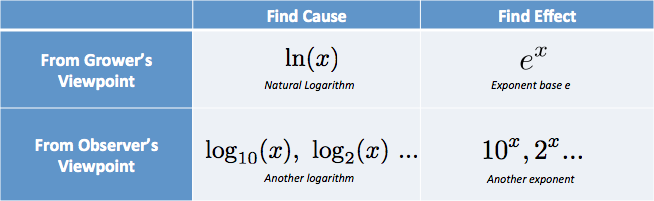

## Standard Deviation
* It is a measure that is used to quantify the amount of variation or dispersion of a set of data values.
* The "Population Standard Deviation": [biased] $$\displaystyle\sigma = \sqrt{\frac{1}{N}\sum_{i=1}^{N}(x_i - \mu)^2}$$, $$\mu$$ is the average of x.
* The "Sample Standard Deviation": [unbiased]$$\displaystyle\sigma = \sqrt{\frac{1}{N-1}\sum_{i=1}^{N}(x_i - \mu)^2}$$
*  It's an important change that to 
divide by N-1 (instead of N) when calculating a Sample Variance.
* Refers:
   * [Wikipedia](https://en.wikipedia.org/wiki/Standard_deviation)
   * [MathisFUN](https://www.mathsisfun.com/data/standard-deviation.html)

   
## Exponents
* Exponents($$e$$) And Logarithms($$ln()$$)
* Ask yourself this question: are we talking about inputs (cause of the change) or outputs (the actual change that happened?)
* **Logarithms** reveal the inputs that caused the growth	
* **Exponents** find the final result of growth
* 
* $$e$$ : is **defined** to be the rate of growth if we continually compound 100% return on smaller and smaller time periods:$$e = \displaystyle\lim_{o \to \infty}(1+\frac{1}{n})^{n} \approx 2.718$$ ,$$growth = e^{rt}; (r: rate, t:time)$$ 
* [An Intuitive Guide To Exponential Functions & e](https://betterexplained.com/articles/an-intuitive-guide-to-exponential-functions-e/) 
* [Demystifying the Natural Logarithm (ln)](https://betterexplained.com/articles/demystifying-the-natural-logarithm-ln/) 

