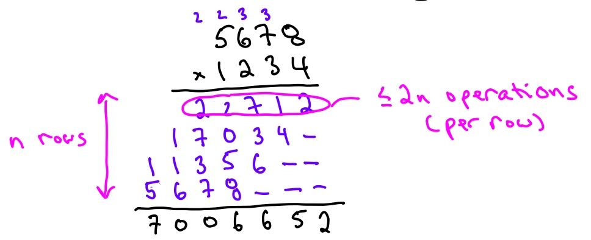
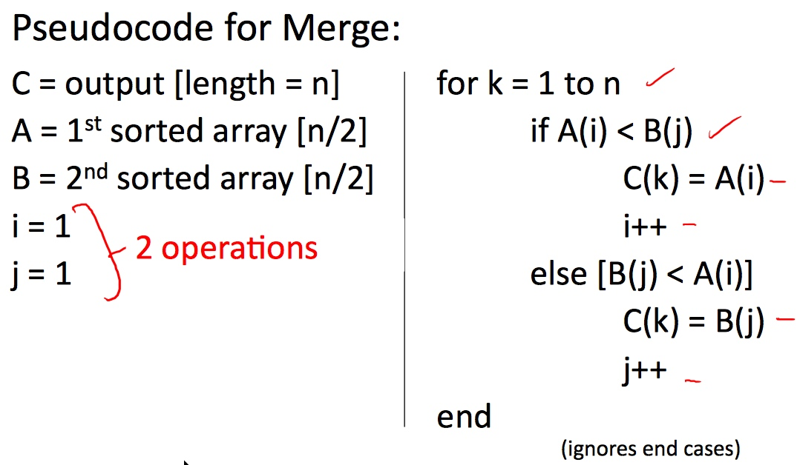
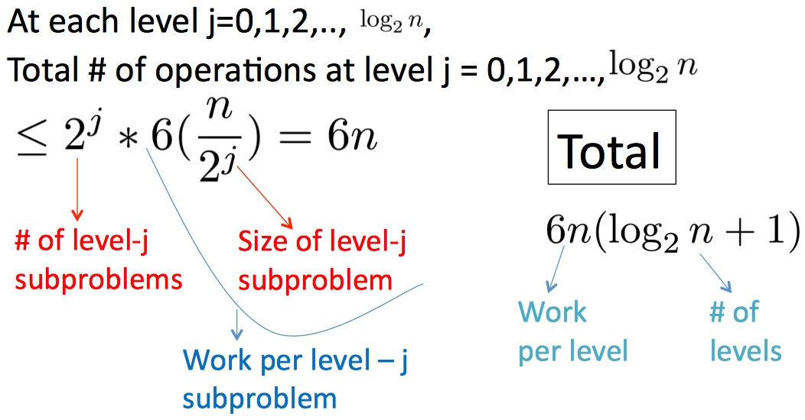

# Introduction

[TOC]

## Integer Multiplication

* **Input**: two **n**-digit numbers **x** and **y**
* **Output**: the product \\(x \cdot y\\)

* **The Grade-School Algorithm**
    * 
    * **Upshot**: operations overall \\(\le \text{constant } \cdot n^2\\)(the example took \\(2 \cdot n^2\\))
    * Can we be better?

### Karatsuba Multiplication

* First, we apply the algorithm to the last example: \\(x = 5678, y = 1234\\)
    * Step 0: Split x and y to: \\(a = 56, b = 78, c = 12, d = 34\\)
    * Step 1: compute \\(a \cdot c = 672\\)
    * Step 2: compute \\(b \cdot d = 2652\\)
    * Step 3: compute \\((a+b)(c+d) = 134 \cdot 46 = 6164\\)
    * Step 4: compute \\((3) - (2) - (1) = 2840\\)
    * Step 5: \\(672 * 10^4 + 2652 + 2840 * 10^2 = 7006652 = 1234 * 5678\\)
* Before dive into the **Karatsuba Multiplication Algorithm**, let's learn another algorithm.

#### A Recursive Algorithm

* Write \\(x = 10^{\frac{n}{2}}a + b\\) and \\(y = 10^{\frac{n}{2}}c + d\\)
    * where a,b,c,d are \\(\frac{n}{2}\\)-digit numbers.
    * Example: a = 56, b = 78, c = 12, d = 34
* **Then**: \\(x \cdot y = (10^{\frac{n}{2}}a+b) \cdot (10^{\frac{n}{2}}c + d) = 10^n a c + 10^{\frac{n}{2}}(ad + bc) + bd\\)
* **Idea**: recursively compute **ac**, **ad**, **bc**, **bd**, then compute the equation in the straightforward way.

#### Back to Karatsuba Multiplication

* **Recall**: \\(x \cdot y = 10^n a c + 10^{\frac{n}{2}}(ad + bc) + bd\\)
* **Step 1**: recursively compute **ac**
* **Step 2**: recursively compute **bd**
* **Step 3**: recursively compute \\((a+b)(c+d) = ac + ad + bc + bd\\)
    * **Gaussion's Trick**: \\((3) - (2) - (1) = ad + bc\\)
    * **Upshot**: only need 3 recursive multiplications!

## Course Topics

* Vocabulary for design and analysis of algorithms
    * E.g., “Big-­‐Oh” nota)on
    * “sweet spot” for high-­‐level reasoning about algorithms
* Divide and conquer algorithm design paradigm
    * Will apply to: Integer multiplication, sorting, matrix multiplication, closest pair
    * General analysis methods (“Master Method/Theorem”)
* Randomization in algorithm design
    * Will apply to: QuickSort, primality testing, graph partitioning, hashing.
* Primitives for reasoning about graphs
    * Connectivity information, shortest paths, structure of information and social networks.
* Use and implementation of data structures
    * Heaps, balanced binary search trees, hashing and some variants (e.g., bloom filters)

## Merge Sort: Motivation and Example

* The Sorting Problem
    * **Input** : array of n numbers, unsorted.
    * **Output** : Same numbers, sorted in increasing order
* Merge Sort: Example
    * [CS50(Week3#Merge Sort)](/cs50/week-3.html#merge-sort)
* Merge Sort Running Time
    * 
    * `i=1, j=1` => 2
    * `for k = 1 to n` => 1
    * `if... else...` => 1
    * `C(k) = A(i)` or `C(k) = B(j)` => 1
    * `i++` or `j++` => 1
    * **Upshot**: running time of Merge on array of **m** numbers is \\(\le\\) **4m + 2**
        * To make it easier, we call this \\(\le\\) **6m** (since \\(m \ge 1\\))
    * **Claim**: For every input array of n numbers, Merge Sort produces a sorted output array and uses at most \\(6n\log_2{n} + 6n\\) operations.
    * Proof of claim(assuming n = power of 2):
        * 

## Guiding Principles for Analysis of Algorithms

1. Use "worst - case analysis" : our running time bound holds for every input of length **n**.
    * Particularly appropriate for “general-purpose” routines 
    * As Opposed to "average-case" analysis, which needs benchmark and domain knowledge, "worst - case" analysis usually easier to analyze.
2. Won't pay much attention to constant factors, lower-order terms.
    * Way easier
    * Constants depend on architecture / compiler / programmer, etc.
    * Lose very little predictive power. We won't be able to tell the precise computation complexity.
3. Asymptotic Analysis : focus on running time for large input sizes **n**

* Conclusion: 
    * fast algorithm \\(\approx\\) 
        * worst-case running time
        * grows slowly with size
        * Usually : want as close to linear (O(n)) as possible

## Words

* **calibrate** ['kælibreit] vt. 校正；调整；测定口径
* **asymptotic** [,æsimp'tɔtik,-kəl] adj. 渐近的；渐近线的

