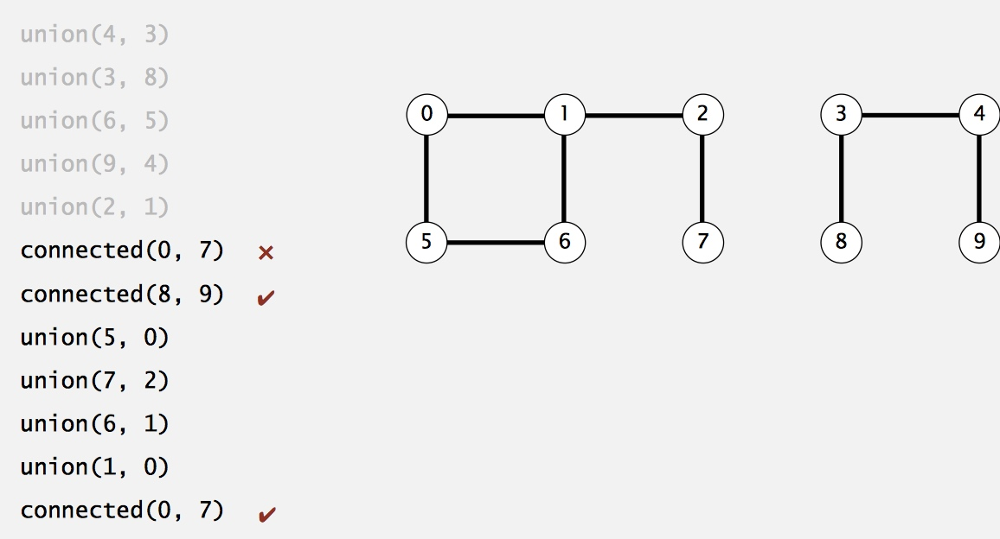
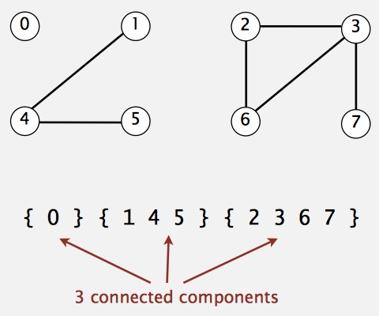
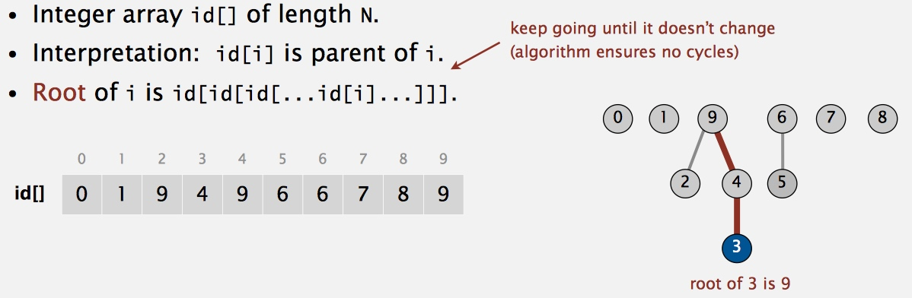

# 1 - Union-Find

[TOC]

## Dynamic Connectivity

* Given a set of N objects.
    * **Union command**: connect two objects.
    * **Find/connected query**: is there a path connecting the two objects?
* 
* **We assume "is connected to" is an equivalence relation**:
    * Reflexive: **p** is connected to **p**.
    * Symmetric: if **p** is connected to **q**, then **q** is connected to **p**. 
    * Transitive: if **p** is connected to **q** and **q** is connected to **r**, then **p** is connected to **r**.
* **Connected components.** Maximal set of objects that are mutually connected.
* 

### Implementation

* The method called **Weighted quick-union with path compression**.
* **quick-union**:
    * 
* **weighted**: Keep track of size of each tree (number of objects). Balance by linking root of smaller tree to root of larger tree.
    * Keep the depth of any node `x` is at most `lg N`.
* **path compression**: Make every other node in path point to its grandparent.
* Code:

    ```java
    package week1;

    import common.StdIn;
    
    import java.io.FileNotFoundException;
    import java.util.Scanner;
    
    public class UnionFind {
    
      private int count;
      private int[] parent;
      private int[] sz; // record the weight
    
      UnionFind(int n) {
        count = n;
        parent = new int[n];
        sz = new int[n];
        for(int i=0; i<n; i++) {
          parent[i] = i;
          sz[i] = 1;
        }
      }
    
      public int root(int id) {
        while (parent[id] != id) {
          parent[id] = parent[parent[id]]; // improve
          id = parent[id];
        }
        return id;
      }
    
      public boolean connected(int p, int q) {
        return root(p) == root(q);
      }
    
      // quick union
      public void union(int p, int q) {
        int rootP = root(p);
        int rootQ = root(q);
        if(sz[rootP] <= sz[rootQ]) {
          parent[rootP] = rootQ;
          sz[rootQ] += sz[rootP];
        } else {
          parent[rootQ] = rootP;
          sz[rootP] += sz[rootQ];
        }
        count --;
      }
    
      public int count() {
        return count;
      }
    
      public static void main(String[] args) {
        Scanner sc = null;
        try {
          sc = new Scanner(StdIn.getDataFile("mediumUF.txt"));
        } catch (FileNotFoundException e) {
          e.printStackTrace();
        }
        int n = sc.nextInt();
        UnionFind uf = new UnionFind(n);
        while (sc.hasNext()) {
          int p = sc.nextInt();
          int q = sc.nextInt();
          if (uf.connected(p, q)) continue;
          uf.union(p, q);
          System.out.println(p + " " + q);
        }
        System.out.println(uf.count() + " components");
      }
    }
    ```
## Assignment (Percolation)

* Write a program to estimate the value of the percolation threshold via Monte Carlo simulation.
    * [Details](http://coursera.cs.princeton.edu/algs4/assignments/percolation.html)
* My Code: [https://github.com/erictt/computer-science-learning/tree/master/algorithms-1/programming/src/week1/assignment](https://github.com/erictt/computer-science-learning/tree/master/algorithms-1/programming/src/week1/assignment)


