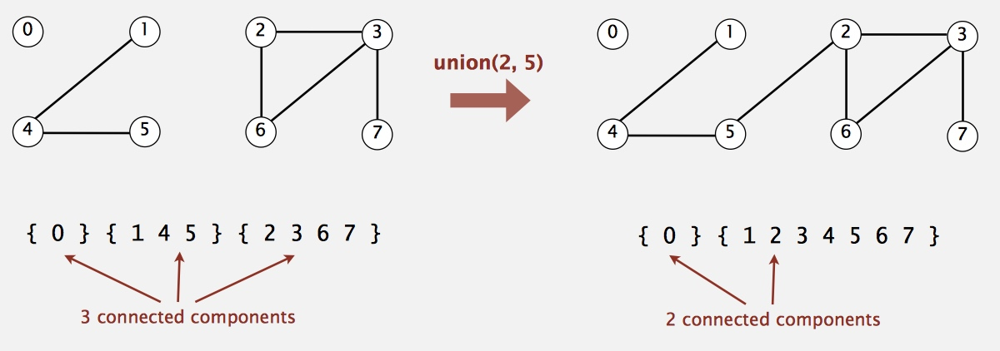
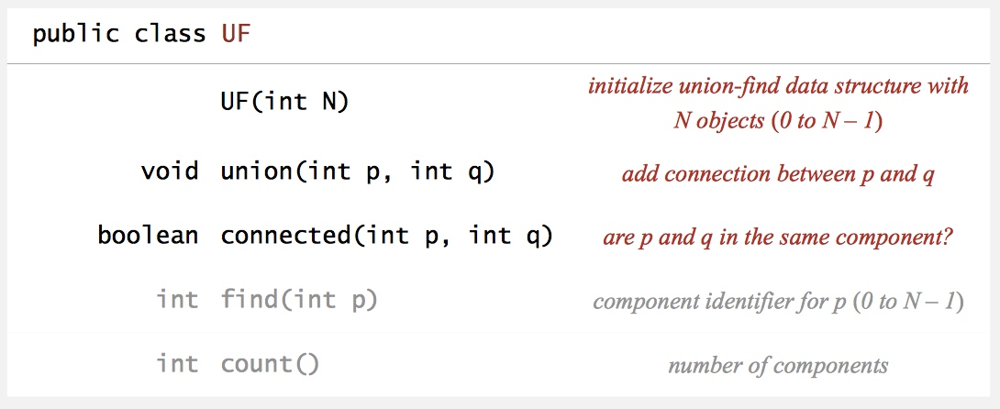
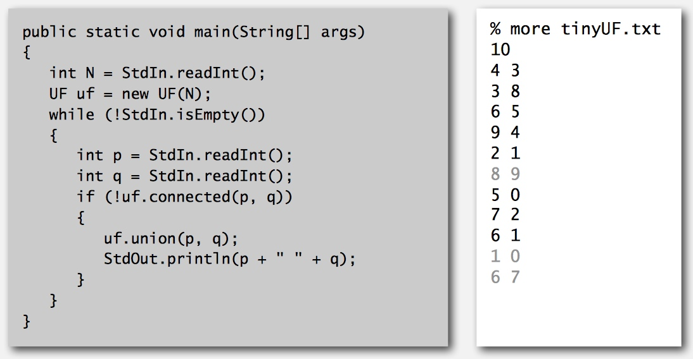

# 1 - Union-Find

[TOC]

* **Steps to developing a usable algorithm**.
    * Model the problem.
    * Find an algorithm to solve it.
    * Fast enough? Fits in memory?
    * If not, figure out why.
    * Find a way to address the problem. Iterate until satisfied.

## Dynamic Connectivity

* Given a set of N objects.
    * **Union command**: connect two objects.
    * **Find/connected query**: is there a path connecting the two objects?
* 

### Modeling the objects

* Applications involve manipulating objects of all types.
    * Pixels in a digital photo.
    * Computers in a network.
    * Friends in a social network.
    * Transistors in a computer chip.
    * Elements in a mathematical set.
    * Variable names in Fortran program.
    * Metallic sites in a composite system.

* When programming, convenient to name objects 0 to N –1.
    * Use integers as array index.
    * Suppress details not relevant to union-find.
        * can use symbol table to translate from site names to integers: stay tuned (Chapter 3)

### Modeling the Connections

* **We assume "is connected to" is an equivalence relation**:
    * Reflexive: **p** is connected to **p**.
    * Symmetric: if **p** is connected to **q**, then **q** is connected to **p**. 
    * Transitive: if **p** is connected to **q** and **q** is connected to **r**, then **p** is connected to **r**.
* **Connected components.** Maximal set of objects that are mutually connected.
* 

### Implementing the Operations

* **Find query**. Check if two objects are in the same component.
* **Union command**. Replace components containing two objects with their union.
    * Merge two components to one.
* 

### Union-find data type (API)

* **Goal.** Design efficient data structure for union-find.
    * Number of objects N can be huge.
    * Number of operations M can be huge.
    * Find queries and union commands may be intermixed.
* 

### Dynamic-connectivity Client

* Read in number of objects N from standard input. Repeat:
    * read in pair of integers from standard input
    * if they are not yet connected, connect them and print out pair
* 

