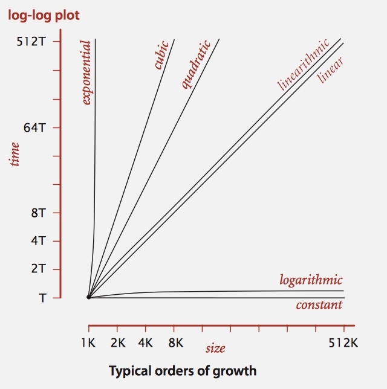
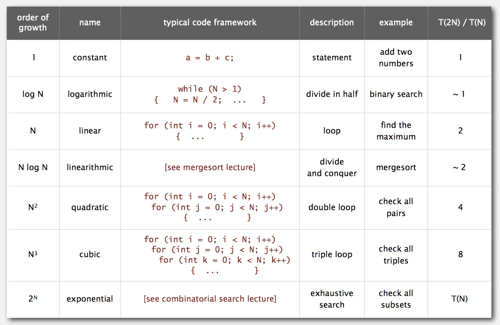
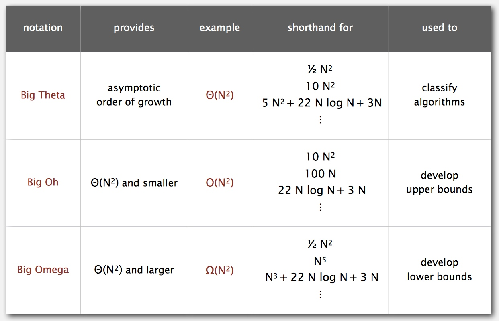
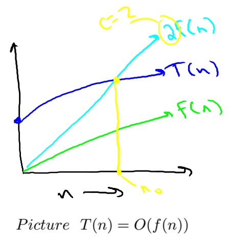
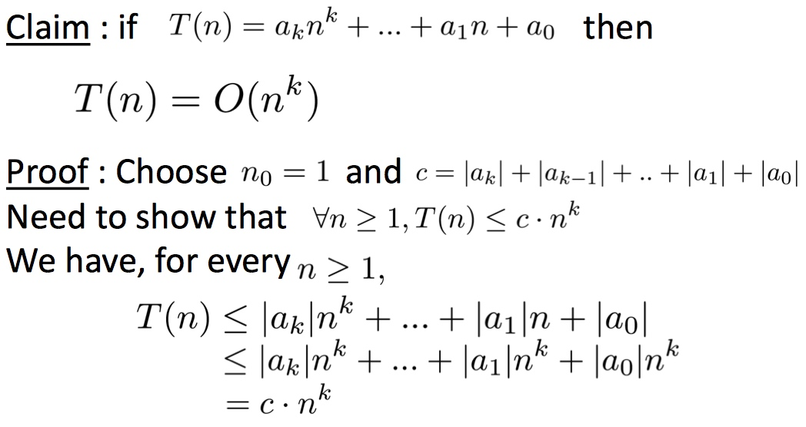
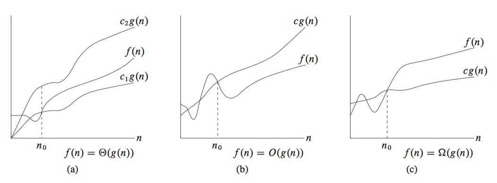

# 2 - Analysis of Algorithms

[TOC]

## Common Order-of-growth Classifications

* \\(1, \log{N}, N \log{N}, N^2, N^3, \text{ and } 2^N\\)
    * order of growth discards leading coefficient
* 
    * \\(\text{time} = \lg{T(N)}\\)
    * \\(\text{size} = \lg{N}\\)
* 

## Theory of Algorithms

* 

## Why Big-Oh Notation ? // TODO

* Formal Definition: \\(T(n) = O(f(n))\\) if and only if there exist constants \\(c,n_0 > 0\\) such that \\(T(n) \le c \cdot f(n)\\) for all \\(n \ge n_0\\)
    * \\(T(n)\\) is the function of the running time of an algorithm.
    * Warning \\(c, n_0\\) cannot depend on **n**.
* [NOTE] It kinds of says, we use \\(n^k\\), but not \\(n^{k-1}\\)
    * Because \\(O(n^{k-1}) = c \cdot n^{k-1}\\) will always less then \\(n^k\\) (**c** is a constant, but n is not).
    * And we need that, T(n) is bounded above by a constant multiple of f(n).
        * 
* Example
    * 

* 

## Words

* **asymptotic** [,æsimp'tɔtik,-kəl] adj. 渐近的；渐近线的
* **ubiquitous** [ju:'bikwitəs] adj. 普遍存在的；无所不在的

