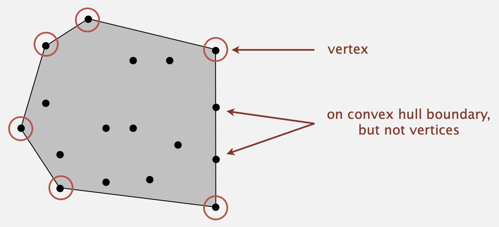

# Stacks and Queues & Elementary Sorts

[TOC]

## Stacks and Queues

### Stacks

* Stack of strings data type.
* 
* Two ways to implement:
    * **Linked List**: Maintain pointer to first node in a linked list; insert/remove from front.
    * **Array**: Use array s[] to store N items on stack.
        * Defect: Stack overflows when N exceeds capacity. 
* Overflow and underflow.
    * Underflow: throw exception if pop from an empty stack.
    * Overflow: use resizing array for array implementation. 
* **Null items**. We allow null items to be inserted. 
* **Loitering**(Java). Holding a reference to an object when it is no longer needed. 
    * 
    * Already pop up the N-th item, should set it null before return.

#### Resizing Array Stack

* push(): double size of array s[] when array is full.
* pop(): halve size of array s[] when array is one-quarter full.
* Array is between 25% and 100% full.

### Queues

* 

* Two ways to implement:
    * **Linked List**: Maintain pointer to first and last nodes in a linked list;
    * **Array**: 
        * Use array q[] to store items in queue.
        * enqueue(): add new item at q[tail].
        * dequeue(): remove item from q[head].
        * Update head and tail modulo the capacity.
        * Add resizing array.
        * Q. How to resize?
            * create another array with double size of the original array and duplicate all of the nodes in the new array
            * create another array as the second array, and create a linkedlist to link the first queue and the second queue.

### Generics 

// ignore

### Iterators

* Has methods hasNext() and next().

### Applications(Dijkstra's two-stack algorithm)

* 

## Elementary Sorts

### Selection Sort

* In iteration **i**, find index **min** of smallest remaining entry.
・Swap a[i] and a[min].

### Insertion sort 

* Assume left side is already sorted, then in iteration **i**, swap a[i] to the left if a[i] < a[i-1]

### Shellsort 

* Move entries more than one position at a time by **h-sorting** the array.
* 
* Shellsort: which increment sequence to use?
    * 3x + 1. 1, 4, 13, 40, 121, 364, …
        * OK. Easy to compute.
    * Sedgewick. 1, 5, 19, 41, 109, 209, 505, 929, 2161, 3905, …
        * Good. Tough to beat in empirical studies.

### Shuffle

* One way is: Generate a random real number for each array entry, then sort the array.
    * Defect: sorting.
* Better way: **Knuth shuffle**
    * In iteration **i**, pick integer **r** between **0** and **i** uniformly at random.
    * Swap **a[i]** and **a[r]**.
    * 
* 

### Convex hull

* The convex hull of a set of N points is the smallest perimeter fence
enclosing the points.
    * 

#### Convex hull application

* **Robot motion planning**. Find shortest path in the plane from **s** to **t** that avoids a polygonal obstacle.
    * 

* **Farthest pair problem**. Given N points in the plane, find a pair of points with the largest Euclidean distance between them.
    * 

* **Geometric properties**
    * Fact. Can traverse the convex hull by making only counterclockwise turns.
    * Fact. The vertices of convex hull appear in increasing order of polar angle with respect to point p with lowest y-coordinate.
    * 

#### Graham scan demo

* Choose point p with smallest y-coordinate.
* Sort points by polar angle with p.
* Consider points in order; discard unless it create a counterclockwise turn.
* 

* Given three points a, b, and c, is a → b→ c a counterclockwise turn?
    * 
    * 

