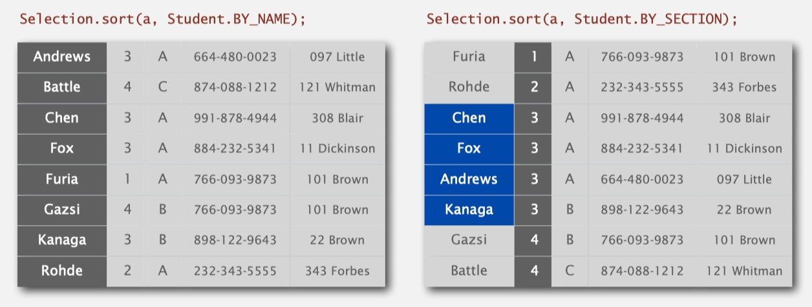
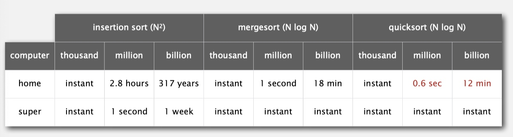
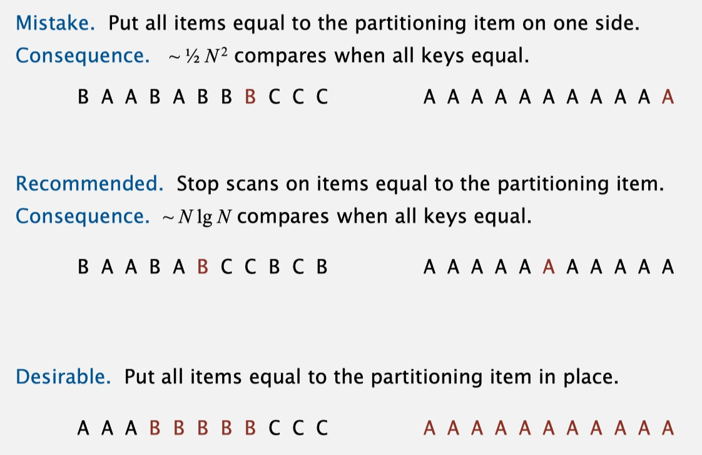
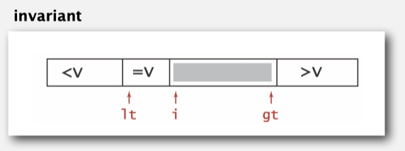
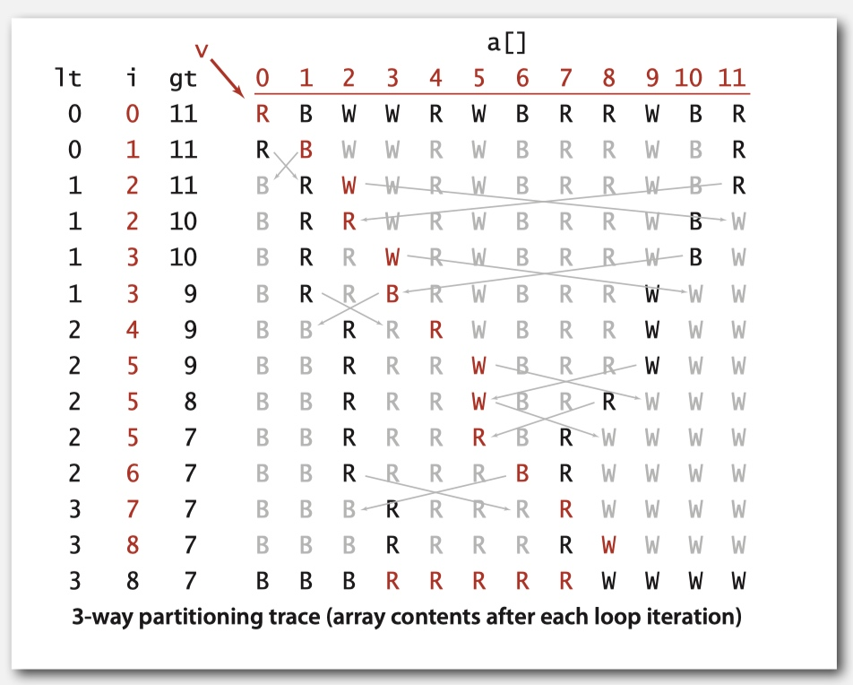
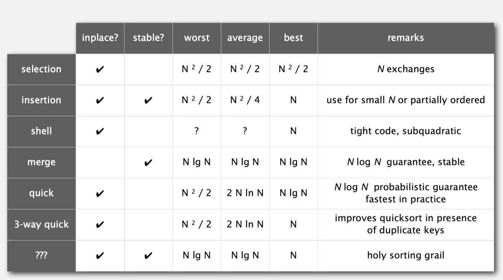

# Week 3 - Mergesort & Quicksort

[TOC]

## Mergesort

* **Basic plan**
    * Divide array into two halves.
    * Recursively sort each half.
    * Merge two halves.
* Check [https://cs.ericyy.me/cs50/week-3.html#merge-sort](https://cs.ericyy.me/cs50/week-3.html#merge-sort)
* Improvements:
    * **Use insertion sort for small subarrays**.
        * Mergesort has too much overhead for tiny subarrays. 
        * Cutoff to insertion sort for ≈ 7 items.
    * **Stop if already sorted.**
    * **Eliminate the copy to the auxiliary array.**

        ```java
        private static void merge(Comparable[] a, Comparable[] aux, int lo, int mid, int hi) {

            int i = lo; int j = mid+1;
            for (int k = lo; k <= hi; k++) {
                if(i > mid)                     a[k] = aux[j++];
                else if(j > hi)                 a[k] = aux[i++];
                else if(less(aux[i], aux[j]))   a[k] = aux[i++];
                else                            a[k] = aux[j++];
            }
        }
        
        private static void sort(Comparable[] a, Comparable[] aux, int lo, int hi) {
    
            if(hi <= lo) return;
            int mid = lo + (hi - lo) / 2;
            sort(aux, a, lo, mid); // keep reverse aux and a
            sort(aux, a, mid+1, hi); 
            merge(a, aux, lo, mid, hi); // the last merge action is sorted 'a' 
            assert isSorted(a, lo, hi);
        }
        
        public static void sort(Comparable[] a) {
            Comparable[] aux = a.clone(); // duplicate a to aux
            sort(a, aux, 0, a.length-1);
            assert isSorted(a);
        }
        ```

### Bottom-up Mergesort

* Basic plan.
    * Pass through array, merging subarrays of size 1. 
    * Repeat for subarrays of size 2, 4, 8, 16, ....

## Stability

* A **stable** sort preserves the relative order of items with equal keys.
* For example:
    * 
    * The second sort changed the order of the students of section 3. So it's not stable.
* To check whether a sort algorithm is stable or not is to check if it has long-distance exchange.
* Insertion sort: every exchange is small steps. **Stable**
* Selection sort: select the minimum to the front, which is big step and by-pass the equal items. **Not Stable**
* Shell sort: **Not Stable**
* Mergesort: **Stable**
* Quicksort: **Not Stable**

## Quicksort

* Basic plan.
    * **Shuffle** the array.
        * Probabilistic guarantee against worst case.
    * **Partition** so that, for some j
        - entry a[j] is in place
        - no larger entry to the left of j
        - no smaller entry to the right of j 
    * **Sort** each piece recursively.

* Check [https://cs.ericyy.me/cs50/week-3.html#quick-sort](https://cs.ericyy.me/cs50/week-3.html#quick-sort)

* **empirical analysis**
    * 
* **Best case**. Number of compares is ~ N lg N.
* **Worst case**. Number of compares is ~ ½ N 2 .
* **Average case**. Number of compares is ~ 1.39 N lg N.
    * 39% more compares than mergesort.
    * But faster than mergesort in practice because of less data movement.
* **Improvements**
    * **Insertion sort small subarrays.**
        * Even quicksort has too much overhead for tiny subarrays. 
        * Cutoff to insertion sort for ≈ 10 items.
        * Note: could delay insertion sort until one pass at end.
    * **Median of sample.**
        * Best choice of pivot item = median.
        * Estimate true median by taking median of sample.
        * Median-of-3 (random) items.
        
            ```java
            int m = medianOf3(a, lo, lo + (hi - lo)/2, hi); 
            swap(a, lo, m);
            ```
            
### Quick-sort

* Partition array so that:
    * Entry a[j] is in place.
    * No larger entry to the left of j. 
    * No smaller entry to the right of j.
* Repeat in one subarray, depending on j; finished when j equals k.
* use quick-select if you **don’t need a full sort**.

### Duplicate keys

* Often, purpose of sort is to bring items with equal keys together.
* **Mergesort with duplicate keys**. Between ½ N lg N and N lg N compares.
* **Quicksort with duplicate keys.** Algorithm goes **quadratic** unless partitioning stops on equal keys!
* 

#### 3-way partitioning

* Let v be partitioning item a[lo]. 
* Scan i from left to right.
    - (a[i] < v): exchange a[lt] with a[i]; increment both lt and i
    - (a[i] > v): exchange a[gt] with a[i]; decrement gt
    - (a[i] == v): increment i
* 
* 

```java
private static void sort(Comparable[] a, int lo, int hi) {
    if (hi <= lo) return; 
    int lt = lo, gt = hi; 
    Comparable v = a[lo]; 
    int i = lo; 
    while (i <= gt) {
        int cmp = a[i].compareTo(v);
        if (cmp < 0) exch(a, lt++, i++);
        else if (cmp > 0) exch(a, i, gt--);
        else i++; 
    }
    
    sort(a, lo, lt - 1); 
    sort(a, gt + 1, hi);
}
```

* Randomized quicksort with 3-way partitioning reduces running time from linearithmic to linear in broad class of applications.

### System sorts

* **java.util.Array.sort()**
    * Uses tuned quicksort for primitive types; tuned mergesort for objects.

## Sorting Summary


