# Week 4 - Priority Queues & Elementary Symbols

[TOC]

## Priority Queues

* Insert and delete items. Which item to delete?
    * **Stack**. Remove the item most recently added. 
    * **Queue**. Remove the item least recently added. 
    * **Randomized queue**. Remove a random item.
    * **Priority queue**. Remove the **largest** (or **smallest**) item.

### Binary Tree

* Empty or node with links to left and right binary trees.

#### Complete binary tree

* Perfectly balanced, except for bottom level.
* Height of complete tree with N nodes is `lg N⎦`.

#### Binary heap representations

* Array representation of a heap-ordered complete binary tree.
* Heap-ordered binary tree.
    * Keys in nodes.
    * Parent's key no smaller than children's keys.
* Largest key is a[1], which is root of binary tree.
* Can use array indices to move through tree.
* Parent of node at k is at **k/2**.
* Children of node at k are at **2k** and **2k+1**.
* 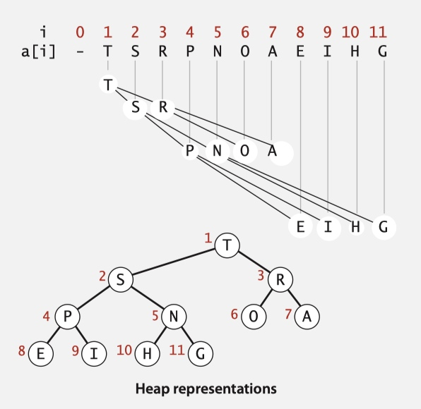

* **Insertion in a heap**
    * Add node at end, then **swim** it up.

        ```java
        private void swim(int k) {
            while (k > 1 && less(k/2, k)) {
                exch(k, k/2);
                k = k/2; 
            } 
        }
        public void insert(Key x) {
            pq[++N] = x;
            swim(N);
        }
        ```

    * 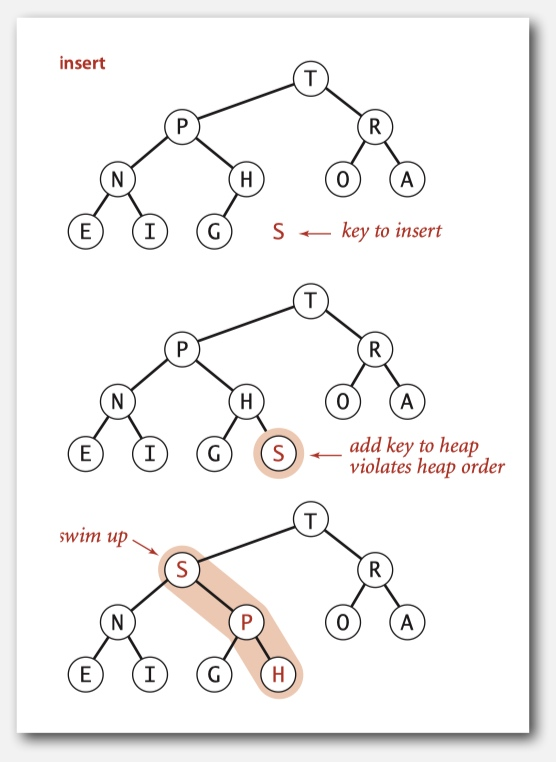

* **Delete the maximum in a heap**
    * Exchange root with node at end, then sink it down.

        ```java
        private void sink(int k) {
            while(2*k <= N) {
                int j = 2*k;
                if(j < N && less(j, j+1)) j++;
                if(!less(k, j)) break;
                exch(k, j);
                k = j;
            }
        }
        public Key delMax() {
            Key max = pq[1];
            exch(1, N-1);
            sink(1);
            pq[N+1] = null;
            return max;
        }
        ```
    * 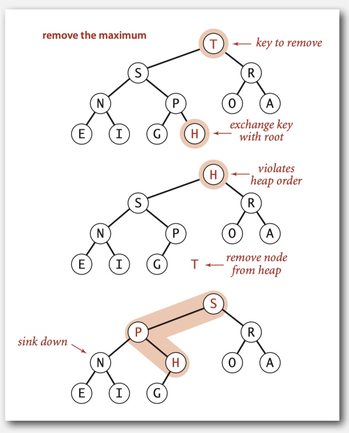

### Heapsort

* **Step 1**: Build heap using bottom-up method.

    ```java
    for (int k = N/2; k >= 1; k--) 
        sink(a, k, N);
    ```
    
    * `N` is just used to count

    * 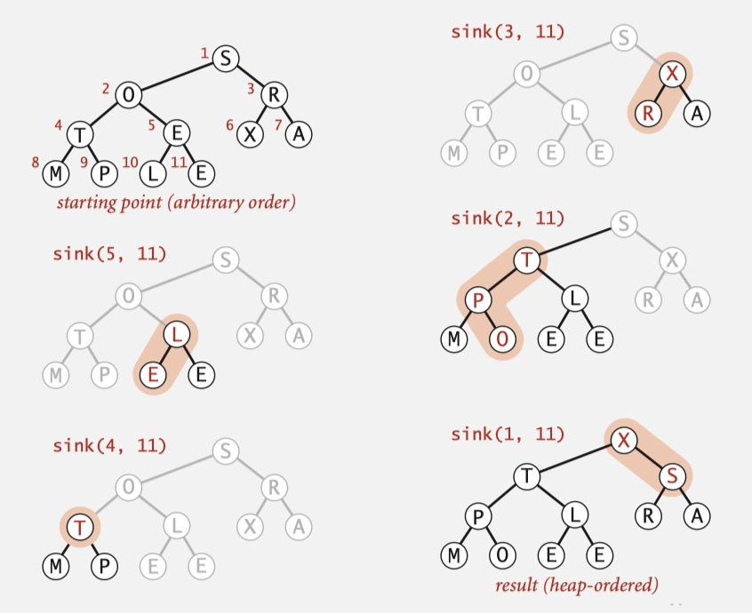

* **Step 2**: Remove the maximum, one at a time. exchange the first element(maximum one) to the end, then sink the first element.
    
    ```java
    while (N > 1) {
        exch(a, 1, N--);
        sink(a, 1, N);
    }
    ```
    * `N` is just used to count
    
* 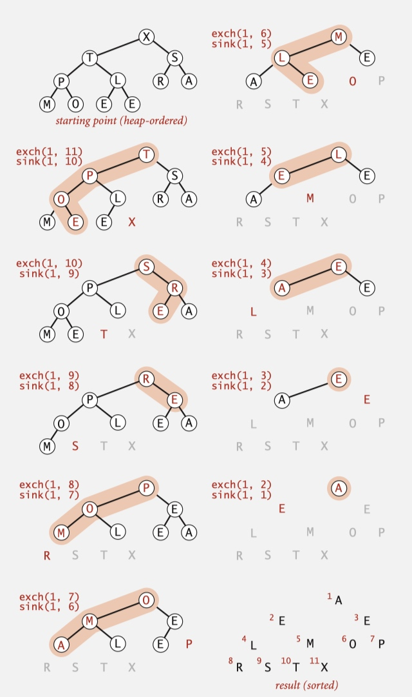

## Elementary Symbols

### Binary Search Trees

* A BST is a **binary tree** in **symmetric order**.
    * A binary tree is either:
        * Empty.
        * Two disjoint binary trees (left and right).
    * Symmetric order. Each node has a key, and every node’s key is:
        * Larger than all keys in its left subtree. 
        * Smaller than all keys in its right subtree
* A Node is comprised of four fields:
    * A Key and a Value.
    * A reference to the left and right subtree.

* **Search**. If less, go left; if greater, go right; if equal, search hit.
* **Insert**. If less, go left; if greater, go right; if null, insert.
* **Get**. Return value corresponding to given key, or null if no such key.
* **Put**. Associate value with key.
    * Search for key, then two cases:
        * Key in tree ⇒ reset value.
        * Key not in tree ⇒ add new node.

* Different tree shapes
    * 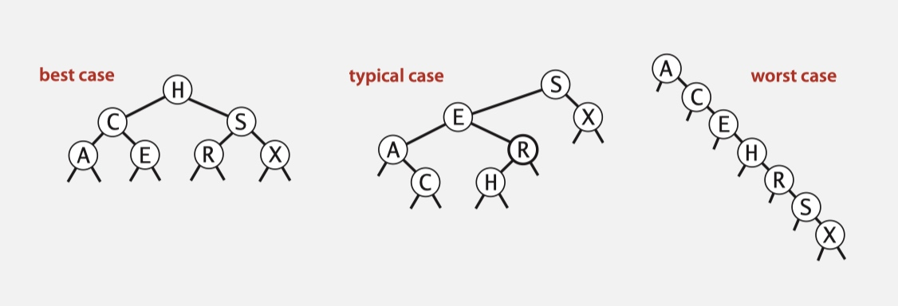
* If N distinct keys are inserted into a BST in **random** order, the expected number of compares for a search/insert is `~ 2 ln N`.

#### Ordered operations

* **Minimum**. Smallest key in table. 
* **Maximum**. Largest key in table.
    * 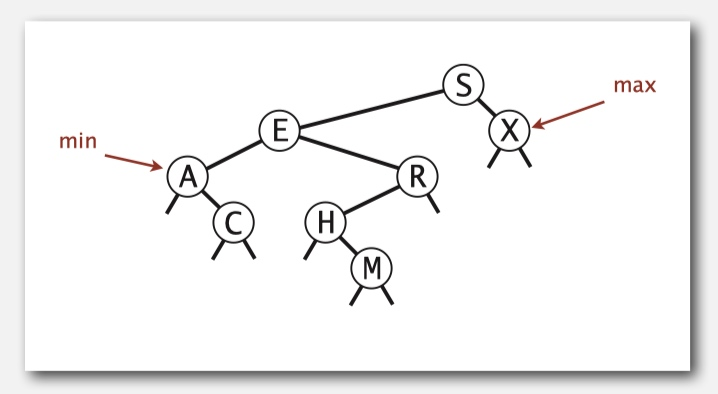
* **Floor**. Largest key ≤ a given key. 
* **Ceiling**. Smallest key ≥ a given key.
    * 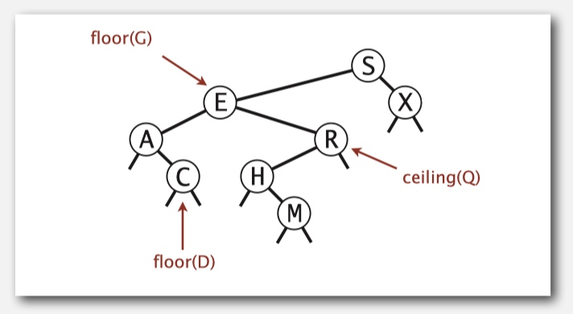
    * Thinking this partially. 
    * For example: 
        * 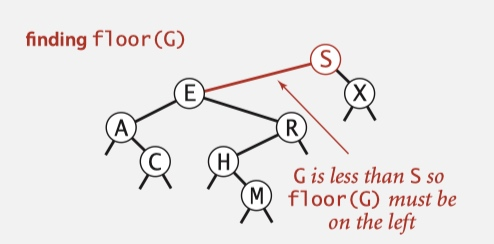
        * 1. initial the result is `null`.
        * 2. just check `S`, `E` and `X`.
        * 3. `G` < `S`, so still `null`. All of the right of `S` should be bigger that `S`, so we continue check the left side `E`, `A` and `R`.
        * 4. `E` < `G`, so `E` is a candidate. All of the left side of `E` should be less that `E`, So we continue check the right side of `E`: `R`, `H` and `null`.
        * 5. `R` > `G`, So the left side of `R`: `H`
        * 6. `H` > `G`, and `H` is the leaf. So `E` is the answer.
* **Counts**
    * In each node, we store the number of nodes in the subtree rooted at that node; to implement size(), return the count at the root.
    * 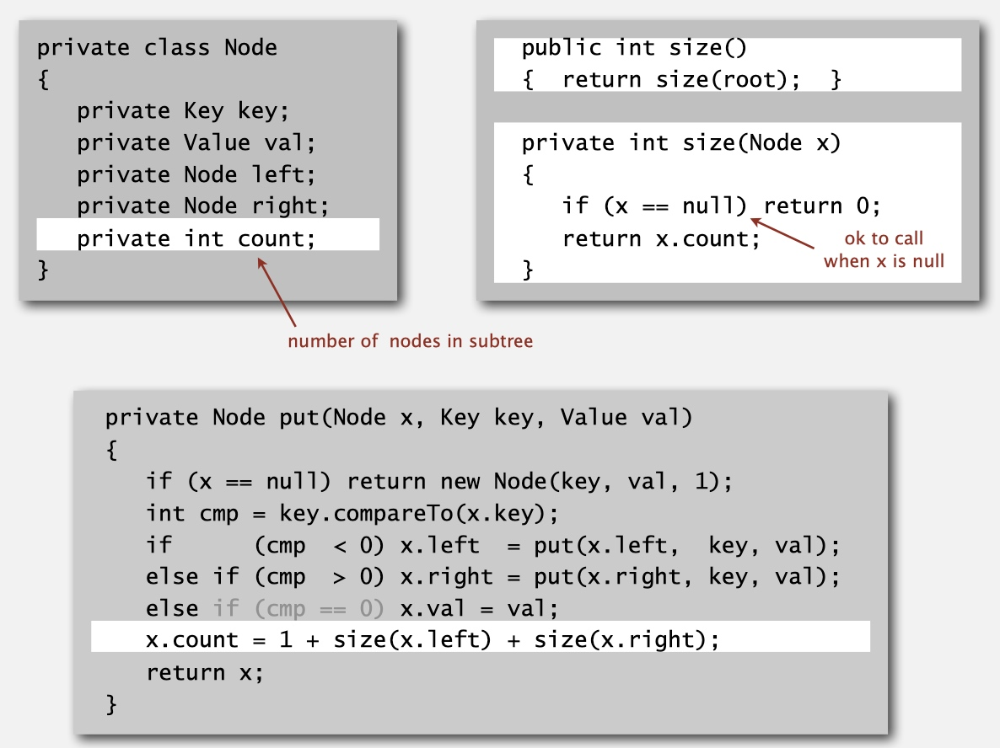
* **Inorder traversal** (Iteration)
    * Traverse left subtree. 
    * Enqueue key.
    * Traverse right subtree.
    * 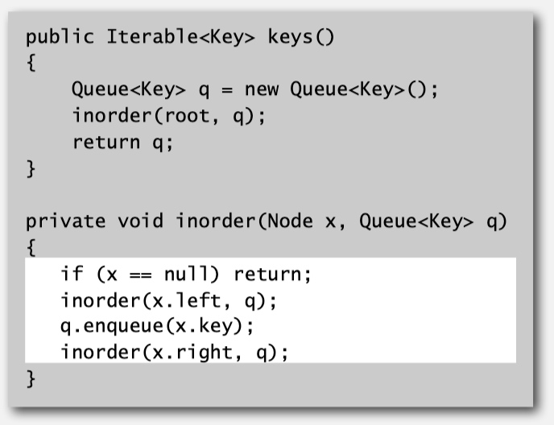

#### BST: ordered symbol table operations summary

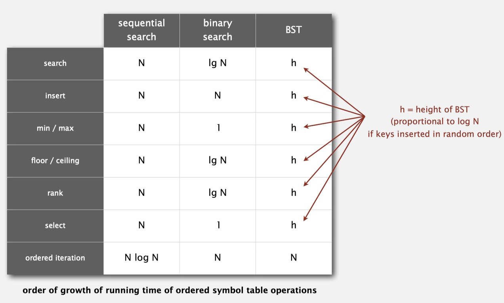

#### Hibbard Deletion

* To delete a node with key k: search for node t containing key k.
* **Case 0**. `[0 children]` Delete t by setting parent link to null.
    * 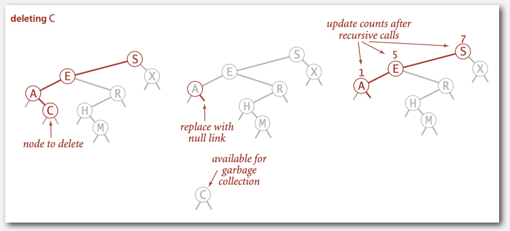

* **Case 1**. `[1 child]` Delete t by replacing parent link.
    * 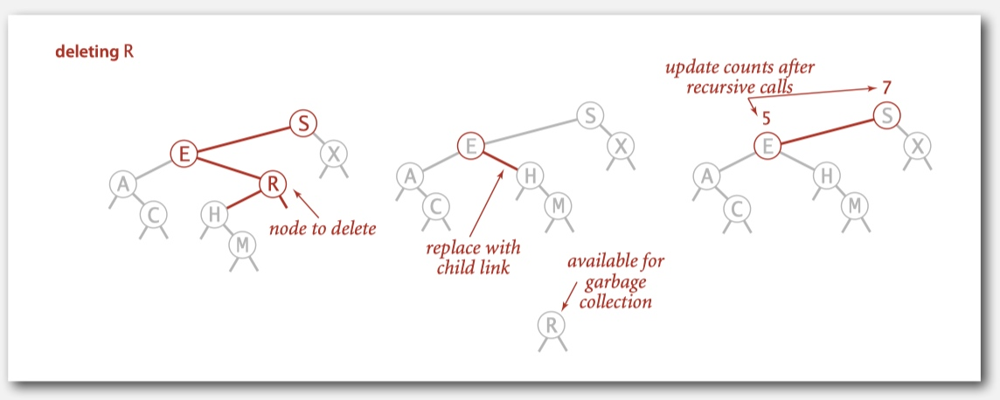

* **Case 2**. `[2 children]`
    * Find successor x of t.
    * Delete the minimum in 's right subtree.
    * Put x in t's spot.
    * 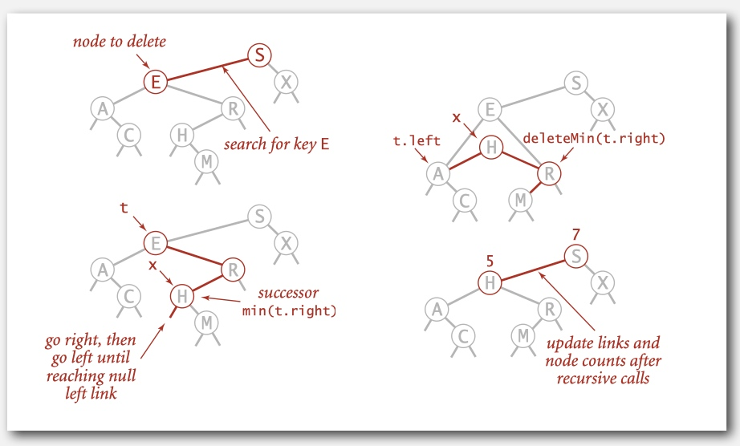
    * 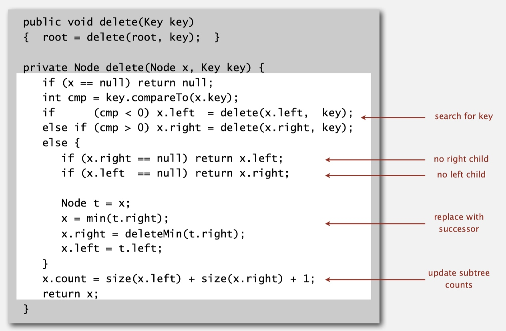

* **analysis**
    *   Unsatisfactory solution. After some deleting, the tree is becoming less balanced.
        * 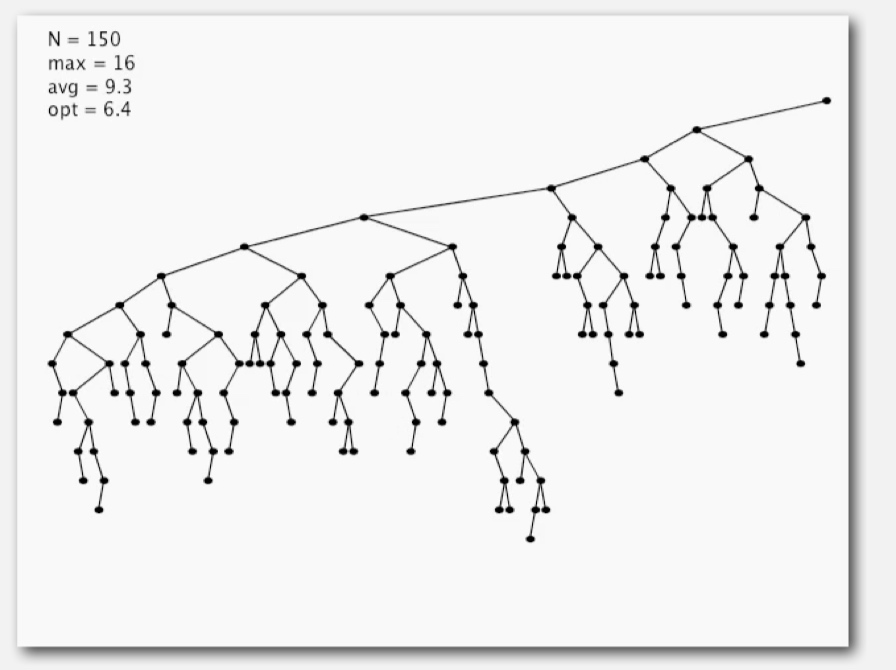

