# Week 5 - Balanced Search Trees

[TOC]

## 2-3 Search Trees

* Allow 1 or 2 keys per node.
    * 2-node: one key, two children. 
    * 3-node: two keys, three children.
* 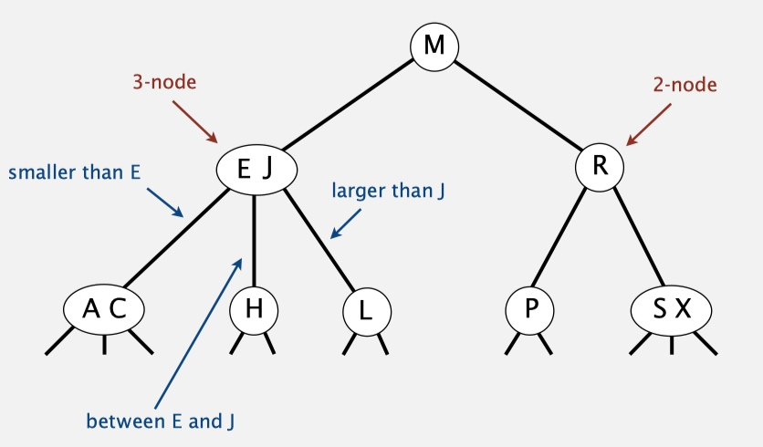

* **Search**
    * Compare search key against keys in node. 
    * Find interval containing search key. 
    * Follow associated link (recursively).
* **Insertion into a 3-node at bottom**.
    * Add new key to 3-node to create temporary 4-node.
    * Move middle key in 4-node into parent.
    * Repeat up the tree, as necessary.
    * If you reach the root and it's a 4-node, split it into three 2-nodes.
    * all of the possibilities we may do: 
        * 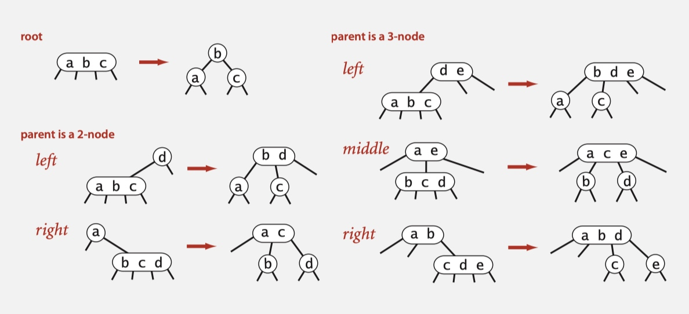
* **Performance**
    * Tree height.
        * Worst case: `lg N`. [all 2-nodes] 
        * Best case: `log 3 N ≈ .631 lg N`. [all 3-nodes] 
        * Between 12 and 20 for a million nodes. 
        * Between 18 and 30 for a billion nodes.

## Red-black BSTs 

* This course focuses on **Left-leaning red-black BSTs**.

1. Represent 2–3 tree as a BST.
2. Use "internal" left-leaning links as "glue" for 3–nodes.

    * 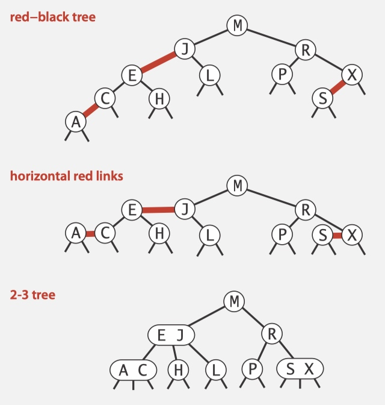

### Elementary red-black BST operations

#### Left rotation & Right rotation

* Orient a (temporarily) right-leaning red link to lean left/right.

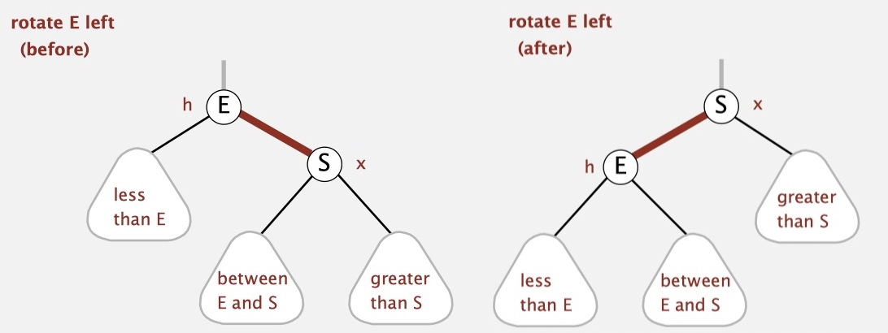
 
```java
private Node rotateLeft(Node h) {
    Node x = h.right;
    h.right = x.left;
    x.left = h;
    x.color = h.color;
    h.color = RED;
    return x;
}
```

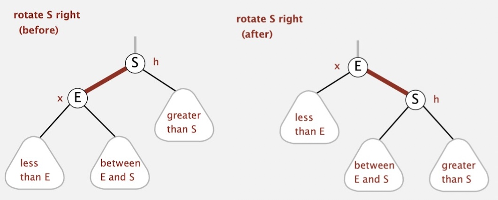

#### Color flip

* Recolor to split a (temporary) 4-node.

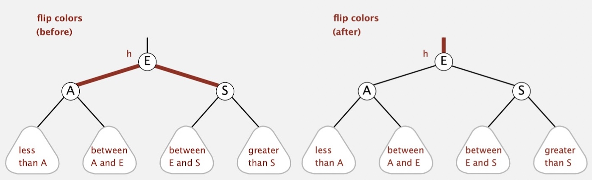

```java
private void flipColors(Node h) {
    h.color = RED;
    h.left.color = BLACK;
    h.right.color = BLACK;    
}
```

#### Insertion in a LLRB tree

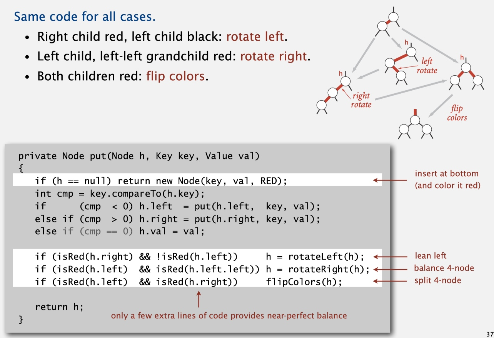

* Search is the same as for elementary BST (ignore color).

### Balance in LLRB trees

* **Proposition**. Height of tree is **≤ 2 lg N** in the worst case.
* **Pf.**
    * Every path from root to null link has same number of black links.
    * Never two red links in-a-row.

### Summary

* 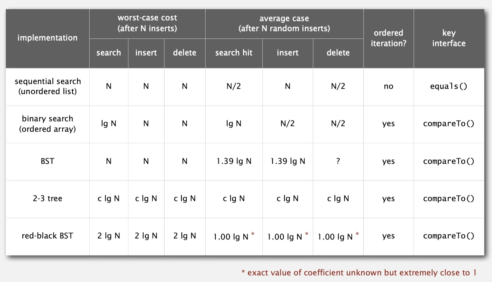

## B-trees

* Generalize 2-3 trees by allowing up to M - 1 key-link pairs per node.

### Insertion in a B-tree

* Search for new key.
* Insert at bottom.
* Split nodes with M key-link pairs on the way up the tree.

* 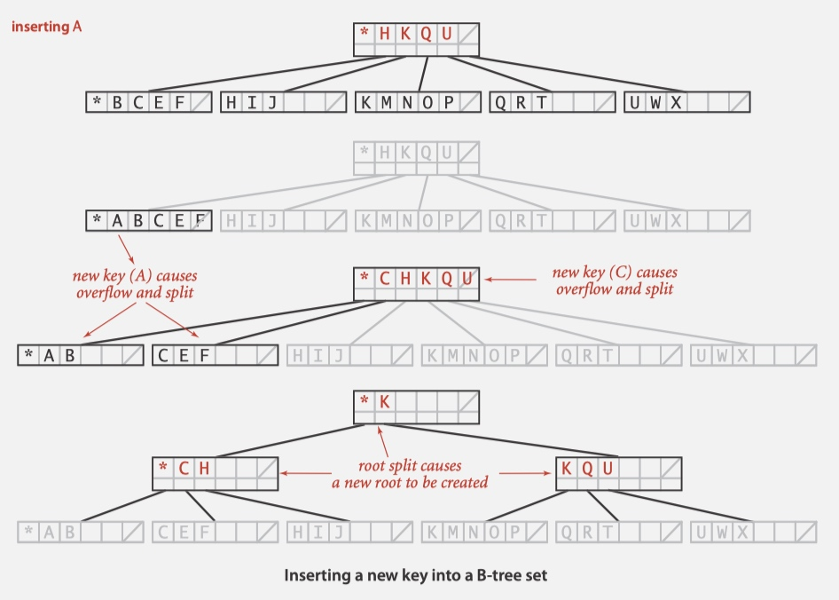


## Geometric Applications of BSTs

### 1d range search

* Keys are point on a **line**.
* Find/count points in a given **1d interval**.
* 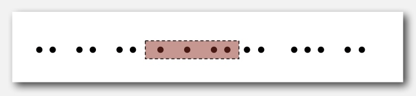
* Find all keys between lo and hi.
    * Recursively find all keys in left subtree (if any could fall in range). 
    * Check key in current node.
    * Recursively find all keys in right subtree (if any could fall in range).
* 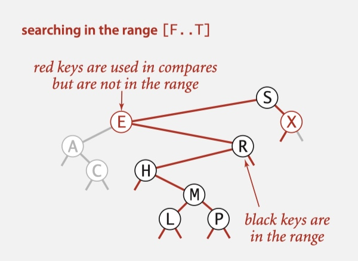

### Orthogonal line segment intersection

* Given N horizontal and vertical line segments, find all intersections.
* **Sweep vertical line from left to right.**
    * x-coordinates define events.
    * h-segment (left endpoint): insert y-coordinate into BST.
    * h-segment (right endpoint): remove y-coordinate from BST.
    * v-segment: range search for interval of y-endpoints.
* 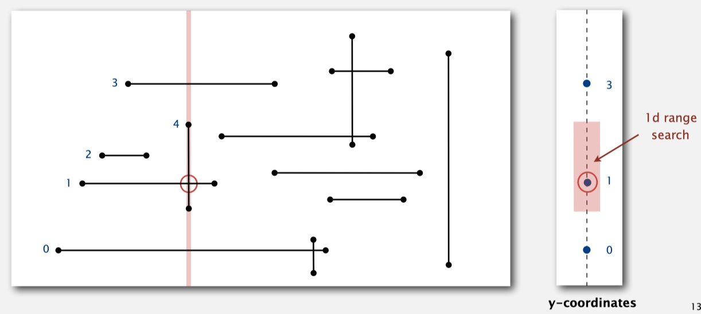

* The sweep-line algorithm takes time proportional to **N log N + R** to find all R intersections among N orthogonal line segments.
    * Put x-coordinates on a PQ (or sort). <-- N log N
    * Insert y-coordinates into BST. <-- N log N
    * Delete y-coordinates from BST. <-- N log N
    * Range searches in BST. <-- N log N + R
        * **R**: enumerate all of the intersections, after we got the ranges.

### kd trees
    
* Keys are point in the **plane**.
* Find/count points in a given **h-v rectangle**
* 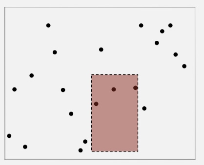

#### 2d tree construction

* **Data structure**. BST, but alternate using x- and y-coordinates as key.
    * Search gives rectangle containing point.
    * Insert further subdivides the plane.
* 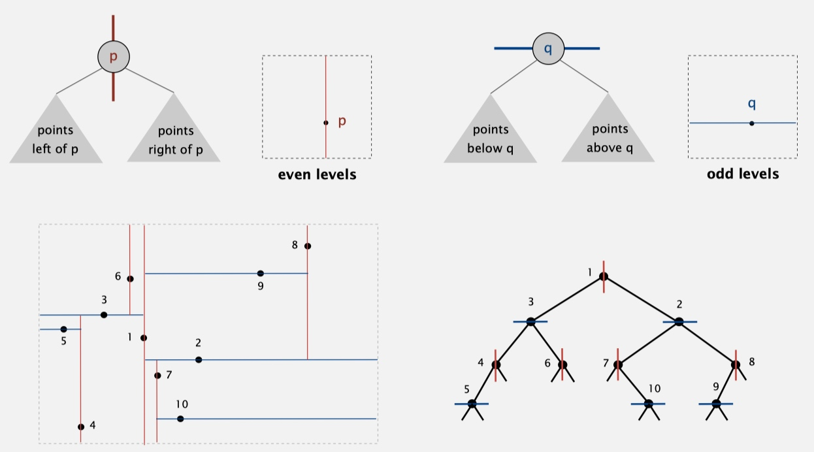
* 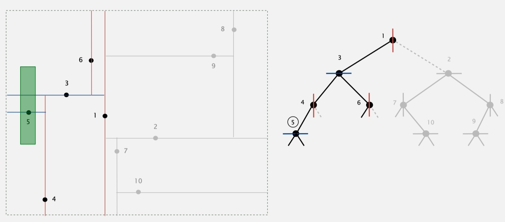

#### Analysis

* Typical case. **R + log N**.
* Worst case (assuming tree is balanced). **R + √N**.

#### Higher dimensions 

* Recursively partition k-dimensional space into 2 halfspaces.
* **Implementation**. BST, but cycle through dimensions ala 2d trees.
    * 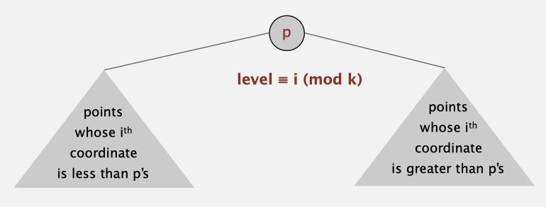

### interval search trees

* Create BST, where each node stores an interval ( lo, hi ).
* Use **left** endpoint as BST **key**.
* Store **max endpoint** in subtree rooted at node.
* 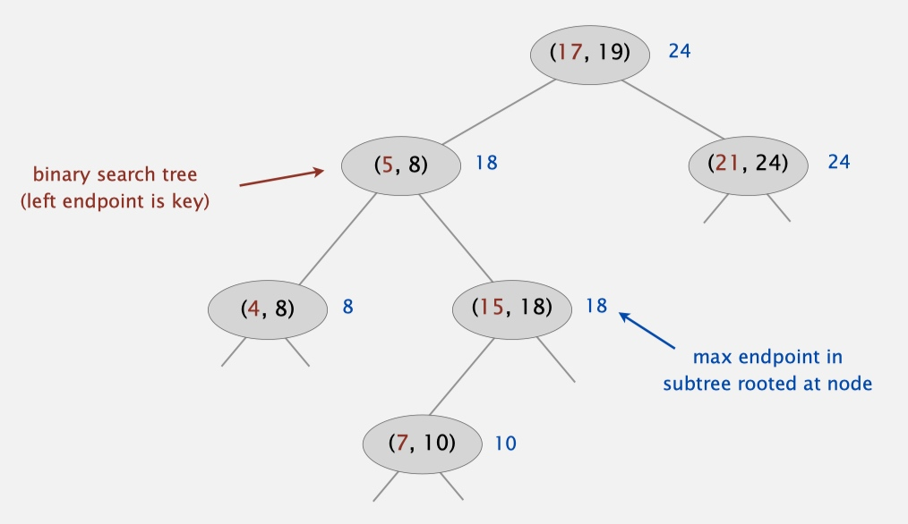

* To search for any one interval that intersects query interval ( lo, hi ) :
    * If interval in node intersects query interval, return it.
    * Else if left subtree is null, go right.
    * Else if max endpoint in left subtree is less than lo, go right.
    * Else go left.
    * 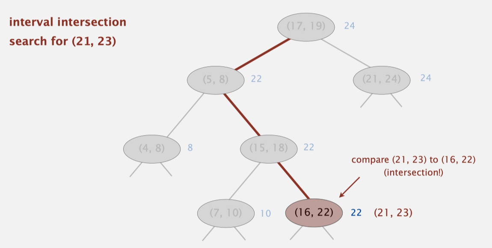

* ```java
  Node x = root; 
  while (x != null) {
      if (x.interval.intersects(lo, hi)) return x.interval;
      else if (x.left == null) x = x.right;
      else if (x.left.max < lo) x = x.right;
      else x = x.left; 
  } 
  return null;
  ```

### rectangle intersection

* **sweep-line algorithm**. Sweep vertical line from left to right.
    * x-coordinates of left and right endpoints define events.
    * Maintain set of rectangles that intersect the sweep line in an interval search tree (using y-intervals of rectangle).
    * Left endpoint: interval search for y-interval of rectangle; insert y-interval. 
    * Right endpoint: remove y-interval.
* 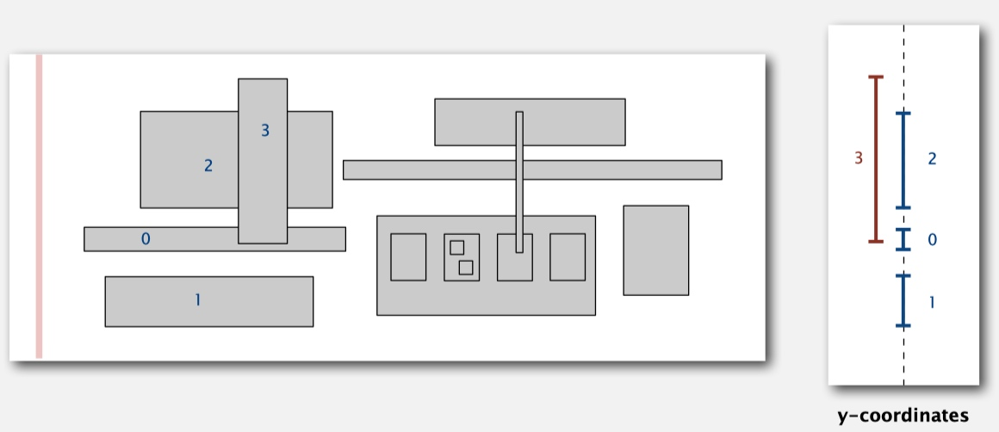

### Applications of BSTs

* 
