# Graphs

[TOC]

## Undirected Graphs

### Graph terminology

* **Path**. Sequence of vertices connected by edges. 
* **Cycle**. Path whose first and last vertices are the same.
* Two vertices are **connected** if there is a path between them.
* 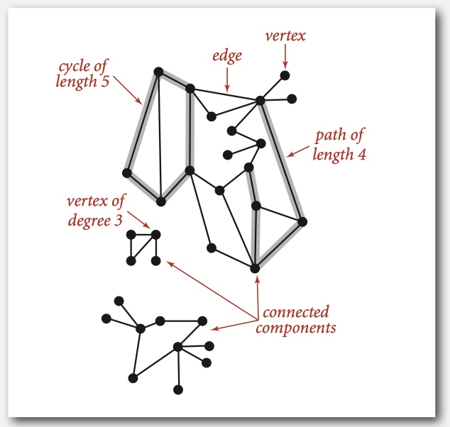

* Some graph-processing problems
    * **Path**. Is there a path between s and t ?
    * **Shortest path**. What is the shortest path between s and t ?
    * **Cycle**. Is there a cycle in the graph?
    * **Euler tour**. Is there a cycle that uses each edge exactly once? Hamilton tour. Is there a cycle that uses each vertex exactly once.
    * **Connectivity**. Is there a way to connect all of the vertices?
    * **MST**. What is the best way to connect all of the vertices? Biconnectivity. Is there a vertex whose removal disconnects the graph?
    * **Planarity**. Can you draw the graph in the plane with no crossing edges Graph isomorphism. Do two adjacency lists represent the same graph?
* **Challenge**. Which of these problems are easy? difficult? intractable?

### Graph API

* 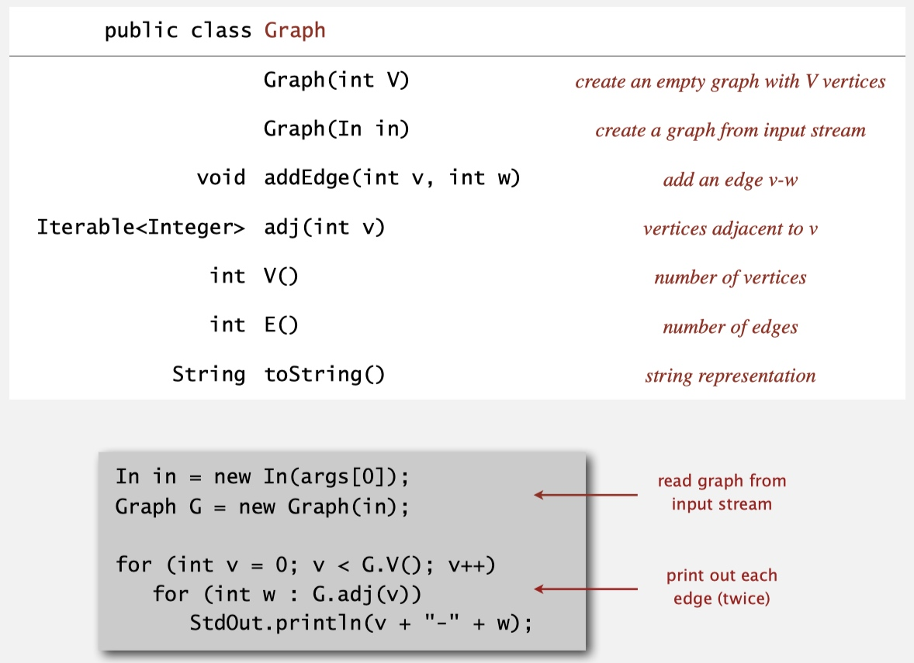
* Typical graph-processing code
* 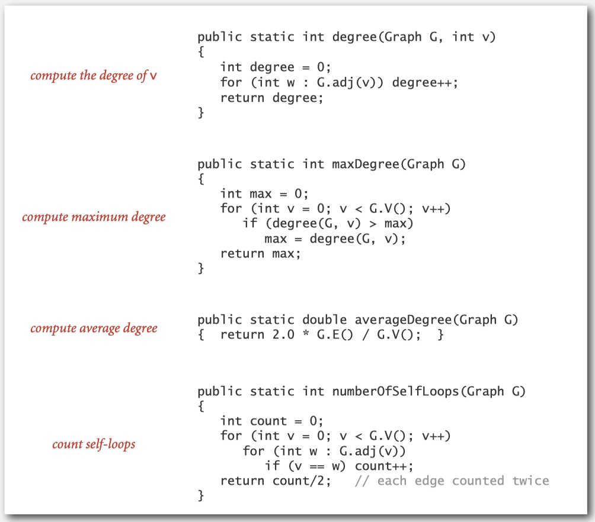

#### Adjacency-list graph representation

* 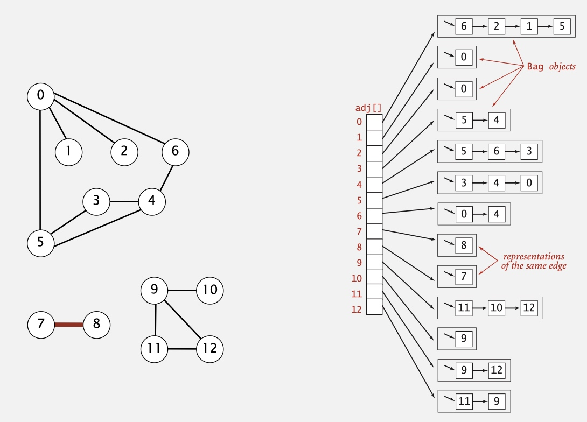
* 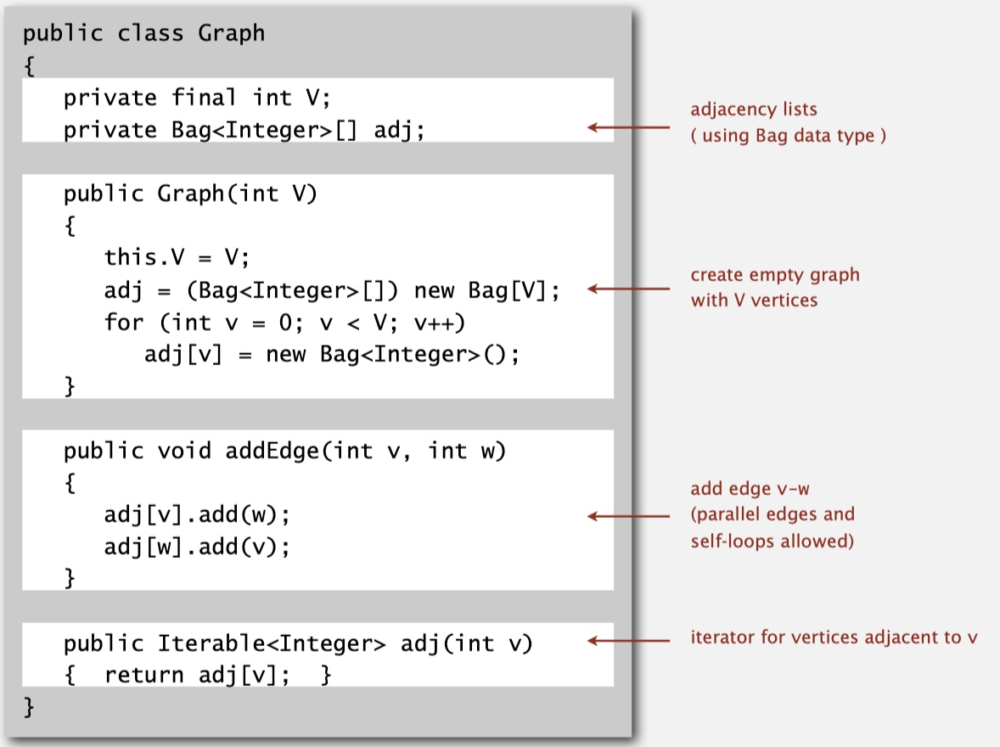

### Depth-first Search

* **Goal**. Find all vertices connected to s (and a corresponding path).
* **Algorithm**.
    * Use recursion (ball of string).
    * Mark each visited vertex (and keep track of edge taken to visit it). Return (retrace steps) when no unvisited options.
* **Data structures**.
    * **boolean[]** marked to mark visited vertices.
    * **int[]** edgeTo to keep tree of paths.
    * **(edgeTo[w] == v)** means that edge v-w taken to visit w for first time 
* 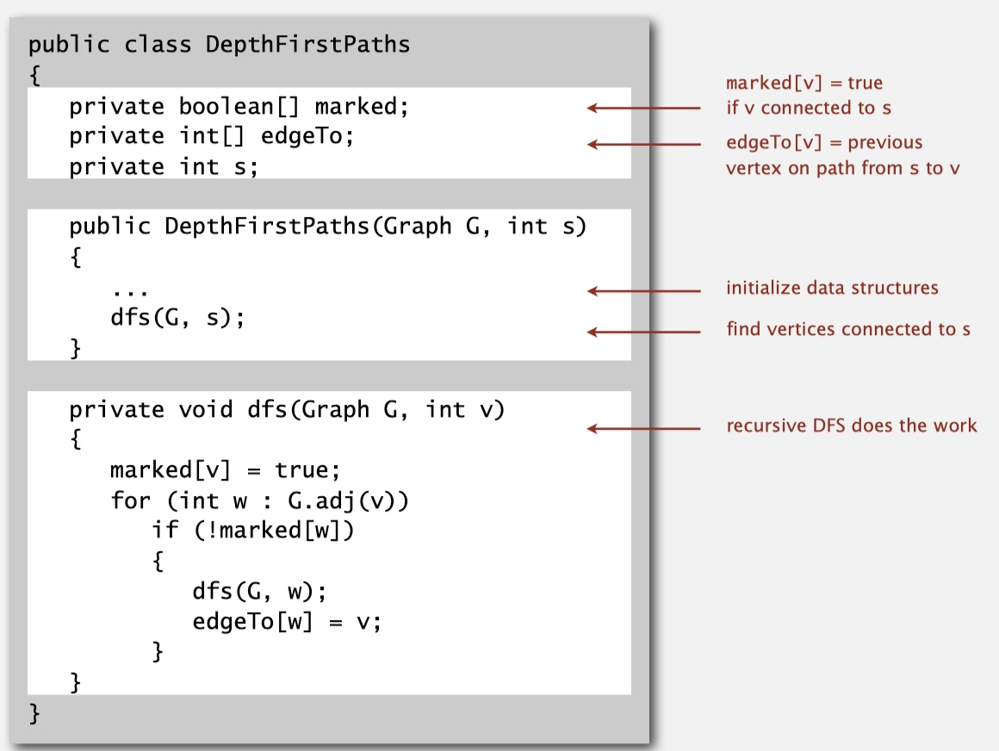


### Breadth-first Search

* **Depth-first search**. Put unvisited vertices on a **stack**. 
* **Breadth-first search**. Put unvisited vertices on a **queue**.
* **Shortest path**. Find path from s to t that uses **fewest number of edges**.

* **Algorithm**.
    * Put s onto a FIFO queue, and mark s as visited. 
    * Repeat until the queue is empty:
        - remove the least recently added vertex v
        - add each of v's unvisited neighbors to the queue, and mark them as visited.
* 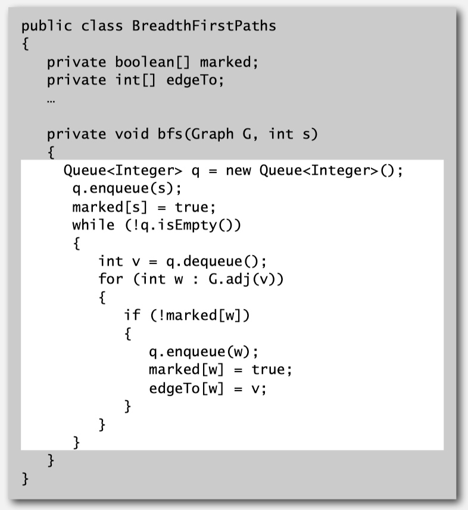

### Connected Components

* **Goal**:
    * Vertices v and w are **connected** if there is a path between them.
    * Preprocess graph to answer queries of the form is v connected to w? in **constant** time.
    * 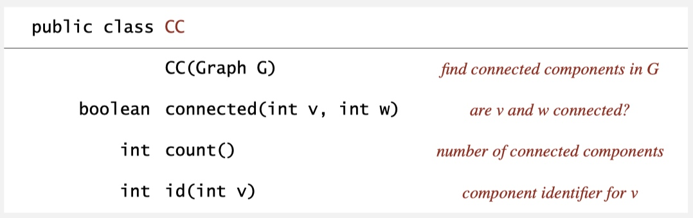
* The relation "is connected to" is an equivalence relation:
    * **Reflexive**: v is connected to v.
    * **Symmetric**: if v is connected to w, then w is connected to v.
    * **Transitive**: if v connected to w and w connected to x, then v connected to x.
* A connected component is a maximal set of connected vertices.
    * 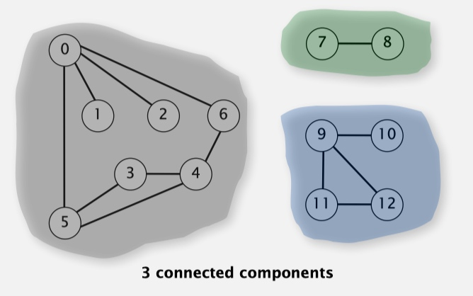
* **Algorithm**:
    * Initialize all vertices v as unmarked.
    * For each unmarked vertex v, run DFS to identify all vertices discovered as part of the same component.
* 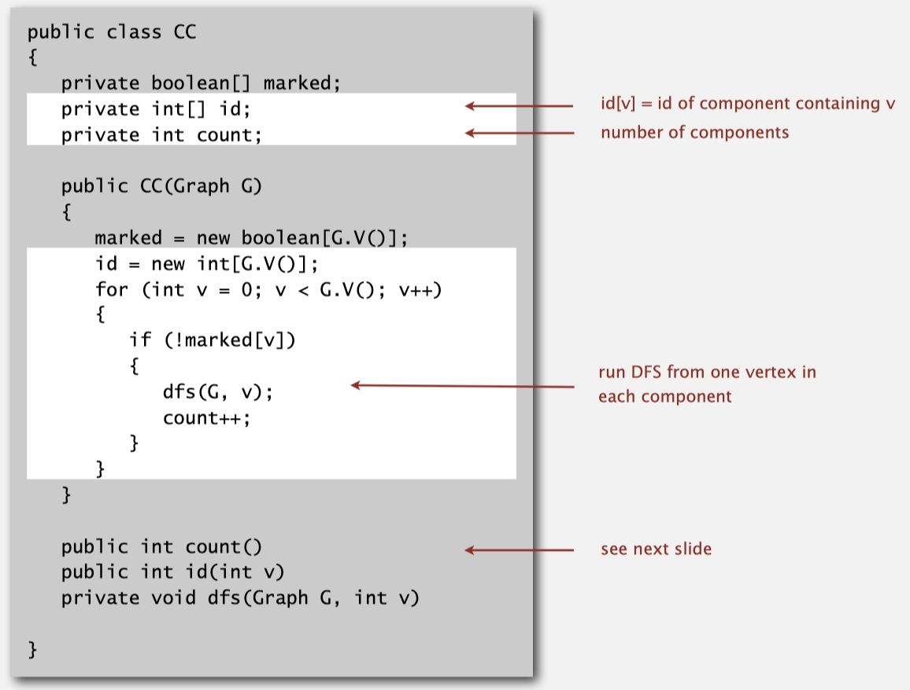
* 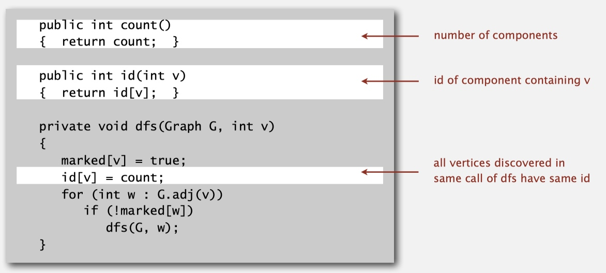

### Some Quizzes
* Some definitions:
    * An edge having the same vertex as both its end vertices is called a **self-loop**.
    * Two edges with the same end vertices are referred to as **parallel edges**.
    * A graph that has neither self-loops nor parallel edges is called a **simple graph**.
    * The **eccentricity** of a vertex v is the the length of the shortest path from that vertex to the furthest vertex from v. 
    * The **diameter** of a graph is the maximum eccentricity of any vertex. 
    * The **radius** of a graph is the smallest eccentricity of any vertex. radius is the middle vertex to one of the diameter vertex.
    * A **center** is a vertex whose eccentricity is the radius.
* **Diameter of a tree.** Given a graph that is a tree (connected and acyclic), find the longest path, i.e., a pair of vertices v and w that are as far apart as possible. Your algorithm should run in linear time.
    1. Assume **x** and **y** are the vertices with the longest diameter.
    2. Randomly pick any vertex **v**, and its furthest vertex **w** should be either **x** or **y**. Because the distance between any two vertices is definitely less than or equal to **x-y**.
        1. Remember there are always paths from **v** to **x** and **y**, so **v-w > v-x & v-w > v-y** can't be true in the same time. otherwise, **y** or **x** should be equal to **w**.
    3. Then just use **x** or **y** to find **y** or **x** which correspond to its furthest vertex.

* **Center of a tree**. Given a graph that is a tree (connected and acyclic), find a vertex such that its maximum distance from any other vertex is minimized.
    *  Find the diameter of the tree (the longest path between two vertices) and return a vertex in the middle.
*  **Parallel edge detection**. Devise a linear-time algorithm to count the parallel edges in a graph.
    *  Hint: maintain a boolean array of the neighbors of a vertex, and reuse this array by only reinitializing the entries as needed.
    *  I'm still not able to fully understand this "parallel edge" means. Does it mean two edges with the same start vertex and end vertex? or just need start with the same start vertex? // TODO got to figure out this later on.

## Directed Graphs (Digraphs)

* Set of vertices connected pairwise by directed edges.
* 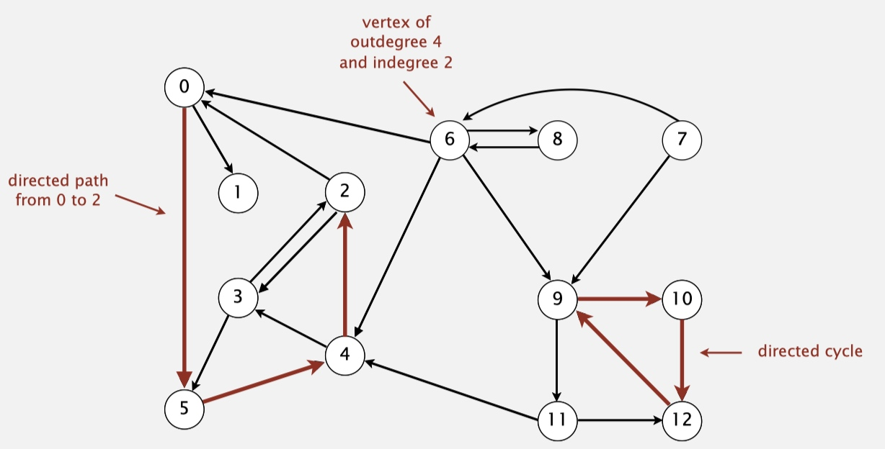

### Digraph API

* 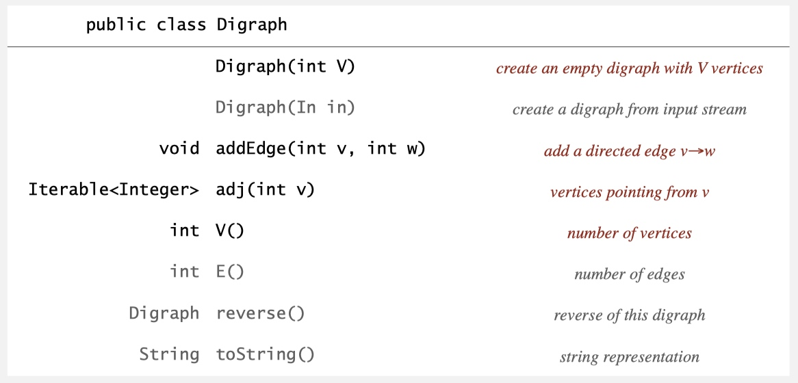
* toString()
    
    ```java
    In in = new In(args[0]);
    Digraph G = new Digraph(in);
    for (int v = 0; v < G.V(); v++) 
        for (int w: G.adj(v))
            StdOut.pringln(v + "->" + w);
    ```
* Adjacency-lists digraph representation
    * same as graph APIs. only difference is:

        ```java
        public void addEdge(int v, int w) { 
            adj[v].add(w);
        }
        ```
        
### Digraph Search

* same as Undirected Graph.

### Topological(拓扑) Sort

* **Goal**. Given a set of **tasks** to be completed with **precedence constraints,** in which order should we schedule the tasks?
    * Digraph model. 
        * vertex = task; 
        * edge = precedence constraint.
* 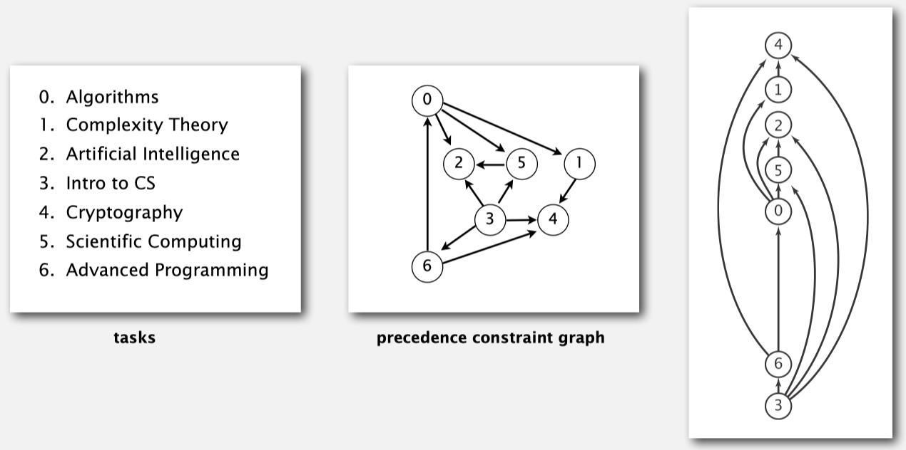
* **DAG**. Directed **acyclic** graph.
* **Topological sort**. Redraw DAG so all edges point upwards.
    * Run depth-first search.
    * Return vertices in reverse postorder.
    * 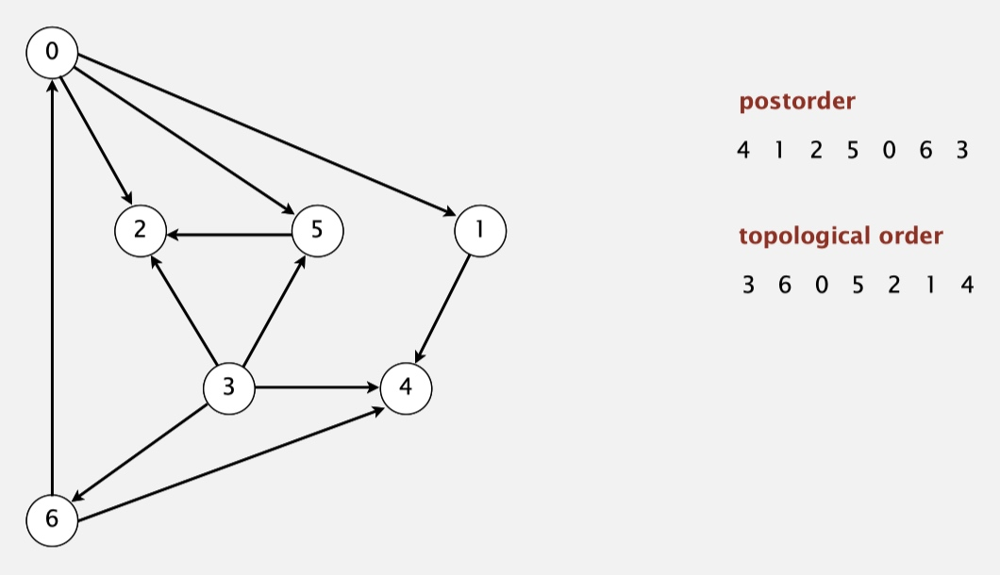

* A digraph has a topological order **iff no directed cycle**.

### Strong Components

* **Def**. Vertices v and w are **strongly connected** if there is both a directed path from v to w and a directed path from w to v.
* **Def**. A **strong component** is a maximal subset of strongly-connected vertices.
    * 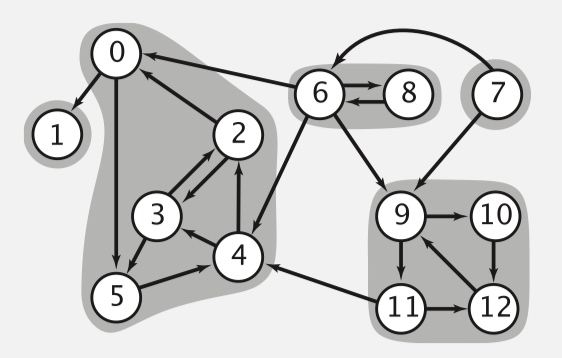

* **Kosaraju-Sharir algorithm**

    * **Reverse graph**. Strong components in G are same as in G R .