# Week 3 - Maximum Flow and Minimum Cut & String Sorts

[TOC]

## Maximum Flow and Minimum Cut

// TODO

## String Sorts

### strings in Java 

* Sequence of characters (immutable)

* **String vs. StringBuilder**

    * Quadratic time
        
        ```java
        public static String reverse(String s) { 
            String rev = ""; 
            for (int i = s.length() - 1; i >= 0; i--) 
                rev += s.charAt(i); 
            return rev; 
        }
        ```
    * Linear time
    
        ```java
        public static String reverse(String s) { 
            StringBuilder rev = new StringBuilder(); 
            for (int i = s.length() - 1; i >= 0; i--) 
                rev.append(s.charAt(i)); 
            return rev.toString(); 
        }
        ```
        
#### Alphabets

* **Digital key**. Sequence of digits over fixed alphabet.
* **Radix**. Number of digits R in alphabet.
* 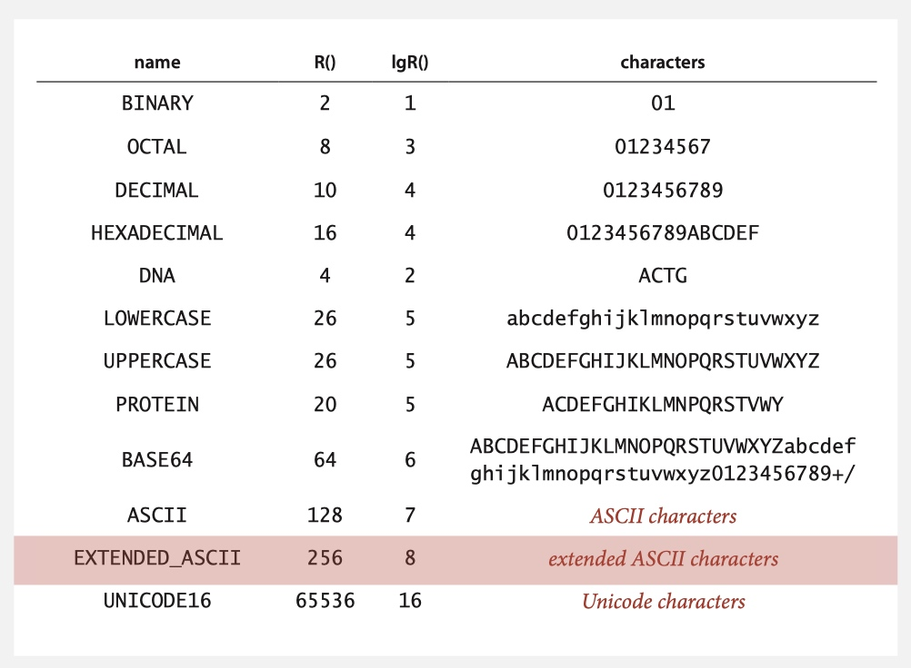

    
### key-indexed counting 

* **Assumption**. Keys are integers between 0 and R - 1.
* **Goal**. Sort an array a[] of N integers between 0 and R - 1.
* **Implementation**.

    ```java
    int N = a.length; 
    // EXTENDED_ASCII 256 8 extended ASCII characters
    // R = 256
    int[] count = new int[R+1];

    // 1. Count frequencies of each letter using key as index.
    for (int i = 0; i < N; i++) 
        count[a[i]+1]++;

    // 2. Compute frequency cumulates which specify destinations.
    for (int r = 0; r < R; r++) 
        count[r+1] += count[r];

    // 3. Access cumulates using key as index to move items.
    for (int i = 0; i < N; i++) 
        aux[count[a[i]]++] = a[i];

    // 4. Copy back into original array.
    for (int i = 0; i < N; i++) 
        a[i] = aux[i];
    ```

* 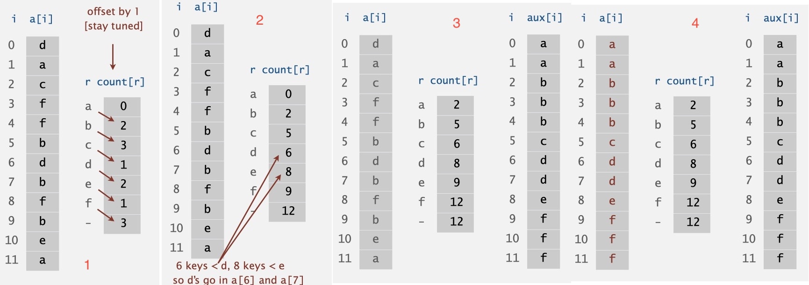
    * **Notice**: use a for 0, b for 1, c for 2, d for 3, e for 4, f for 5 for better explanation

* **Proposition**. Key-indexed counting uses ~ 11 N + 4 R array accesses to sort N items whose **keys are integers between 0 and R - 1**.

### LSD radix sort 

* Least-significant-digit-first string sort
* LSD string (radix) sort.
    * Consider characters from right to left.
    * Stably sort using d^th character as the key (using key-indexed counting).
* 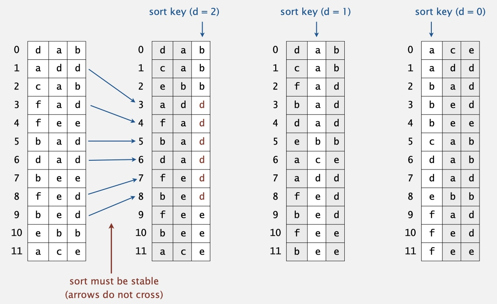
* 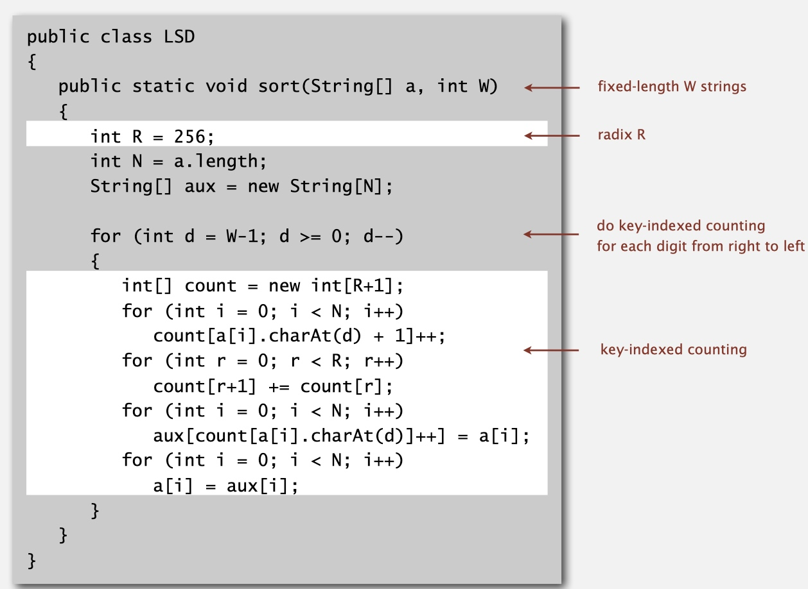


### MSD radix sort 

* Most-significant-digit-first string sort
    * Partition array into R pieces according to first character (use key-indexed counting).
    * Recursively sort all strings that start with each character (key-indexed counts delineate subarrays to sort).
* 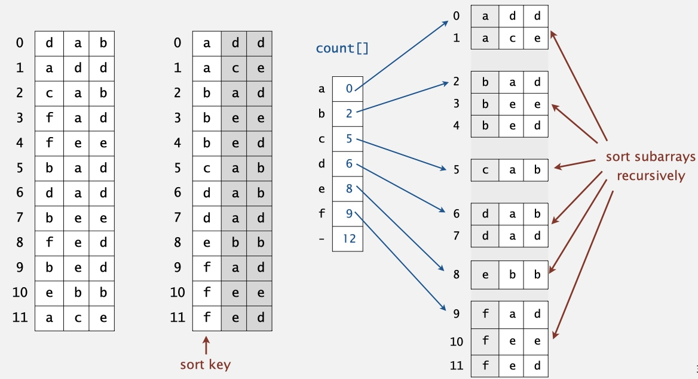
* Treat strings as if they had an extra char at end (smaller than any char).
    * 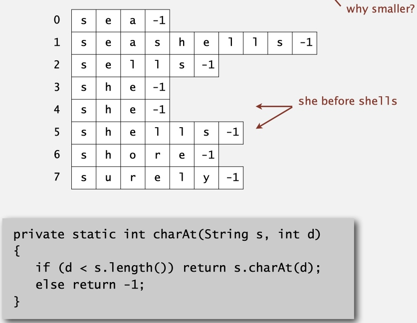
* implementation
    * 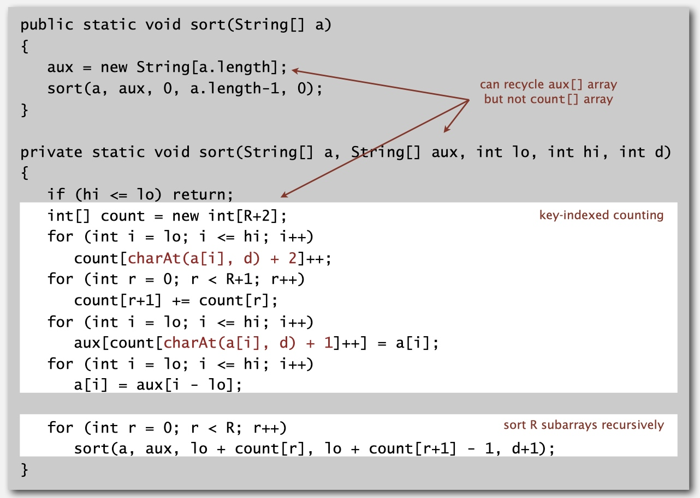
* potential for disastrous performance
    1. much too slow for small subarrays
    2. Huge number of small subarrays
    
    * Solution: Cutoff to insertion sort for small subarrays.
        * Insertion sort, but start at d th character.
        * Implement less() so that it compares starting at d^th character.
        * 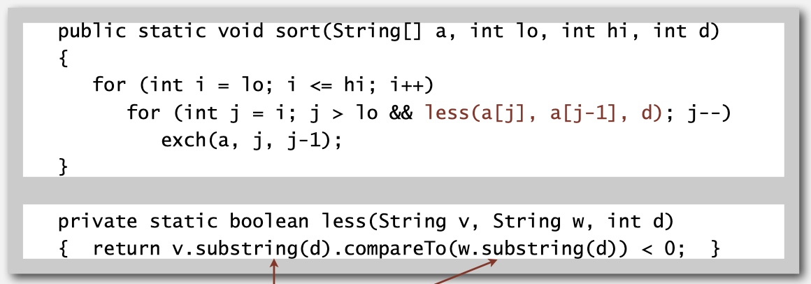
    
### 3-way radix quicksort 

* 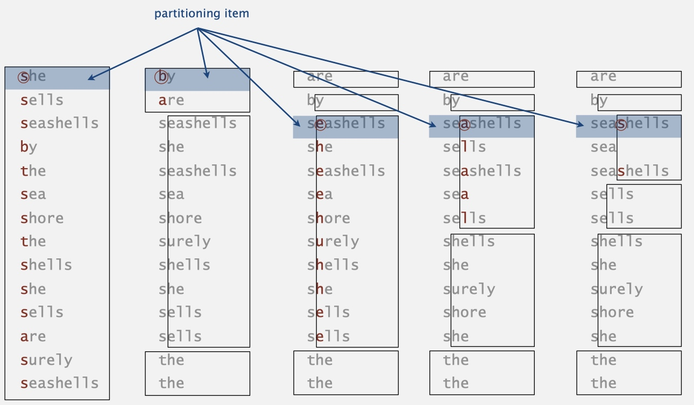
* 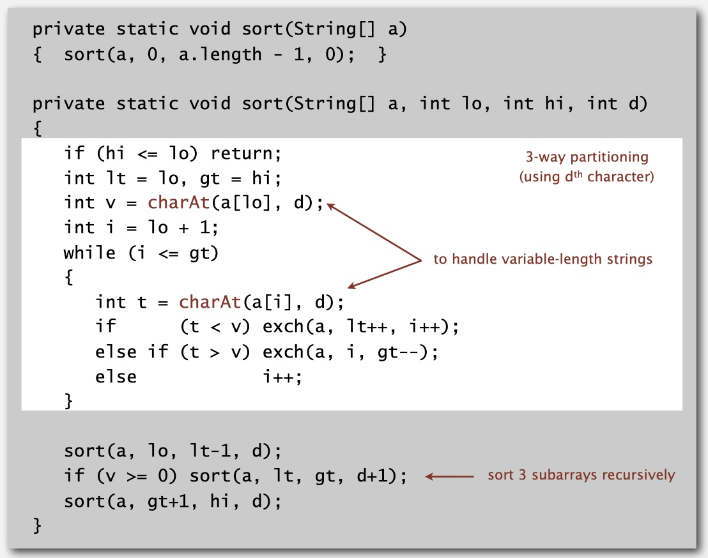
* faster than the other two algorithms, but not stable.

### suffix arrays

#### Suffix sort

* 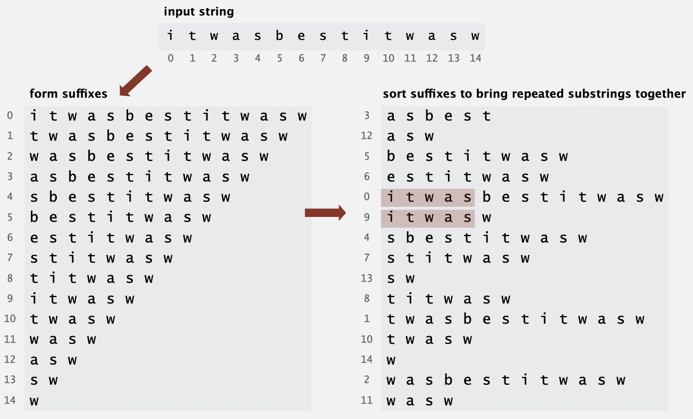
* Can be used for finding longest repeated substring
* **worst-case input**: longest repeated substring very long.
    * LRS needs at least 1 + 2 + 3 + ... + D character compares, where D = length of longest match.

#### Manber-Myers MSD algorithm

* Suffix sorting in linearithmic time
    * linear: N, linearithmic: a * N
* overview
    * **Phase 0**: sort on first character using key-indexed counting sort. 
    * **Phase i**: given array of suffixes sorted on first 2 i - 1 characters, create array of suffixes sorted on first 2 i characters.
* Key process: Constant-time string compare by indexing into inverse
    * 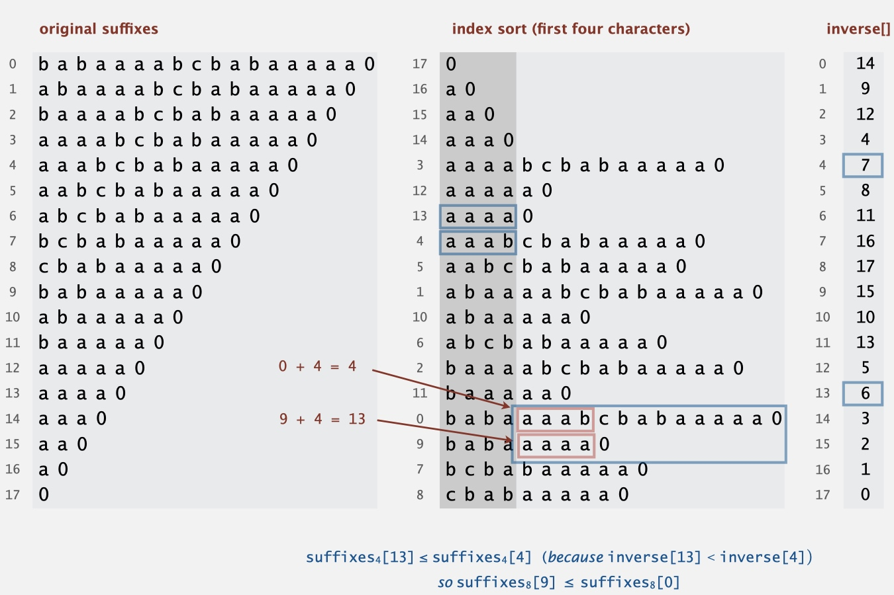
    * inverse[]:
        * before: {0: 17, 1: 16, 2: 15, ..., 9: 1, ..., 12: 2, ..., 14: 0 }
        * after: { 0: 14, 1: 9, 2: 12, ...}
