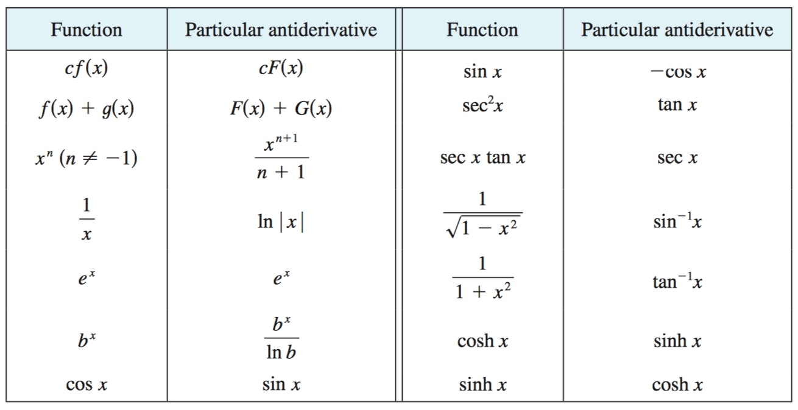
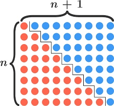
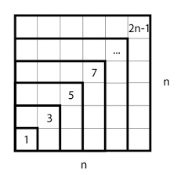
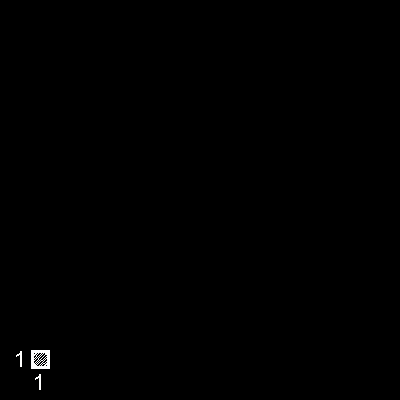
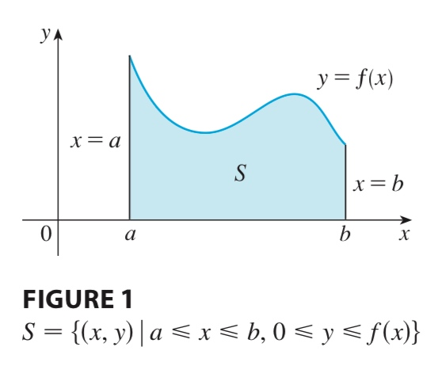
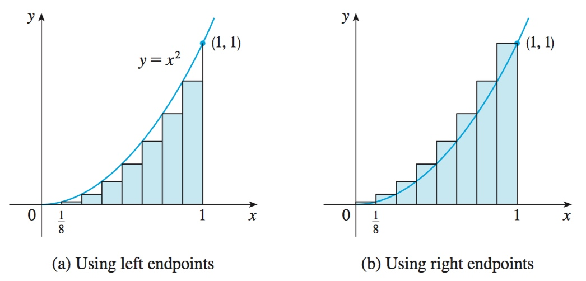
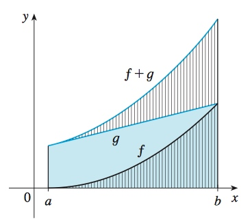
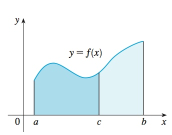
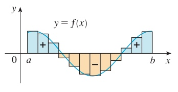

# Week 11-12 - Antidifferentiation & Integration

[TOC]

## Antiderivatives

* Anti-differentiation is a bridge between the differentiation and the integration.
* **Theorem** If \\(f\\) is an antiderivative of \\(f\\) on an interval **I**, then the most general antiderivative of \\(f\\) on **I** is \\(F(x) + C\\) where **C** is an arbitrary constant.
* 
* **the sum of antiderivatives**
    * \\(\int(f(x) +g(x)) dx = \int(f(x)) dx + \int(g(x) dx\\)
* The antiderivative of \\(f(mx+b)\\)
    * \\(\int f(mx+b) dx = \dfrac{F(mx+b)}{m} + C\\)

## Integration

### Summation Notation

* [Sum of n, n², or n³(Brilliant.org)](https://brilliant.org/wiki/sum-of-n-n2-or-n3/)

* \\(\displaystyle\sum_{i=0}^{n}i = \frac{n(n+1)}{2}\\)
    * 
* \\(\displaystyle\sum_{i=0}^{n}(2i-1) = n^2\\)
    * 
* \\(\displaystyle\sum_{i=0}^{n}i^2 = \frac{(2n+1)(n+1)n}{6}\\)
    * Animation: [http://www.takayaiwamoto.com/Sums_and_Series/sumsqr_1_anim.gif](http://www.takayaiwamoto.com/Sums_and_Series/sumsqr_1_anim.gif)
    * [khanacademy.org](https://www.khanacademy.org/math/calculus-home/series-calc/series-basics-challenge/v/sum-of-n-squares-1)
* \\(\displaystyle\sum_{i=0}^{n}i^3 = (\sum_{i=0}^{n}i)^2\\)
    * 
    * From [Math can be fun with CAD](http://www.takayaiwamoto.com/Sums_and_Series/Sums_and_Series.html)
* What about \\(\displaystyle\sum_{i=0}^{n}i^m\\)?
    * [Sum of 1 to N^m,](http://www.takayaiwamoto.com/Sums_and_Series/sum_mpower.html)

### The Area Problem

* Find the area of the region **S** that lies under the curve \\(y = f(x)\\) from **a** to **b**.
    * 
* Riemann Sum:
    * Patition the intervel \\([a, b]\\) and \\(x_0 = a < x_1 < x_2 < \ldots < x_n = b\\). Choose sample points \\(x_i\\), then \\[\text{Area}\ \approx \sum_{i=1}^nf(x_i) \cdot (x_i - x_{i-1})\\]
    * Left Riemann Sum: \\(x_i^* = x_{i-1}\\)
        * \\(\displaystyle\sum_{i=1}^nf(x_{i-1}) \cdot (x_i-x_{i-1})\\)
    * Right Riemann Sum: \\(x_i^* = x_{i}\\)
        * \\(\displaystyle\sum_{i=1}^nf(x_{i}) \cdot (x_i-x_{i-1})\\)
    * 
    * PS: \\(x_i^*\\) can be any number in the **i**th subinterval \\([x_{i-1}, x_i]\\).

### Definition of a Definite Integral

* If \\(f\\) is a function defined for \\(a \le x \le b\\), we divide the interval \\([a, b]\\) into **n** subintervals of equal width \\(\Delta x = (b - a)/n\\). We let \\(x_0(=a), x_1, x_2, \ldots, x_n(=b)\\) be the endpoints of these subintervals and we let \\(x_1^*, x_2^*, \ldots, x_n^*\\) be any **samples points** in these subintervals, so \\(x^*\\) lies in the **i**th subinterval \\([x_{i-1}, x_i]\\). Then the **definite integral of f from a to b** is \\[\int_a^bf(x)dx = \lim_{n \to \infty}^n f(x_i^*) \Delta x\\]
* provided that this limit exists and gives the same value for all possible choices of sample points. If it does exist, we say that **f** is integrable on \\([a, b]\\).

### Compute Integrals

* What is the integral of x^2 from x=0 to 1? (\\(\int_0^1 x^2 dx\\))
    * \\(f(x) = x^2\\) is continuous so it is integrable \\(x_i = \frac{1}{n}\\), check the figure above.
    * \\(\displaystyle\sum_{i=1}^n f(x_i^*) \cdot (x_i - x_{i-1}) = \sum_{i=1}^n (\frac{1}{n})^2 \cdot \frac{1}{n}\\)
    * \\(\begin{aligned}\int_0^1 x^2 dx &= \sum_{i=1}^n (\frac{1}{n})^2 \cdot \frac{1}{n} \\
        &= \lim_{n \to \infty} \sum_{i=1}^n \frac{1}{n^3} \cdot \frac{1}{n} = \lim_{n \to \infty} \frac{1}{n^3} \cdot \sum_{i=1}^n i^2 \\
        &= \lim_{n \to \infty}(\frac{1}{n^3} \cdot \frac{(n)(n+1)(2n+1)}{6}) \\
        &= \lim_{n \to \infty}(\frac{1}{n^3} \cdot \frac{2n^3+3n^2+n}{6}) \\
        &= \frac{1}{3}
        \end{aligned}\\)
    * So, \\(3\int_0^1 x^2 dx = \int_0^1 3x^2 dx = 1\\): like stretching the area vertically, then we get \\(\int_0^1 3x^2 dx\\)
    * This deduction doesn't say that the area of x^2 from x=0 to 1 is 1/3. It use limit theorem to point out that, if we removed a little piece of area 1/3 then we can fit it in area \\(\int_0^1 3x^2 dx\\). And the same, if we add a little piece of area 1/3 then we can cover it up. It is all about **limits**.

* What is the integral of x^3 from x = 1 to 2?
    * \\[\begin{aligned}
        \sum_{i=1}^n f(x_i^*) \cdot (x_i - x_{i-1}) &= \sum_{i=1}^n f(\frac{2}{n} \cdot i) \cdot \frac{2}{n} \\
        &= \sum_{i=1}^n (\frac{2}{n} \cdot i)^3 \cdot \frac{2}{n} \\
        &= \sum_{i=1}^n\frac{16}{n^4} \cdot i^3
        \end{aligned}\\]
    * \\[\begin{aligned}\int_0^2 x^3 dx &= \lim_{n \to \infty} \sum_{i=1}^n \frac{16}{n^4} \cdot i^3 \\
        &= \lim_{n \to \infty} \sum_{i=1}^n \frac{16}{n^4} \cdot \sum_{i=1}^n i^3 = \lim_{n \to \infty} \sum_{i=1}^n \frac{16}{n^4} \cdot (\sum_{i=1}^n i)^2 \\
        &= \lim_{n \to \infty} \sum_{i=1}^n \frac{16}{n^4} \cdot (\frac{(n)(n+1)}{2})^2 = \lim_{n \to \infty} \frac{4n^2(n+1)^2}{n^4} \\
        &= 4
        \end{aligned}\\]
    * Use same deduction, we get \\(\displaystyle\int_0^1 x^3 dx = \frac{1}{4}\\)
    * Then \\(\displaystyle\int_0^2 x^3 dx = \displaystyle\int_0^1 x^3 dx + \displaystyle\int_1^2 x^3 dx = 1/4 + 4\\)

#### Properties of the Integral

* \\(\displaystyle \int_a^b c dx = c(b-a) \\), where c is any constant
* \\(\displaystyle \int_a^b [f(x) + g(x)] dx = \int_a^b f(x) dx + \int_a^b g(x) dx \\)
    * 
* \\(\displaystyle \int_a^b [f(x) - g(x)] dx = \int_a^b f(x) dx - \int_a^b g(x) dx \\)
* \\(\displaystyle \int_a^b c f(x) dx = c \int_a^b f(x) dx \\)
* \\(\displaystyle \int_a^c f(x) dx + \int_c^b f(x) dx = \int_a^b f(x) dx \\)
    * 

#### The Accumulation Function Increasing/Decreasing

* If **f** takes on both _positive_ and _negative_ values, as in the figure below, then the **Riemann sum** is the sum of the areas of the rectangles that lie above the x-axis and the negatives of the areas of the rectangles that lie below the x-axis (the areas of the blue rectangles minus the areas of the gold rectangles).
* 
* So when **f** is positive, **A(x)** increasing, and **A'(x) > 0**. In other way, when **f** is negative, **A(x)** decreasing, and **A'(x) < 0**.

### The Integral of Sin x From -1 To 1

* \\[\begin{aligned}
    \int_{-1}^1 \sin x dx &= \int_{-1}^0 \sin x dx + \int_0^1 \sin x dx \\
    &= \int_0^1 \sin (-x) dx + \int_0^1 \sin x dx \\
    &= \int_0^1 - \sin x dx + \int_0^1 \sin x dx \\
    &= - \int_0^1 \sin x dx + \int_0^1 \sin x dx \\
    &= 0
    \end{aligned}\\]
* So, symmetry can be exploited to calculate some integrals.

## Refers

* [http://www.takayaiwamoto.com/Sums_and_Series/Sums_and_Series.html](http://www.takayaiwamoto.com/Sums_and_Series/Sums_and_Series.html)

