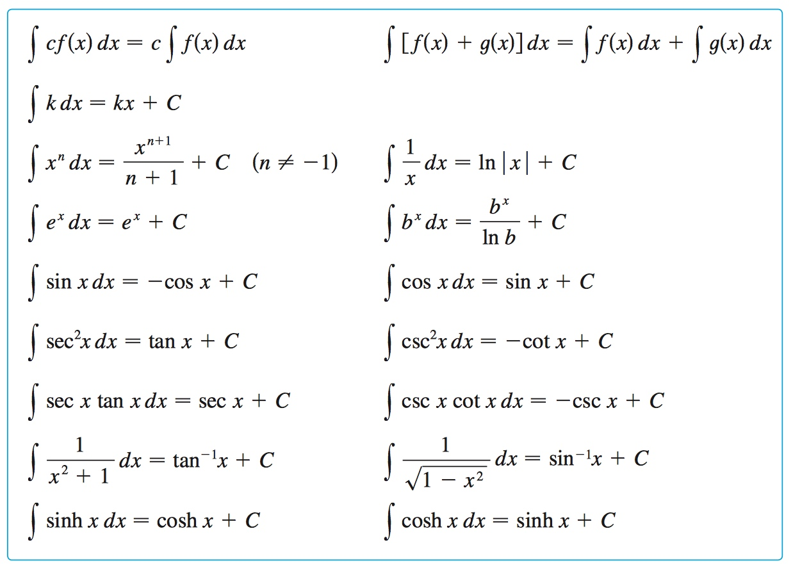
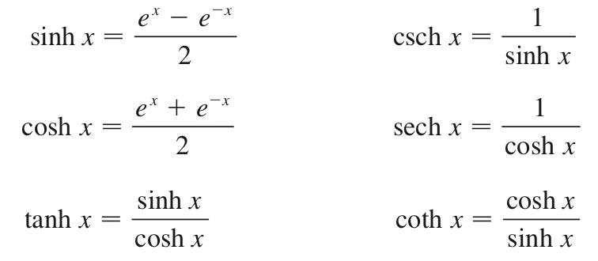
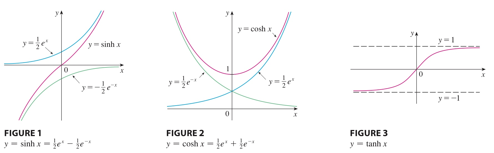

# Week 15 - Techniques of Integration

[TOC]

## Integration by Parts

* Every differentiation rule has a corresponding integration rule.
* The rule that corresponds to the Product Rule for differentiation is called the rule for **integration by parts**.
* The Product Rule states that if **f** and **g** are differentiable functions, then $$\frac{d}{dx}[f(x)g(x)] = f(x)g'(x) + f'(x)g(x)$$
* In the notation for indefinite integrals this equation becomes $$\int [f(x)g'(x) + f'(x)g(x)] dx = f(x)g(x)$$
* We can rearrange this equation as $$\int f(x)g'(x) dx = f(x)g(x) - \int f'(x)g(x)$$
* Let $$u = f(x)$$ and $$v = g(x)$$, we can simplify the equation: $$\int u\ dv = uv - \int v\ du$$

### Examples

1. $$\int x e^x$$
    * Let $$u = x$$ and $$dv = e^x dx$$
    * $$\int x e^x = x e^x - \int x \cdot e^x = x e^x - e^x + C $$
2. $$\int \log{x} dx$$
    * Let $$u = \log{x}$$ and $$dv = dx$$
    * $$\int \log{x} dx = x\log{x} - \int \frac{d}{dx}\log{x} \cdot x dx = x\log{x} - \int 1\ dx = x\log{x} - x$$
3. $$\int e^x \cos{x}  dx$$
    * Let $$u = e^x$$ and $$dv = \cos{x}\ dx$$
    * $$\int \cos{x} e^x\ dx = e^x \cdot \sin{x} - \int e^x \cdot \sin{x}\ dx$$
    * Let's calculate the part $$\int e^x \cdot \sin{x}\ dx$$
        * Let $$u = e^x$$ and $$dv = \sin{x}\ dx$$
        * $$\int e^x \cdot \sin{x}\ dx = e^x \cdot (-\cos{x}) - \int e^x \cdot (-\cos{x})\ dx $$
        * $$\int e^x \cdot \sin{x}\ dx = - e^x \cdot \cos{x} + \int e^x \cdot \cos{x}\ dx$$
    * Then we get $$\int e^x \cos{x}\ dx = e^x \cdot \sin{x} + e^x \cdot \cos{x} - \int e^x \cdot \cos{x}\ dx$$
    * So, $$\int e^x \cos{x}\ dx = \frac{e^x \cdot \sin{x} + e^x \cdot \cos{x} }{2} $$

### When to Use Parts?

* Example $$\int e^{\sqrt{x} } dx$$
* First we need to use **Substitution rule** to replace $$\sqrt{x}$$
* Let's set $$u = \sqrt{x}$$, then $$x = u^2, dx = 2u$$
* We rewrite the function $$\int e^u \cdot 2u\ du$$
* Now we can use **Parts**:
    * Let $$v = 2u, dw = e^u\ du$$, then
    * $$\int e^u \cdot 2u\ du = 2u \cdot e^u - \int 2e^u du = 2u \cdot e^u - 2e^u + C = 2e^{\sqrt{x} }(\sqrt{x}-1) + C$$

## Integrate Powers of Sines and Cosines

* **If the power of cosine or sine is odd**:
    * Example $$\int \sin^{(2n+1)}{x} \cdot \cos^{2n}{x}\ dx$$, ($$n \in \mathbb{R}$$)
    * We can't use the **Substitution rule** directly, because whichever we choose to be $$u$$ (sine or cosine), we will always get a part that can't deal with.
        * Like, if we choose $$u = \sin{x}, du = \cos{x}\ dx$$, then the part $$\cos^{2n}{x}$$ will not be able to transfer.
    * Instead of making substitution immediately, we can trade a pair of sines for a pair of cosines.
        * $$= \int \sin{x} \cdot \sin^{2n}{x} \cdot \cos^{2n}{x} \ du$$
        * $$= \int \sin{x} \cdot (1-\cos^{2}{x})^n \cdot \cos^{2n}{x} \ du$$
    * Set $$u = \cos{x}, du = -\sin{x}\ dx$$, we get:
        * $$= - \int (1-u^{2})^n \cdot u^{2n} \ du$$
        * $$= - \int u^{2n} - u^{4n} \ du$$
        * $$= - \frac{1}{2n+1}u^{2n+1} + \frac{1}{4n+1}u^{4n} + C $$
        * $$= - \frac{1}{2n+1}\cos^{2n+1}{x} + \frac{1}{4n+1}\cos^{4n}{x} + C $$
    * **The conclusion is**, we can always transfer the odd one to $$\sin^{2n}{x} \cdot \sin{x}$$ or $$\cos^{2n}{x} \cdot \cos{x}$$, and use the equation $$\sin^2{x} + \cos^2{x} = 1$$ to transfer between $$\sin$$ and $$\cos$$ .
* If the powers of both sine and cosine are even, use the **half-­angle identities**:$$
    \sin^2{x} = \frac{1}{2}(1 - \cos(2x)),\ \cos^2{x} = \frac{1}{2}(1 + \cos(2x))
    $$
    * It is sometimes helpful to use the identity $$\sin{x}\cos{x} = \frac{1}{2}\sin{2x}$$
    * For example: $$\begin{aligned}
        \int_0^{\pi} \sin^2{x} \ dx &= \frac{1}{2} \int_0^{\pi}(1 - \cos{2x})\ dx \\
        &= \big[\frac{1}{2}(x-\frac{1}{2}\sin{2x})\big]_0^{\pi} \\
        &= \frac{1}{2}(\pi - \frac{1}{2} \sin{2\pi}) - \frac{1}{2}(0 - \frac{1}{2}\sin{0}) = \frac{1}{2}\pi
        \end{aligned}$$

## Tables of Indefinite Integrals

* 
    * $$tan^{-1}x = \arctan{x}$$
    * Hyperbolic functions 
        * In mathematics, hyperbolic functions are analogs of the ordinary trigonometric, or circular, functions. --from [Wikipedia](https://en.wikipedia.org/wiki/Hyperbolic_function)
        * 
        * 

## Words

* **vice versa** [,vaisi'və:sə] 反之亦然

