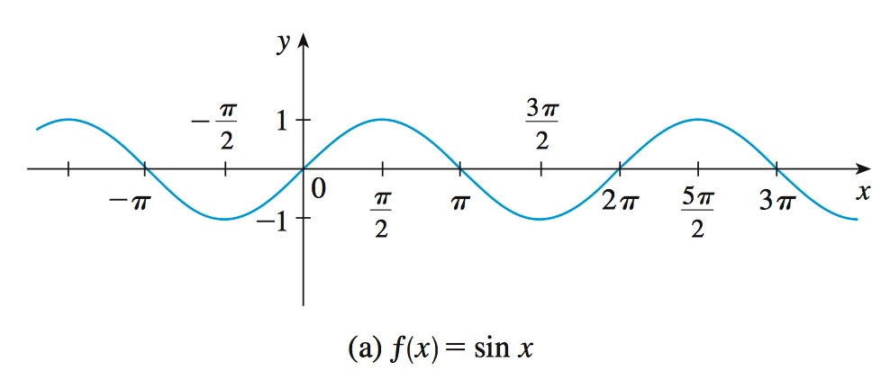

# Week 2-3 - Functions & Limits

[TOC]

## Functions

* **Definition**: A function `f` is a rule that assigns to each element `x` in a set `D` exactly **one** element, called \\(f(x)\\), in a set `E`.
    * The set `D` is called the **domain** of the function.
    * The number \\(f(x)\\) is the value of `f` at `x` and is read "f of x".
    * The **range** of `f` is the set of all possible values of \\(f(x)\\) as `x` varies throughout the domain.
    * A symbol that represents an arbitrary number in the _domain_ of a function `f` is called an **independent variable**. A symbol that represents a number in the _range_ of `f` is called a **dependent variable**.
* Four ways to represent a functions
    * verbally (by a description in words)
    * numerically (by a table of values)
    * visually (by a graph)
    * algebraically (by an explicit formula)

* A catalog of essential functions

    * **linear function**
        * \\(f(x) = mx+b\\)
        * 

    * **polynomials**
        * \\(P(x)=a_{n}x^{n}+a_{n-1}x^{n-1}+a_{n-2}x^{n-2}+...+a_{2}x^{2}+a_{1}x^{1}+a_{0}\\)
        * The domain of any polynomial is \\(\mathbb{R} = (-\infty, + \infty)\\). 
        * If the leading coefficient \\(a_{n}\ne 0\\), then the degree of the polynomial is **n**.
            * `n=2`: quadratic function
                * 
            * `n=3`: cubic function
                * 

    * **power function**
        * \\(f(x) = x^a\\)
            * `a = n`, where `n` is a positive integer
                * 
            * `a = 1/n`, where `n` is a positive integer. It's a **root function.**
                * 
            * `a = -1`: **reciprocal function**
                * 

    * **rational function** 
        * A rational function `f` is a ratio of two polynomials:
            * \\(f(x)=\frac{P(x)}{Q(x)}\\), \\(\{Q(x)\ne0\}\\)
            * \\(f(x)=\frac{2x^{4}-x^{2}+1}{x^{2}-4}\\), \\(\{x|x \ne \pm 2\}\\):
                * 

    * **algebraic function**
        * A function `f` is called an **algebraic function** if it can be constructed using algebraic operations (such as addition, subtraction, multiplication, division, and taking roots)

    * **trigonometric function**
        * \\(f(x)=\sin{x}\\)
        * 
    
    * **exponential function**
        * \\(f(x)=b^x\\)
        * 
        * law of exponential function:
            * \\(b^{x+y}=b^x+b^y\\)
            * \\(b^{x-y}=\frac{b^x}{b^y}\\)
            * \\((b^{x})^{y}=b^{xy}\\)
            * \\({ab}^{x}=a^{x}b^{x}\\)

    * **logarithmic function**
        * \\(f(x)=\log_{b}{x}\\)
        * 

### Combinations of Functions

* \\((f+g)(x)=f(x)+g(x)\\)
* \\((f-g)(x)=f(x)-g(x)\\)
* \\((fg)(x)=f(x)g(x)\\), the domain of `fg` is \\(A \cap B\\)
* \\((\frac{f}{g})(x)=\frac{f(x)}{g(x)}\\), the domain of `f/g` is \\(\{x \in A \cap B\ |\ g(x) \ne 0\}\\).
* \\((f \circ g)(x) = f(g(x))\\)
    * composition (or composite) of `f` and `g`, denoted by \\(f \circ g\\) (“f circle g”). 
    * 

### Inverse of Functions

* Definition:
    * If a function maps every input to exactly **one** output, an inverse of that function maps every “output” to exactly **one** “input.”
* denoted by\\( f^{-1}\\) , and read “**f inverse**”.
* to function \\(N=f(t)\\), the inverse function will be \\(t=f^{-1}(N)\\).

#### one-to-one functions

* A function is **one-to-one** if for every value in the **range**(`f(x)`), there is exactly one value in the **domain**(`x`).
    * domain of \\(f^{-1}\\) = range of \\(f\\)
    * range of \\(f^{-1}\\) = domain of \\(f\\)
    * for example: \\(f(x)=x^3\\) is a one-to-one function, \\(f(x)=x^2\\) is not.

## Limits

* Definition:
    * \\(\displaystyle\lim_{x \to a}{f(x)}=L\\)
    * the limit of `f(x)`, as `x` approaches `a`, equals `L`
    * if we can make the values of `f(x)` arbitrarily close to `L` (as close to `L` as we like) by restricting `x` to be sufficiently close to `a` (on either side of `a`) but **NOT equal** to `a`.(This means that in finding the limit of `f(x)` as `x` approaches `a`, we never consider `x = a`.)

### Limit Laws

* Suppose that `c` is a constant and the limits \\(\displaystyle\lim_{x \to a}{f(x)}\\) and \\(\displaystyle\lim_{x \to a}{g(x)}\\) exist, Then: 
    1. \\(\displaystyle\lim_{x \to a}{[f(x)+g(x)]}=\lim_{x \to a}{f(x)}+\lim_{x \to a}{g(x)}\\)
    2. \\(\displaystyle\lim_{x \to a}{[f(x)-g(x)]}=\lim_{x \to a}{f(x)}-\lim_{x \to a}{g(x)}\\) 
    3. \\(\displaystyle\lim_{x \to a}{cf(x)}=c\lim_{x \to a}{f(x)}\\) 
    4. \\(\displaystyle\lim_{x \to a}{[f(x)g(x)]}=\lim_{x \to a}{f(x)}\cdot \lim_{x \to a}{g(x)}\\) 
    5. \\(\displaystyle\lim_{x \to a}{\frac{f(x)}{g(x)}}=\frac{\displaystyle\lim_{x \to a}{f(x)}}{\displaystyle\lim_{x \to a}{g(x)}}\\), if \\(\displaystyle\lim_{x \to a}{g(x)} \ne 0\\)

* These five laws can be stated verbally as follows:
    1. **Sum Law** : The limit of a sum is the sum of the limits.
    2. **Difference Law** : The limit of a difference is the difference of the limits.
    3. **Constant Multiple Law** : The limit of a constant times a function is the constant times the limit of the function.
    4. **Product Law** : The limit of a product is the product of the limits.
    5. **Quotient Law** : The limit of a quotient is the quotient of the limits (provided that the limit of the denominator is not 0).

### Squeeze Theorem

* if \\(g(x) \le f(x) \le h(x)\\) and \\(\displaystyle\lim_{x\to{a}}g(x) = \lim_{x\to{a}}h(x) = L\\), then \\(\displaystyle\lim_{x\to{a}}f(x)=L\\)
* Sample: to prove \\(\displaystyle\lim_{x\to{0}}\frac{\sin(x)}{x}=1\\)
    * we know: 
        * \\(\displaystyle\lim_{x\to{0}}\cos(x)=1=\lim_{x\to{0}}1\\)
        * \\(\cos(x) \le \frac{\sin(x)}{x} \le 1\\)
            * [to prove this(from www.khanacademy.org)](https://www.khanacademy.org/math/in-in-grade-11-ncert/in-in-class11-limits/copy-of-squeeze-theorem-ab/v/sinx-over-x-as-x-approaches-0)
    * then:
        * \\(\displaystyle\lim_{x\to{0}}\cos(x) \le \lim_{x\to{0}}\frac{\sin(x)}{x} \le 1\\)
    * so:
        * \\(\displaystyle\lim_{x\to{0}}\frac{\sin(x)}{x}=1\\)

### Continuity

* Definition 1:
    * A function `f` is **continuous at a number a**, if \\(\displaystyle\lim_{x \to a}f(x)=f(a)\\)
        * Notice that this **Definition** implicitly requires three things if `f` is continuous at `a`:
            1. `f(a)` is defined (that is, `a` is in the domain of `f`) 
            2. \\(\displaystyle\lim_{x \to a}f(x)\\) exists
            3. \\(\displaystyle\lim_{x \to a}f(x) = f(a)\\)
* Definition 2:
    * A function `f` is **continuous from the right at a number a** if \\(\displaystyle\lim_{x \to a^{+}}f(x) = f(a)\\), and `f` is **continuous from the left at a** if \\(\displaystyle\lim_{x \to a^{-}}f(x) = f(a)\\)
* Definition 3:
    * A function `f` is **continuous on the interval** `(a, b)`, if for all points `c` so that `a < c < b`, `f(x)` is continuous at `c`.
        * **close intervals**:
            * To say "`f(x)` is **continuous on the interval** `[a, b]`", means:
                * `f(x)` is **continuous on the interval** `(a, b)`
                * \\(\displaystyle\lim_{x \to a^{+}}f(x) = f(a)\\)
                * \\(\displaystyle\lim_{x \to b^{-}}f(x) = f(b)\\)

#### The Intermediate Value Theorem

* Suppose that `f` is continuous on the closed interval `[a, b]` and let `N` be any number between `f(a)` and `f(b)`, where \\(f(a) \ne f(b)\\). Then there exists a number `c` in `[a, b]` such that \\(f(c) = N\\).
    * 
* For example: how to approximate root two?
    * use function \\(f(x)=x^2-2\\)
   * 
   * when \\(x=\sqrt{2}\\), this function equals `0`,
   * so i just need to look for a positive value, that I can plug into this function to make it equals zero. 
   * We know that `f(1)=-1<0` and `f(2)=2>0`. So base on **The Intermediate Value Theorem**, there must be a value in domain (1, 2) that exist `c` such that `f(c) = 0`.
   * to continue calculating `f(1.5)=0.25>0`, we got \\(c \in (1, 1.5)\\), then \\(c \in (1.4, 1.5)\\) ... then we are getting closer and closer to \\(\sqrt{2}\\).

#### Fixed Point

* Definition
    * A **fixed point** of a function `f` is a number `c` in its domain such that `f(c) = c`. (The function doesn’t move `c`; it stays fixed.)
        * if `f(x)` continuous on `[0,1]`, and \\(0 \le f(x) \le 1\\), then there is an `x` in domain `[0, 1]`, exist `f(x) = x`.
            * To Prove:
            * Assumption: `g(x) = f(x) - x`, so `g(x)` is continuous
            * `g(0) = f(0) - 0 >= 0`
            * `g(1) = f(1) - 1 <= 1`
            * Base on the IVT(Intermediate Value Theorem), there must be an `x` such that `g(x) = 0`, which is `f(x) = x`.

### Infinity

* Definition
    * \\(\displaystyle\lim_{x \to a}f(x) = \infty\\) means that `f(x)` is as large as you like provides `x` is close enough to `a`.
        * \\(\displaystyle\lim_{x \to \pi/2}\tan(x) = \infty\\)
    * \\(\displaystyle\lim_{x \to \infty}f(x) = L\\) means that `f(x)` is close enough to `L` provided `x` is large enough.
        * \\(\displaystyle\lim_{x \to \infty}\tan^{-1}(x) = \frac{\pi}{2}\\)
    * if  \\(\displaystyle\lim_{x \to \infty}f(x) = L\\) or \\(\displaystyle\lim_{x \to -\infty}f(x) = L\\), then the line `y = L` is called a **horizontal asymptote** of the curve `y = f(x)` :
        * 

* Potential Infinity vs Actual Infinity (from [Wikipedia](https://en.wikipedia.org/wiki/Actual_infinity))
    * Actual Infinity is the idea that numbers, or some other type of **mathematical object**, can form an actual, completed totality;
        * Such as the set of all natural numbers,  an infinite sequence of rational numbers.
    * Potential Infinity is a **non-terminating process** (such as "add 1 to the previous number") produces an unending "infinite" sequence of results, but each individual result is finite and is achieved in a finite number of steps.

* Precise Definitions
    * \\(\displaystyle\lim_{x \to a}f(x) = L\\) means:
        * for all \\(\epsilon > 0\\), there is \\(\delta>0\\),
        * so that if \\(0 < |x - a| < \delta\\) (\\(x \ne a\\) and x in within \\(\delta\\) of `a`), then \\(|f(x)-L| < \epsilon \\) (`f(x)` is within \\(\epsilon\\) of `L`).
            * `|x - a|` is the distance from x to a and `|f(x) - L|` is the distance from f(x) to L.
            * so \\(\displaystyle\lim_{x \to a}f(x) = L\\) means that the distance between f(x) and L can be made arbitrarily small by requiring that the distance from x to a be sufficiently small (but not 0).
    * For Example: \\(\displaystyle\lim_{x \to 2}x^2 = 4\\)
        * Let's say \\(\epsilon = 0.1\\), that means \\(|f(x)-4| < 0.1 \\), `3.9 < f(x) < 4.1`,
        * Base on the definition, there should be a \\(\delta\\), that \\(2 - \delta < x < 2 + \delta\\) to satisfy the demand.
        * Try \\(\delta = 0.01\\). We got `1.99 < x < 2.01`,  `3.9601 < x^2 < 4.0401`, `3.9 < f(x) < 4.1` which suit the demand.
   * Another Example: \\(\displaystyle\lim_{x \to 10}2x = 20\\)
       *  Let \\(\epsilon > 0, \delta = \epsilon / 2\\)
       *  if \\(0<|x-10|<\delta\\), then,
       *  \\(0<2|x-10|<2\delta=\epsilon\\), and so,
       *  \\(0<|2x-20|<\epsilon\\)

