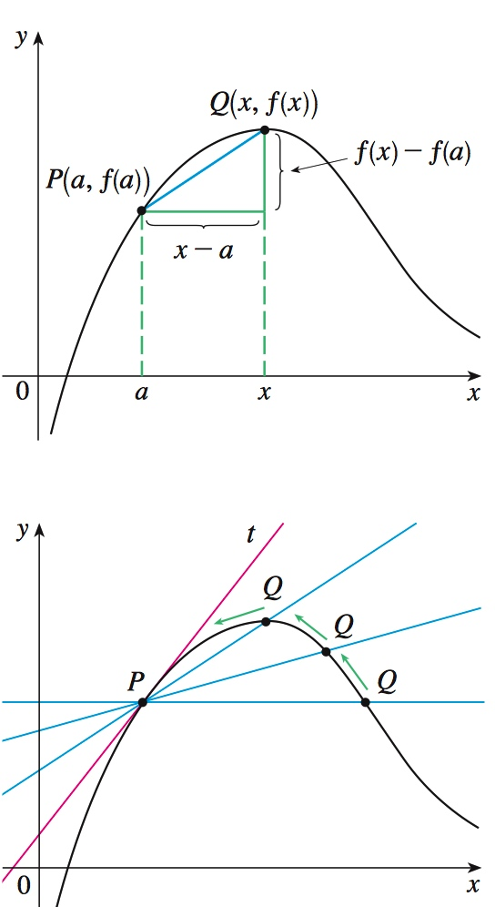
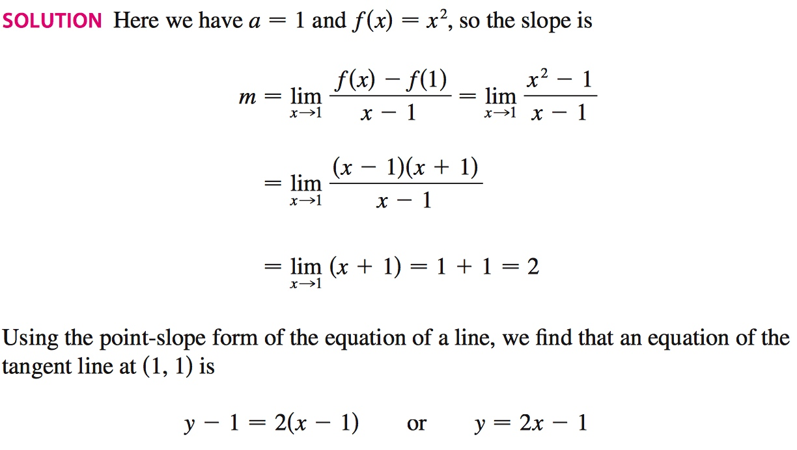

# Week 4 - The Beginning of Derivatives

[TOC]

## Derivatives

### Definition

* The derivative of `f` at point `x` is defined to be \\(\displaystyle\lim_{h -> 0}\frac{f(x + h) - f(x)}{h}\\)
* If the derivative of `f` exists at `x`, we say that the function is **differentiable** at `x`.
* **The derivative is measuring how changing the input affects the output.** In other words, how wiggling the input to `f` changes `f`.
* Other notations \\(f'(x) = \frac{d}{dx}f(x) = D_{x}f(x) = \frac{dy}{dx}\\).
    * \\(f'(x)=\displaystyle\lim_{h -> 0}\frac{f(x + h) - f(x)}{h}\\)

* Different definitions:
    * \\(f'(x)=\displaystyle\lim_{w -> x}\frac{f(w) - f(x)}{w - x}\\)
    * \\(f'(a)=\displaystyle\lim_{x -> a}\frac{f(x) - f(a)}{x - a}\\)
        * **Notice** the variable is `a` not `x`, cause we are approaching `a` **not** `x`.

* If the derivative of `f` exists at `x` whenever `x` between `a` and `b`, then we say that `f` is **differentiable** on `(a, b)`.
    * open interval `(a, b)` can be \\((a, \infty)\\) or \\((-\infty, a)\\) or \\((-\infty, +\infty)\\)
    * `(a, b)` does NOT include `a` and `b`.

* Tangent Line

    * the tangent line is the limiting position of the secant line PQ as Q approaches P.
        * 
    * The tangent line to the curve `y = f(x)` at the point `P(a, f(a))` is the line through `P` with slope \\(t=\displaystyle\lim_{x -> a}\frac{f(x) - f(a)}{x - a}\\) provided that this limit exists.
    * Example: Find an equation of the tangent line to the parabola \\(y=x^2\\) at the point `P(1, 1)`.
        * 

### How Can A Function Fail To Be Differentiable (Three situations)?    

* First: the left and right limits are different.
    * Why is `f(x) = |x|` not differentiable at `x = 0` ?
        * \\(f(x) = |x|\\)
        * \\(f'(0) = \displaystyle\lim_{h->0}\frac{|0+h| - |0|}{h} \\)
        * \\(f'(0) = \displaystyle\lim_{h->0}\frac{|h|}{h} \\) <- DNE(does not exist) 
            * Because \\(\displaystyle\lim_{h->0^{+}}\frac{|h|}{h} = 1 \ne -1 = \displaystyle\lim_{h->0^{-}}\frac{|h|}{h} \\)
* Second: if `f` is not continuous at `a`, then `f` is not differentiable at `a`.
* Third: the curve has a vertical tangent line when `x = a`; that is, `f` is continuous at `a` and \\(\displaystyle\lim_{x->a}|f'(x)|=\infty\\)

### Why Would I Care To Find The Derivative?

* Why is sqrt(9999) so close to 99.995?
    * \\(\frac{d}{dx}x^{n}=nx^{n-1}\\)
    * \\(\frac{d}{dx}x^{1/2}=\frac{1}{2}x^{-\frac{1}{2}}\\)
    * \\(\frac{d}{dx}\sqrt{x}=\frac{1}{2\sqrt{x}}\\)
    * we know that the tangent line of \\(f(x)=\sqrt{x}\\) at 10000 is `1/200` which is `0.005`.
    * so \\(0.005*(10000-9999) \approx 100 - \sqrt{9999}\\)
    * then we got \\(\sqrt{9999} \approx 100 - 0.005 * 1 = 99.995\\)
    * in other words, \\(\sqrt{9999} \approx 100 - 1 * (\text{derivative at}\ 10000) = 99.995\\)
    * **Conclusion**:
        * \\(f(x+h) \approx f(x)+h*f'(x)\\)

### Rules

* \\(\frac{d}{dx}x^{n}=nx^{n-1}\\)
* \\(\frac{d}{dx}nf(x)=n\frac{d}{dx}f(x)\\)
* \\(\frac{d}{dx}(f(x)+g(x))=\frac{d}{dx}f(x)+\frac{d}{dx}g(x)\\)
* More in next week

