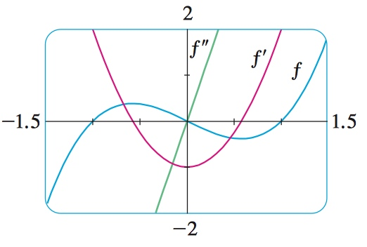

# Week 5

[TOC]

## The Product Rule

* If **f and g are both differentiable**, then \\[\frac{d}{dx}[f(x)g(x)]=f(x)\frac{d}{dx}g(x) + \frac{d}{dx}f(x)g(x)\\]
* Two ways to prove
    * the area of rectangle
        * 
        * We start by assuming that `u = f(x)` and `v = g(x)`.
        * Then we can interpret the `product uv` as an area of a rectangle
        * If `x` changes by an amount `Δx`, then the corresponding changes in `u` and `v` are
            * \\(Δu = f(x + Δx) - f(x)\\), \\(Δv = g(x + Δx) - g(x)\\)
        * The change in the area of the rectangle is:
            * `Δ(uv) = (u + Δu)(v + Δv) - uv = uΔv + vΔu + ΔuΔv` = the sum of the three shaded areas
        * If we divide by `Δx`, we get \\[\frac{Δ(uv)}{Δx} = \frac{uΔv}{Δx} + \frac{vΔu}{Δx} + \frac{ΔuΔv}{Δx}\\]
        * If we now let \\(Δx \to 0\\), we get the derivative of `uv`(f(x)g(x)): 
        
        \\[\begin{align}
        \frac{d}{dx}(uv) &= \lim_{Δx \to 0}\frac{Δ(uv)}{Δx} \\ 
        &= \lim_{Δx \to 0}(u\frac{Δv}{Δx} + v\frac{Δu}{Δx} + Δu\frac{Δv}{Δx}) \\ 
        &= u\lim_{Δx \to 0}\frac{Δv}{Δx} + v\lim_{Δx \to 0}\frac{Δu}{Δx} + (\lim_{Δx \to 0}Δu)(\lim_{Δx \to 0}(\frac{Δv}{Δx}) \\ 
        &= u\frac{d}{dx}v + v\frac{d}{dx}u + 0 * u\frac{d}{dx}v
        \end{align}\\]
        
        * \\(\frac{d}{dx}(uv) = u\frac{d}{dx}v + v\frac{d}{dx}u\\)

    * use limit theorem 

    \\[\begin{align}
    \frac{d}{dx}(f(x) \cdot g(x)) &= \lim_{h \to 0}\frac{f(x+h) \cdot g(x+h)-f(x) \cdot g(x)}{h} \\ 
    &= \lim_{h \to 0}\frac{f(x+h) \cdot g(x+h)-f(x+h) \cdot g(x)+f(x+h)g(x)-f(x) \cdot g(x)}{h} \\
    &= \lim_{h \to 0}\frac{f(x+h) \cdot g(x+h)-f(x+h) \cdot g(x)}{h} + \lim_{h \to 0}\frac{f(x+h) \cdot g(x)-f(x) \cdot g(x)}{h} \\
    &= \lim_{h \to 0}\frac{g(x+h)-g(x)}{h}*\lim_{h \to 0}f(x+h) + \lim_{h \to 0}\frac{f(x+h)-f(x)}{h}*\lim_{h \to 0}g(x) \\
    &= \frac{d}{dx}g(x)\lim_{h \to 0}f(x+h) + \frac{d}{dx}f(x)\lim_{h \to 0}g(x) \\
    &= f(x)\frac{d}{dx}g(x) + g(x)\frac{d}{dx}f(x) \\
    \end{align}\\]

    * In prime notion: \\((f \cdot g)'=f \cdot g'+g \cdot f'\\)

## The Quotient Rule 

* If **f and g are differentiable, then**

    * \\[\frac{d}{dx}[\frac{f(x)}{g(x)}]=\frac{\frac{d}{dx}f(x) \cdot g(x) - f(x) \cdot \frac{d}{dx}g(x)}{g(x)^2}\\] 
    
    * In prime notion: \\((\frac{f}{g})'=\frac{g \cdot f'-f \cdot g'}{g^2}\\)
 
## Higher Derivatives

* If `f` is a differentiable function, then its derivative `f'` is also a function, so `f'` may have a derivative of its own, denoted by `(f')' = f''`.
* This new function \\(f''(x)\\) is called the second derivative of `f` because it is the derivative of the derivative of `f`. Using Leibniz notation, we write the second derivative of `y = f(x)` as
    * 
* For example: 
    * \\(f(x) = x^3 - x\\)
    * \\(f'(x)=3x^2-1\\), \\(f''(x)=6x\\)
    * 
    * We can interpret `f''(x)` as the slope of the curve `y=f'(x)` at the point `(x, f(x))`. In other words, it is the rate of change of the slope of the original curve `y=f(x)`.
* Take another sample:
    * If `s=s(t)` is the position function of an object that moves in a straight line, we know that its first derivative represents the velocity `v(t)` of the object as a function of time:
        * \\(v(t)=s'(t)=\frac{ds}{dt}\\)
    * Thus the **acceleration**(the instantaneous rate of change of velocity with respect to time) function is the derivative of the velocity function and is therefore the second derivative of the position function:
        * \\(a(t)=v'(t)=s''(t)\\)
        * or in Leibniz notation: \\(a=\frac{dv}{dt}=\frac{d^2s}{dt^2}\\)
### Concavit
* If `f''(x) > 0` for all `x` in `I`, then the graph of `f` is concave upward on `I`.
* If `f''(x) < 0` for all `x` in `I`, then the graph of `f` is concave downward on `I`.
* **inflection point**
    * A point `P` on a curve `y = f(x)` is called **an inflection point** if `f` is continuous there and the curve changes from concave upward to concave downward or from concave downward to concave upward at `P`.

## Extreme Value

### Definitions

* **local maximum**
    * `f(c)` is a **local maximum value** for `f` if there is some `ε > 0`, so that whenever `x` is in `(c - ε, c + ε)`, `f(c) >= f(ε)`.
* **local minimum**
    * `f(c)` is a **local minimum value** for `f` if there is some `ε > 0`, so that whenever `x` is in `(c - ε, c + ε)`, `f(c) <= f(ε)`.
* **local extremum**
    * a local maximum or local minimum is called a **local extremum**.
* **global maximum**
    * `f(c)` is a **global maximum value** for `f` if whenever `x` is in the domain of `f`, `f(c) >= f(ε)`.
* **global minimum**
    * `f(c)` is a **global minimum value** for `f` if whenever `x` is in the domain of `f`, `f(c) <= f(ε)`.

### Fermat’s Theorem (Find Extreme Value)

* Suppose `f` is a function, defined on the interval \\((a, b) \ni c\\). 
    * If `f(c)` is an extreme value of `f`, and `f` is differentiable at `c`, then `f'(c) = 0`;
    * If `f` is differentiable at `c`, and `f'(c) != 0`, then `f(c)` is **not** an extreme value.
        * In reverse, if `f(c)` is a local extremum, then either `f'(c)` does not exist(like: `f(x) = |x|`) or `f'(c) = 0`.

### e^x

* To function \\(g(x) = \lim_{h \to 0}\frac{x^h-1}{h}\\), we know:
    * \\(\lim_{h \to 0}\frac{2^h-1}{h} \approx 0.693\\)
    * \\(\lim_{h \to 0}\frac{3^h-1}{h} \approx 1.099\\)
* Then there is an `x` such that \\(\lim_{h \to 0}\frac{x^h-1}{h} = 1\\).
* We call it \\(e\\), \\(\lim_{h \to 0}\frac{e^h-1}{h} = 1\\)
* To calculate the derivative of \\(e^x\\):

\\[\begin{align}
f'(x) &= \lim_{h \to 0}\frac{e^{x+h} - e^x}{h} \\
      &= \lim_{h \to 0}\frac{e^{x}e^{h} - e^x}{h} \\
      &= \lim_{h \to 0}\frac{e^{x}(e^{h} - 1)}{h} \\
      &= e^{x} * \lim_{h \to 0}\frac{(e^{h} - 1)}{h} 
\end{align}\\]

* We already assume that \\(\lim_{h \to 0}\frac{e^h-1}{h} = 1\\), so we got: \\[f'(x) = e^{x} * 1 = e^{x} = f(x)\\]

