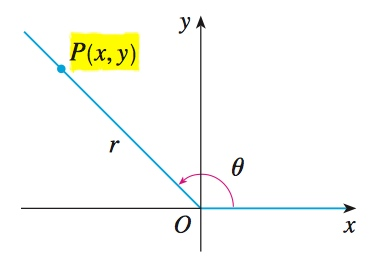
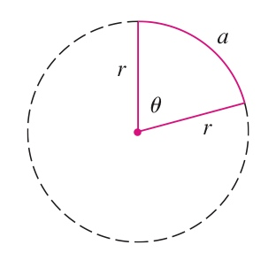
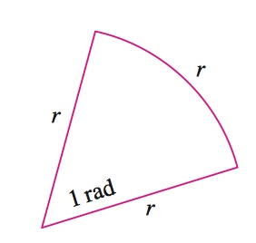
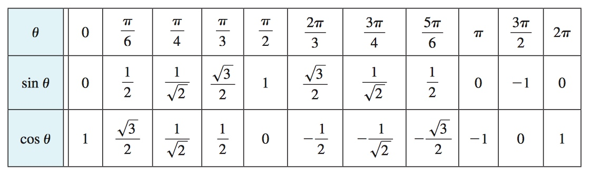
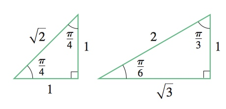
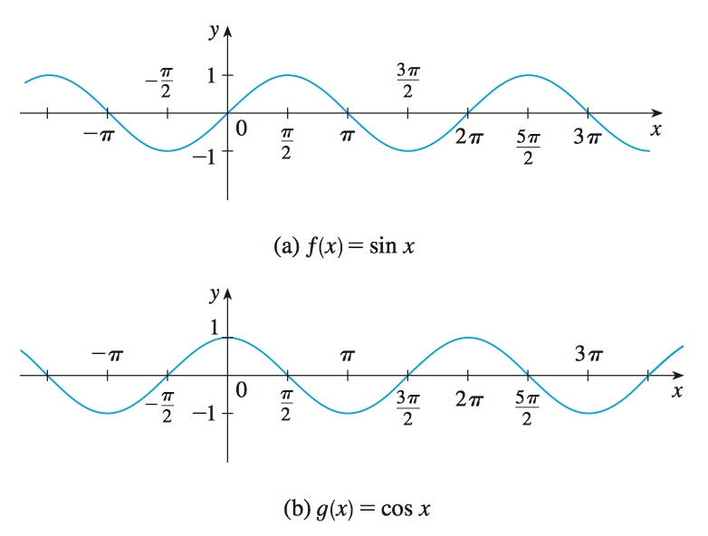
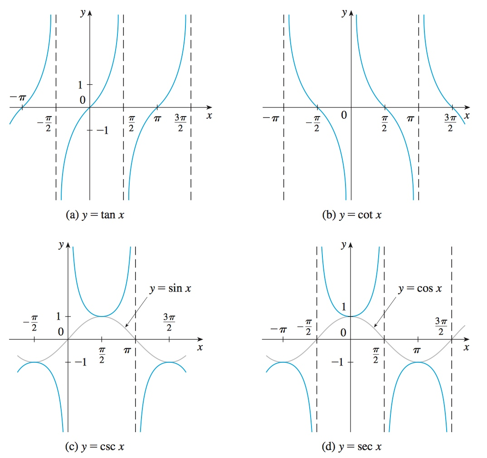
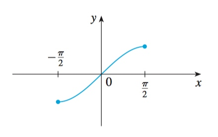
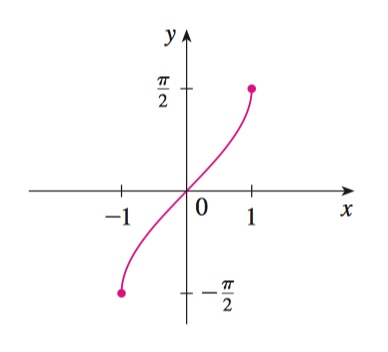
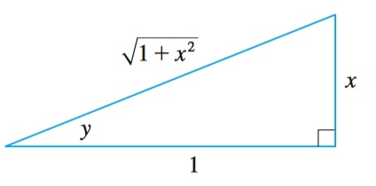

# Week 7 - Derivatives of Trigonometric Functions

[TOC]

## Trigonometry 

* Trigonometric Functions
    * 
        * \\(\sin{\theta} = \frac{opp}{hyp}\\), \\(\csc{\theta} = \frac{hyp}{opp}\\)
        * \\(\cos{\theta} = \frac{adj}{hyp}\\), \\(\sec{\theta} = \frac{hyp}{adj}\\)
        * \\(\tan{\theta} = \frac{opp}{adj}\\), \\(\cot{\theta} = \frac{adj}{opp}\\)
    * 
        * \\(\sin{\theta} = \frac{y}{r}\\), \\(\csc{\theta} = \frac{r}{y}\\)
        * \\(\cos{\theta} = \frac{x}{r}\\), \\(\sec{\theta} = \frac{r}{x}\\)
        * \\(\tan{\theta} = \frac{y}{x}\\), \\(\cot{\theta} = \frac{x}{y}\\)

### Angles

* \\(\pi rad = 180^{\circ} \\)
    * \\(1 rad = (\frac{180}{\pi})^{\circ} \approx 57.3^{\circ}\\)
    
| Degree | \\(0^{\circ}\\) | \\(30^{\circ}\\) | \\(45^{\circ}\\) | \\(60^{\circ}\\) | \\(90^{\circ}\\) | \\(120^{\circ}\\) | \\(135^{\circ}\\) | \\(150^{\circ}\\) | \\(180^{\circ}\\) | \\(270^{\circ}\\) | \\(360^{\circ}\\) |
| --- | --- | --- | --- | --- | --- | --- | --- | --- | --- | --- | --- |
| Radians | \\(0\\) | \\(\frac{\pi}{6}\\) | \\(\frac{\pi}{4}\\) | \\(\frac{\pi}{3}\\) | \\(\frac{\pi}{2}\\) | \\(\frac{2\pi}{3}\\) | \\(\frac{3\pi}{4}\\) | \\(\frac{5\pi}{6}\\) | \\(\pi\\) | \\(\frac{3\pi}{2}\\) | \\(2\pi\\) |

* \\(\theta = \frac{a}{r}\\), \\(a = r\theta\\)
    *  
* 

    * 

### Some of Trigonometric Identities

* \\(\sin^2{x} + \cos^2{x} = 1\\)
* \\(\sin{-x} = -\sin{x}\\)
* \\(\cos{-x} = \cos{x}\\)
* \\(\sin{x+2\pi} = \sin{x}\\), \\(\cos{x+2\pi} = \cos{x}\\)

### Graphs of the Trigonometric Functions

* 
* 

## Differentiate Trig Functions

* To prove: if \\(f(x) = \sin{x}\\), then \\(f'(x) = \cos{x}\\)
    * \\[\begin{aligned}
        f'(x) &= \lim_{h \to 0}\frac{\sin(x+h) - \sin(x)}{h} \\
              &= \lim_{h \to 0}\frac{\sin{x}\cos{h} + \cos{x}\sin{h} - \sin(x)}{h} \\
              &= \lim_{h \to 0}[\sin{x}(\frac{\cos{h} - 1}{h}) + \cos{x}(\frac{\sin{h}}{h})] \\
              &= \sin{x}\lim_{h \to 0}\frac{\cos{h} - 1}{h} + \cos{x}\lim_{h \to 0}\frac{\sin{h}}{h} 
      \end{aligned}\\]
    * Recall the [Squeeze Theorem](/calculus-one/week-2-3.html#squeeze-theorem), we know \\(\displaystyle\lim_{x\to{0}}\frac{\sin(x)}{x}=1\\), then,
    * \\[\begin{aligned}
        \lim_{\theta \to 0}\frac{\cos{\theta} - 1}{\theta} &= \lim_{\theta \to 0}{\frac{\cos{\theta} - 1}{\theta} \cdot \frac{\cos{\theta} + 1}{\cos{\theta} + 1}} = \lim_{\theta \to 0}\frac{\cos^2{\theta} - 1}{\theta(\cos{\theta} + 1)} \\
        &= \lim_{\theta \to 0}\frac{-\sin^2{\theta}}{\theta(\cos{\theta} + 1)} = -\lim_{\theta \to 0}{\frac{\sin{\theta}}{\theta} \cdot \frac{\sin{\theta}}{\cos{\theta}+1}} \\
        &= -\lim_{\theta \to 0}\frac{\sin{\theta}}{\theta} \cdot \lim_{\theta \to 0}\frac{\sin{\theta}}{\cos{\theta}+1} \\
        &= - 1 \cdot (\frac{0}{1 + 1}) \\
        \lim_{\theta \to 0}\frac{\cos{\theta} - 1}{\theta} &= 0
        \end{aligned}\\]
    * So, \\[\begin{aligned}
            f'(x) &= \sin{x}\lim_{h \to 0}\frac{\cos{h} - 1}{h} + \cos{x}\lim_{h \to 0}\frac{\sin{h}}{h} \\
            &= (\sin{x}) \cdot 0 + (\cos{x}) \cdot 1 \\
            &= \cos{x}
            \end{aligned}\\]
            
###  Derivatives of Trigonometric Functions

* \\(\frac{d}{dx}(\sin{x}) = \cos{x}\\), \\(\frac{d}{dx}(\csc{x}) = -\csc{x}\cot{x}\\)
* \\(\frac{d}{dx}(\cos{x}) = -\sin{x}\\), \\(\frac{d}{dx}(\sec{x}) = \sec{x}\tan{x}\\)
* \\(\frac{d}{dx}(\tan{x}) = \sec^2{x}\\), \\(\frac{d}{dx}(\cot{x}) = -\csc^2{x}\\)

## Inverse Trigonometric Functions

* \\(y = \sin{x}\\)
    * 
* \\(y = \sin^{-1}{x} = \arcsin{x} \Leftrightarrow \sin{y} = x\ and\ -\frac{\pi}{2} \le x \le \frac{\pi}{2}\\)
    * 
    * we can conclude this: \\(\arcsin{(\sin{x})} = x\\)
* Sample: Simplify the expression \\(\cos{(\tan^{-1}x)}\\):
    * If \\(y=\tan^{-1}x\\), then \\(\tan{y}=x\\), we can use a diagram to express this: 
    * Then \\[\cos{(\tan^{-1}x)} = \cos{y} = \frac{1}{\sqrt{1+x^2}}\\]

### The Derivatives of Inverse Trig Functions

* \\(\frac{d}{dx}\arcsin{x} = ?\\)
    * Let's say \\(f(x) = \arcsin{x}\\)
        * We know \\(f(\sin{x}) = x\\)
        * So use the chain rules, derivative the both sides, we got: \\[\begin{aligned}
                f'(\sin{x}) \cdot \cos{x} &= 1 \\
                f'(\sin{x}) &= \frac{1}{\cos{x}} \\
                f'(\sin{x}) &= \frac{1}{\sqrt{1-\sin^2{x}}} \\
                f'(x) &= \frac{1}{\sqrt{1-x^2}} \\
                \end{aligned}\\]
* \\(\frac{d}{dx}\arccos{x} = ?\\): 
    * In a right triangle, the other two angles are \\(\alpha\, \beta\\), we know:
    * (\\(\sin{\alpha} = y\,\ \cos{\beta} = x\\)) and the hypotenuse equals `1`, then we got:
    * \\(\alpha + \beta = \frac{\pi}{2}\\)
    * \\(\arcsin{y} = \alpha\,\ \arccos{y} = \beta\\)
    * \\(\arcsin{y} + \arccos{y} = \frac{\pi}{2}\\)
    * \\(\frac{d}{dy}\arcsin{y} + \frac{d}{dy}\arccos{y} = \frac{d}{dy} \frac{\pi}{2}\\)
    * \\(\frac{d}{dy}\arcsin{y} + \frac{d}{dy}\arccos{y} = 0\\)
    * \\(\frac{d}{dy}\arccos{y} = - \frac{1}{\sqrt{1-x^2}}\\)
* \\(\frac{d}{dx}\arctan{x} = ?\\)
    * set \\(f(x) = \arctan{x}\\), 
        * then \\(f(\tan{x}) = x\\)
    * use the chain rules: \\[\begin{aligned}
        f'(\tan{x}) \cdot \sec^2{x} &= 1 \\
        f'(\tan{x}) &= \frac{1}{\sec^2{x}} \\
        f'(\tan{x}) &= \frac{1}{\tan^2{x}+1} \\
        f'(x) &= \frac{1}{x^2+1} \\
        \end{aligned}\\]

### Why do Sine and Cosine Oscillate?

* If \\(f''(x) = - f(x)\\)
* For example: 
    * A running car, it's acceleration equals minor it's position, and the center point is 0.
        * Which means:
            * the velocity will be smaller and smaller when it's acceleration less than 0, 
            * but when the position is less than 0 the acceleration will be positive, and the car will move backwards sooner.
        * So the car will be back and forward, just like the sine wave.
* To Sine and Cosine, we know:
    * \\(f(t) = \sin{t},\ f''(t) = - \sin{t}\\)
    * \\(f(t) = \cos{t},\ f''(t) = - \cos{t}\\)

### Angle sum and difference identities

* \\(\sin{(x+y)} = \sin{x}\cos{y} + \cos{x}\sin{y}\\)
* \\(\cos{(x+y)} = \cos{x}\cos{y} - \sin{x}\sin{y}\\)
* \\(\sin{(x-y)} = \sin{x}\cos{y} - \cos{x}\sin{y}\\)
* \\(\cos{(x-y)} = \cos{x}\cos{y} + \sin{x}\sin{y}\\)
* \\(\sin{2x} = 2\sin{x}\cos{x} \\)
* \\(\cos{2x} = \cos^2{x} - \sin^2{x} \\)
    * [en.wikipedia.org](https://en.wikipedia.org/wiki/List_of_trigonometric_identities#Angle_sum_and_difference_identities)
* \\(\tan{(x+y)} = \frac{\tan(x) + \tan{y}}{1 - \tan(x)\tan(y)}\\)
* \\(\tan{(x-y)} = \frac{\tan(x) - \tan{y}}{1 + \tan(x)\tan(y)}\\)

### Approximate sin 1

* \\(f(x) = \sin{x},\ f(0) = 0\\)
* \\(f'(x) = \cos{x},\ f'(0) = 1\\)
* \\(f(0+h) \approx f(0) + h \cdot f'(0)\\), (when `h` approach to `0`)
* \\(f(0+h) \approx 0 + h \cdot 1\\)
* \\(f(h) \approx h\\) (when `h` approach to `0`)
* pick an `x = 1/32`, then \\(\sin{\frac{1}{32} \approx \frac{1}{32}}\\)
    * then use formula \\(\sin{2x} = 2\sin{x}\cos{x} \\), we got \\[\sin{2x} = 2\sin{x} \cdot \sqrt{1-\sin^2{x}} \\]
    * So, \\(\sin{(2 \cdot \frac{1}{32})} = 2\sin{(1/16)} \cdot \sqrt{1-\sin^2{(1/32)}}\\)
    * We can keep multiple 2 to x until `x = 1`, then we got (\\(\sin{1}\\))

