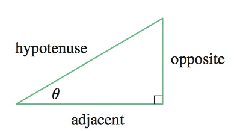

# Week 7

[TOC]

## Trigonometry 

* Trigonometric Functions
    * 
        * \\(\sin{\theta} = \frac{opp}{hyp}\\), \\(\csc{\theta} = \frac{hyp}{opp}\\)
        * \\(\cos{\theta} = \frac{adj}{hyp}\\), \\(\sec{\theta} = \frac{hyp}{adj}\\)
        * \\(\tan{\theta} = \frac{opp}{adj}\\), \\(\cot{\theta} = \frac{adj}{opp}\\)
    * 
        * \\(\sin{\theta} = \frac{y}{r}\\), \\(\csc{\theta} = \frac{r}{y}\\)
        * \\(\cos{\theta} = \frac{x}{r}\\), \\(\sec{\theta} = \frac{r}{x}\\)
        * \\(\tan{\theta} = \frac{y}{x}\\), \\(\cot{\theta} = \frac{x}{y}\\)

### Angles

* \\(\pi rad = 180^{\circ} \\)
    * \\(1 rad = (\frac{180}{\pi})^{\circ} \approx 57.3^{\circ}\\)
    
    | Degree | \\(0^{\circ}\\) | \\(30^{\circ}\\) | \\(45^{\circ}\\) | \\(60^{\circ}\\) | \\(90^{\circ}\\) | \\(120^{\circ}\\) | \\(135^{\circ}\\) | \\(150^{\circ}\\) | \\(180^{\circ}\\) | \\(270^{\circ}\\) | \\(360^{\circ}\\) |
    | --- | --- | --- | --- | --- | --- | --- | --- | --- | --- | --- | --- |
    | Radians | \\(0\\) | \\(\frac{\pi}{6}\\) | \\(\frac{\pi}{4}\\) | \\(\frac{\pi}{3}\\) | \\(\frac{\pi}{2}\\) | \\(\frac{2\pi}{3}\\) | \\(\frac{3\pi}{4}\\) | \\(\frac{5\pi}{6}\\) | \\(\pi\\) | \\(\frac{3\pi}{2}\\) | \\(2\pi\\) |

    * \\(\theta = \frac{a}{r}\\), \\(a = r\theta\\)
        *  
    * 

        * 

### Trigonometric Identities

* \\(\sin^2{x} + \cos^2{x} = 1\\)
* \\(\sin{-x} = -\sin{x}\\)
* \\(\cos{-x} = \cos{x}\\)
* \\(\sin{x+2\pi} = \sin{x}\\), \\(\cos{x+2\pi} = \cos{x}\\)
* \\(\sin{x+y} = \sin{x}\cos{y} + \cos{x}\sin{y}\\)
* \\(\cos{x+y} = \cos{x}\cos{y} - \sin{x}\sin{y}\\)
* \\(\sin{x-y} = \sin{x}\cos{y} - \sin{x}\sin{y}\\)
* \\(\cos{x-y} = \cos{x}\cos{y} + \sin{x}\sin{y}\\)
* \\(\sin{2x} = 2\sin{x}\cos{x} \\)
* \\(\cos{2x} = \cos^2{x} - \sin^2{x} \\)

### Graphs of the Trigonometric Functions

* 
* 

## Differentiate Trig Functions

* To prove: if \\(f(x) = \sin{x}\\), then \\(f'(x) = \cos{x}\\)
    * \\[\begin{align}
        f'(x) &= \lim_{h \to 0}\frac{\sin(x+h) - \sin(x)}{h} \\
              &= \lim_{h \to 0}\frac{\sin{x}\cos{h} + \cos{x}\sin{h} - \sin(x)}{h} \\
              &= \lim_{h \to 0}[\sin{x}(\frac{\cos{h} - 1}{h}) + \cos{x}(\frac{\sin{h}}{h})] \\
              &= \sin{x}\lim_{h \to 0}\frac{\cos{h} - 1}{h} + \cos{x}\lim_{h \to 0}\frac{\sin{h}}{h} 
      \end{align}\\]
    * Recall the [Squeeze Theorem](/calculus-one/week-2-3.html#squeeze-theorem), we know \\(\displaystyle\lim_{x\to{0}}\frac{\sin(x)}{x}=1\\), then,
    * \\[\begin{align}
        \lim_{\theta \to 0}\frac{\cos{\theta} - 1}{\theta} &= \lim_{\theta \to 0}{\frac{\cos{\theta} - 1}{\theta} \cdot \frac{\cos{\theta} + 1}{\cos{\theta} + 1}} = \lim_{\theta \to 0}\frac{\cos^2{\theta} - 1}{\theta(\cos{\theta} + 1)} \\
        &= \lim_{\theta \to 0}\frac{-\sin^2{\theta}}{\theta(\cos{\theta} + 1)} = -\lim_{\theta \to 0}{\frac{\sin{\theta}}{\theta} \cdot \frac{\sin{\theta}}{\cos{\theta}+1}} \\
        &= -\lim_{\theta \to 0}\frac{\sin{\theta}}{\theta} \cdot \lim_{\theta \to 0}\frac{\sin{\theta}}{\cos{\theta}+1} \\
        &= - 1 \cdot (\frac{0}{1 + 1}) \\
        \lim_{\theta \to 0}\frac{\cos{\theta} - 1}{\theta} &= 0
        \end{align}\\]
    * So, \\[\begin{align}
            f'(x) &= \sin{x}\lim_{h \to 0}\frac{\cos{h} - 1}{h} + \cos{x}\lim_{h \to 0}\frac{\sin{h}}{h} \\
            &= (\sin{x}) \cdot 0 + (\cos{x}) \cdot 1 \\
            &= \cos{x}
            \end{align}\\]
            
###  Derivatives of Trigonometric Functions

* \\(\frac{d}{dx}(\sin{x}) = \cos{x}\\), \\(\frac{d}{dx}(\csc{x}) = -\csc{x}\cot{x}\\)
* \\(\frac{d}{dx}(\cos{x}) = -\sin{x}\\), \\(\frac{d}{dx}(\sec{x}) = \sec{x}\tan{x}\\)
* \\(\frac{d}{dx}(\tan{x}) = \sec^2{x}\\), \\(\frac{d}{dx}(\cot{x}) = -\csc^2{x}\\)

