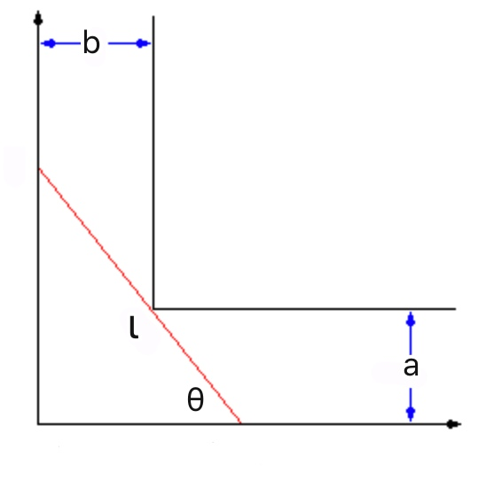

# Week 9 - Optimization

[TOC]

## Maximum And Minimum Values

* Let `c` be a number in the domain `D` of a function `f`. Then `f(c)` is the 
    * **Absolute Maximum** value of `f` on `D` if $$f(c) \ge f(x)$$ for all `x` in `D`.
    * **Absolute Minimum** value of `f` on `D` if $$f(c) \le f(x)$$ for all `x` in `D`.
* An absolute maximum or minimum is sometimes called a **global** maximum or minimum. The maximum and minimum values of f are called **extreme values** of `f`.
* The number `f(c)` is a
    * **Local Maximum** value of `f` if $$f(c) \ge f(x)$$ when `x` is near `c`.
    * **Local Minimum** value of `f` if $$f(c) \le f(x)$$ when `x` is near `c`.

### The Extreme Value Theorem

* Definition: If `f` is **continuous** on a **closed** interval $$[a, b]$$, then `f` attains an absolute maximum value $$f(c)$$ and an absolute minimum value $$f(d)$$ at some numbers `c` and `d` in $$[a, b]$$.

### Find The Maximum And Minimum Values

* Four Steps:
    * Differentiate the function.
    * List the critical points and endpoints.
        * A **critical number** of a function `f` is a number `c` in the domain of f such that either **f'(c) = 0** or **f(c)** does not exist.
    * Check all of the points.
    * Check the limiting behavior, if you're working on an open interval. 
* For Example: find the maximum and minimum values of function $$f(x) = \frac{1}{(x^2-1)^2}$$ which domain is $$(-1, 1)$$.
    * Step 1: $$f'(x) = -\frac{4x}{(x^2-1)^{3}}$$
    * Step 2: List the critical points $$x = 0$$, and the endpoints ( $$\displaystyle\lim_{x \to -1^{+}}f(x) = \infty$$, $$\displaystyle\lim_{x \to +1^{+}}f(x) = \infty$$)
    * Step 3: We got the minimum point (x = 0) and no maximum point.
    * Step 4: the domain is an open interval, and when x = -1/1, f(x) goes infinity. So it's fine.
* Try another domain: $$(1, \infty)$$
    * We know that it doesn't have critical points, so there is no maximum and minimum values in this domain.

#### Don't forgot to check the endpoints

* Example: $$f(x) = x-x^3$$ in domain $$[-3, 3]$$
* We got:
    * endpoint: $$f(-3) = 24$$
    * local minimum:$$f(-\sqrt{1/3}) = -\frac{2}{9}\sqrt{3} \approx -0.38$$
    * local maximum:$$f(\sqrt{1/3}) = \frac{2}{9}\sqrt{3} \approx 0.38$$
    * endpoint: $$f(3) = -24$$
* So this time the maximum and minimum values are the endpoints.

#### Consider the points where the function is not differentiable

* Example: $$f(x) = x - |x^2-2x|$$, ($$x \ge 0$$)
    * Rewrite the function: $$f(x) = \left\{ \begin{array}{rl} 
    x-(x^2-2x) \text{, if } x^2-2x \ge 0,\\ 
    x+(x^2-2x) \text{, if } x^2-2x < 0. 
    \end{array} \right.$$
    * Differentiate it: $$f'(x) = \left\{ \begin{array}{rl} 
    3-2x &\text{, if } x < 0 \text{ or } x > 2,\\ 
    -1+2x &\text{, if } 0 < x < 2. 
    \end{array} \right.$$
    * Now List the critical points:
        * **x = 2** is the point that the function can't be differentiable.
        * **x = 1/2** is the local extreme value
        * **x = 0 and x = 3** are the endpoints.
    * Then we got our conclusion.

#### Handle a real problem

* Five Steps: 
    * Draw a picture of the situation;
    * Label everything with variables;
    * Write down the thing you're tying to optimize;
    * Solve my goal for a single variable;
    * Apply calculus.

* Example: build the best fence for your sheep
    * We've got 52 meters of fencing, and to build a biggest rectangular pen with three sides.
    * Since it's a rectangle we got **2x + y = 52** and we are trying to get maximum value of **xy**
    * **xy = x(52-2x)** so we got a function **f(x) = x(52-2x)** 
    * Now to use calculus, then we got **x = 13**.

## Optimize Functions

* Sometime we don't need calculus.
* Example: two numbers(**x, y**) sum to 24. How large can their product be?
    * **x + y = 24**, calculate **max(xy)**.
    * We can use calculus, but let take another way, use **AM-GM theorem**([inequality of arithmetic and geometric means](https://en.wikipedia.org/wiki/Inequality_of_arithmetic_and_geometric_means))
        * $$\frac{x+y}{2} \ge \sqrt{xy}$$
        * So $$144 \ge xy$$, which is maximum value of **xy**.

## Optimization in Action 

* Example: How large of an object can you carry around a corner?
    * 
    * I want to move this red stick around this corner without it getting stuck. 
    * The real problem is to figure out the longest length, the maximum length of a stick that can be navigated around that corner. which end up solving a minimization problem.
    * Base on the diagram, we got: $$l = a \cdot \csc\theta + b \cdot \sec\theta$$
    * And we want to maxmize $$l$$. 
        * Don't forget $$0 < \theta < \pi/2$$
    * To get the critical points, set $$l'(\theta) = -a \cdot \csc\theta \cot\theta+ b \cdot \sec\theta \tan \theta = 0$$
    * Then $$\tan^3\theta = \frac{a}{b}$$, $$\tan\theta = \sqrt[3]{\frac{a}{b}}$$
        * So, use trigonometry, we got $$\csc\theta = \frac{\sqrt{1+(a/b)^{2/3}}}{\sqrt[3]{a/b}}$$, $$\sec\theta = \sqrt{1+(q/b)^{2/3}}$$
    * $$\begin{aligned}l(\theta) &= \frac{a \cdot \sqrt{1+(a/b)^{2/3}}}{\sqrt[3]{a/b}} + b \cdot \sqrt{1+(q/b)^{2/3}} \\ &= (a^{2/3} + b^{2/3})^{3/2}\end{aligned}$$
    * So the longest length is $$(a^{2/3} + b^{2/3})^{3/2}$$

