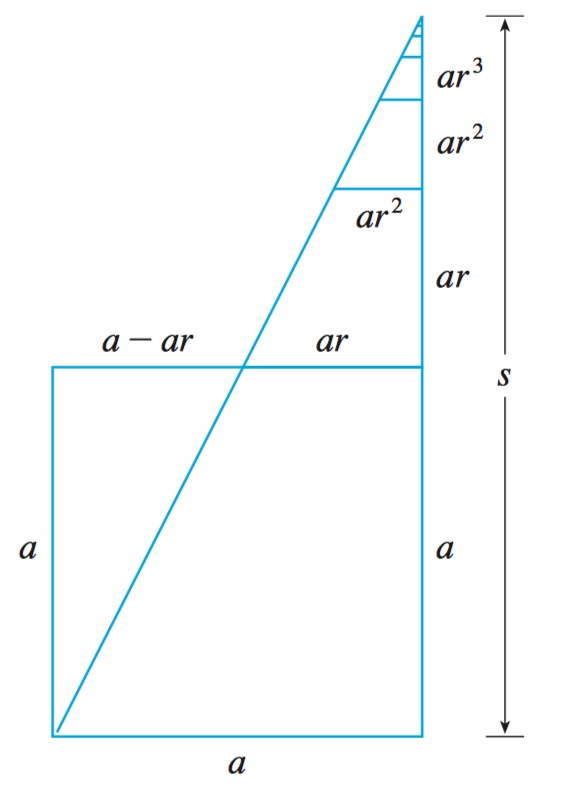
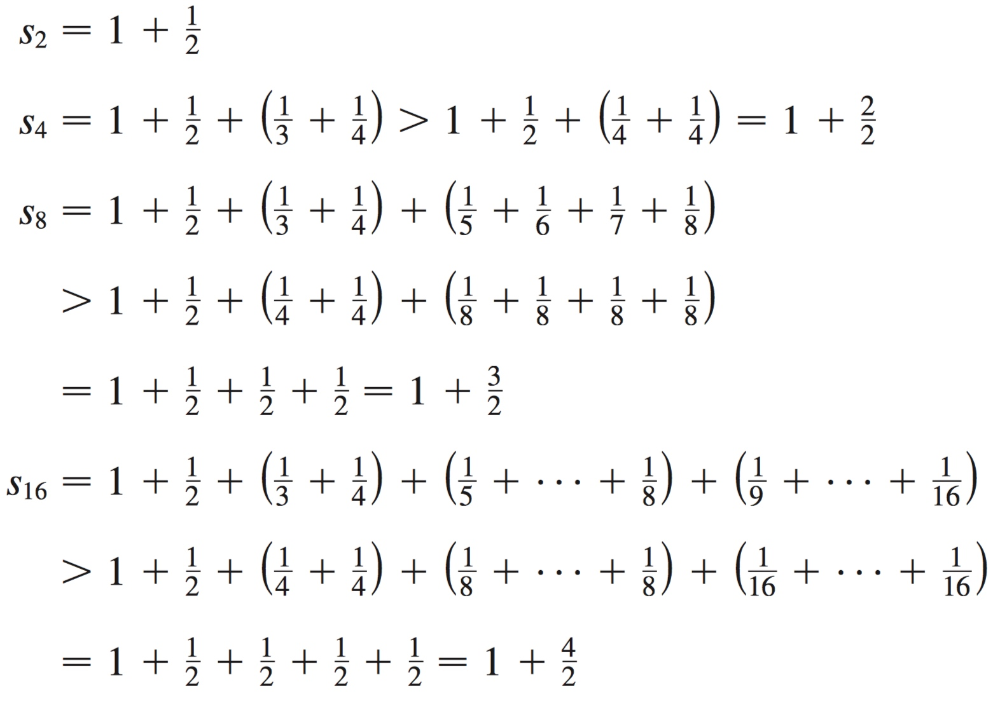

# Week 2 - Series

[TOC]

## Definition

* In general, if we try to add the terms of an infinite sequence \\(\{a_n\}_{n=1}^{\infty}\\) we get an expression of the form \\[a_1+a_2+a_3+\cdots+a_n+\cdots\\]
* which is called an **infinite series** (or just a **series**) and is denoted, for short, by the symbol \\[\sum_{n=1}^{\infty} a_n \ \text{or}\ \sum{a_n}\\]

### Convergent and Divergent

* Given a series \\(\sum_{n=1}^{\infty}a_n = a_1 + a_2 + a_3 + \cdots\\), let \\(s_n\\) denote its *n*th **partial sum**: \\[s_n = \sum_{i=0}^n a_i = a_1 + a_2 + a_3 + \cdots + a_n\\]
* If the sequence \\(\{s_n\}\\) is convergent and \\(\lim_{n \to \infty} s_n = s\\) exists as a real number, then the series \\(\sum a_n\\) is called **convergent** and we write \\[a_1 + a_2 + a_3 + \cdots + a_n + \cdots = s \ \text{or}\ \sum_{n=1}^{\infty} a_n = s\\]
* The number s is called the sum of the series. If the sequence \\(\{s_n\}\\) is divergent, then the series is called **divergent**.

## Geometric Series

* \\(a + ar + ar^2 + ar^3 + \cdots + ar^{n-1} + \cdots = \sum_{n=1}^{\infty} ar^{n-1}, \ a \ne 0\\)
* Each term is obtained from the preceding one by multiplying it by the **common ratio** **r**.
* If \\(r = 1\\), then \\(s_n = a + a + a + \cdots + a = na \to \pm \infty\\). Since \\(\lim_{n \to \infty} s_n\\) doesn't exist, the geometric series diverges in this case.
* If \\(r \ne 1\\), we have \\[\begin{aligned} s_n &= a + ar + ar^2 + ar^3 + \cdots + ar^{n-1} \\ 
    rs_n &= ar + ar^2 + ar^3 + \cdots + ar^{n}
    \end{aligned}\\]
    * Subtracting these equations, we get \\[s_n - rs_n = a - ar^n\\]
    * \\[s_n = \frac{a(1-r^n)}{1-r}\\]
* If \\(-1 \le r \le 1\\), then \\(r^n \to 0,\ \text{as}\  n \to \infty\\), so \\[\lim_{n \to \infty}s_n = \lim_{n \to \infty}\frac{a(1-r^n)}{1-r} = \frac{a}{1-r} - \frac{a}{1-r}\lim_{n \to \infty}r^n = \frac{a}{1-r}\\]
* **Summarize the results** The geometric series \\[\sum_{n=1}^{\infty} ar^{n-1} = a + ar + ar^2 + \cdots\\] is convergent if \\(|r| < 1\\) and its sum is \\[\sum_{n=1}^{\infty} ar^{n-1} = \frac{a}{1-r}\ \ \ \  |r| < 1\\] If \\(|r| \ge 1\\), the geometric series is divergent.
* Another way to get the conclusion (\\(-1 \le r \le 1\\)): 
    * 
    * This figure provides a geometric demonstration of the result in the example. If the triangles are constructed as shown and s is the sum of the series, then, by similar triangles, \\[\frac{s}{a} = \frac{a}{a- ar}\ \text{, so}\ s= \frac{a}{1-r}\\]
* Example: \\(0.\bar{9}\\)
    * \\[\begin{aligned} 0.\bar{9} &= \sum_{n=1}^{\infty}9 \cdot 10^{-n} \\
        &= 9 \sum_{n=1}^{\infty}10^{-n} = 9 \sum_{n=1}^{\infty}\frac{1}{10^n} \\
        &= 9 \cdot \frac{1/10}{1- 1/10} = 9 \cdot \frac{1}{9} = 1
        \end{aligned}\\]
        * Notice the formula is \\(ar^{n-1}\\), so here \\(= 9 \cdot \frac{1/10}{1- 1/10}\\)

## Telescoping Series

* A **telescoping series** is a series whose partial sums eventually only have a fixed number of terms after cancellation.
* For example, the series \\[\sum _{n=1}^{\infty }{\frac {1}{n(n+1)}}\\]
    * (the series of reciprocals of pronic numbers) simplifies as \\[{\begin{aligned}\sum _{n=1}^{\infty }{\frac {1}{n(n+1)}}&{}=\sum _{n=1}^{\infty }\left({\frac {1}{n}}-{\frac {1}{n+1}}\right)\\{}&{}=\lim _{N\to \infty }\sum _{n=1}^{N}\left({\frac {1}{n}}-{\frac {1}{n+1}}\right)\\{}&{}=\lim _{N\to \infty }\left\lbrack {\left(1-{\frac {1}{2}}\right)+\left({\frac {1}{2}}-{\frac {1}{3}}\right)+\cdots +\left({\frac {1}{N}}-{\frac {1}{N+1}}\right)}\right\rbrack \\{}&{}=\lim _{N\to \infty }\left\lbrack {1+\left(-{\frac {1}{2}}+{\frac {1}{2}}\right)+\left(-{\frac {1}{3}}+{\frac {1}{3}}\right)+\cdots +\left(-{\frac {1}{N}}+{\frac {1}{N}}\right)-{\frac {1}{N+1}}}\right\rbrack \\{}&{}=\lim _{N\to \infty }\left\lbrack {1-{\frac {1}{N+1}}}\right\rbrack =1.\end{aligned}}\\]
* From [Wikipedia](https://en.wikipedia.org/wiki/Telescoping_series)

## Harmonic Series

* \\[\sum_{n=1}^{\infty} \frac{1}{n} = 1 + \frac{1}{2} + \frac{1}{3} + \frac{1}{4} + \cdots\\] is divergent.
* Solution: For this particular series it’s convenient to consider the partial sums \\(s_2, s_4, s_8, s_{16}, s_{32}, \ldots\\) and show that they become large.
    * 
    * Similarly, \\(s_{32} > 1 + \frac{5}{2}, s_{64} > 1 + \frac{6}{2}\\), and in general \\[s_{2^n} > 1 + \frac{n}{2}\\]

## Theorem

* If the series \\(\displaystyle\sum_{n=1}^{\infty} a_n\\) is convergent, then \\(\displaystyle\lim_{n \to \infty} a_n = 0\\).
* If \\(\displaystyle\lim_{n \to \infty} a_n\\) does not exist or if \\(\displaystyle\lim_{n \to \infty} a_n \ne 0\\), then the series \\(\displaystyle\sum_{n=1}^{\infty}a_n\\) is divergent.
* If \\(\sum a_n\\) and \\(\sum b_n\\) are convergent series, then so are the series \\(\sum c a_n\\) (where c is a constant), \\(\sum(a_n + b_n)\\), and \\(\sum(a_n - b_n)\\), and
    * \\(\displaystyle\sum_{n=1}^{\infty} c a_n = c \sum_{n=1}^{\infty} a_n\\)
    * \\(\displaystyle\sum_{n=1}^{\infty} (a_n + b_n) = \sum_{n=1}^{\infty} a_n + \sum_{n=1}^{\infty} b_n\\) 
    * \\(\displaystyle\sum_{n=1}^{\infty} (a_n - b_n) = \sum_{n=1}^{\infty} a_n - \sum_{n=1}^{\infty} b_n\\) 

## The Comparison Tests

* The Comparison Test Suppose that \\(\sum a_n\\) and \\(\sum b_n\\) are series with **positive terms**.
    * If \\(\sum b_n\\) is convergent and \\(a_n < b_n\\) for all **n**, then \\(\sum a_n\\) is also convergent.
    * If \\(\sum b_n\\) is divergent and \\(a_n > b_n\\) for all **n**, then \\(\sum a_n\\) is also divergent.
* Example: Does \\(\displaystyle\sum_{n=1}^{\infty} \frac{1}{n^2}\\) converges?
    * Let's start with n = 2, which should get the same conclusion.
    * \\(\displaystyle\sum_{n=2}^{\infty} \frac{1}{n^2} < \sum_{n=1}^{\infty} \frac{1}{n \cdot (n-1)} = \sum_{n=1}^{\infty} (\frac{1}{n -1} - \frac{1}{n}) = \lim_{n \to \infty} 1 - \frac{1}{n} = 1\\)
    * \\(0 < \displaystyle\sum_{n=2}^{\infty} \frac{1}{n^2} < 1\\)

## Cauchy Condensation 

* The sequence \\(\{a_k\}\\) decreasing and \\(a_k > 0\\). The series \\(\displaystyle\sum_{k=1}^{\infty} a_k\\) converges if and only if \\(\displaystyle\sum_{k=0}^{\infty} 2^k \cdot a_{2^k}\\) converges.
* **Proven**:
    * \\(a_k > 0\\), so \\(\displaystyle\sum_{k=1}^{\infty} a_k\\) is non-decreasing.
    * Same as the **Harmonic Series** part, we can get: \\[\begin{aligned} 
        s_n &= 1 + (a_2 + a_3) + (a_4 + a_5 + a_6 + a_7 + a_8) + \cdots \\
        s_n &< 1 + 2 \cdot a_2 + 4 \cdot a_4 + \cdots \\
        s_n &< \sum_{k=0}^{\infty} 2^k \cdot a_{2^k}
        \end{aligned}\\]
* Same example: Does \\(\displaystyle\sum_{n=1}^{\infty} \frac{1}{n^2}\\) converges?
    * First way -> Use Telescoping Series:
        * \\(\displaystyle\sum_{n=1}^{\infty} \frac{1}{n^2}\\) converge, iff \\( \displaystyle\sum_{n=2}^{\infty} \frac{1}{n^2}\\) converge.
        * \\(0 \le \frac{1}{n^2} \le \frac{1}{n^2 - n}\ \text{, }\ n \ge 2\\) => if \\(\displaystyle\sum_{n=2}^{\infty} \frac{1}{n^2 - n}\\), then \\(\displaystyle\sum_{n=2}^{\infty} \frac{1}{n^2}\\) converge.
        * \\(\displaystyle\sum_{n=2}^{\infty} \frac{1}{n^2 - n} = \sum_{n=2}^{\infty} (\frac{1}{n-1} - \frac{1}{n})\\) which is a telescoping series.
        * \\(\displaystyle \lim_{n \to \infty}\sum_{n=2}^{N} (\frac{1}{n-1} - \frac{1}{n}) = \lim_{n \to \infty}(1 - \frac{1}{N}) = 1\\)
        * So \\(\displaystyle\sum_{n=2}^{\infty} \frac{1}{n^2 - n}\\) converge => \\(\displaystyle\sum_{n=2}^{\infty} \frac{1}{n^2}\\) converge => \\(\displaystyle\sum_{n=1}^{\infty} \frac{1}{n^2}\\) converge
    * Second way -> Use Conchy Condensation:
        * The sequence \\(\{\frac{1}{n^2}\}\\) decreasing and \\(\frac{1}{n^2} > 0\\), So:
        * \\(\displaystyle\sum_{n=1}^{\infty} \frac{1}{n^2} < \sum_{n=0}^{\infty} 2^n \cdot \frac{1}{(2^n)^2} = \sum_{n=0}^{\infty} \frac{1}{2^n} = 2\\)
        * With Geometric Series \\(\displaystyle\sum_{n=0}^{\infty} \frac{1}{2^n} = \frac{1}{1-1/2} = 2\\)

