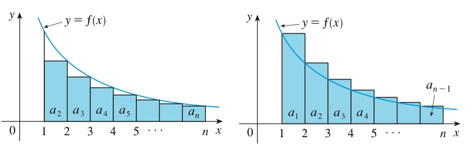

# Week 3 - Convergence Tests

[TOC]

## Ratio Test

### Example

* Does \\(\sum\frac{n^5}{4^n}\\) convergence?
    * Use the **Geometric Series Theory**, we know that \\(\sum\frac{1}{4^n}\\) convergence, because \\(\sum\frac{1}{4^n} = \sum\frac{1}{4} \cdot {\frac{1}{4}^{n-1} }\\) and \\(\frac{1}{4} < 1\\).
    * Last week, we've learned **Comparison Test Theory**. So if we can find a series that every element in it is bigger than this one and also converges, then this example must converge, too.
    * Let's calculate \\(\lim_{n \to \infty}\frac{a_n}{a_{n-1} }\\)
        * \\[\lim_{n \to \infty}\frac{a_n}{a_{n-1} } = \lim_{n \to \infty} \frac{\frac{n^5}{4^n} }{\frac{(n-1)^5}{4^{n-1} } } = \lim_{n \to \infty}\frac{n^5}{4^n} \cdot \frac{ 4^{ n-1 } }{ (n-1)^5 } = \lim_{n \to \infty}\frac{1}{4} (\frac{n}{n-1})^5 = \frac{1}{4}\\]
        * So if **n** is big enough, then the **common ratio** will be close to **1/4**.
    * Then we can pick a constant \\(\epsilon = 0.1\\) that make \\(\vert \frac{a_n}{a_{n-1} } \vert < \frac{1}{4} + 0.1\\), after some calculation we got that \\(n \ge 15\\).
        * So, \\(a_{n+1} < (\frac{1}{4} + 0.1) a_n,\ \text{where}\ n \ge 15\\),
        * Then \\(a_{15+k} < (\frac{1}{4} + 0.1)^k a_{15}\\).
    * We know that \\(\sum (\frac{1}{4} + 0.1)^k a_{15}\\) convergence, base on the **Geometric Series Theory**.
    * So \\(\sum a_{15+k}\\) converge.
    * So \\(\sum a_{k}\\) converge.

### Theorem

* Consider \\(\displaystyle \sum_{n=0}^{\infty} a_n\\). And \\(a_n \ge 0\\), \\(\displaystyle \lim_{n \to \infty} \frac{a_{n+1} }{a_n} = L\\).
    * If \\(L < 1\\), then \\(\displaystyle \sum_{n=0}^{\infty} a_n\\) converges.
    * If \\(L > 1\\), then \\(\displaystyle \sum_{n=0}^{\infty} a_n\\) diverges.
    * If \\(L = 1\\), then the ratio test is inconclusive.

#### Detailed

* To find the series (\\(\sum_{n=1}^{\infty}a_n,\ \text{where}\ a_n > 0\\)) converge or not.
* If \\(\lim_{n \to \infty}\frac{a_{n+1} }{a_n} = L < 1\\),
    * Then pick a small \\(\epsilon\\) so that \\(L + \epsilon < 1\\)
    * Find **N** so that \\(n \ge N\\), \\(\frac{a_{n+1} }{a_n} < L + \epsilon\\).
    * Then \\(a_{N+k} < (L+\epsilon)^k \cdot a_{N}\\)
    * Since \\(\sum (L+\epsilon)^k \cdot a_{N}\\) converge, \\(\sum a_{N+k}\\) converge.
    * So \\(\sum a_{k}\\) converge.
* If \\(\lim_{n \to \infty}\frac{a_{n+1} }{a_n} = L > 1\\),
    * Then pick a small \\(\epsilon\\) so that \\(L - \epsilon > 1\\)
    * Find **N** so that \\(n \ge N\\), \\(\frac{a_{n+1} }{a_n} > L - \epsilon\\).
    * Then \\(a_{N+k} > (L-\epsilon)^k \cdot a_{N}\\)
    * Since \\(\sum (L+\epsilon)^k \cdot a_{N}\\) diverge, \\(\sum a_{N+k}\\) diverge.
    * So \\(\sum a_{k}\\) diverge.
* If \\(\lim_{n \to \infty}\frac{a_{n+1} }{a_n} = L = 1\\),
    * Might converge, like \\(\sum \frac{1}{n^2}\\)
    * Might diverge, like \\(\sum 1\\)
 
### Other Examples

* \\(\sum \frac{n!}{n^n}\\), \\(\sum \frac{n!}{(n/2)^n}\\), \\(\sum \frac{n!}{(n/3)^n}\\)
* We know that \\(e = \displaystyle\lim_{n \to \infty} (1+\frac{1}{n})^n\\). With this, we can conclude \\(\sum \frac{n!}{(n/2)^n}\\) converges, \\(\sum \frac{n!}{(n/3)^n}\\) diverges.
* But what about \\(\sum \frac{n!}{(n/e)^n}\\). Let's compare \\(n!\\) with \\(n^n\\)
    * \\(\log(n!) = \sum_{k=1}^n \log(k) \approx \int_1^n \log x dx = x \log x - x ]_1^n\\)
    * \\(\log(n!) = n \log n - n + 1\\)
    * \\(\log(n!) \approx n \log n - n = \log(\frac{n^n}{e^n})\\)
    * \\(n! \approx (\frac{n}{e})^n\\)
    * Better approximation is \\(n! \approx (\frac{n}{e})^n \sqrt{2 \pi n}\\), which name is **Stirling's approximation**.

## Root Test

### Theorem

* \\(a_n > 0, L = \displaystyle \lim_{n \to \infty} \sqrt[n]{a_n}\\)
    * If \\(L < 1, \displaystyle \sum_{n=1}^{\infty} \\) converge,
    * If \\(L > 1, \displaystyle \sum_{n=1}^{\infty} \\) diverge,
    * If \\(L = 1, \displaystyle \sum_{n=1}^{\infty} \\) inconclusive.

## Integral Test

### Theorem

* Suppose **f** is a continuous, positive, decreasing function on \\([1, \infty)\\), and let \\(a_n = f(n)\\). Then the series \\(\sum_{n=1}^{\infty} a_n\\) is convergent if and only if the improper integral \\(\int_{1}^{\infty} f(x) dx\\) is convergent. In other words:
    * If \\(\int_{1}^{\infty} f(x) dx\\) is convergent, then \\(\sum_{n=1}^{\infty} a_n\\) is convergent.
    * If \\(\int_{1}^{\infty} f(x) dx\\) is divergent, then \\(\sum_{n=1}^{\infty} a_n\\) is divergent.

### Proof of the Integral Test

* 
* For the general series \\(\sum a_n\\), look at the figures above. The area of the first shaded rectangle is the value of **f** at the right endpoint of [1, 2], that is, \\(f(2) = a_2\\). So, comparing the areas of the shaded rectangles with the area under \\(y = f(x)\\) from 1 to n, we see that
    * \\(a_2 + a_3 + \ldots + a_n \le \int_1^n f(x) dx \\)
    * \\(\int_1^n f(x) dx \le a_1 + a_2 + \ldots + a_{n-1}\\)
        * Notice that this inequality depends on the fact that f is decreasing.
* If \\(\int_1^n f(x) dx\\) is convergent, then \\[\sum_{i=2}^n a_i \le \int_1^n f(x) dx \le \int_1^{\infty} f(x) dx\\] since \\(f(x) \ge 0\\). Therefore \\[s_n = a_1 + \sum_{i=2}^n a_i \le a_1 + \int_1^{\infty} f(x) dx\\]
    * So the sequence \\(\{s_n\}\\) is bounded above.
    * And \\(\{s_n\}\\) is also an increasing sequence.
    * This means that \\(\sum a_n\\) is convergence.
* If \\(\int_1^n f(x) dx\\) is divergent, then \\(\int_1^n f(x) dx \to \infty \ \text{as}\ n \to \infty\\) because \\(f(x) \ge 0\\). But \\(\int_1^n f(x) dx \le \sum_{i=1}^{n-1}a_i = s_{n-1}\\) and so \\(s_{n-1} \to \infty\\). This implies that \\(s_n \to \infty\\) and \\(\sum a_n\\) diverges.

### Example

* The Harmonic Series \\(\sum \frac{1}{n}\\)
    * **The Integral Test** need the function is positive and decreasing on \\([1, \infty)\\).
        * \\(x \ge 1, f(x) > 0\\)
        * \\(a > b, f(a) < f(b)\\)
    * Now let's calculate \\(\int_1^{\infty} f(x) d(x)\\)
        * \\( = \displaystyle \lim_{N \to \infty} \int_1^N f(x) dx = \lim_{N \to \infty} \int_1^N \frac{1}{x} dx \\)
        * \\( = \displaystyle\lim_{N \to \infty} (\log N - \log 1) = \lim_{N \to \infty} \log N\\)
        * \\( = \infty\\)
* \\(\sum \frac{1}{n^p}\\)
    * Method 1:
        * With **Cauchy Condensation**, we know that, \\(\sum_{n=1}^{\infty} \frac{1}{n^p}\\) converges if and only if \\(\sum_{n=0}^{\infty} 2^n \frac{1}{(2^n)^p}\\) converges.
        * \\(\sum_{n=0}^{\infty} 2^n \frac{1}{(2^n)^p} = \sum_{n=0}^{\infty} \frac{1}{(2^n)^{p-1} } = \sum_{n=0}^{\infty} \frac{1}{(2^{p-1})^n }\\)
        * Use the **Geometric Series Theory**, we got the ratio is \\(\frac{1}{2^{p-1}}\\), so if \\(p < 1\\), it diverges; if \\(p > 1\\), it converges. 
    * Method 2, use **The Integral Test**:
        * Let's assume \\(p \ne 1\\), which is The Harmonic Series we have proved before.
        * Also the function is positive and decreasing on \\([1, \infty)\\), so we can use the Integral Test on this.
        * \\(\displaystyle \int_1^{\infty} f(x) d(x) = \lim_{N \to \infty} \int_1^N \frac{1}{x^p} d(x) = \lim_{N \to \infty} \frac{1}{-p+1} N^{-p+1} - \frac{1}{-p+1}\\)
        * \\(\displaystyle = \lim_{N \to \infty} \frac{1}{-p+1} (N^{-p+1} - 1)\\)
        * so if \\(p < 1\\), it diverges; if \\(p > 1\\), it converges. 

        
## Words

* **factorial** ['fæktɔ:riəl] adj. 因子的，阶乘的 n. [数] 阶乘

