# Lecture 10 - 11

[TOC]

## Experimental Data

* These lectures are talking about the interplay between statistics and  experimental science. And how to get a valid statistical conclusion.

### The Behavior of Springs

* **Hooke’s law** of elasticity: `F = -kx`
    * In other words, the force, `F`, stored in a spring is linearly related to the distance, `x`, the spring has been compressed(or stretched).
    * `k` is called the spring constant.
    * All springs have an **elastic limit**, beyond which the law fails.

* For example, How much does a rider have to weigh to compress the spring  on motorbike 1cm? (\\(k \approx 35,000 N/m\\))
    * \\(F = 0.01m * 35,000 N/m\\)
    * \\(F = 350 N\\) 
    * \\(F = mass * acc\\), \\(F = mass * 9.81m/s^2\\)
    * \\(mass * 9.81m/s^2 = 350N\\)
    * \\(mass \approx 35.68kg\\)

* Finding `k`
    * We can't conduct the experiment perfectly, so, to hang a series of increasingly heavier weights on the spring, measure the stretch of the spring each time, and plot the results will be a better way.

    * First we should know: 
        * `F=-kx`
        * `k=-F/x`
        * `k=9.81*m/x`
        * 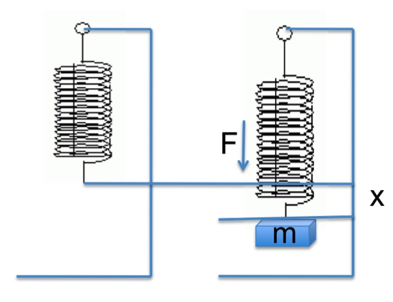

   * Then, we got some data

        ```
        0.0865 0.1
        0.1015 0.15
        ...
        0.4263 0.65
        0.4562 0.7
        ```
        
   * Plot the data, we got:

       * 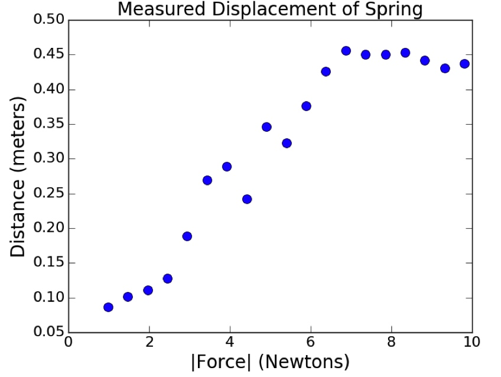
       * It has some measurement errors.
    
   * Next step is to fit curves to data.
       * When we fit a curve to a set of data, we are finding a fit that relates an independent variable (the mass) to an estimated value of a dependent variable (the distance)
       * To fit curves to data, we need to define an **objective function** that provides a quantitative assessment of how well the curve fits the data. In this case, a straight line, that is **linear function**. 
       * Then, finding the best fit is an optimization problem. most commonly used **objective function** is called **least squares**:
           * \\(\displaystyle\sum_{i=0}^{len(observed)-1}(observed[i] - predicted[i])^2\\)
       * Next is to use a successive approximation algorithm to find the best least-squares fit. **PyLab** provides a built-in function, **polyfit**:
            
            ```python
            pylab.polyfit(observedXVals, observedYVals, n)
            ```
            
            * this function finds the coefficients of a polynomial of degree `n` that provides a best least-squares fit for the set of points defined by the arrays observedXVals and observedYVals.
            * The algorithm used by polyfit is called **linear regression**.

    * Visualizing the Fit

        ```python
        def getData(fileName):
            dataFile = open(fileName, 'r')
            distances = []
            masses = []
            dataFile.readline() #discard header
            for line in dataFile:
                d, m = line.split()
                distances.append(float(d))
                masses.append(float(m))
            dataFile.close()
            return (masses, distances)
            
        def labelPlot():
            pylab.title('Measured Displacement of Spring')
            pylab.xlabel('|Force| (Newtons)')
            pylab.ylabel('Distance (meters)')
        
        def plotData(fileName):
            xVals, yVals = getData(fileName)
            xVals = pylab.array(xVals)
            yVals = pylab.array(yVals)
            xVals = xVals*9.81  #acc. due to gravity
            pylab.plot(xVals, yVals, 'bo',
                       label = 'Measured displacements')
            labelPlot()
            
        def fitData(fileName):
            xVals, yVals = getData(fileName)
            xVals = pylab.array(xVals)
            yVals = pylab.array(yVals)
            xVals = xVals*9.81 #get force
            pylab.plot(xVals, yVals, 'bo',
                       label = 'Measured points')
            labelPlot()                 
            a,b = pylab.polyfit(xVals, yVals, 1)
            # estYVals = a*xVals + b
            estYVals = pylab.polyval(model, xVals)
            print('a =', a, 'b =', b)
            pylab.plot(xVals, estYVals, 'r',
                       label = 'Linear fit, k = '
                       + str(round(1/a, 5)))
            pylab.legend(loc = 'best')
            
        fitData('springData.txt')
        ```

        * 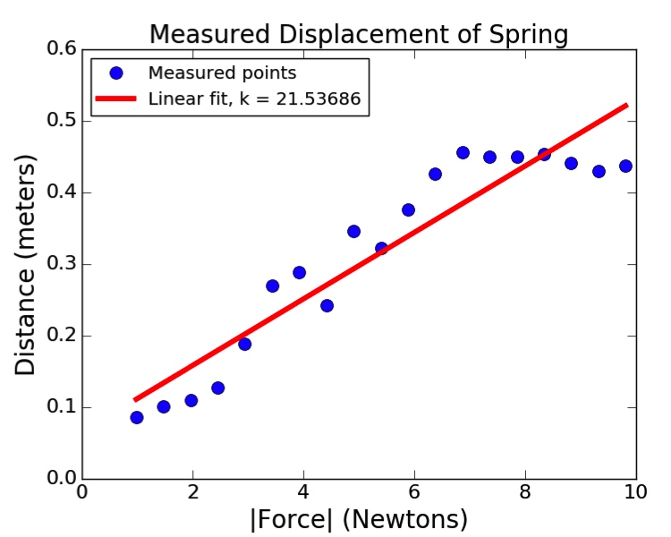

        * `k = 21.53686`

### Another Experiment
    
* to fit curves to these mystery data: 

   * 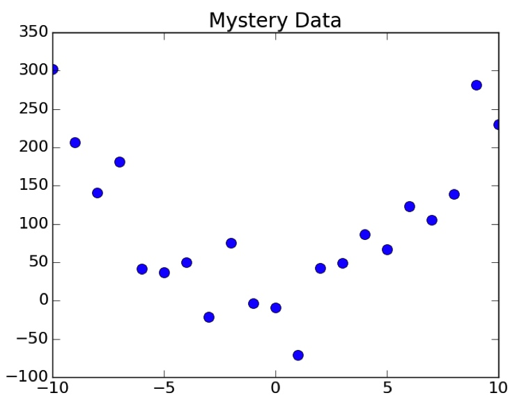

   * 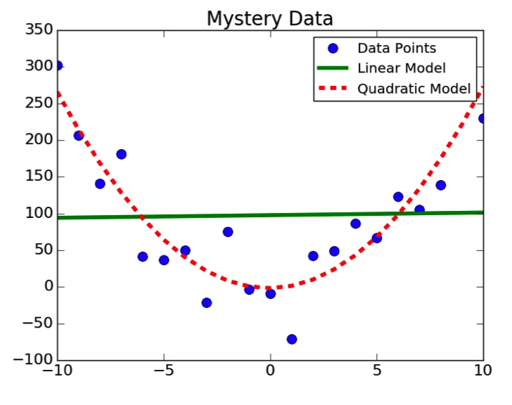

* how good are these fits

   * we can see that quadratic model is better than linear model, but how bad a fit is the line and how good is the quadratic fit?
   * comparing **mean squared error**

       ```python
       def aveMeanSquareError(data, predicted):
           error = 0.0
           for i in range(len(data)):
               error += (data[i] - predicted[i])**2
           return error/len(data)
       ```
       
       * then we got:
           * Ave. mean square error for linear model = 9372.73078965
           * Ave. mean square error for quadratic model = 1524.02044718
       * Seems like, quadratic model is better than linear model. But we still have to ask, is the quadratic fit good in an absolute sense?
       * The mean square error is useful for comparing two different models of the same data, but it's not actually very useful for getting the absolute goodness of fit.

### Coefficient of Determination ( R^2 )

* \\(R^{2}=1-\frac{\sum_{i}(y_i-p_i)^2}{\sum_{i}(y_i-\mu_i)^2}\\)
    * By comparing the estimation errors (the numerator) with the variability of the original values (the denominator), R^2 is intended to capture the proportion of variability in a data set that is accounted for by the statistical model provided by the fit
    * Always between 0 and 1 when fit generated by a linear regression and tested on training data
    * If R^2 = 1, the model explains all of the variability in the data. If R^2 = 0, there is no relationship between the values predicted by the model and the actual data.
        
    ```python
    def rSquared(observed, predicted):
     error = ((predicted - observed)**2).sum()
     meanError = error/len(observed)
     return 1 - (meanError/numpy.var(observed))
  ```
  
* Testing Goodness of Fits
   
    ```python
    def genFits(xVals, yVals, degrees):
     models = []
     for d in degrees:
         model = pylab.polyfit(xVals, yVals, d)
         models.append(model)
     return models
      
    def testFits(models, degrees, xVals, yVals, title):
     pylab.plot(xVals, yVals, 'o', label = 'Data')
     for i in range(len(models)):
         estYVals = pylab.polyval(models[i], xVals)
         error = rSquared(yVals, estYVals)
         pylab.plot(xVals, estYVals,
                    label = 'Fit of degree '\
                    + str(degrees[i])\
                    + ', R2 = ' + str(round(error, 5)))
     pylab.legend(loc = 'best')
     pylab.title(title)
      
    xVals, yVals = getData('mysteryData.txt')
    degrees = (1, 2)
    models = genFits(xVals, yVals, degrees)
    testFits(models, degrees, xVals, yVals, 'Mystery Data')
    ```
      
    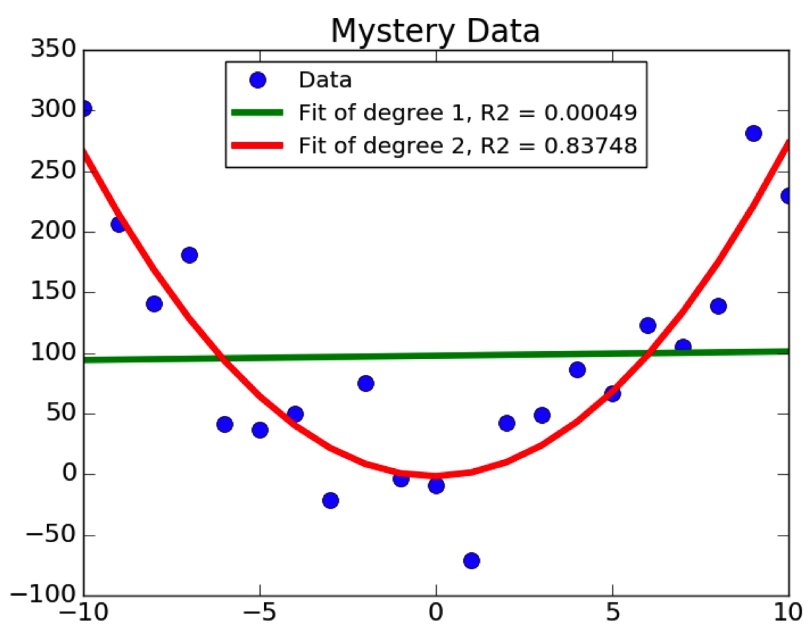
    
    * Quadratic model get 84%, and Linear get almost 0%.
    * Since the degree of polynomial can affect the Goodness of Fits, what if we use some bigger ones? Can we get a tighter Fit?
        * 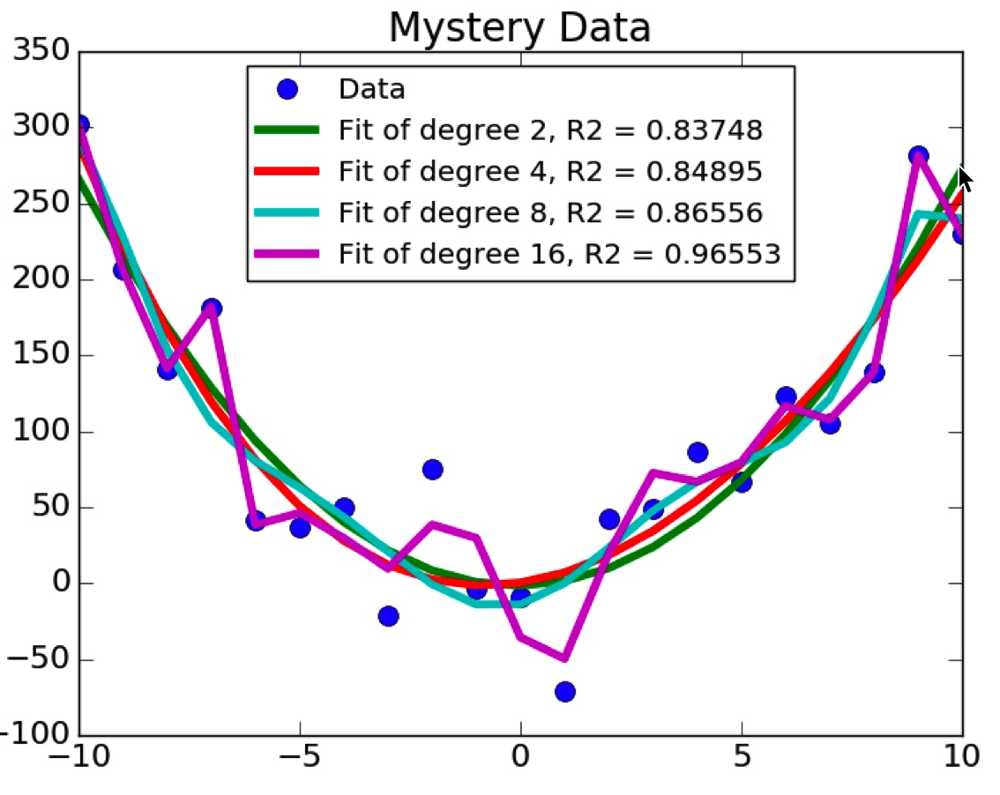

### A Tighter Fit May Not Be We Need, So How to Choose?

* Why We Build Models
    
   * Help us understand the process that generated the data
   * Help us make predictions about out-of-sample data
   * A good model helps us do these things

* How Mystery Data Was Generated
    
   ```pyton
   def genNoisyParabolicData(a, b, c, xVals, fName):
       yVals = []
       for x in xVals:
           theoreticalVal = a*x**2 + b*x + c
           yVals.append(theoreticalVal + random.gauss(0, 35))
       f = open(fName,'w')
       f.write('y        x\n')
       for i in range(len(yVals)):
           f.write(str(yVals[i]) + ' ' + str(xVals[i]) + '\n')
       f.close()
   ```
    
* Let’s Look at Two Data Sets

   ```python
   #parameters for generating data
   xVals = range(-10, 11, 1)
   a, b, c = 3, 0, 0
   degrees = (2, 4, 8, 16)
   
   #generate data
   random.seed(0)
   genNoisyParabolicData(a, b, c, xVals, 'Dataset 1.txt')
   
   genNoisyParabolicData(a, b, c, xVals, 'Dataset 2.txt')
   
   xVals1, yVals1 = getData('Dataset 1.txt')
   models1 = genFits(xVals1, yVals1, degrees)
   testFits(models1, degrees, xVals1, yVals1, 'DataSet 1.txt')
   
   pylab.figure()
   xVals2, yVals2 = getData('Dataset 2.txt')
   models2 = genFits(xVals2, yVals2, degrees)
   testFits(models2, degrees, xVals2, yVals2, 'DataSet 2.txt')
   ```
   
   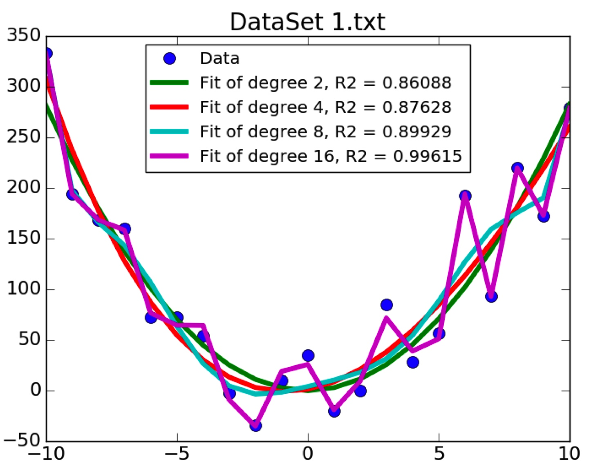 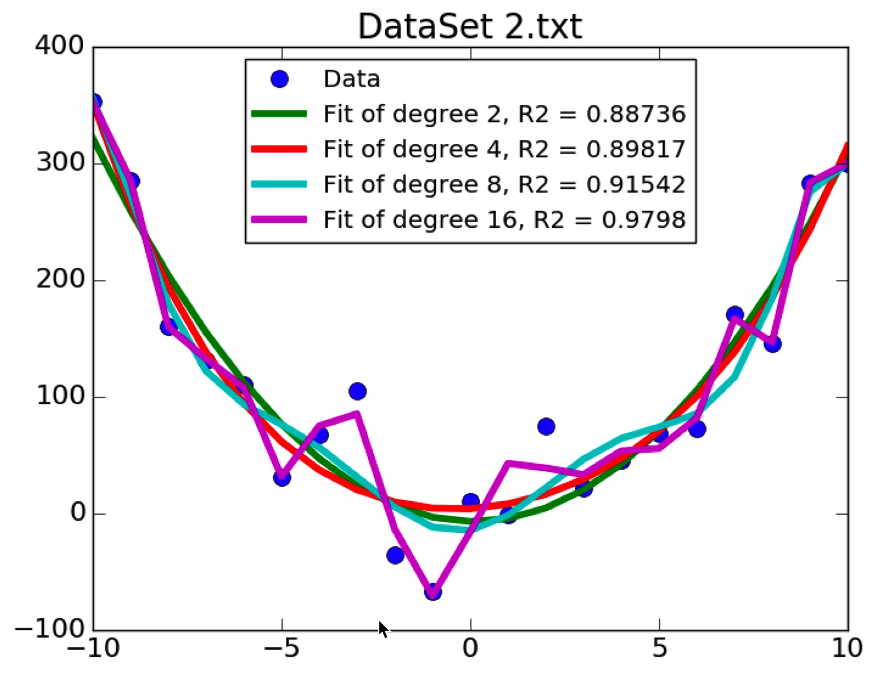

* Hence Degree 16 Is Tightest Fit, But
   * We want model to work well on other data generated by the same process
   * It needs to generalize

* **Cross Validate**
   * Generate models using one dataset, and then test it on the other
       * Use models for Dataset 1 to predict points for Dataset 2
       * Use models for Dataset 2 to predict points for Dataset 1
   * Expect testing error to be larger than training error
   * A better indication of generalizability than training error

   ```python
   pylab.figure()
   testFits(models1, degrees, xVals2, yVals2, 'DataSet 2/Model 1')
   pylab.figure()
   testFits(models2, degrees, xVals1, yVals1, 'DataSet 1/Model 2')
   ```

   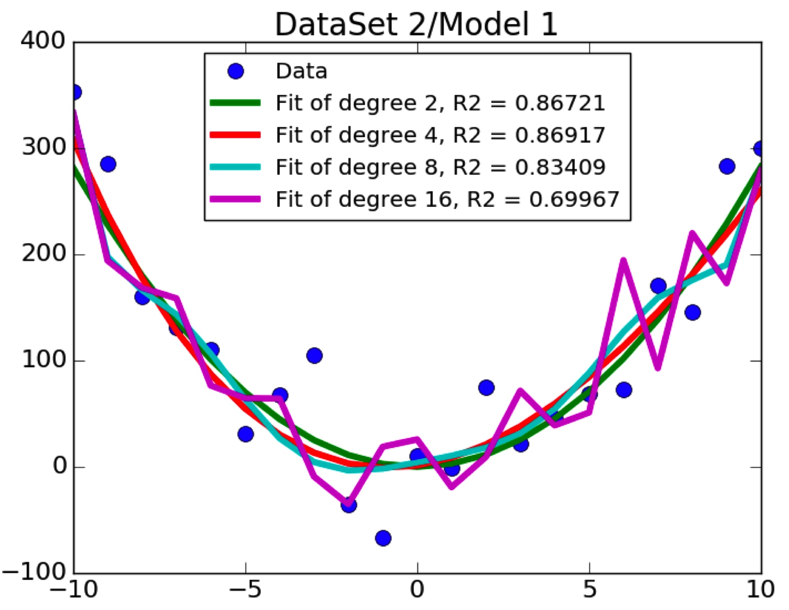 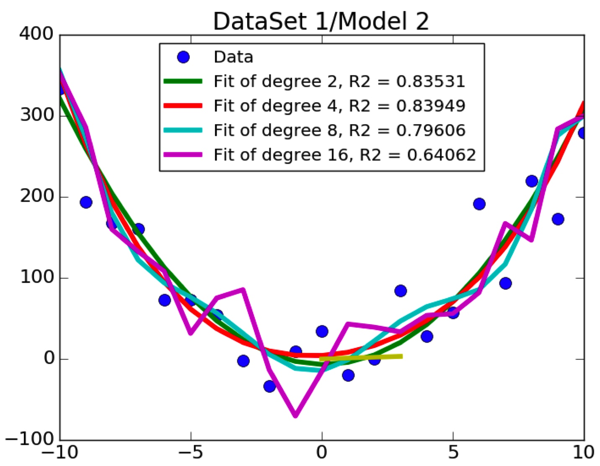

* Increasing the Complexity
    
   * coefficient may be zero if Fitting a quadratic to a perfect line
       * for example one:
           * data: [{0, 0}, {1, 1}, {2, 2}, {3, 3}]
           * Fit `y=ax^2+bx+c`, will get `y=0x^2+1x+0`, which is `y=x`
       * for example two:
           * data: [{0, 0}, {1, 1}, {2, 2}, {3, 3.1}]
           * Fit `y=ax^2+bx+c`, will get `y=0.025x^2+0.955x+0.005`, which is `y=x`
   * if data is noisy, can fit the noise rather than the underlying pattern in the data?
       * for example:
           * data: [{0, 0}, {1, 1}, {2, 2}, {3, 3}, {4, 20}]
           * Fit `y=ax^2+bx+c`, we got:
               * 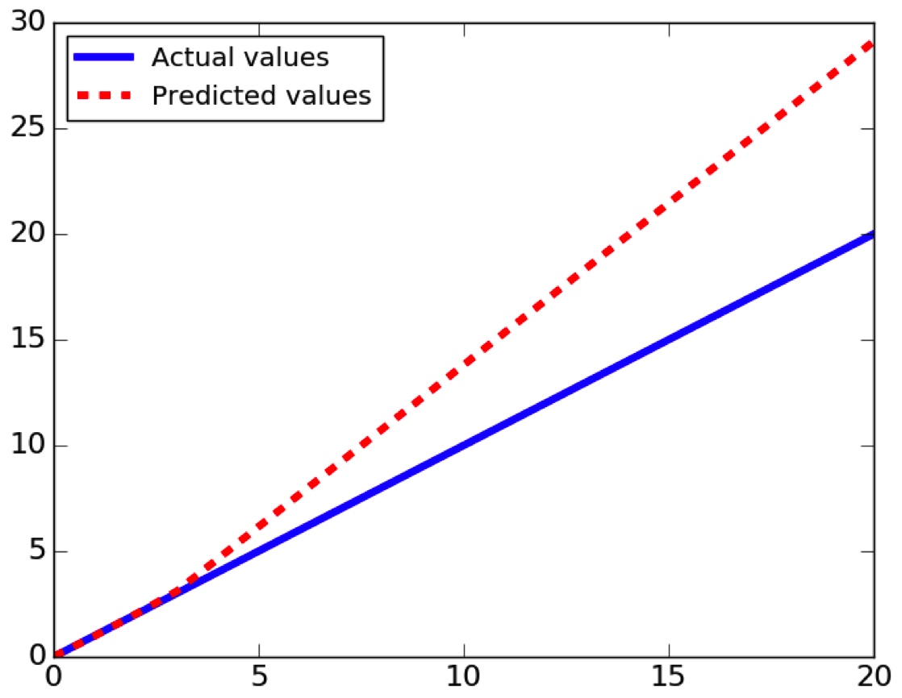
               * R-squared = 0.7026
           * suppose we had used a first-degree fit
               * `model = pylab.polyfit(xVals, yVals, 1)`
               * 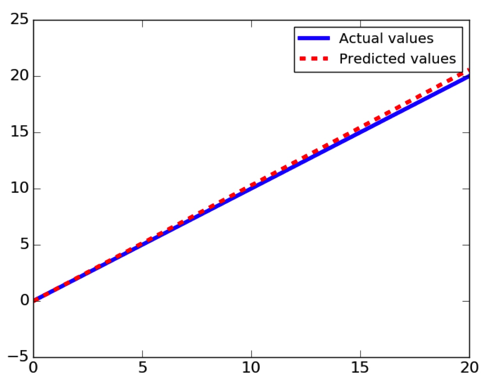

* Conclusion
    * Choosing an overly-complex model can leads to **overfitting** to the training data
    * Increases the risk of a model that works poorly on data not included in the training set
    * On the other hand choosing an insufficiently complex model has other problems
        * when we fit a line to data that was basically parabolic

### Suppose We Don’t Have a Solid Theory to Validate Model

* Use **cross-validation** results to guide the choice of model complexity
* If dataset small, use leave-one-out cross validation
* If dataset large enough, use k-fold cross validation or repeated-random-sampling validation

#### Leave-one-out Cross Validation

* Let `D` be the original data set

    ```
    testResults = []

    for i in range(len(D)): 
        training = D[:].pop(i)
        model = buildModel(training)
        testResults.append(test(model, D[i]))
    Average testResults
    ```
    
#### Repeated Random Sampling

* Let `D` be the original data set
* Let `n` be the number of random samples

    ```
    testResults = []
    for i in range(n)
        randomly partition D into two sets:
        training and test
        model = buildModel(training)
        testResults.append(test(model, test))
    Average testResults
    ```
    
#### An Example, Temperature By Year

* Task: Model how the mean daily high temperature in the U.S. varied from 1961 through 2015
    * Get means for each year and plot them
    * Randomly divide data in half n times
        * For each dimensionality to be tried
            * Train on one half of data
            * Test on other half
            * Record r-squared on test data
    * Report mean r-squared for each dimensionality
    * Code: [lecture11-3.py](https://github.com/erictt/computer-science-learning/blob/master/computational-thinking/unit-4/lecture11-3.py)
    
* The Whole Data Set:
    * 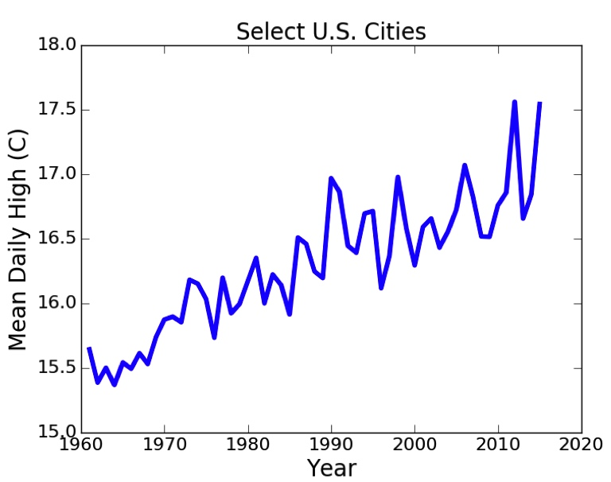
* Results:
    * Mean R-squares for test data
        * For dimensionality 1 mean = 0.7535 Std = 0.0656
        * For dimensionality 2 mean = 0.7291 Std = 0.0744
        * For dimensionality 3 mean = 0.7039 Std = 0.0684 
* Line seems to be the winner
    * Highest average r-squared
    * Simplest model    
    
### Wrapping Up Curve Fitting

* We can use linear regression to fit a curve to data
    * Mapping from independent values to dependent values
* That curve is a model of the data that can be used to predict the value associated with independent values we haven’t seen (out of sample data)
* R-squared used to evaluate model
    * Higher not always “better” because of risk of over fitting
* Choose complexity of model based on
    * Theory about structure of data
    * Cross validation
    * Simplicity

