# Lecture 12

[toc]

## Machine Learning

* Definition
    * 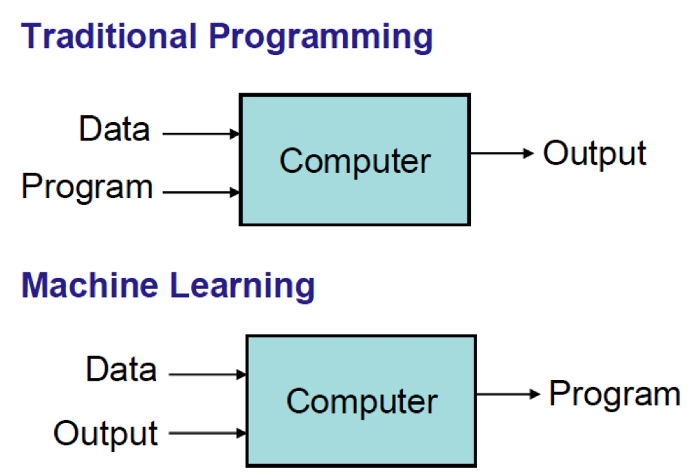
* Basic Paradigm
    * Observe set of examples: **training data**
    * Infer something about process that generated that data
    * Use inference to make predictions about previously unseen data: **test data**
* Procedures
    * Representation of the features
        * separate people with features(man/woman, educated/not, etc.)
    * Distance metric for feature vectors
        * make feature vectors can be calculated in a same range.
    * Objective function and constraints
    * Optimization method for learning the model
    * Evaluation method

### Supervised Learning

* Start with set of feature vector/value pairs
* Goal: find a model that predicts a value for a previously unseen feature vector
* **Regression models** predict a real
    * As with linear regression
* **Classification models** predict a label (chosen from a finite set of labels)

### Unsupervised Learning

* Start with a set of feature vectors
* Goal: uncover some latent structure in the set of feature vectors
* **Clustering** the most common technique
    * Define some metric that captures how similar one feature vector is to another
    * Group examples based on this metric

### Difference between Supervised and Unsupervised

* 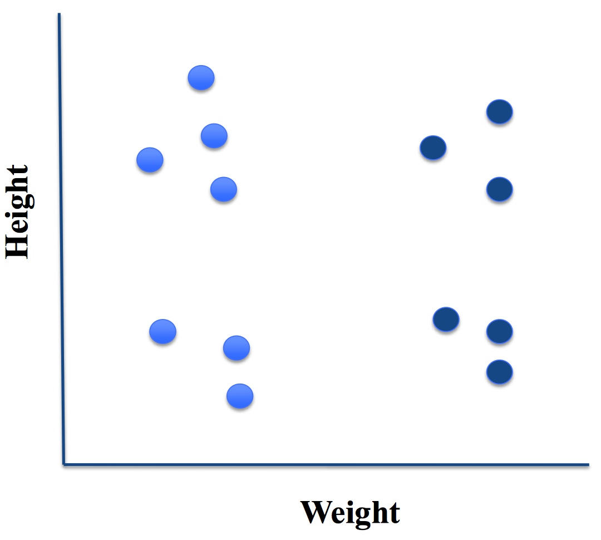
* with label, we can classify the data to two clusters by wight or height, or four clusters by wight and height, which is Supervised Learning
* without label, to figure out how to clustering the data, is Unsupervised Learning.

### Choose Feature Vectors

* Why should careful?
    * Irrelevant features can lead to a bad model. 
    * Irrelevant features can greatly slow the learning process.
* How?
    * **signal-to-noise ratio (SNR)**
        * Think of it as the ratio of useful input to irrelevant input.
    * The purpose of feature extraction is to separate those features in the available data that contribute to the signal from those that are merely noise.

    
### Distance Between Vectors

#### Minkowski Metric 

* \\(dist(X1, X2, p)=(\displaystyle\sum_{k-1}^{len}abs(X1_{k}-X2_{k})^p)^{1/p}\\)
* p = 1: Manhattan Distance
* P = 2: Euclidean Distance
   
   ```python
   def minkowskiDist(v1, v2, p):
       """Assumes v1 and v2 are equal-length arrays of numbers 
          Returns Minkowski distance of order p between v1 and v2""" 
       dist = 0.0 
       for i in range(len(v1)):
           dist += abs(v1[i] - v2[i])**p 
       return dist**(1.0/p)
   ```
* For example:
   * 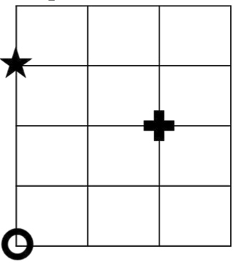
   * To compare the distance between star and circle and the distance between cross and circle
   * Use Manhattan Distance, they should be 3 and 4
   * Use Euclidean Distance, they should be 3 and 2.8 = \\(\sqrt{2^2+2^2}\\)

##### Using Distance Matrix for Classification

* Procedures
    * Simplest approach is probably nearest neighbor
    * Remember training data
    * When predicting the label of a new example
        * Find the nearest example in the training data
        * Predict the label associated with that example
* To predict the color of `X`
    * 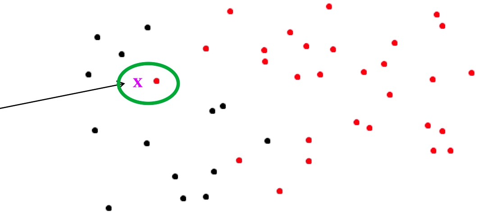
    * The closest one is pink, so X should be pink

*  K-nearest Neighbors
    
    * Find `K` nearest neighbors, and choose the label associated with the majority of those neighbors.
    * Usually, we use odd number. This sample, we use `k = 3`
    * 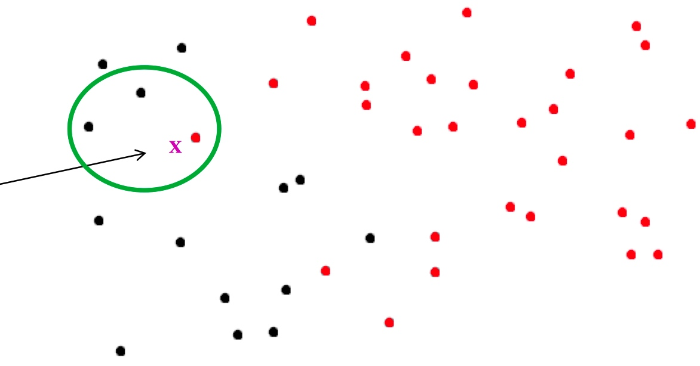

*  Advantages and Disadvantages of KNN
    
    * Advantages
        * Learning fast, no explicit training
        * No theory required
        * Easy to explain method and results
    * Disadvantages
        * Memory intensive and predictions can take a long time
        * Are better algorithms than brute force
        * No model to shed light on process that generated data

* For Example
    * 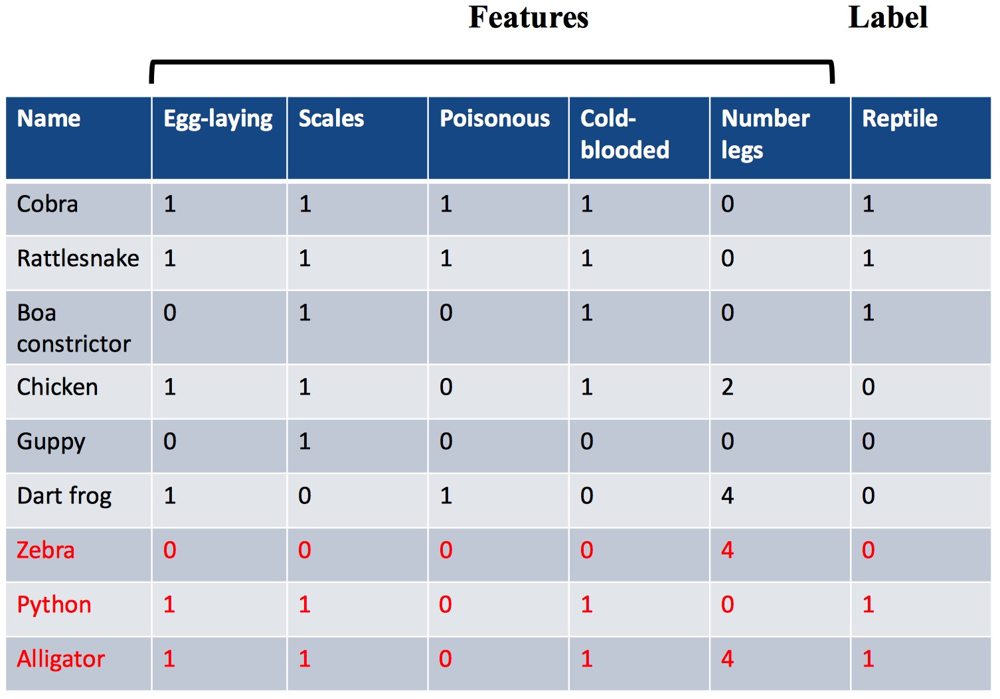
    * To predict whether zebra, python and alligator are reptile or not.
    * Calculate the distances, we got:
        * 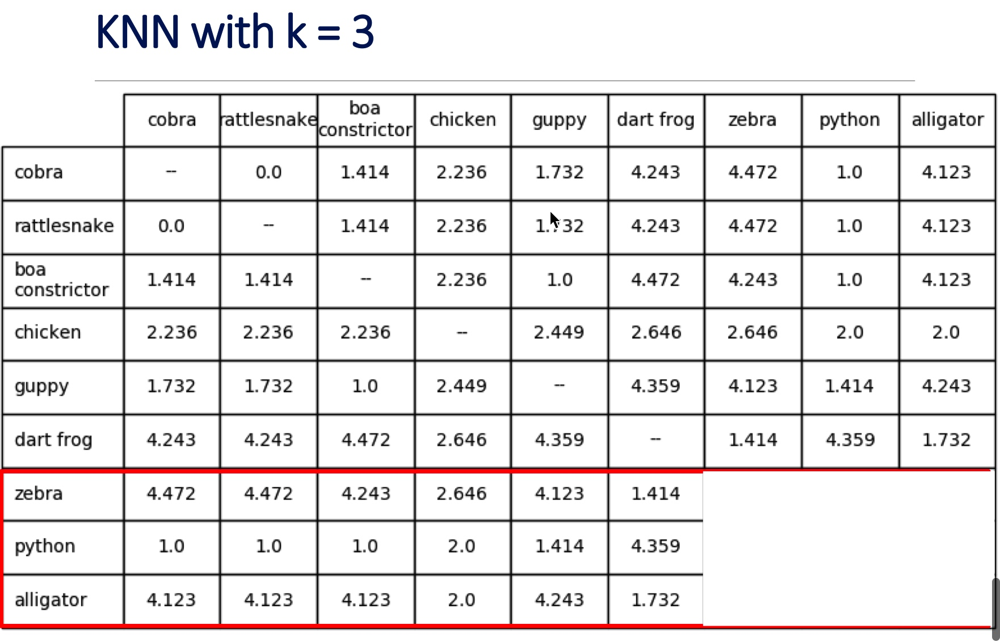
        * The closest three animals to alligator are boa constrictor, chicken and dark frog, and two of them are not reptile, so alligator is not reptile.
        * But we know alligator is reptile. So what's wrong?
        * We notice, all of the features are 0 or 1, except number of legs, which gets disproportionate weight.
            * So, Instead of number of legs, we say "has legs." And then this becomes a one.
    * 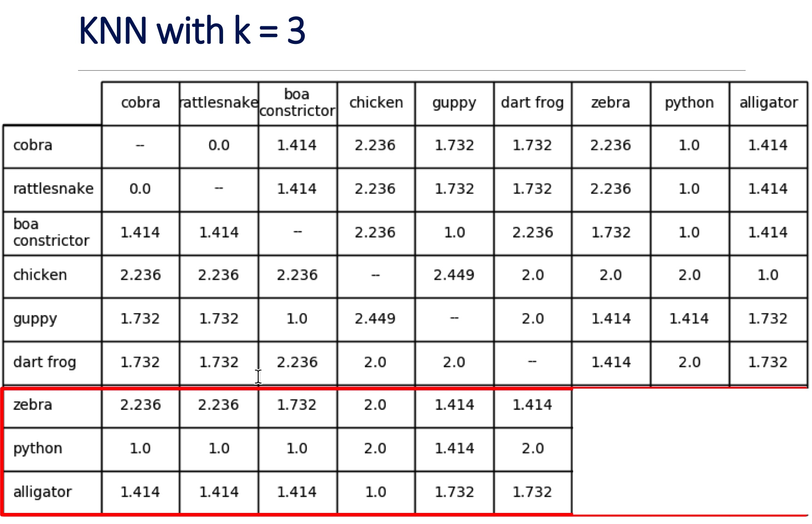
        * The closest three animals to alligator are boa constrictor, chicken and cobra, and two of them are reptile, so alligator is reptile.

* A More General Approach: Scaling
    * Z-scaling
        * Each feature has a mean of 0 & a standard deviation of 1
    * Interpolation
        * Map minimum value to 0, maximum value to 1, and linearly interpolate

    ```python
    def zScaleFeatures(vals):
        """Assumes vals is a sequence of floats"""
        result = pylab.array(vals)
        mean = float(sum(result))/len(result)
        result = result - mean
        return result/stdDev(result)
    
    def iScaleFeatures(vals):
        """Assumes vals is a sequence of floats"""
        minVal, maxVal = min(vals), max(vals)
        fit = pylab.polyfit([minVal, maxVal], [0, 1], 1)
        return pylab.polyval(fit, vals)
    ``` 
    
### Clustering

* Partition examples into groups (clusters) such that examples in a group are more similar to each other than to examples in other groups
* Unlike classification, there is not typically a “right answer”
    * Answer dictated by feature vector and distance metric, not by a ground truth label

#### Optimization Problem

* Clustering is an optimization problem. The goal is to find a set of clusters that optimizes an objective function, subject to some set of constraints.
* Given a distance metric that can be used to decide how close two examples are to each other, we need to define an **objective function** that
    * Minimizes the distance between examples in the same clusters, i.e., minimizes the dissimilarity of the examples within a cluster.
* To compute the variability of the examples within a cluster
    * First compute the mean(`sum(V)/float(len(V))`, more precisely the Euclidean mean) of the feature vectors of all the examples in the cluster. , `V` is a list of feature vectors. 
    * Compute the distance between feature vectors
        * \\(variability(c)=\displaystyle\sum_{e \in c}distance(mean(c), e)^2\\)
* The definition of variability within a single cluster, `c`, can be extended to define a dissimilarity metric for a set of clusters, `C`:
   * \\(dissimilarity(C)=\displaystyle\sum_{e \in c}variability(c)\\)
* It's NOT the optimization problem to find a set of clusters, C, such that dissimilarity(C) is minimized. It can easily be minimized by putting each example in its own cluster.
* We could put a constraint on the distance between clusters or require that the maximum number of clusters is `k`. Then to find the minimum between clusters.

##### K-means Clustering

* Constraint: exactly `k` non-empty clusters
* Use a greedy algorithm to find an approximation to minimizing objective function
* Algorithm

    ```
    randomly chose k examples as initial centroids
    while true:
        create k clusters by assigning each
            example to closest centroid
        compute k new centroids by averaging
            examples in each cluster
        if centroids don’t change:
            break
    ```
    
    * Sample: [lecture12-4.py](./unit-4/lecture12-3.py)
        * `k=4`, Initial Centroids: 
            * 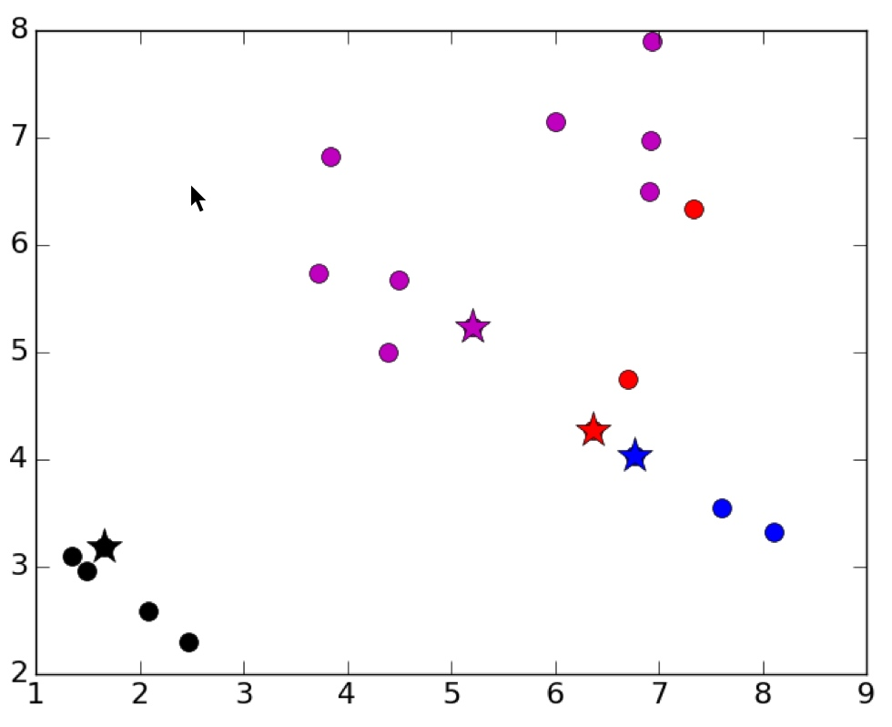
        * Result: 
            * 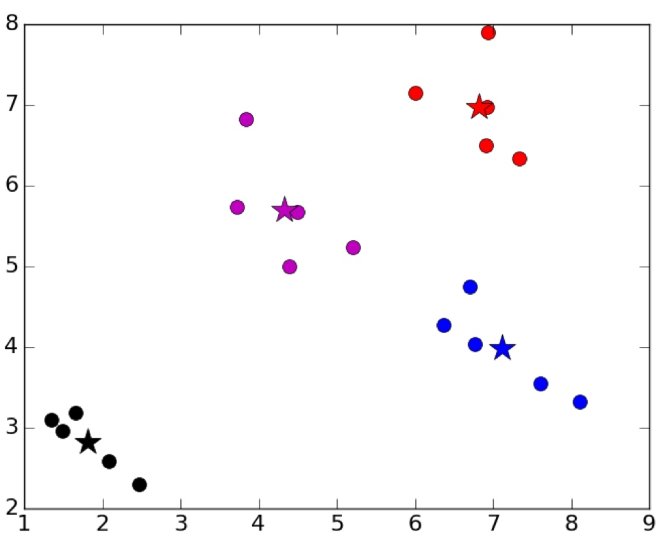
* Unlucky Initial Centroids
    * `k=4`, Initial Centroids: 
        * 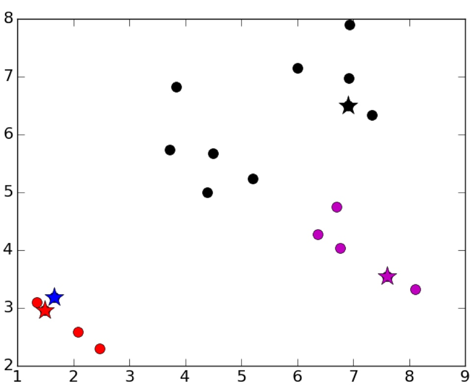
    * Result: 
        * 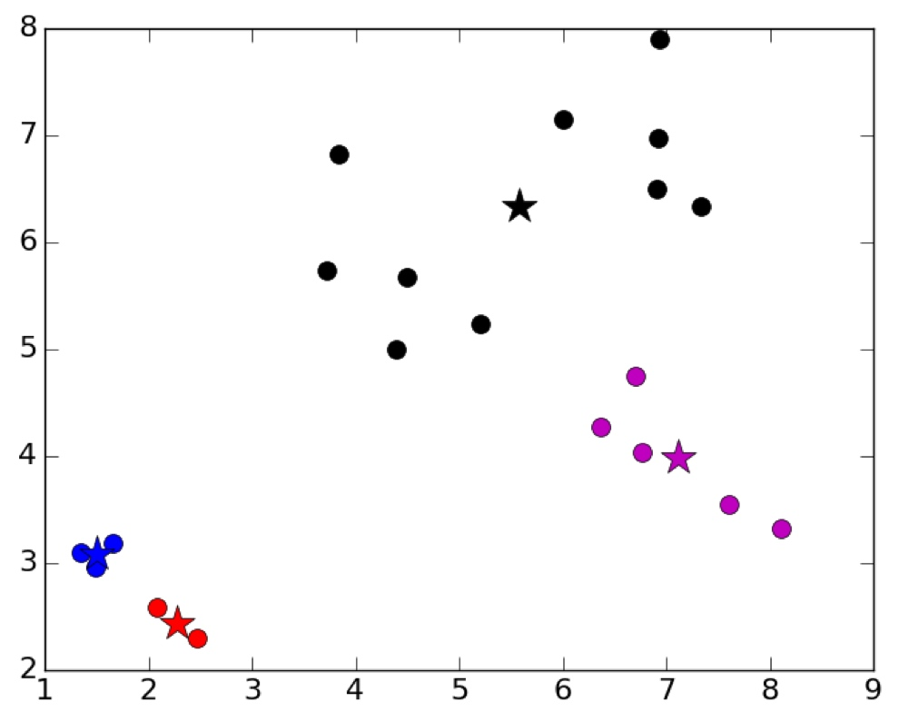
    * Mitigating Dependence on Initial Centroids
        
        ```
        best = kMeans(points)
        for t in range(numTrials):
            C = kMeans(points)
            if dissimilarity(C) < dissimilarity(best):
            best = C
        return best
        ```
### Wrapping Up Machine Learning

* Use data to build statistical models that can be used to
    * Shed light on system that produced data
    * Make predictions about unseen data
* Supervised learning
* Unsupervised learning
* Feature engineering
* Goal was to expose you to some important ideas
    * Not to get you to the point where you could apply them
    * Much more detail, including implementations, in text


