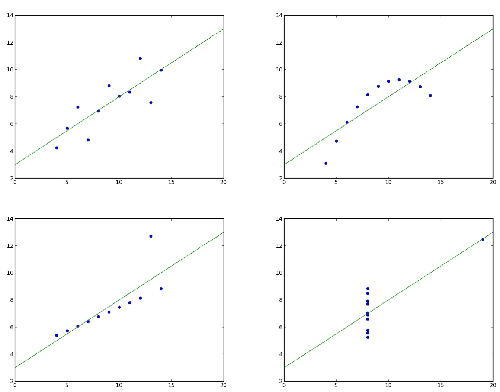
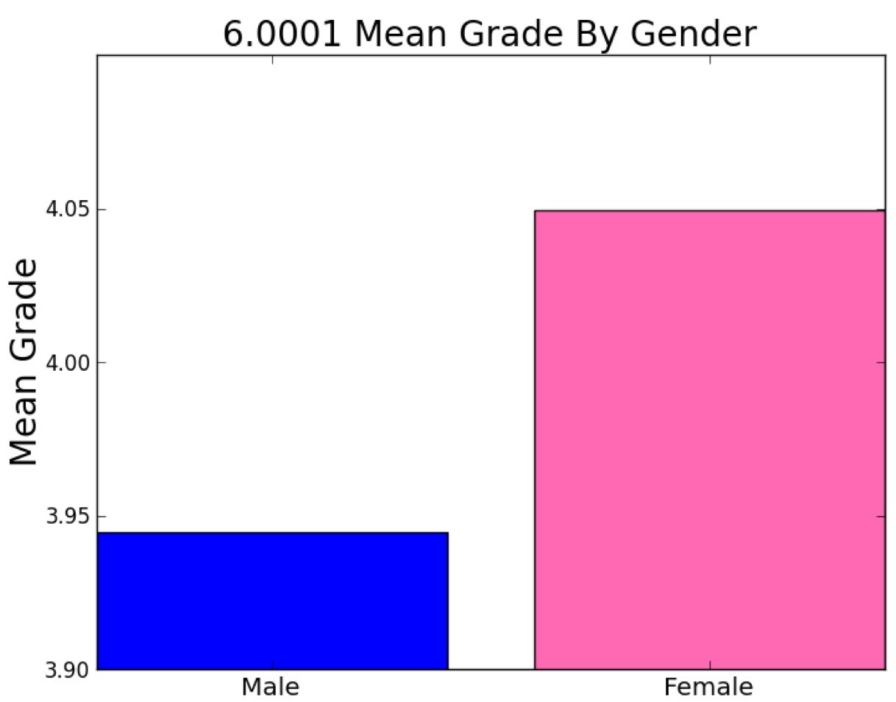
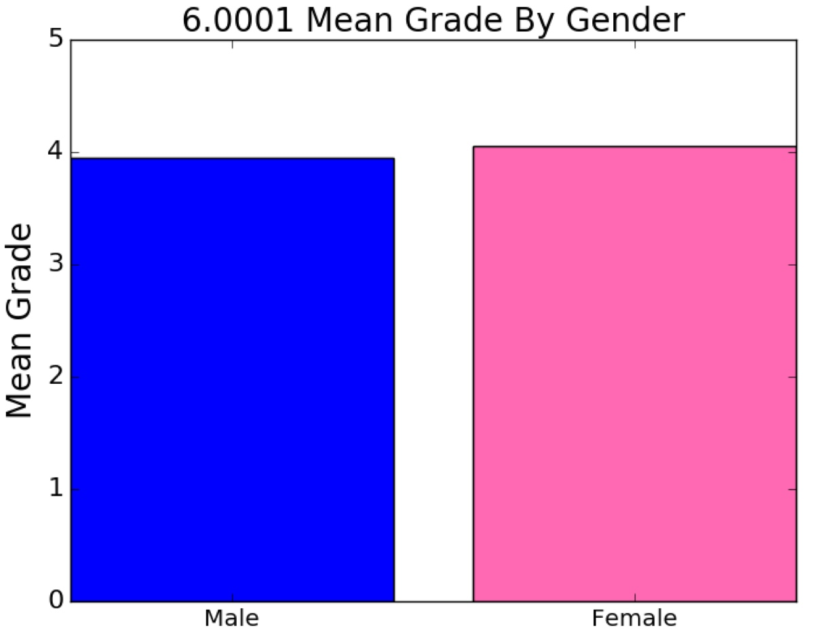
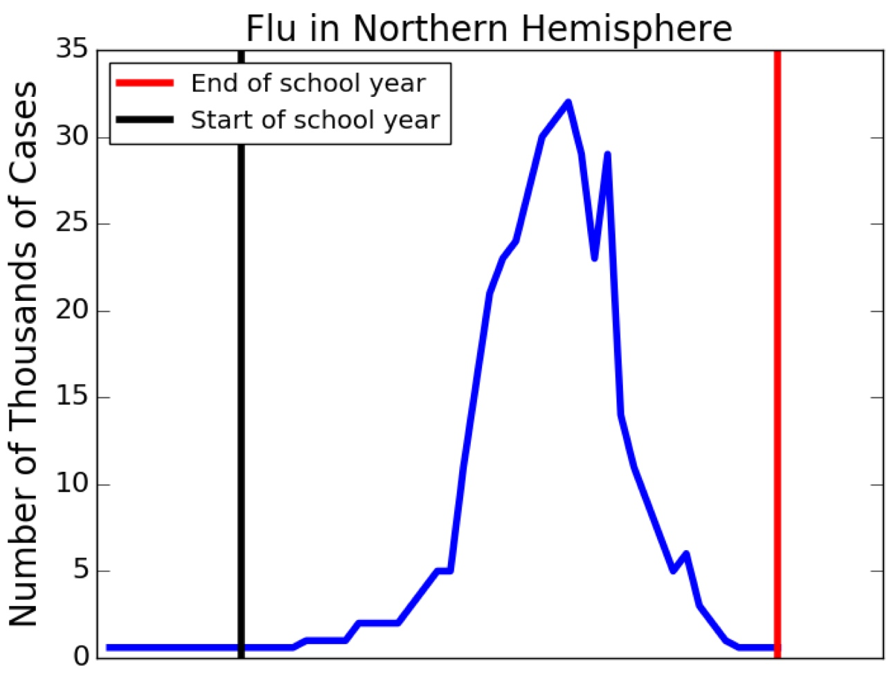

# Lecture 13

[toc]

## Statistical Abuses

### Anscombe’s Quartet

* 
* Summary statistics for groups identical
    * Mean x = 9.0
    * Mean y = 7.5
    * Variance of x = 10.0
    * Variance of y = 3.75
    * Linear regression model: y = 0.5x + 3
* Are four data sets really similar?
    * 
* Moral:
    * **Sometimes, Statistics about the data is not the same as the data**
    * **Use visualization tools to look at the data itself**

### Lying with Pictures

* 
* Telling the Truth with Pictures
    * 
* Moral: **Look carefully at the axes labels and scales**

### GIGO (Garbage In, Garbage Out)

* Moral: **Analysis of bad data can lead to dangerous conclusions.**

### Non-representative Sampling

* “Convenience sampling” not usually random, e.g.,
    * Survivor bias, e.g., course evaluations at end of course or grading final exam in 6.00.2x on a curve
    * Non-response bias, e.g., opinion polls conducted by mail or online
* Moral: **Understand how data was collected, and whether assumptions used in the analysis are satisfied. If not, be wary.**

### A Comforting Statistic?

* 99.8% of the firearms in the U.S. will not be used to commit a violent crime in any given year
    * How many privately owned firearms in U.S.?
    * 300,000,000
    * 300,000,000*0.002 = 600,000
* Moral: **Context matters. A number means little without context.**

### Relative to What?

* Consider drugs X and Y for treating acne
    * X cures acne twice as well as Y
    * X kills twice as many acne patients as Y
* Do you want to take X or Y?
    * Suppose Y kills 0.00001% of cases, and cures 50% of them
* Moral: **Beware of percentages when you don’t know the baseline**

### Lurking Variable

* 
* Does going to school contribute to the spread of flu?
* Moral:
    * **Establishing Causation**
        * Attempt to control for all variables other than the variables of interest
            * Rarely possible
        * Randomized control studies the gold standard
            * Start with a population
            * Randomly assign members to either
                * Control group
                * Treatment group
            * Deal with two groups identically except with respect to the one thing being evaluated
            * Very hard to do

