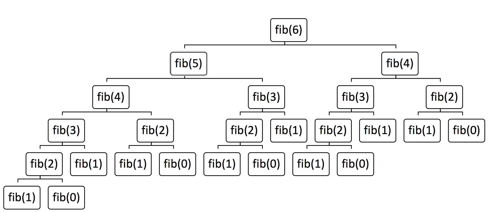
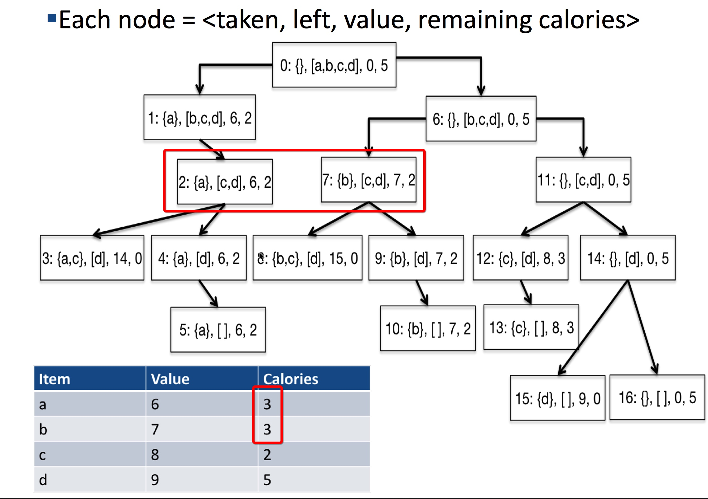

# Lecture 2

[TOC]

## Search Tree Implementation 

* The first element is selected from the still to be considered items
    * If there is room for that item in the knapsack, a node is constructed that reflects the consequence of choosing to take that item. 
    * Then explore the consequences of not taking that item.
* The process is then applied **recursively** to non-leaf children
* Finally, chose a node with the highest value that meets constraints

### Computational Complexity

* Time based on number of nodes generated
* Number of levels is number of items to choose from
* Number of nodes at level **i** is $2^i$
* So, if there are **n** items, the number of nodes is
    * $\sum_{i=0}^{i=n}2^i$, i.e., $O(2^{i+1})$
* An obvious optimization: don’t explore parts of tree that violate constraint

## Header for Decision Tree Implementation

```python
def maxVal(toConsider, avail):
    if toConsider == [] or avail == 0:
        result = (0, ())
    elif toConsider[0].getUnits() > avail:
        result = maxVal(toConsider[1:], avail)
    else:
        nextItem = toConsider[0]
        withVal, withToTake = maxVal(toConsider[1:],
        avail - nextItem.getUnits())
        withVal += nextItem.getValue()
        withoutVal, withoutToTake = maxVal(toConsider[1:], avail)
        
    if withVal > withoutVal:
        result = (withVal, withToTake + (nextItem,))
    else:
        result = (withoutVal, withoutToTake)
    return result
```

* **toConsider**: Those items that nodes higher up in the tree (corresponding to earlier calls in the recursive call stack) have not yet considered
* **avail**: The amount of space still available
* Does not actually build search tree, local variable result records best solution found so far

## Dynamic Programming

* **Optimal substructure**: a globally optimal solution can be found by combining optimal solutions to local subproblems
    * For x > 1, fib(x) = fib(x - 1) + fib(x – 2)

* **Overlapping subproblems**: finding an optimal solution involves solving the same problem multiple times
    * Compute fib(x) or many times

### Recursive Implementation of Fibonacci 

```python
def fib(n):
    if n == 0 or n == 1:
        return 1
    else:
        return fib(n - 1) + fib(n - 2)

# fib(120) = 8,670,007,398,507,948,658,051,921
```

#### Call Tree for Recursive Fibonacci(6) = 13



### To avoid repeat work

* Create a table to record what we’ve done
    * Before computing fib(x), check if value of fib(x) already stored in the table
        * If so, look it up
        * If not, compute it and then add it to table
    * Called **memoization**

#### Use a Memo to Compute Fibonacci 

```python
def fastFib(n, memo = {}):
    """Assumes n is an int >= 0, 
        memo used only by recursive calls Returns Fibonacci of n"""
    if n == 0 or n == 1:
        return 1
    try:
        return memo[n]
    except KeyError:
        result = fastFib(n-1, memo) + fastFib(n-2, memo)
        memo[n] = result
        return result
```

### Take another sample for knapsack



* Since `a` and `b` have the same calories, the rest calculations of the two which marked by red box will be the same. This will be a **overlapping subproblems** which can be optimized.

#### Modify maxVal to Use a Memo

* Add memo as a third argument: 
    * def fastMaxVal(toConsider, avail, memo = {}):
* Key of memo is a tuple
    * take (items left to be considered, available weight) as the key, which will be `memo[(len(toConsider), avail)]`.
    * Items left to be considered represented by `len(toConsider)`
    * The value will always be the same.
* First thing body of function does is check whether the optimal choice of items given the the available weight is already in the memo
* Last thing body of function does is update the memo

## Summary of Lectures 1-2

* Many problems of practical importance can be formulated as **optimization problems**
* **Greedy algorithms** often provide adequate (though not necessarily optimal) solutions
* Finding an optimal solution is usually **exponentially hard**
* But **dynamic programming** often yields good performance for a subclass of optimization problems—those with optimal substructure and overlapping subproblems
    * Solution always correct
    * Fast under the right circumstances

## Exercises

* [Power Set](unit-1/powerset.md)

