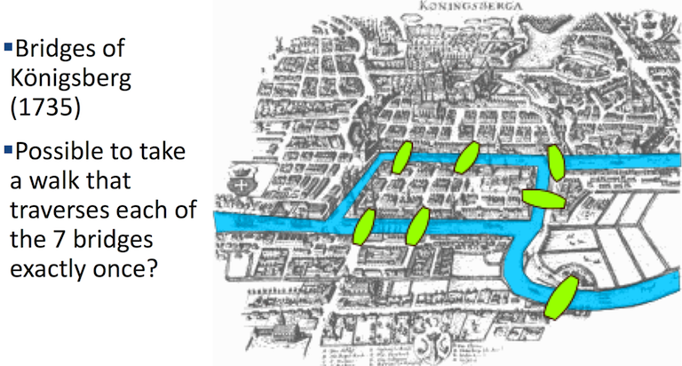
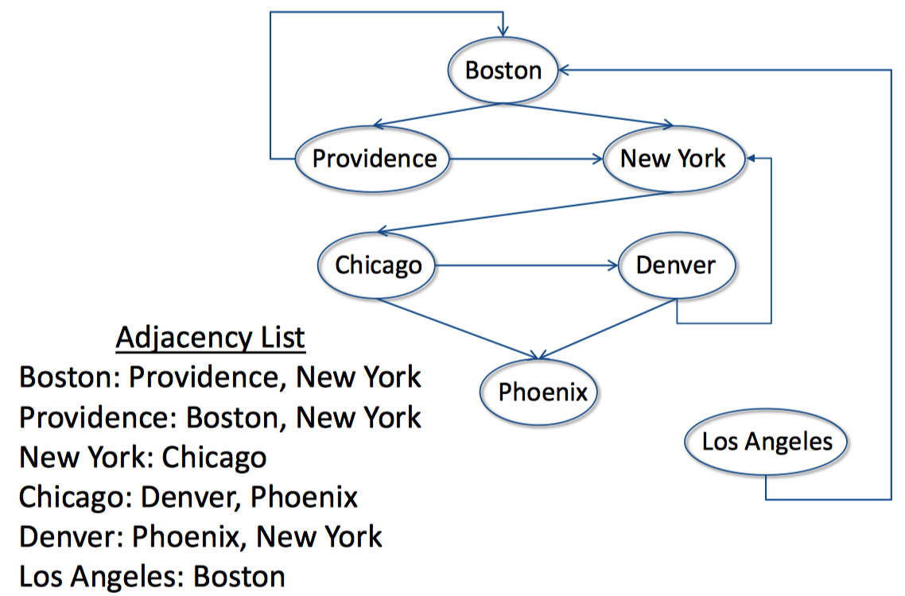

# Lecture 3

[TOC]

## Computational Models

* Programs that help us understand the world and solve practical problems

### Graph

#### Definition

* Set of nodes (vertices) with properties
* Set of edges (arcs) each consisting of a pair of nodes
    * Undirected (graph)
    * Directed (digraph)
        * Source (parent) and destination (child) nodes
   * Unweighted or weighted

#### Usage

* To capture useful relationships among entities
    * Rail links between Paris and London
    * How the atoms in a molecule related to one another
    * Ancestral relationships

#### Samples

* Leonhard Euler’s Model (First Reported Use of Graph Theory)
    * 
    * Each island a node
    * Each bridge an undirected edge
    * **Model abstracts away irrelevant details**
        * Size of islands
        * Length of bridges
   * Is there a path that contains each edge exactly once?

## Graph-theoretic Models

### Common Representations of Digraphs

* Adjacency matrix
    * Rows: source nodes
    * Columns: destination nodes
    * Cell[s, d] = 1 if there is an edge from s to d
        * 0 otherwise
* **Adjacency list** (We are trying this one first)
   * Associate with each node a list of destination nodes

#### Sample

* Finding a route from one city to another
    * 

* Four classes:
    * Node
        * property: `name`
    * Edge
        * properties: `source` and `dest` which are substances of class `Node`
    * Digraph
        * properties: `edges` is a `K-V` sets data, `K` for source node, and `V` for destination node.
        * method `addNode` to add Node object as the `K` of `edges`.
        * method `addEdge` to add Edge object, which will append the `dest` property of Edge object to `edges` with the specific `K`.
        * method `chirdrenOf` to return all the child nodes
        * method `hasNode` in `self.edges`
        * method `getNode` by node's name
    * Graph - is a subclass of Digraph
        * `addEdge`: rewrite the `addEdge` method to add another set with reversed source and destination nodes.

   * [Codes](https://github.com/erictt/computer-science-learning/tree/master/computational-thinking/unit-1/lecture3-segment2.py) 

### Algorithm: Depth First Search[DFS]

* Similar to left-first depth-first method of enumerating a search tree, mainly difference is that graph might have cycles, so we must keep track of what nodes we have visited

* Implement [Codes](https://github.com/erictt/computer-science-learning/tree/master/computational-thinking/unit-1/lecture3-segment3.py) 

   ```python
   def DFS(graph, start, end, path, shortest, toPrint):
       path = path + [start]     
       if start == end:
           return path
       for node in graph.childrenOf(start):
           if node not in path: #avoid cycles
               if shortest == None or len(path) < len(shortest):
                   """Will have values until node == end,
                        then save as shortest
                      And compare it with current path 
                        if path is still shorter
                        (don't need to continue if it isn't shorter), 
                      unless this shortest one will be returned
                   """
                   newPath = DFS(graph, node, end, path, shortest, toPrint)
                   if newPath != None:
                       shortest = newPath
       return shortest
       
   def shortestPath(graph, start, end):
       return DFS(graph, start, end, [], None, toPrint)
   ```

### Algorithm: Breadth First Search[BFS]

* Explore the nodes layer by layer, like first we got a node as start node, then check all the children nodes, then children's children, it will keep going until we got the node equal the end node. And that's the path we are looking for, just return it.
* Implement [Codes](https://github.com/erictt/computer-science-learning/tree/master/computational-thinking/unit-1/lecture3-segment3.py) 

    ```python
    """ Explore all paths with n hops 
        before exploring any path with more than n hops"""
    def BFS(graph, start, end, toPrint = False):
        """Assumes graph is a Digraph; start and end are nodes
           Returns a shortest path from start to end in graph"""
        initPath = [start]
        pathQueue = [initPath]
        while len(pathQueue) != 0:
            #Get and remove oldest element in pathQueue
            tmpPath = pathQueue.pop(0)
            if toPrint:
                print('Current BFS path:', printPath(tmpPath))
            lastNode = tmpPath[-1]
            if lastNode == end:
                return tmpPath
            for nextNode in graph.childrenOf(lastNode):
                if nextNode not in tmpPath:
                    newPath = tmpPath + [nextNode]
                    pathQueue.append(newPath)
        return None
    ```

## Summary

* Graph is used to create a model of many things
    * Capture relationships among objects
* DFS and BFS can be used for searching shortest path

## Words

**digraph**  ['daiɡrɑ:f, -ɡræf] n. 有向图


