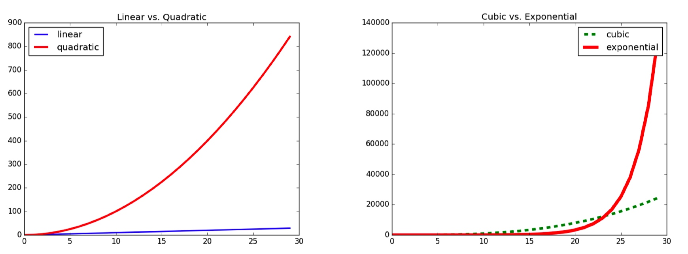
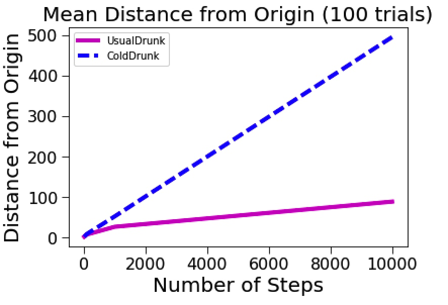
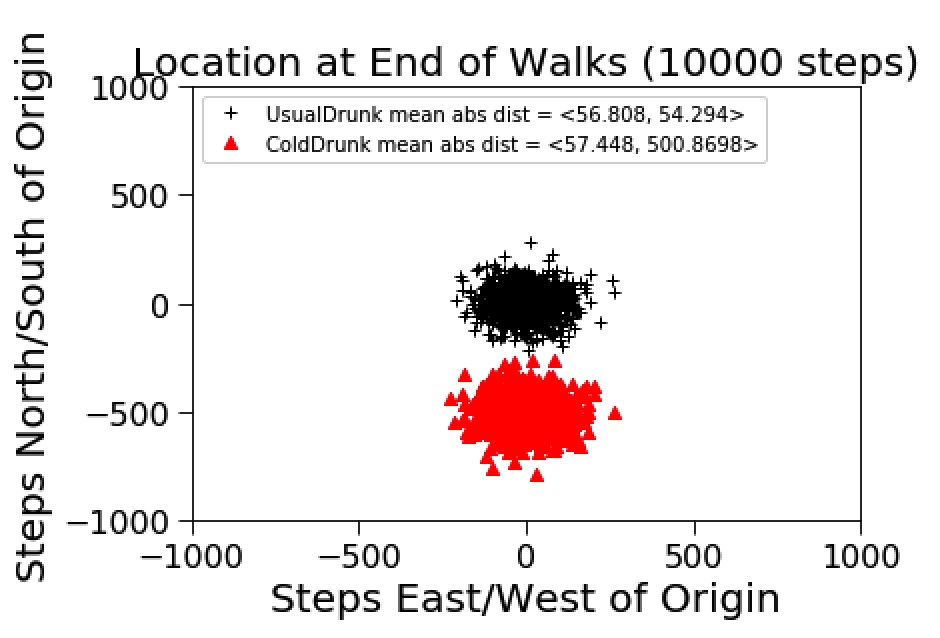

# Lecture 4-6

[TOC]

## Plotting

* Just an example.

```python
import pylab

pylab.figure('lin quad') # give a name to this figure
pylab.clf() # clean the figure, avoid overlapping
# mySample: X values
# myLinear/myQuadratic/myCubic/myExponential: Y values 
# b-/ro/g^/r-- : line's style. 
pylab.plot(mySamples, myLinear, 'b-', label = 'linear', linewidth = 2.0)
pylab.plot(mySamples, myQuadratic,'ro', label = 'quadratic', linewidth = 3.0)
pylab.legend(loc = 'upper left')
pylab.title('Linear vs. Quadratic')

pylab.figure('cube exp')
pylab.clf()
pylab.plot(mySamples, myCubic, 'g^', label = 'cubic', linewidth = 4.0)
pylab.plot(mySamples, myExponential, 'r--',label = 'exponential', linewidth = 5.0)
pylab.legend()
pylab.title('Cubic vs. Exponential')
``` 

* 

## Stochastic Programs

* A stochastic model is one in which randomness is present, and variable states are not described by unique values, but rather by **probability distributions**. The behavior of this model cannot be entirely predicted.
    * events are **independent** of each other
    * Probabilities are always in the range **0 to 1**. 0 if impossible, and 1 if guaranteed.
    * If the probability of an event occurring is **p**, the probability of it not occurring must be **1-p**.

## Random Walk 

* The reason we look at random walk is:
    * it is a good example of how to use abstract data types and inheritance to structure programs in general and simulations in particular.

### Defines

* Location
    * `x`, `y` : coordinates.
    * `move(deltaX, deltaY)`: move self with deltaX, deltaY
    * `getX()`, `getY()`
    * `distFrom(otherLocation)`: check the distance between current location with otherLocation
* Field
    * `drunks`: list of drunk objects
    * `addDrunk(drunk, loc)`: add a drunk with its location into Fields' `drunks`
    * `moveDrunk(drunk)`: move the drunk's `location`
    * `getLoc(drunk)`: get the drunk's `location`
* Drunk(object)
    * `name`: it's name
* UsualDrunk(Drunk)
    * `takeStep()`: move one step to left/right/up/down direction
* ColdDrunk(Drunk)
    * `takeStep()`: move two steps towards south, the others are the same with UsualDrunk

### Simulations

* try 10, 100, 1000, 10000 steps with UsualDrunk and ColdDrunk

```python
def walk(f, d, numSteps):
    """Assumes: f a Field, d a Drunk in f, and numSteps an int >= 0.
       Moves d numSteps times, and returns the distance between
       the final location and the location at the start of the 
       walk."""
    start = f.getLoc(d)
    for s in range(numSteps):
        f.moveDrunk(d)
    return start.distFrom(f.getLoc(d))
    
def simWalks(numSteps, numTrials, dClass):
    """Assumes numSteps an int >= 0, numTrials an int > 0,
         dClass a subclass of Drunk
       Simulates numTrials walks of numSteps steps each.
       Returns a list of the final distances for each trial"""
    Homer = dClass()
    origin = Location(0, 0)
    distances = []
    for t in range(numTrials):
        f = Field()
        f.addDrunk(Homer, origin)
        distances.append(round(walk(f, Homer, numSteps), 1))
    return distances

class styleIterator(object):
    def __init__(self, styles):
        self.index = 0
        self.styles = styles

    def nextStyle(self):
        result = self.styles[self.index]
        if self.index == len(self.styles) - 1:
            self.index = 0
        else:
            self.index += 1
        return result
    
def simDrunk(numTrials, dClass, walkLengths):
    meanDistances = []
    for numSteps in walkLengths:
        print('Starting simulation of',
              numSteps, 'steps')
        trials = simWalks(numSteps, numTrials, dClass)
        mean = sum(trials)/len(trials)
        meanDistances.append(mean)
    return meanDistances

def simAll(drunkKinds, walkLengths, numTrials):
    styleChoice = styleIterator(('m-', 'b--', 'g-.'))
    for dClass in drunkKinds:
        curStyle = styleChoice.nextStyle()
        print('Starting simulation of', dClass.__name__)
        means = simDrunk(numTrials, dClass, walkLengths)
        pylab.plot(walkLengths, means, curStyle,
                   label = dClass.__name__)
    pylab.title('Mean Distance from Origin ('
                + str(numTrials) + ' trials)')
    pylab.xlabel('Number of Steps')
    pylab.ylabel('Distance from Origin')
    pylab.legend(loc = 'best')

random.seed(0)
numSteps = (10,100,1000,10000)
simAll((UsualDrunk, ColdDrunk), numSteps, 100)
```



* plot every final locations

```python
def getFinalLocs(numSteps, numTrials, dClass):
    locs = []
    d = dClass()
    for t in range(numTrials):
        f = Field()
        f.addDrunk(d, Location(0, 0))
        for s in range(numSteps):
            f.moveDrunk(d)
        locs.append(f.getLoc(d))
    return locs

def plotLocs(drunkKinds, numSteps, numTrials):
    styleChoice = styleIterator(('k+', 'r^', 'mo'))
    for dClass in drunkKinds:
        locs = getFinalLocs(numSteps, numTrials, dClass)
        xVals, yVals = [], []
        for loc in locs:
            xVals.append(loc.getX())
            yVals.append(loc.getY())
        xVals = pylab.array(xVals)
        yVals = pylab.array(yVals)
        meanX = sum(abs(xVals))/len(xVals)
        meanY = sum(abs(yVals))/len(yVals)
        curStyle = styleChoice.nextStyle()
        pylab.plot(xVals, yVals, curStyle,
                      label = dClass.__name__ +\
                      ' mean abs dist = <'
                      + str(meanX) + ', ' + str(meanY) + '>')
    pylab.title('Location at End of Walks ('
                + str(numSteps) + ' steps)')
    pylab.ylim(-1000, 1000)
    pylab.xlim(-1000, 1000)
    pylab.xlabel('Steps East/West of Origin')
    pylab.ylabel('Steps North/South of Origin')
    pylab.legend(loc = 'upper left')

random.seed(0)
plotLocs((UsualDrunk, ColdDrunk), 10000, 1000)
```




* [complete code](https://github.com/erictt/computer-science-learning/blob/master/computational-thinking/unit-2/lecture6-segment3.py)

