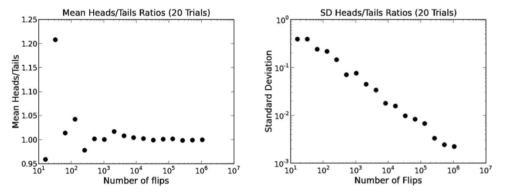
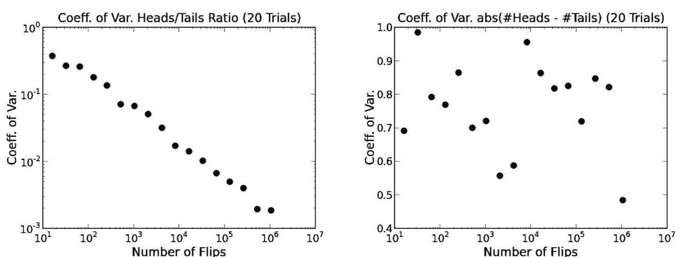

# Lecture 7

[TOC]

## Inferential Statistics

* Definition:
    * use simulations to estimate the value of an unknown quantity by making use of the principle of **inferential statistics**.
* Detail explanation
    * `Population`: a set of examples
    * `Sample`: a proper subset of a population
    * `Goal`: Estimate some statistic about the population based on statistics about the sample
    * `Key fact`: If the sample is **random**, it tends to exhibit the same properties as the population from which it is drawn
* **Law of Large Number**: In repeated independent experiments (e.g., flipping a fair coin 100 times and counting the fraction of heads) with the same expected value (0.5 in this case), the average value of the experiments approaches the expected value(平均值趋近于期望值) as the number of experiments goes to infinity.
    * **Gambler's Fallacy**: If deviations from expected behavior occur, these deviations are likely to be evened out by opposite deviations in the future.
        1. that “large” is a relative concept.
        2. the law of large numbers does not imply that the absolute difference between the number of heads and the number of tails decreases as the number of flips increases. In fact, we can expect that number to increase.
        3. What decreases is the ratio of the absolute difference to the number of flips.

### Simulation

#### The ratio heads/tails (the law of large number)
* How many samples do we need to look at before we can have justified confidence in our answer?
* **variance** is measure of how much spread there is in the possible different outcomes, which can help us to justify.
    *  $variance(X) = \frac{\sum_{x\in{X}}{(x-\mu)^{2}}}{\lvert{X}\rvert}$
* **standard deviation** tells us what fraction of the values are close to the mean. If many values are relatively close to the mean, the standard deviation is relatively small.
    *  $\sigma(X) = \sqrt{\frac{1}{\lvert{X}\rvert}\sum_{x\in{X}}{(x-\mu)^{2}}}$
        *  where |X| is the size of the collection and (  $\mu$) its mean.

        ```python
        def stdDev(X):
            """Assumes that X is a list of numbers.
                Returns the standard deviation of X"""
            mean = float(sum(X))/len(X) 
            tot = 0.0 
            for x in X:
                tot += (x - mean)**2 
            return (tot/len(X))**0.5 #Square root of mean difference
        ```
* For example, flip coins exponentially, from 2^4 to 2^20, each times we flip 20 times to get the mean values with standard deviation function.

    ```python
    #Page 160, Figure 12.4
    def stdDev(X):
        """Assumes that X is a list of numbers.
           Returns the standard deviation of X"""
        mean = float(sum(X))/len(X)
        tot = 0.0
        for x in X:
            tot += (x - mean)**2
        return (tot/len(X))**0.5 #Square root of mean difference
    
    #Page 161, Figure 12.5
    def makePlot(xVals, yVals, title, xLabel, yLabel, style,
                 logX = False, logY = False):
        """Plots xVals vs. yVals with supplied titles and labels."""
        pylab.figure()
        pylab.title(title)
        pylab.xlabel(xLabel)
        pylab.ylabel(yLabel)
        pylab.plot(xVals, yVals, style)
        if logX:
            pylab.semilogx()
        if logY:
            pylab.semilogy()
    
    def runTrial(numFlips):
        numHeads = 0
        for n in range(numFlips):
            if random.random() < 0.5:
                numHeads += 1
        numTails = numFlips - numHeads
        return (numHeads, numTails)
        
    def flipPlot1(minExp, maxExp, numTrials):
    """Assumes minExp and maxExp positive ints; minExp < maxExp
         numTrials a positive integer
       Plots summaries of results of numTrials trials of
         2**minExp to 2**maxExp coin flips"""
    ratiosMeans, diffsMeans, ratiosSDs, diffsSDs = [], [], [], []
    xAxis = []
    for exp in range(minExp, maxExp + 1):
        xAxis.append(2**exp)
    for numFlips in xAxis:
        ratios = []
        diffs = []
        for t in range(numTrials):
            numHeads, numTails = runTrial(numFlips)
            ratios.append(numHeads/float(numTails))
            diffs.append(abs(numHeads - numTails))
        ratiosMeans.append(sum(ratios)/float(numTrials))
        diffsMeans.append(sum(diffs)/float(numTrials))
        ratiosSDs.append(stdDev(ratios))
        diffsSDs.append(stdDev(diffs))
    numTrialsString = ' (' + str(numTrials) + ' Trials)'
    title = 'Mean Heads/Tails Ratios' + numTrialsString
    makePlot(xAxis, ratiosMeans, title,
             'Number of flips', 'Mean Heads/Tails', 'bo', logX = True)
    title = 'SD Heads/Tails Ratios' + numTrialsString
    makePlot(xAxis, ratiosSDs, title,
             'Number of Flips', 'Standard Deviation', 'bo',
             logX = True, logY = True)
    
    flipPlot1(4, 20, 20)
    ```
    
    

    * The ratio heads/tails is converging towards 1 and log of standard deviation is falling linearly with the log of the number of flips per trail. 
    * By the time we get to about 10^6 coin flips per trail, the standard deviation is roughly three decimal orders of magnitude smaller than the mean. 
    * As we flip more coins, not only do we have a more precise answer, but more important, we also have reason to be more confident that it is close to the right answer.

#### The absolute difference between heads and tails (gambler's fallacy)

* **coefficient of variation** is the standard deviation divided by the mean.
    
    ```python
    #Page 163, Figure 12.7
    def CV(X):
        mean = sum(X)/float(len(X))
        try:
            return stdDev(X)/mean
        except ZeroDivisionError:
            return float('nan')
   
    #Page 164, Figure 12.8
    def flipPlot1(minExp, maxExp, numTrials):
    """Assumes minExp and maxExp positive ints; minExp < maxExp
         numTrials a positive integer
       Plots summaries of results of numTrials trials of
         2**minExp to 2**maxExp coin flips"""
    ratiosMeans, diffsMeans, ratiosSDs, diffsSDs = [], [], [], []
    ratiosCVs, diffsCVs = [], []
    xAxis = []
    for exp in range(minExp, maxExp + 1):
        xAxis.append(2**exp)
    for numFlips in xAxis:
        ratios = []
        diffs = []
        for t in range(numTrials):
            numHeads, numTails = runTrial(numFlips)
            ratios.append(numHeads/float(numTails))
            diffs.append(abs(numHeads - numTails))
        ratiosMeans.append(sum(ratios)/float(numTrials))
        diffsMeans.append(sum(diffs)/float(numTrials))
        ratiosSDs.append(stdDev(ratios))
        diffsSDs.append(stdDev(diffs))
        ratiosCVs.append(CV(ratios))
        diffsCVs.append(CV(diffs))
    numTrialsString = ' (' + str(numTrials) + ' Trials)'
    title = 'Mean Heads/Tails Ratios' + numTrialsString
    makePlot(xAxis, ratiosMeans, title,
             'Number of flips', 'Mean Heads/Tails', 'bo', logX = True)
    title = 'SD Heads/Tails Ratios' + numTrialsString
    makePlot(xAxis, ratiosSDs, title,
             'Number of Flips', 'Standard Deviation', 'bo',
             logX = True, logY = True)
    title = 'Mean abs(#Heads - #Tails)' + numTrialsString
    makePlot(xAxis, diffsMeans, title,
         'Number of Flips', 'Mean abs(#Heads - #Tails)', 'bo',
         logX = True, logY = True)
    title = 'SD abs(#Heads - #Tails)' + numTrialsString
    makePlot(xAxis, diffsSDs, title,
         'Number of Flips', 'Standard Deviation', 'bo',
         logX = True, logY = True)
    title = 'Coeff. of Var. abs(#Heads - #Tails)' + numTrialsString
    makePlot(xAxis, diffsCVs, title, 'Number of Flips',
             'Coeff. of Var.', 'bo', logX = True)
    title = 'Coeff. of Var. Heads/Tails Ratio' + numTrialsString
    makePlot(xAxis, ratiosCVs, title, 'Number of Flips',
             'Coeff. of Var.', 'bo', logX = True, logY = True)
    ```

    
    
    * the plot of coefficient of variation for the heads/tails ratio is not much different from the plot of the standard deviation, cause the mean is close to 1.
    * **dispersion** in the values of `abs(heads – tails)` is independent of the number of flips.

## Words

* The Law of Large Number 大数定律
* Gambler’s Fallacy 赌徒谬误


