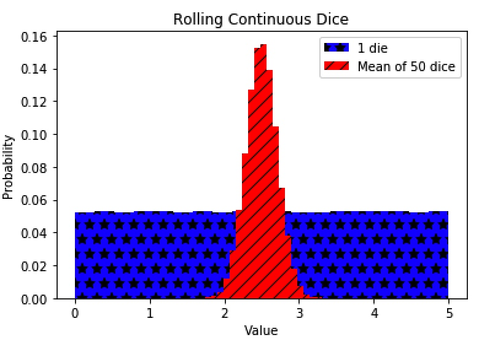
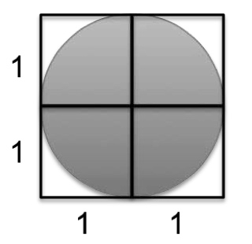

# Lecture 8

[TOC]

## The Central Limit Theorem (CLT)
* Given a sufficiently large sample:
    1. The means of the samples in a set of samples (the sample means) will be approximately normally distributed,
    2. This normal distribution will have a mean close to the mean of the population, and
    3. The variance of the sample means (  $\sigma_{\bar{x}}^2$) will be close to the variance of the population (  $\sigma^2$) divided by the sample size (N).
        *  $\sigma_{\bar{x}}^2=\frac{\sigma^2}{N}$
        *  $\sigma_{\bar{x}}=\frac{\sigma}{\sqrt{N}}$
        * Standard Error of the Mean is: the standard deviation of the sampling distribution of the sample mean.
        * Reference: [Khan Academy](https://www.khanacademy.org/math/statistics-probability/sampling-distributions-library/sample-means/v/central-limit-theorem)

* A sample to prove: point 1 and point 2.

    ```python
    import random, pylab

    def getMeanAndStd(vals):
        mean = sum(vals)/float(len(vals))
        std = (sum([(x-mean)**2 for x in vals])/len(vals))**0.5
        return (mean, std)
    
    def plotMeans(numDice, numRolls, numBins, legend, color, style):
    
        means = []
        for i in range(numRolls//numDice):
            vals = 0
            for j in range(numDice):
                vals += 5*random.random()
            means.append(vals/float(numDice))
        
        pylab.hist(means, numBins, color = color, label = legend,
                   weights = pylab.array(len(means)*[1])/len(means),
                   hatch = style)
        
        return getMeanAndStd(means)
    
    mean, std = plotMeans(1, 1000000, 19, '1 die', 'b', '*')
    print('Mean of rolling 1 die =', str(mean) + ',', 'Std =', std)
    
    mean, std = plotMeans(50, 1000000, 19, 'Mean of 50 dice', 'r', '//')
    print('Mean of rolling 50 dice =', str(mean) + ',', 'Std =', std)
    
    pylab.title('Rolling Continuous Dice')
    pylab.xlabel('Value')
    pylab.ylabel('Probability')
    pylab.legend()
    ```
    
    
    
    * Conclusion:
        * It doesn’t matter what the shape of the distribution of values happens to be
        * If we are trying to estimate the mean of a population using sufficiently large samples
        * The CLT allows us to use the empirical rule when computing confidence intervals

## Monte Carlo Simulation

### Finding π

* Think about inscribing a circle in a square with sides of length 2, so that the radius, r, of the circle is of length 1. (Invented by the French mathematicians Buffon (17071788) and Laplace (1749-1827))
    * 
    * By the definition of π, area = πr^2 . Since r is 1, π = area.
    * If the locations of the needles are truly random, we know that,
        *  $\frac{needles\ in\ circle}{needles\ in\ square}=\frac{area\ of\ circle}{area\ of\ square}$
    * solving for the area of the circle,
       *  $area\ of\ circle = \frac{area\ of\ sqaure\ *\ needles\ in\ circle}{needles\ in\ square}$
    * Recall that the area of a 2 by 2 square is 4, so,
        *  $area\ of\ circle = \frac{4 *\ needles\ in\ circle}{needles\ in\ square}$
        * in this case $area\ of\ circle = {\pi}r^2$, and r=1, so:
            *  $\pi = \frac{4 *\ needles\ in\ circle}{needles\ in\ square}$
    
    ```python
    import random

    def getMeanAndStd(data):
        mean = sum(data)/float(len(data))
        std = (sum([(d-mean)**2 for d in data])/len(data))**0.5
        return (mean, std)
    
    def throwNeedls(numNeedles):
        inCircle = 0;
        for needle in range(numNeedles):
            if (random.random()**2 + random.random()**2)**0.5 <= 1.0:
                inCircle+=1
        return 4*inCircle/numNeedles
    
    def getEst(numNeedles, numTrails):
        estPis = []
        for t in range(numTrails):
            estPis.append(throwNeedls(numNeedles))
        return getMeanAndStd(estPis)
    
    # we want 95% (an arbitrary choice of accuracy) confidence interval 
    # 95% => 0.95 => 0.475*2
    # check the z-table 0.475 => 1.96 std
    # so we are looking for 1.96 std less that precision
    # z-table: https://en.wikipedia.org/wiki/Standard_normal_table
    def estPi(precision, numTrails):
        numNeedles = 1000
        std = precision
        while(std >= precision/1.96):
            mean, std = getEst(numNeedles, numTrails)
            print("Mean="+str(mean)+", Std="+str(round(std, 6))+", Needls="+str(numNeedles))
            numNeedles *= 2 
            
    random.seed(0)
    estPi(0.005, 100)
    ```
    
    * In general, to estimate the area of some region R

        1. Pick an enclosing region, E, such that the area of E is easy to calculate and R lies completely within E.
        2. Pick a set of random points that lie within E.
        3. Let F be the fraction of the points that fall within R.
        4. Multiply the area of E by F.


