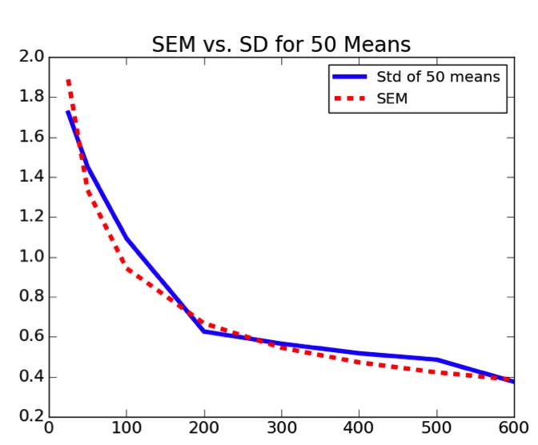
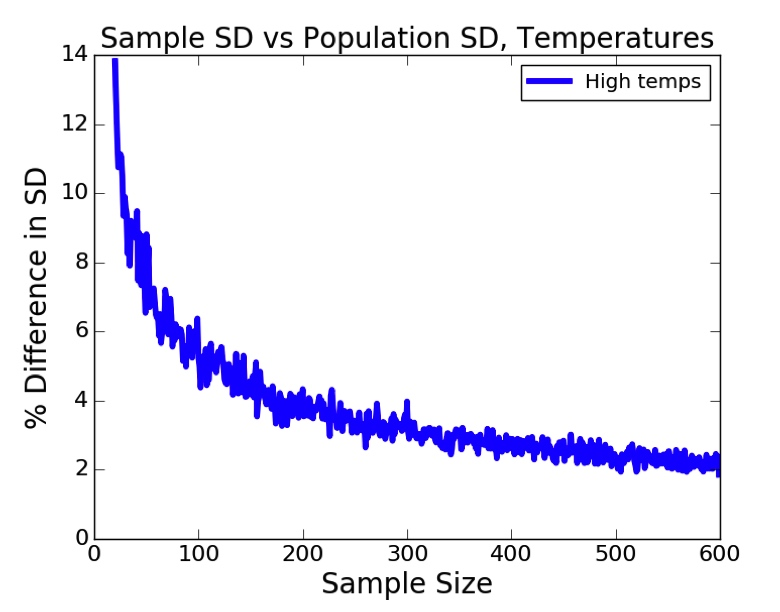
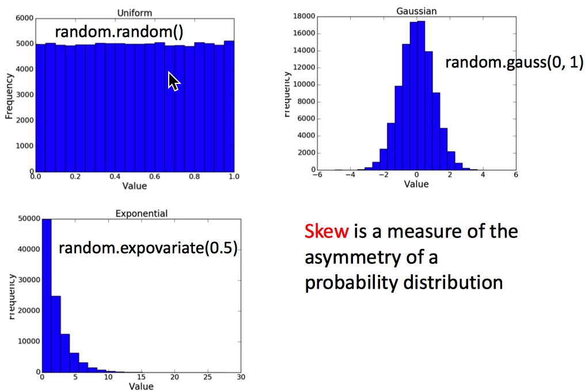
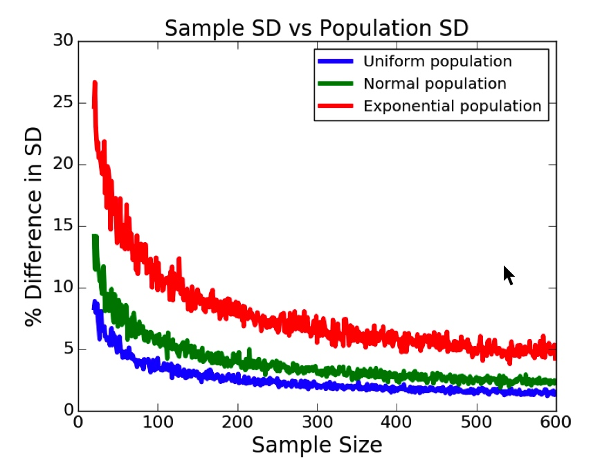
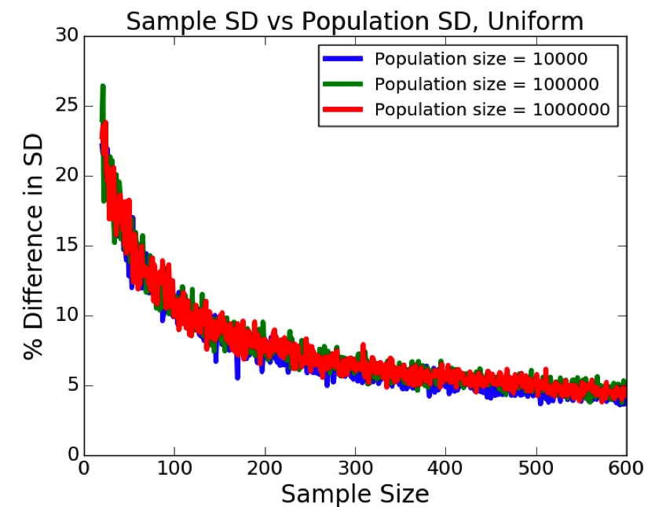

# Lecture 9

[TOC]
 
## Sampling and Standard Error

### Stratified Sampling
* Partition population into subgroups
* Take a simple random sample from each subgroup
* When need to use:
    * There are small subgroups that should be represented
    * It is important that subgroups be represented proportionally to their size in the population
    * Can be used to reduced the needed size of sample

#### For example (Predicting Temperatures in the U.S.)
* Data:
   * From U.S. National Centers for Environmental Information (NCEI)
   * 21 different US cities
       * ALBUQUERQUE, BALTIMORE, BOSTON, CHARLOTTE, CHICAGO, DALLAS, DETROIT, LAS VEGAS, LOS ANGELES, MIAMI, NEW ORLEANS, NEW YORK, PHILADELPHIA, PHOENIX, PORTLAND, SAN DIEGO, SAN FRANCISCO, SAN JUAN, SEATTLE, ST LOUIS, TAMPA
  * 1961 – 2015
  * 421,848 data points (examples)
       
* First, fetch 100 random samples, get the standard deviation and mean:
    
```python
def makeHist(data, title, xlabel, ylabel, bins = 20):
   pylab.hist(data, bins = bins)
   pylab.title(title)
   pylab.xlabel(xlabel)
   pylab.ylabel(ylabel)

def getHighs():
   inFile = open('temperatures.csv')
   population = []
   for l in inFile:
       try:
           tempC = float(l.split(',')[1])
           population.append(tempC)
       except:
           continue
   return population
    
def getMeansAndSDs(population, sample, verbose = False):
   popMean = sum(population)/len(population)
   sampleMean = sum(sample)/len(sample)
   if verbose:
       makeHist(population,
                'Daily High 1961-2015, Population\n' +\
                '(mean = '  + str(round(popMean, 2)) + ')',
                'Degrees C', 'Number Days')
       pylab.figure()
       makeHist(sample, 'Daily High 1961-2015, Sample\n' +\
                '(mean = ' + str(round(sampleMean, 2)) + ')',
                'Degrees C', 'Number Days')   
       print('Population mean =', popMean)
       print('Standard deviation of population =',
             numpy.std(population))
       print('Sample mean =', sampleMean)
       print('Standard deviation of sample =',
             numpy.std(sample))
   return popMean, sampleMean,\
          numpy.std(population), numpy.std(sample)
    
random.seed(0)         
population = getHighs()
sample = random.sample(population, 100)
getMeansAndSDs(population, sample, True)
```

* Result:
   
   ```
   Population mean = 16.298769461986048
   Standard deviation of population = 9.4375585448
   Sample mean = 17.0685
   Standard deviation of sample = 10.390314372
   ```
   
   

* Try it 1000 times and plot the results

```python
random.seed(0) 
population = getHighs()
sampleSize = 100
numSamples = 1000
maxMeanDiff = 0
maxSDDiff = 0
sampleMeans = []
for i in range(numSamples):
   sample = random.sample(population, sampleSize)
   popMean, sampleMean, popSD, sampleSD =\
      getMeansAndSDs(population, sample, verbose = False)
   sampleMeans.append(sampleMean)
   if abs(popMean - sampleMean) > maxMeanDiff:
       maxMeanDiff = abs(popMean - sampleMean)
   if abs(popSD - sampleSD) > maxSDDiff:
       maxSDDiff = abs(popSD - sampleSD)
print('Mean of sample Means =',
     round(sum(sampleMeans)/len(sampleMeans), 3))
print('Standard deviation of sample means =',
     round(numpy.std(sampleMeans), 3))
print('Maximum difference in means =',
     round(maxMeanDiff, 3))
print('Maximum difference in standard deviations =',
     round(maxSDDiff, 3))
makeHist(sampleMeans, 'Means of Samples', 'Mean', 'Frequency')
pylab.axvline(x = popMean, color = 'r')
```
    
* Result:

   ```
   Mean of sample Means = 16.282
   Standard deviation of sample means = 0.662
   Maximum difference in means = 2.52
   Maximum difference in standard deviations = 1.281
   ```
   
   

* To get a tighter bound, we tried:
    * drawing 2000 samples instead of 1000,
        * doesn't change too much
    * or increasing sample size from 100 to 200
        * Standard deviation of sample means drops from 0.94 to 0.66

* Then use `pylab.errorbar()` function to plot different sample sizes [50, 100, 200, 300, 400, 500, 600]:
    
    ```python
    pylab.errorbar(xVals, sizeMeans, \
        yerr = 1.96*pylab.array(sizeSDs), \
        fmt = 'o', label = '95% Confidence Interval')
    ```

    

* Result:
    * Going from a sample size of 100 to 400 reduced the confidence interval from 1.8C to about 1C.

#### Conclusion

* Bigger sample size will always be better.    

### Standard Error

* **Standard Error of the Mean** is the standard deviation of the sampling distribution of the sample mean.
* to prove the third point of [CLT](lecture-8.md#the-central-limit-theorem-clt)
    * The variance of the sample means (\\(\sigma_{\bar{x}}^2\\)) will be close to the variance of the population (\\(\sigma^2\\)) divided by the sample size (N).
       * \\(\sigma_{\bar{x}}=\frac{\sigma}{\sqrt{N}}\\)
* In the end of [Stratified Sampling](#stratified-sampling), we talked about plotting different sample sizes.

#### Test the SEM(Standard Error of the Mean)

```python
def sem(popSD, sampleSize):
   return popSD/sampleSize**0.5
    
sampleSizes = (25, 50, 100, 200, 300, 400, 500, 600)
numTrials = 50
population = getHighs()
popSD = numpy.std(population)
sems = []
sampleSDs = []
for size in sampleSizes:
   sems.append(sem(popSD, size))
   means = []
   for t in range(numTrials):
       sample = random.sample(population, size)
       means.append(sum(sample)/len(sample))
   sampleSDs.append(numpy.std(means)) # calculate the standard deviation of the means of random samples from population
pylab.plot(sampleSizes, sampleSDs,
          label = 'Std of 50 means')
pylab.plot(sampleSizes, sems, 'r--', label = 'SEM')
pylab.title('SEM vs. SD for 50 Means')
pylab.legend()
```



* the SEM is very close to the Standard Deviation of Population

    
#### Compare Sample Standard Deviation

* compare the differences between the Standard Deviation of Sample(**NOT Standard Error of the Means**) and the Standard Deviation of the Population:

```python
def getDiffs(population, sampleSizes):
   popStd = numpy.std(population)
   diffsFracs = []
   for sampleSize in sampleSizes:
       diffs = []
       for t in range(100):
           sample = random.sample(population, sampleSize)
           diffs.append(abs(popStd - numpy.std(sample))) # single sample
       diffMean = sum(diffs)/len(diffs)
       diffsFracs.append(diffMean/popStd)
   return pylab.array(diffsFracs)*100
   
def plotDiffs(sampleSizes, diffs, title, label):
   pylab.plot(sampleSizes, diffs, label = label)
   pylab.xlabel('Sample Size')
   pylab.ylabel('% Difference in SD')
   pylab.title(title)
   pylab.legend()
    
sampleSizes = range(20, 600, 1)
diffs = getDiffs(getHighs(), sampleSizes)
plotDiffs(sampleSizes, diffs,
         'Sample SD vs Population SD, Temperatures',
         label = 'High temps')
```
    

    
* Once sample reaches a reasonable size, **Sample Standard Deviation** is a pretty good approximation to **Population Standard Deviation**

#### Questions
* Does the Distribution of Population matter?
    * Try Three Different Distributions: Uniform, Gaussian and Exponential
    * 

    ```python
    def compareDists():
        uniform, normal, exp = [], [], []
        for i in range(100000):
            uniform.append(random.random())
            normal.append(random.gauss(0, 1))
            exp.append(random.expovariate(0.5))
        sampleSizes = range(20, 600, 1)
        udiffs = getDiffs(uniform, sampleSizes)
        ndiffs = getDiffs(normal, sampleSizes)
        ediffs = getDiffs(exp, sampleSizes)
        plotDiffs(sampleSizes, udiffs,
                  'Sample SD vs Population SD',
                  'Uniform population')
        plotDiffs(sampleSizes, ndiffs,
                  'Sample SD vs Population SD',
                  'Normal population')
        plotDiffs(sampleSizes, ediffs,
                  'Sample SD vs Population SD',
                  'Exponential population')
    
    compareDists()  
    ```
    
    

    * Conclusion
        * It does. Different Distribution of Population has different differences.

* Does Population Size Matter?

    ```python
    popSizes = (10000, 100000, 1000000)
    sampleSizes = range(20, 600, 1)
    for size in popSizes:
        population = []
        for i in range(size):
            population.append(random.expovariate(0.5))
        ediffs = getDiffs(population, sampleSizes)
        plotDiffs(sampleSizes, ediffs,
                  'Sample SD vs Population SD, Uniform',
                  'Population size = ' + str(size))
    ```
    
    
    
    * Conclusion
        * It doesn't. Different Population Size has almost the same  differences.

#### Conclusion (To Estimate Mean from a Single Sample)

* **Prerequisite**: independent random samples
    
1. Choose sample size based on estimate of skew in population
    * `skew`: A distribution is skewed if one tail extends out further than the other. A distribution has a positive skew (is skewed to the right) if the tail to the right is longer. It has a negative skew (skewed to the left) if the tail to the left is longer.
2. Chose a random sample from the population
3. Compute the mean and standard deviation of that sample
4. Use the standard deviation of that sample to estimate the SE (**NOT SEM**)
    * \\(SE_{\bar{x}}=\frac{s}{\sqrt{n}}\\)
    * where
        * `s` is the sample standard deviation (i.e., the sample-based estimate of the standard deviation of the population), and
        * `n` is the size (number of observations) of the sample.
5. Use the estimated SE to generate confidence intervals around the sample mean

#### Test the Conclusion

* Are 200 Samples Enough?

    ```python
    random.seed(0)
    temps = getHighs()
    popMean = sum(temps)/len(temps)
    sampleSize = 200 # conclusion(1.)
    numTrials = 10000
    numBad = 0
    for t in range(numTrials):
        sample = random.sample(temps, sampleSize) # conclusion(2.)
        sampleMean = sum(sample)/sampleSize # conclusion(3.)
        se = numpy.std(sample)/sampleSize**0.5 # conclusion(4.)
        if abs(popMean - sampleMean) > 1.96*se: # 1.96 is a confidence level of 95%
            numBad += 1
    print('Fraction outside 95% confidence interval =',
          numBad/numTrials)
    ```
    
    * Result:
        * Fraction outside 95% confidence interval = 0.0511
    * Conclusion:
        * It is enough for estimate the average temperatures in the U.S

* What if we use continuous 200 samples ?

    ```python
    for t in range(numTrials):
        posStartingPts = range(0, len(temps) - sampleSize)
        start = random.choice(posStartingPts)
        sample = temps[start:start+sampleSize]
        sampleMean = sum(sample)/sampleSize
        se = numpy.std(sample)/sampleSize**0.5
        if abs(popMean - sampleMean) > 1.96*se: 
            numBad += 1
    print('Fraction outside 95% confidence interval =',
          numBad/numTrials)
    ```
    
    * Result:
        * Fraction outside 95% confidence interval = 0.9367
    * Conclusion:
       * we have violated a key assumptions.
       * we did **NOT** choose independent random samples
           * Data organized by city
           * Temperatures correlated with city
           * Therefore examples in sample are not independent of each other
           * Obvious here, but can be subtle

* Conclusion for the last two tests
    * All theoretical results incorporate some assumptions
    * These must be checked before applying the theory!

