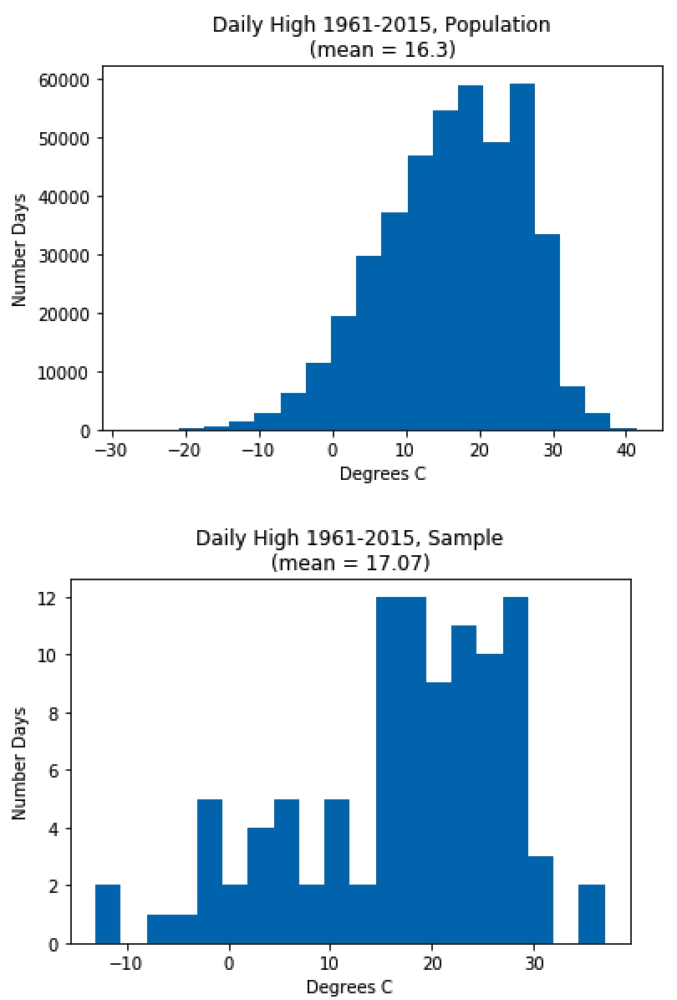
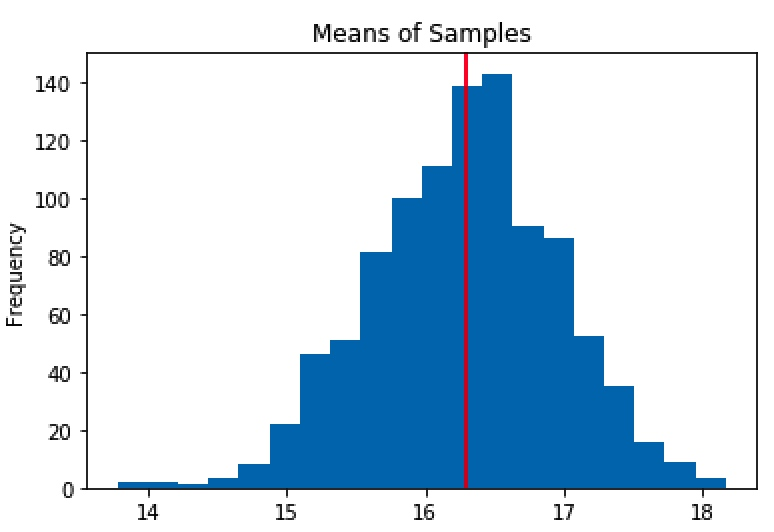
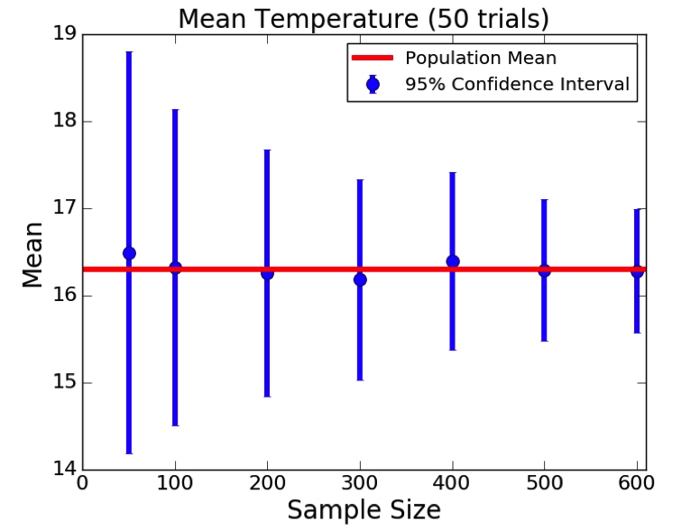

# Lecture 9

[TOC]
 
## Sampling and Standard Error

### Stratified Sampling
* Partition population into subgroups
* Take a simple random sample from each subgroup
* When:
    * There are small subgroups that should be represented
    * It is important that subgroups be represented proportionally to their size in the population
    * Can be used to reduced the needed size of sample

#### For example (Predicting Temperatures in the U.S.)
* Data:
   * From U.S. National Centers for Environmental Information (NCEI)
   * 21 different US cities
       * ALBUQUERQUE, BALTIMORE, BOSTON, CHARLOTTE, CHICAGO, DALLAS, DETROIT, LAS VEGAS, LOS ANGELES, MIAMI, NEW ORLEANS, NEW YORK, PHILADELPHIA, PHOENIX, PORTLAND, SAN DIEGO, SAN FRANCISCO, SAN JUAN, SEATTLE, ST LOUIS, TAMPA
  * 1961 – 2015
  * 421,848 data points (examples)
       
* First, fetch 100 random samples, get the standard deviation and mean:
    
```python
def makeHist(data, title, xlabel, ylabel, bins = 20):
   pylab.hist(data, bins = bins)
   pylab.title(title)
   pylab.xlabel(xlabel)
   pylab.ylabel(ylabel)

def getHighs():
   inFile = open('temperatures.csv')
   population = []
   for l in inFile:
       try:
           tempC = float(l.split(',')[1])
           population.append(tempC)
       except:
           continue
   return population
    
def getMeansAndSDs(population, sample, verbose = False):
   popMean = sum(population)/len(population)
   sampleMean = sum(sample)/len(sample)
   if verbose:
       makeHist(population,
                'Daily High 1961-2015, Population\n' +\
                '(mean = '  + str(round(popMean, 2)) + ')',
                'Degrees C', 'Number Days')
       pylab.figure()
       makeHist(sample, 'Daily High 1961-2015, Sample\n' +\
                '(mean = ' + str(round(sampleMean, 2)) + ')',
                'Degrees C', 'Number Days')   
       print('Population mean =', popMean)
       print('Standard deviation of population =',
             numpy.std(population))
       print('Sample mean =', sampleMean)
       print('Standard deviation of sample =',
             numpy.std(sample))
   return popMean, sampleMean,\
          numpy.std(population), numpy.std(sample)
    
random.seed(0)         
population = getHighs()
sample = random.sample(population, 100)
getMeansAndSDs(population, sample, True)
```

* Result:
   
   ```
   Population mean = 16.298769461986048
   Standard deviation of population = 9.4375585448
   Sample mean = 17.0685
   Standard deviation of sample = 10.390314372
   ```
   
   

* Try it 1000 times and plot the results

```python
random.seed(0) 
population = getHighs()
sampleSize = 100
numSamples = 1000
maxMeanDiff = 0
maxSDDiff = 0
sampleMeans = []
for i in range(numSamples):
   sample = random.sample(population, sampleSize)
   popMean, sampleMean, popSD, sampleSD =\
      getMeansAndSDs(population, sample, verbose = False)
   sampleMeans.append(sampleMean)
   if abs(popMean - sampleMean) > maxMeanDiff:
       maxMeanDiff = abs(popMean - sampleMean)
   if abs(popSD - sampleSD) > maxSDDiff:
       maxSDDiff = abs(popSD - sampleSD)
print('Mean of sample Means =',
     round(sum(sampleMeans)/len(sampleMeans), 3))
print('Standard deviation of sample means =',
     round(numpy.std(sampleMeans), 3))
print('Maximum difference in means =',
     round(maxMeanDiff, 3))
print('Maximum difference in standard deviations =',
     round(maxSDDiff, 3))
makeHist(sampleMeans, 'Means of Samples', 'Mean', 'Frequency')
pylab.axvline(x = popMean, color = 'r')
```
    
* Result:

   ```
   Mean of sample Means = 16.282
   Standard deviation of sample means = 0.662
   Maximum difference in means = 2.52
   Maximum difference in standard deviations = 1.281
   ```
   
   

* To get a tighter bound, we tried:
    * drawing 2000 samples instead of 1000,
        * doesn't change too much
    * or increasing sample size from 100 to 200
        * Standard deviation of sample means drops from 0.94 to 0.66

* Then use `pylab.errorbar()` function to plot different sample sizes [50, 100, 200, 300, 400, 500, 600]:
    
    ```python
    pylab.errorbar(xVals, sizeMeans, \
        yerr = 1.96*pylab.array(sizeSDs), \
        fmt = 'o', label = '95% Confidence Interval')
    ```

    

* Result:
    * Going from a sample size of 100 to 400 reduced the confidence interval from 1.8C to about 1C.

#### Conclude

* Bigger sample size will always be better.    

### Standard Error

* to prove the third point of CLT
    * The variance of the sample means (\\(\sigma_{\bar{x}}^2\\)) will be close to the variance of the population (\\(\sigma^2\\)) divided by the sample size (N). Check [lecture-8](lecture-8.md#the-central-limit-theorem-clt) for more detail.

