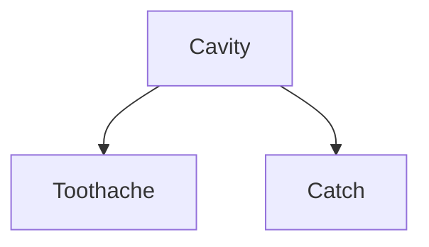
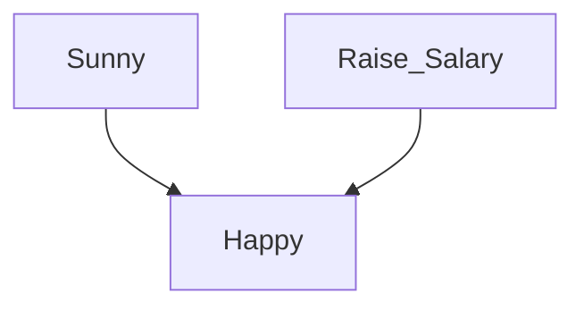
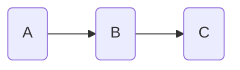
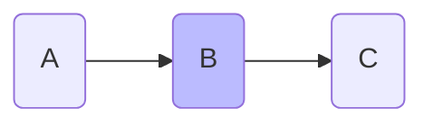
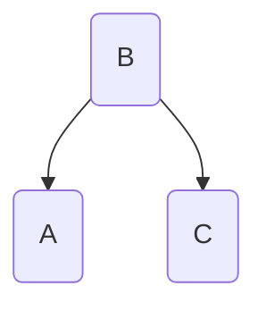
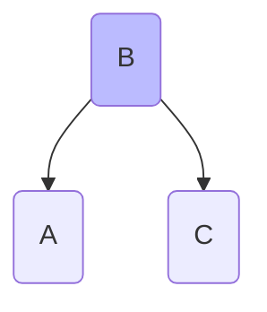
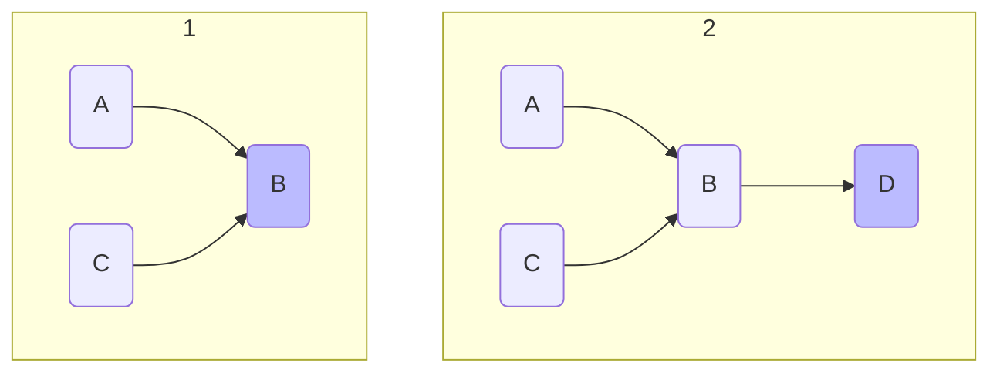
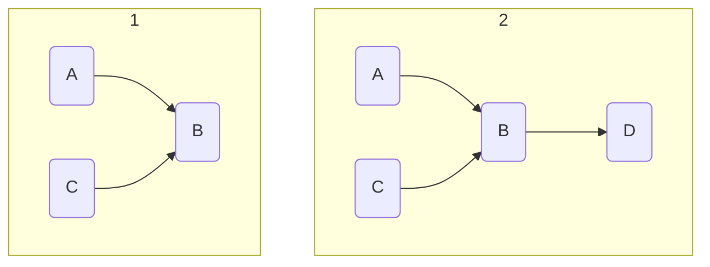
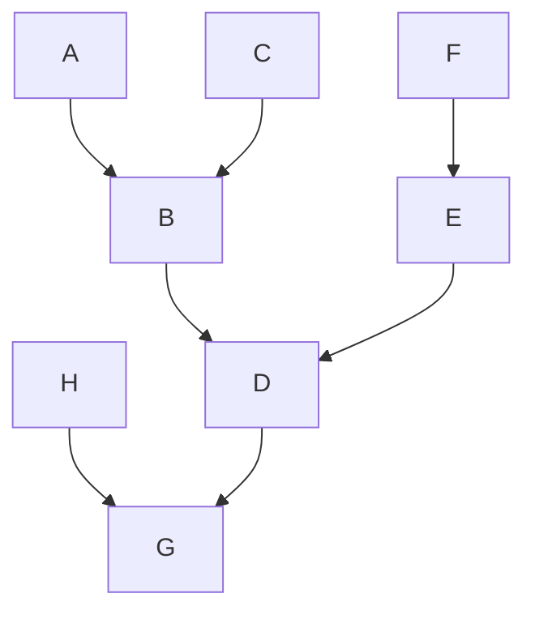
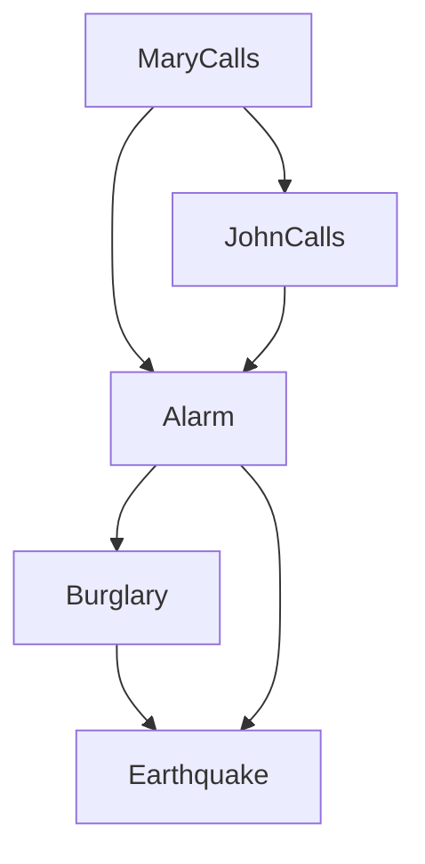

# Bayes' Network

##  Basic Probability Notation

- **Event Probability**: $P(A)$ denotes the probability of event $A$ occurring.
- **Complementary Event**: $P(A^c)$ or $P(\neg A)$ represents the probability that event $A$ does not occur.
- **Joint Probability**: $P(A \cap B)$ or $P(A, B)$ denotes the probability of both events $A$ and $B$ occurring simultaneously.
- **Conditional Probability**: $P(A|B)$ represents the probability of event $A$ occurring given that event $B$ has occurred.
- **Union Probability**: $P(A \cup B)$ denotes the probability that either event $A$, event $B$, or both occur.

## Rules and Theorem

- **Addition Rule**: $P(A \cup B) = P(A) + P(B) - P(A \cap B)$
- **Marginal Probability** is often simply called the marginal. the probability of a single event occurring without reference to any other events.
	- Suppose you have a deck of cards, 
		- the marginal probability of drawing an Ace: $P(Ace)=4/52​$
		- the marginal probability of drawing a Red card: $P(Red) = 26/52$(heart or diamond)
- **Independence($A \perp B$) of Two Events**: In the context of a **joint probability table**(JPT), each cell (other than the marginals) represents a joint probability.
	- If $A$ and $B$ are **independent**:
		- $P(A \cap B) = P(A) \times P(B)$ <-- **Multiplication Rule**
	- If **not independent**:
		- $P(A \cap B) = P(A|B) \times P(B)$
		- or $P(A \cap B) = P(B|A) \times P(A)$
	- First example:
		* The probability of drawing a Red Ace: $P(Ace, Red) = 2/52$ because there are only two cards meet the criteria, and the value
			* $= P(Ace) \times P(Red) = 4/52 \times 26/52 = 2/52$
		* Thus, being an Ace and being Red are **independent**.
		* In other words, being Ace doesn't affect the probability of being Red.
	* Second example:
		* When flipping a coin, **ASSUME** that the probability of getting heads at the first flip is 1/2: $P(X_1=H) = 1/2$, and the second flip is **dependent** to first flip and
			* $P(X_2 = H | X_1 = H) = 0.9$
			* $P(X_2 = T | X_1 = T) = 0.8$
		* Then
			* $P(X_2 = H) = P(X_2 = H | X_1 = H) \times P(X_1 = H) + P(X_2 = H | X_1 = T) \times P(X_1 = T)$
				* $= 0.9 * 0.5 + (1 - 0.8) * 0.5$
			* Because the second flip is dependent to the first flip.
* **Total Probability**: $P(Y) = \displaystyle\sum_{i}{P(Y|X=i)P(X=i)}$
	* When Y depends on X
* **Negation of Probability**: $P(\neg X | Y) = 1 - P(X|Y)$
- **Bayes' Theorem**: $P(A|B) = \frac{\color{red}{P(B|A)}\color{blue}{P(A)}}{P(B)}$
	- $P(A|B)$: the **posterior**
	- $P(B|A)$: the **likelihood**
	- $P(A)$: the **prior** probability of $A$ occurring.
	- $P(B)$: the marginal likelihood or the total probability of $B$ occurring.
		- $P(B) = \displaystyle\sum_{\alpha}{P(B|A=\alpha)P(A=\alpha)}$
	- For example, when a person underwent a cancer(C) screening test, and it comes back positive(+). What's the actual probability that this person has cancer?
		- Given that:
			- the prevalence of this cancer in general population is $P(C) = 0.01$ <- **prior probability**.
			- the test's accuracy:
				- If a person has cancer, there is a 99% chance the test will be positive $P(+|C) = 0.99$ <- **likelihood**.
				- If a person don't have cancer, there is 5% chance the test will still be positive(false positive): $P(+|\neg C) = 0.05$
		- With Bayes' Theorem:
			- $P(C|+) = \frac{P(+|C) \times P(C)}{P(+)} = \frac{0.99 \times 0.01}{0.0594} \approx 0.166$
				- $P(+) = P(+|C) \times P(C) + P(+|\neg C) \times P(\neg C) = 0.01×0.99+0.99×0.05 = 0.0594$
## Bayes' Network

**Bayesian Network**: A directed acyclic graph (DAG) where nodes represent random variables, and edges represent probabilistic dependencies between them.

Suppose we have a domain consisting of just the three Boolean variables **Toothache**, **Cavity**, and **Catch** (the dentist’s nasty steel probe catches in my tooth).

The full joint distribution:

The **marginal probability**: $P(cavity) = 0.108 +0.012+0.072+0.008 = 0.2$
The general marginalization rule for any **sets of variables** Y and Z:
- $P(Y) = \displaystyle{\sum_{z}{P(Y,Z=z)}}$
	- where $\sum_z$ sums over all of the possible combinations of values of the set of variables $Z$. $P(Y, Z=z)$ can be simplified as $P(Y,z)$

E.g.
$$
\begin{align}
P(Cavity) =& P(Cavity,toothache,catch)+P(Cavity,toothache,\neg catch) \\ 
&+ P(Cavity,\neg toothache,catch)+P(Cavity,\neg toothache,\neg catch) \\
=& ⟨0.108,0.016⟩ + ⟨0.012,0.064⟩ + ⟨0.072,0.144⟩ + ⟨0.008,0.576⟩\\
=& ⟨0.2,0.8⟩
\end{align}
$$
Using product rule to update the equation, we get **conditioning** rule:
- $P(Y) = \displaystyle{\sum_{z}{P(Y|z)P(z)}}$
$$
\begin{align}
P(cavity | toothache) &= \frac{P(cavity \land toothache)}{P(toothache)} \\
&= \frac{0.108 +0.012}{0.108 +0.012+0.016+0.064} \\
&= 0.6 \\
P(\neg cavity | toothache) &= \frac{P(\neg cavity \land toothache)}{P(toothache)} \\
&= \frac{0.016+0.064}{0.108+0.012+0.016+0.064} \\
&= 0.4 \\
\end{align}
$$

Notice that $P(toothache)$ is in the denominator for both calculation, and it can be viewed as a **normalization** constant $\alpha$  for the distribution $P(Cavity|toothache)$, ensuring that it adds up to 1:
$$
\begin{align}
P(Cavity | toothache) &= \alpha P(Cavity,toothache) \\
&= \alpha [⟨0.108,0.016⟩ + ⟨0.012,0.064⟩] \\
&= \alpha ⟨0.12,0.08⟩ \\
&= ⟨0.6,0.4⟩
\end{align}
$$
- In this case, we eliminated the denominator entirely, and only use the nominator from both $P(cavity|toothache)$ and $P(\neg cavity|toothache)$ and then normalize the sum-up probability to 1. In other worlds, we can calculate $P(Cavity|toothache)$ even if we don't know the value of $P(toothache)$.
From the example, we can extract a general inference procedure:
- $P(X|e) = \alpha P(X,e) = \alpha \displaystyle\sum_y{P(X,e,y)}$
	- **X** is the query(Cavity in the example)
	- **E** is a list of **evidence variables**(just Toothache in the example)
	- **Y** is the remaining unobserved variables(just Catch in the example)

Now let's recalculate $P(cavity | toothache)$ and $P(\neg cavity | toothache)$ with Bayes' rule.

$$
\begin{align}
P(cavity | toothache) &= \frac{P(toothache|cavity)P(cavity)}{P(toothache)} \\
P(\neg cavity | toothache) &= \frac{P(toothache| \neg cavity)P(\neg cavity)}{P(toothache)}
\end{align}
$$

The conditional probability $P(toothache | cavity)$ quantifies the relationship in the causal direction, whereas $P(cavity | toothache)$ describes the diagnostic direction. **In a task such as medical diagnosis, we often have conditional probabilities on causal relationships.** The doctor knows $P(symptoms | disease)$ and want to derive a diagnosis, $P(disease | symptoms)$.

Apply normalization to Bayes' rule, we get:
- $P(Y|X) = \alpha P(X|Y)P(Y)$, where
	- $\alpha$ is the normalization constant needed to make the entries in $P(Y|X)$ sum to 1.
	- Y and X are variable sets.
- In this case, we eliminate P(X) from the denominator.

What if we have multiple evidence? For example, $P(Cavity | toothache \land catch)$. Try with Bayes' rule to reformulate the problem:
- $P(Cavity | toothache \land catch) = \alpha P(toothache \land catch | Cavity) P(Cavity)$
For this reformulation to work, we need to know the conditional probabilities of the conjunction $toothache \land catch$ for each value of Cavity. It's not feasible when there are n possible evidence variables (X rays, diet, oral hygiene, etc.), aka  $O(2^n)$ conditional probabilities.

### Conditional independence and Absolute Independence

Toothache and Catch are not independent, but with given Cavity, they become independent, which is called **conditional independence**:
- $P(toothache \land catch | Cavity) = P(toothache | Cavity) P(catch | Cavity)$
Plug this into the formula above, we get:

$$
\begin{align}
P(Cavity | toothache \land catch) &= \alpha P(toothache \land catch | Cavity) P(Cavity) \\
&= \alpha P(toothache | Cavity) P(catch | Cavity) P(Cavity)
\end{align}
$$

**Now we use each piece of evidence separately.**
- Think about how complicate when calculating $P(toothache \land catch | Cavity)$ comparing $P(toothache | Cavity) P(catch | Cavity)$

The general definition of **conditional independence** of two vars X and Y, given a third var Z, is:
- $P(X, Y | Z) = P(X | Z) P(Y | Z)$
In our example, we can rewrite the formula: 
- $P(Toothache,Catch | Cavity) = P(Toothache | Cavity)P(Catch | Cavity)$
Another example:
$$
\begin{align}
P(toothache | catch) =& P(toothache | catch, cavity) P(cavity | catch) \\
&+ P(toothache | catch, \neg cavity) P(\neg cavity | catch) \\
=& P(toothache | cavity) P(cavity | catch) \\
&+ P(toothache | \neg cavity) P(\neg cavity | catch)
\end{align}
$$
- Given Cavity, Toothache and Catch are conditional independent.
As with **absolute independence** in equation, the equivalent forms
- $P(X | Y,Z)=P(X | Z)$ and $P(Y | X,Z)=P(Y | Z)$
	- Assume X and Y are absolute independent.

## Explaining Away

It is the phenomenon where the observation or evidence for one cause can reduce the probability of another cause, even if the two causes are independent of each other.

For example, Rain and Salary Rise can both cause Happy,

Given happy and sunny, the probability of salary raise is much lower than no knowing any of these.

Given the probabilities:
$$
\begin{align}
P(S) &= 0.7 \\
P(R) &= 0.01 \\
P(H|S, R) &= 1 \\
P(H|\neg S, R) &= 0.9 \\
P(H|S, \neg R) &= 0.7 \\
P(H|\neg S, \neg R) &= 0.1 \\
\end{align}
$$
Let's calculate the following:

$P(R|S) = \color{red}0.01$ 
- because R and S are absolute independent.

$$
\begin{align}
P(R|H, S) &= \frac{P(H|R,S)P(R|S)}{P(H|S)} \\
&= \frac{P(H|R,S)P(R)}{P(H|S,R)P(R) + P(H|S, \neg R)P(\neg R)} \\
&= \frac{1 \times 0.01}{1 \times 0.01 + 0.7 \times (1 - 0.01)} \\
&= \color{red}0.0412
\end{align}
$$

$$
\begin{align}
P(R|H, \neg S) &= \frac{P(H|R,\neg S)P(R|\neg S)}{P(H|\neg S)} \\
&= \frac{P(H|R,\neg S)P(R)}{P(H|\neg S,R)P(R) + P(H|\neg S, \neg R)P(\neg R)} \\
&= \frac{0.9 \times 0.01}{0.9 \times 0.01 + 0.1 \times (1 - 0.01)} \\
&= \color{red}0.0833
\end{align}
$$

$$
\begin{align}
P(R|H) =& \frac{P(H|R)P(R)}{P(H)} \\
P(H|R) =& P(H|R, S)P(S) + P(H|R, \neg S)P(\neg S) \\ 
P(H) =& P(H|R,S)P(R,S) + P(H|R,\neg S)P(R,\neg S) \\ 
	&+ P(H|\neg R,S)P(\neg R,S) + P(H|\neg R,\neg S)P(\neg R,\neg S) \\
	=& P(H|R,S)P(R)P(S) + P(H|R,\neg S)P(R)P(\neg S) \\ 
	&+ P(H|\neg R,S)P(\neg R)P(S) + P(H|\neg R,\neg S)P(\neg R)P(\neg S) \\
	=& \color{red}0.5245
\end{align}
$$
With the numbers:

$$
\begin{align}
&P(R|S) &= 0.01 \\
&P(R|H,S) &= 0.0412 \\
&P(R|H, \neg S) &= 0.0833 \\
&P(R|H) &= 0.4245
\end{align}
$$
we get:
- $R \perp S$: R and S are absolute independent.
- Without sunny, the chance of getting raise is much higher than with sunny.
- Given H, R and S are not independent anymore.
- Independence does NOT imply conditional independence! 
	- $P(R|S) = P(R)$
	- $P(R|H,S) \ne P(R|H)$

## D-separation

It stands for "directional separation". Given a Bayes' network, two sets of nodes X and Y are said to be d-separated by a third set Z if there's no **active trail** between any node in X and Y given Z. **If they are d-separated, X and Y are conditionally independent given Z.**
### Active and Inactive Trails:

An "active trail" between two nodes means that changes in one node can influence the other. D-separation essentially checks **if there's any active trail between two sets of nodes when a third set is observed.** The status of a trail (active or inactive) is determined by three basic structures in the graph:

1. **Causal Trail (Chain)**: A→B→C
- Active when no node is observed.

- Inactive when the middle node **B is observed**.

2. **Common Cause (Fork)**: A←B→C
- Active when no node is observed.

- Inactive when the middle node **B is observed**.

3. **Common Effect (V-structure or Collider)**: A→B←C

- Active when the middle node B or one of its descendants is observed.

- Inactive when no node is observed.

Example:

Are F and A independent?

| - | Yes | No | reason |
| -- | -- | -- | -- |
| $F \perp A$ | [X] | [] | inactive V-structure |
| $F \perp A$ | [X] | [] | inactive V-structure |
| $F \perp A \vert D$ | [ ] | [X] | active V-structure |
| $F \perp A \vert G$ | [ ] | [X] | active V-structure |
| $F \perp A \vert H$ | [X] | [] | inactive V-structure |

## Inference in Bayes' Network

Suppose we decide to add the nodes in the order **MaryCalls**, **JohnCalls**, **Alarm**, **Burglary**, **Earthquake**. We then get the somewhat more complicated network:

The process goes as follows:
- Adding MaryCalls.
- Add JohnCalls. If Mary calls, that probably means the alarm has gone off, which make it likely that John calls. Therefore, JohnCalls needs MaryCalls as a parent.
- Adding Alarm. Both John and Mary can trigger the alarm.
- Adding Burglary: If the alarm is on, then Burglary is likely to happen. The calls from Mary/John don't increase that probability. So $P(Burglary|Alarm, JohnCalls, MaryCalls) = P(Burglary | Alarm)$
- Adding Earthquake: If we know there is a burglary, then earthquake is unlikely to happen. So earthquake need both Alarm and Burglary as parents.

probabilistic inference system is to compute the **posterior probability distribution for a set of query variables**, given some **observed event**—usually, some assignment of values to a set of **evidence variables**. 

In the burglary network, we might observe the event in which **JohnCalls=true** and **MaryCalls=true**. We could then ask for, say, the probability that a burglary has occurred:
- $P(Burglary | JohnCalls=true,MaryCalls=true) = ⟨0.284,0.716⟩$.
- In this case, **JohnCalls** and **MaryCalls** are evidence, **Alarm** and **Earthquake** are hidden variables, **Burglary** is the query.

### Enumeration

Causal direction for inference

Variable Elimination

still NP Hard competition 

1. Joining factors
2. sum out/marginalization 

### Sampling(Approximate Inference)

consist probability

conditional probability
- Rejection sampling
	- if sample is unlikely, you reject lots of examples.
- Likelihood weighting
- Gibbs sampling
- WH sampling

---
## Random Variables and Distributions

- **Random Variable**: $X$ represents a variable that can take on different values according to some probability distribution.
- **Expected Value**: $\Bbb{E} [ X ]$ denotes the average or mean value of the random variable $X$.
- **Variance**: $\text{Var}(X)$ or $\sigma^2_X$ represents the measure of the spread of the values of $X$.
- **Standard Deviation**: $\sigma_X$ is the square root of the variance.
- **Probability Mass Function (for discrete variables)**: $P(X=x)$
- **Probability Density Function (for continuous variables)**: $f_X(x)$
## Common Distributions 

- **Bernoulli Distribution**: $P(X=k) = p^k (1-p)^{1-k}$ for $k \in{0,1}$
- **Binomial Distribution**: $P(X=k) = \binom{n}{k} p^k (1-p)^{n-k}$
- **Normal Distribution**: $f(x) = \frac{1}{\sqrt{2\pi\sigma^2}} e^{-\frac{(x-\mu)^2}{2\sigma^2}}$
