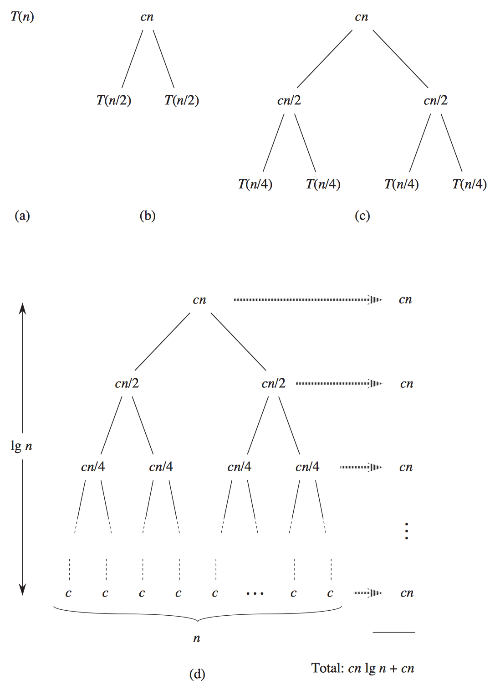

# Week 3

[TOC]


## Computational Complexity

* worst-case scenario:  $O$
* best-case scenario:  $\Omega$
* theta,  $\Theta$, if the running time of an algorithm is the same in the worst-case (  $\Omega$) and the best-case (  $O$).
* We don't actually care about how complex the algorithm is precisely, only it's tendency, which dictated by the highest-order term.
    * for example,  $n^3$,  $n^3+n^2$,  $n^3-8n^2+20n$. when `n` is 1,000,000, the values will be  $1.0*10^{18}$,  $1.000001*10^{18}$ and  $9.99992*10^{17}$. The lower terms became really irrelevant. So we only take the highest-order term, which is  $n^3$ here.

### Common Classes 

* from fast to slow:
    *  $O(1)$ constant time
    *  $O(\log{n})$ logarithmic time
        * binary search
    *  $O(n)$ linear time
        * linear search
    *  $O(n\log{n})$ linearithmic time
        * merge sort 
    *  $O(n^2)$ quadratic time
        * bubble search, selection search, insert search
    *  $O(n^c)$ polynomial time
    *  $O(c^n)$ exponential time 
    *  $O(n!)$ factorial time
    *  $O(\infty)$ infinite time

## Search

### Linear Search

```
for each element in array
    if element you're looking for
        return true
return false
```

### Binary Search

```
look at middle of array
if element you're looking for
    return true
else if element is to left
    search left half of array
else if element is to right
    search right half of array
else
    return false
```   

## Sorting

### Selection Sort

* find the smallest element, and move it to the front of the list and shift the other ones down, until hit the end.

```
for i from 0 to n-1
    find smallest element between i'th and n-1'th
    swap smallest with i'th element
```    
   
## Bubble Sort

* from left to right and compare each pair of numbers. If they are out of order, then we swap them. 

```
repeat until no swaps
    for i from 0 to n-2
        if i'th and i+1'th elements out of order
            swap them
```  

## Insertion Sort

* Each time, we look at the next element and place it into our sorted portion of the list, even if we have to shift elements.

```
for i from 1 to n-1
    call 0'th through i-1'th elements the "sorted side"
    remove i'th element
    insert it into the sorted side in order
```    
## Merge Sort

* First divide the list into the smallest unit (1 element), then compare each element with the adjacent list to sort and merge the two adjacent lists. Finally all the elements are sorted and merged.

```
on input of n elements
    if n < 2
        return
    else
        sort left half of elements
        sort right half of elements
        merge sorted halves
```

* An example:

    

* Calculate the complexity:  $\Theta(n\log{n})$:
    
    
    
    * c is the single step takes, if c = 1, then T(n) = T(n/2) + T(n/2) + n. So every layer will take n steps, and the deep is  $\log{n}$, so the complexity will be :  $n\log{n}$.

* [Implement](https://gist.github.com/erictt/2c4387dba45586b967ae2efe7bb94bc7)

## Quick Sort

```
pick an element called a pivot from array
partition the array with pivot
   if element i > pivot
       move to right
in the end swap the pivot to middle()
recursively apply steps before to the left and the right sub-array without pivot
```   

* [Implement](https://gist.github.com/erictt/daede65d8178a93a25a5e52ed07d69aa) 

## Refers
* [CS50/week 3](http://docs.cs50.net/2016/fall/notes/3/week3.html)
* [Sorting_algorithm - Wikipedia](https://en.wikipedia.org/wiki/Sorting_algorithm)
* [Merge_sort - Wikipedia](https://en.wikipedia.org/wiki/Merge_sort)
* [Quicksort - Wikipedia](https://en.wikipedia.org/wiki/Quicksort)
* [Comparison Sorting Visualization](https://www.cs.usfca.edu/~galles/visualization/ComparisonSort.html)


