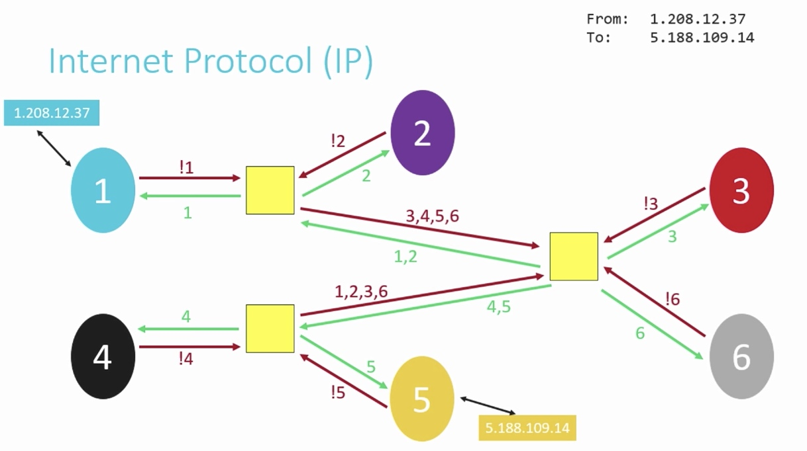

# Week 6

[TOC]

## IP

* Internet Protocol
* IP is responsible for getting information from point A to point B, and breaking the information into small pieces, so that the network isn't overly taxed.
* Trace route sample:
    * 

### IPv4

* IP Address `w.x.y.z`
* Each of w, x, y, z can be a nonnegative value in the range [0, 255].
* Each Ip address is 32 bits, so there are roughly 4 billion addresses.

### IPv6

* IP Address `s:t:u:v:w:x:y:z`
* Each of s, t, u, v, w, x, y and z is represented by 1 to 4 hexadecimal degits in the range [0, ffff].
* Sample: `2001:4860:4860:0:0:0:0:8844`
    * Short version `2001:4860:4860::8844`

## DHCP

* Dynamic Host Configuration Protocol
* to assign IP addresses to devices.

## DNS

* The Domain Name System
* to translate IP addresses to more memorable names that are more human-comprehensible.
    
    Host | IPv4 Address
    ---- | ------------
    google.com|74,125,202,138
    
    Host | IPv6 Address
    ---- | ------------
    google.ie|2a00:1450:4010:c09:0:0:0:93

## Access Points

* to deal with the IPv4 addressing problem is to start assigning multiple people to the same IP address.
* The IP address is assigned to a router, whose job is to act as a traffic cop that allows data requests from all of the devices on your local network to be processed through a singe IP address.
* Modern home networks consist of access points that combine a router, a modern, a switch, and other technologies together into a single device.
* Modern business networks or large-scale wide-area networks(WANs) still frequently have these as separate devices to allow the size of their network to scale more easily.  
* [Wikipedia](https://en.wikipedia.org/wiki/Wireless_access_point)
* [Access Point vs Range Extender](https://www.linksys.com/us/r/resource-center/what-is-a-wifi-access-point/)

## TCP

* Transmission Control Protocol(TCP)
* If the Internet Protocol(IP) is thought of as the protocol for getting information from a sending machine to a receiving machine, then TCP can be thought of as **directing** the transmitted packet to the **correct program** on the receiving machine.
* It is important to be able to identify both where the receiver is and what the packet is for, so TCP and IP are almost an inseparable pair: TCP/IP.
* Each program/utility/service on a machine is assigned a port number. Coupled with IP address, we can uniquely identify a specific program on a specific machine.
* TCP is crucial for is **guaranteeing delivery** of packets, which IP alone does not do.
* TCP does this by including information about how many packets the receiver should expect to get, and in what order, and transmitting that information alongside the data.
* Common used standard ports
    * 21 FTP, for file transfers
    * 22 SSH, secure shell, to run commands on another computer
    * 25 SMTP, for sending email
    * 53 DNS80 HTTP, for visiting websites
    * 443 HTTPS, for visiting secure websites
* Steps of the TCP/IP process
    * When a program goes to send data, TCP breaks it into smaller chunks and communicates those packets to the computer's network software, adding a TCP layer onto the packet.
    * IP routes the individual packets from sender to receiver; this info is part of the IP layer surrounding the packet.
    * When the destination computer gets the packet, TCP looks at the header to see which program it belongs to; and since the routes packets take may differ, TCP also must present those packets to the destination program in the proper order.

## HTTP

* Hypertext Transfer Protocol(HTTP)
* In addition to protocols that indicate how information is communicated from machine to machine and application to application (IP and TCP, respectively), it is frequently the case that the application itself has **a system of rules** for **how to interpret the data** was sent.
* HTTP is one such example of an application layer protocol, which specifically dictates the format by which clients request web pages from a server, and the format via which servers return information to clients.
* Other application layer protocols include:
    * FTP (File Transfer Protocol)
    * SMTP (Simple Mail Transfer Protocol)
    * DDS (Data Distribution Service)
    * RDP (Remote Desktop Protocol)
    * XMPP (Extensible Message and Presence Protocol)
* sample:
    * simple request
    
        ```
        GET / HTTP/1.1
        Host: www.harvard.edu 
        ...
        ```
        
        * `/` refers default directory
        * `HTTP/1.1` indicates the the version of HTTP we want to use
        * `Host: www.harvard.edu` indicates the website we want the server to return to us.
    * response
        
        ```
        HTTP/1.1 200 OK
        Content-Type: text/html
        ...
        ```
        
        * Common status codes include:

            * 200 OK
            * 301 Moved Permanently
            * 302 Found
            * 304 Not Modified
            * 401 Unauthorized
            * 403 Forbidden
            * 404 Not Found
            * 500 Internal Server Error

* Another sample:

    ```
    $ curl -I http://reference.cs50.net/
    HTTP/1.1 301 Moved Permanently
    Cache-control: no-cache="set-cookie"
    Content-Length: 178
    Content-Type: text/html
    Date: Mon, 03 Oct 2016 17:17:39 GMT
    Location: https://reference.cs50.net/
    Server: nginx/1.8.1
    Set-Cookie: AWSELB=7D03E3C11C9564D4EBA91026CCAAA8EEDCD5DC34657AEDEBBAB0856E24F9ACB5BE65C5B4443B7EF06C9BBEAC5F36BF556A51333C0377A6BC471E810D021D4033A06AC36B27;PATH=/
    Connection: keep-alive
    ```    
    
    * We see a `Location:` header to redirect us to a new URL.
## HTML

* A simple webpage:
    
    ```html
    <!DOCTYPE html>
    <html>
        <head>
            <title>hello, world</title>
        </head>
        <body>
            hello, world
        </body>
    </html>
    ``` 
    
* more examples: [http://cdn.cs50.net/2016/fall/lectures/6/src6/](http://cdn.cs50.net/2016/fall/lectures/6/src6/)

## CSS

* an example, which mixes CSS into HTML:

    ```html
    <!DOCTYPE html>
    <html>
        <head>
            <title>css-0</title>
        </head>
        <body>
            <div style="text-align: center;">
                <div style="font-size: 36px; font-weight: bold;">
                    John Harvard
                </div>
                <div style="font-size: 24px;">
                    Welcome to my home page!
                </div>
                <div style="font-size: 12px;">
                    Copyright &#169; John Harvard
                </div>
            </div>
        </body>
    </html>
    ```

## Some Commands

* `nslookup`
    * Look up and find IP addresses in the DNS.
    * Sample
        * `nslookup redhat.com`
    * Query the MX Record using `-query=mx`
        * MX ( Mail Exchange ) record maps a domain name to a list of mail exchange servers for that domain. The MX record tells that all the mails sent to “@redhat.com” should be routed to the Mail server in that domain.
    * Query the NS Record using `-query=ns`
        * NS ( Name Server ) record maps a domain name to a list of DNS servers authoritative for that domain. It will output the name serves which are associated with the given domain.
    * Using Specific DNS server
        * `nslookup redhat.com ns1.redhat.com`
    * Reverse DNS lookup
        * `nslookup 209.132.183.181`

* `telnet`
    * INPUT:

        ```
        >telnet www.esqsoft.globalservers.com 80
        ```
        
        * Note: this launches telnet and tells it to look up and connect to the server for "www.esqsoft.globalservers.com" on port 80.

    * OUTPUT:

        ```
        Trying 64.136.56.122...
        Connected to www.esqsoft.globalservers.com.
        Escape character is '^]'.
        ```
    
    * INPUT:

        ```
        GET /index.htm HTTP/1.1
        host: www.esqsoft.globalservers.com
        <line feed>
        ```
        
        * Notes: 
        1) no OS cursor caret, the connection is open so you just get a blank line waiting for input. 
        2) need to hit <enter> twice after the "host:"

    * OUTPUT:

        ```
        HTTP/1.1 200 OK
        Date: Mon, 18 Apr 2005 16:38:00 GMT
        Server: Apache/1.3.27 (Unix)  (Red-Hat/Linux) mod_ssl/2.8.12 OpenSSL/0.9.6 PHP/4.1.2 mod_perl/1.27 FrontPage/5.0.2.2623
        Last-Modified: Thu, 01 Jul 2004 01:16:05 GMT
        ETag: "158e008c-182c-40e365d5"
        Accept-Ranges: bytes
        Content-Length: 6188
        Connection: close
        Content-Type: text/html
        
        <html>
        <head>
        <title>...
        
        ...lots of HTML code here...
        
        </body></html>
        Connection closed by foreign host.
        ```
    * Double `return` will exit.

* `curl`
    
    * URL manipulations and transfers.
    * Fetch HEAD: `curl -I http://example.com`
    * More Samples: [https://curl.haxx.se/docs/httpscripting.html](https://curl.haxx.se/docs/httpscripting.html)

* `traceroute`
    * Print the route packets take to network host.
    * Sample: 
        *  Ping the host to see if its alive
            *  `traceroute google.com`
        * Disable IP address and host name mapping
            * `traceroute google.com -n`
        * Configure Response Wait Time
            * `traceroute google.com -w 0.1`

## Refers

* [http://docs.cs50.net/2016/fall/notes/6/week6.html](http://docs.cs50.net/2016/fall/notes/6/week6.html)
* [https://curl.haxx.se/docs/httpscripting.html](https://curl.haxx.se/docs/httpscripting.html)
* [https://en.wikipedia.org/wiki/Wireless_access_point](https://en.wikipedia.org/wiki/Wireless_access_point)
* [https://www.linksys.com/us/r/resource-center/what-is-a-wifi-access-point/](https://www.linksys.com/us/r/resource-center/what-is-a-wifi-access-point/)
* [http://www.sanfoundry.com/traceroute-command-usage-examples-linux/](http://www.sanfoundry.com/traceroute-command-usage-examples-linux/)

