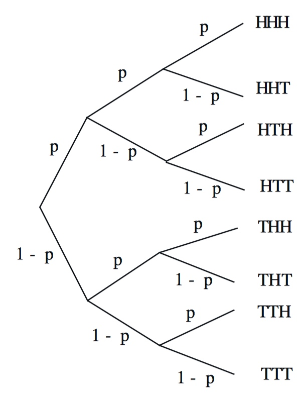
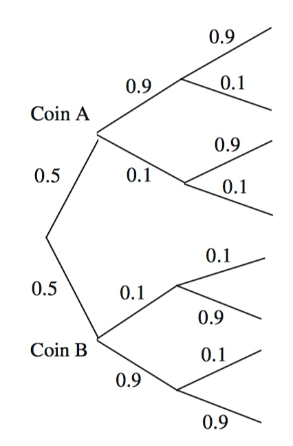

# Unit 2: Conditioning and independence

[TOC]

## Lec. 2: Conditioning and Bayes' rule
  
### Conditional probability
  
* Definition: $$P(A|B)$$ = "probability of **A**, given that **B** occurred": $$P(A|B) = \frac{P(A \cap B)}{P(B)}$$ defined only when $$P(B) > 0$$.
  
#### Example: two rolls of a Die 4-sided roll die

* Let $$\color{red}{B}$$ be the event: $$\min(X, Y) = 2$$
* Let $$\color{blue}{M}$$ be the event: $$\max(X, Y)$$
* 
* $$P(\color{blue}{M = 1}|\color{red}{B}) = 0$$
* $$P(\color{blue}{M = 3}|\color{red}{B}) = \frac{P(M = 3 \cap B)}{P(B)} = \frac{2/16}{5/16} = 2/5$$

### Models based on conditional probabilities and three basic tools

* A radar example: 
* Event $$\color{blue}{A}$$: Airplane is flying above
* Event $$\color{red}{B}$$: Something registers on radar screen
* 

* $$P(\color{blue}{A} \cap \color{red}{B}) = 0.05 \cdot 0.99$$
    * An airplane flight, and radar found it.
* $$P(\color{red}{B}) = 0.05 \cdot 0.99 + 0.95 \cdot 0.1 = 0.1445$$
    * Radar detected the sky whether there is an airplane flight by or not.
* $$P(\color{blue}{A} | \color{red}{B}) = \frac{P(\color{blue}{A} \cap \color{red}{B})}{P(\color{red}{B})} = \frac{0.05 \cdot 0.99}{0.1445} = 0.34$$
    * Radar detected the sky and an airplane DID fly by.
  
#### Multiplication rule

* Take the radar example:
    * $$P(\color{blue}{A} \cap \color{red}{B}) = P(\color{red}{B}) P(\color{blue}{A} | \color{red}{B}) = P(\color{blue}{A}) P(\color{red}{B} |\color{blue}{A})$$
    * Check the figure, we will find this is the trace of the branch from the origin, then $$\color{blue}{A}$$, and finally end with $$\color{blue}{A} \cap \color{red}{B}$$.
* Consider the experiment has an additional event $$C$$,
    * 

    * Check this figure, we will get,
    * $$P(A^c \cap B \cap C^c) = P(A^c) P(B | A^c) P(C^c | A^c \cap B) $$

* **Theorem**: Assuming that all of the conditioning events have positive probability, we have $$P(\cap_{i=1}^n A_i) = P(A_1)P(A_2|A_1)P(A_2|A_1 \cap A_2)\cdots P(A_n | \cap_{i=1}^{n-1} A_i)$$

#### Total probability theorem

* **Theorem**: Let $$A_1, \ldots, A_n$$ be disjoint events that form a partition of the sample space and assume that $$P(A_i) > 0$$, for all $$i = 1, \ldots, n$$. Then, for any event $$B$$, we have $$\begin{aligned}P(B) &= P(A_1 \cap B) + \ldots + P(A_n \cap B) \\ &= P(A_1 )P(B | A_1 ) + \ldots + P(A_n) P(B | A_n )\end{aligned}$$.
* B occurs is a **weighted average** of its conditional probability under each scenario, where each scenario is weighted according to its (unconditional) probability ($$P(A_i)$$).
* 

#### Bayes' rules( -> inference) 

* **Theorem**: Let $$A_1, A_2 , \ldots, A_n$$ be disjoint events that form a partition of the sample space, and assume that $$P(A_i) > 0$$, for all **i**. Then, for any event B such that $$P(B) > 0$$, we have $$\begin{aligned} P(A_i | B) &= \frac{P(A_i) P(B | A_i)}{P(B)} \\ &= \frac{P(A_i)P(B | A_i)}{P(A_1)P(B | A_1) + \cdots + P(A_n) P(B | A_n)} \end{aligned}$$
* Bayes’ rule is often used for **inference**. There are a number of “causes” that may result in a certain “effect.” We observe the effect, and we wish to infer the cause. $$\begin{aligned} & \color{blue}{A_i} \xrightarrow[P(\color{red}{B}|\color{blue}{A_i})]{\text{model} } \color{red}{B} \\  & \\ & \color{red}{B} \xrightarrow[P(\color{blue}{A_i}|\color{red}{B})]{\text{inference} } \color{blue}{A_i} \end{aligned}$$
  
## Lec. 3: Independence

### A coin tossing example

* 3 tosses of a biased coin: $$P(H) = p, P(T) = 1 - p$$
* 

* $$P(\text{only 1 head}) = 3 p (1 - p)^2$$
* $$P(H_1 | \text{only 1 head}) = \frac{P(H_1 \cap \text{ only 1 head})}{\text{only 1 head} } = \frac{p (1-p)^2}{3 p (1-p)^2} = \frac{1}{3}$$
    * first toss is H is denoted by $$H_1$$ and the probability is **p**.

### Independence

* Two events A and B are said to **independent** if $$P(A \cap B) = P(A)P(B)$$ If in addition, $$P(B) > 0$$, independence is equivalent to the condition $$P(A | B) = P(A)$$
* If A and B are independent, so are A and $$B^c$$.
* Two events A and B are said to be **conditionally independent**, given another event C with $$P(C) > 0$$, if $$P(A \cap B | C) = P(A | C)P(B | C).$$ If in addition, $$P(B \cap C) > 0$$, conditional independence is equivalent to the condition $$P(A | B \cap C) = P(A | C).$$
* **Independence does not imply conditional independence**, and vice versa.

### Conditional independence example

* Two unfair coins, A and B:
    * $$P(H | \text{coin } A) = 0.9, P(H | \text{coin } B) = 0.1$$
* choose either coin with equal probability.
* 
* Compare:
    * $$P(\text{toss } 11 = H) = P(A) P(H_{11} | A) + P(B) P(H_{11}| B) = 0.5 * 0.9 + 0.5 * 0.1 = 0.5$$
    * $$P(\text{toss } 11 = H | \text{first 10 tosses are heads}) = P(H_{11} | A) = 0.9$$
* So in this experiment, A and B are conditional independent.

### Independence of a collection of events

* We say that the events $$A_1, A_2, \ldots, A_n$$ are **independent** if $$P(\bigcap_{i \in S}A_i) = \prod_{i \in S} P(A_i), \text{ for every subset S of }\{1, 2, \ldots, n\}.$$

### Independence versus pairwise independence

* **Pairwise independence does not imply independence.**

* For example: two independent fair coin tosses
    
    |  HH  |  HT  |
    | :--: | :--: |
    |  TH  |  TT  |
    
    * $$H_1$$: First toss is H
    * $$H_2$$: First toss is H
    * $$P(H_1) = P(H_2) = 1/2$$
    * $$C$$: the two tosses had the same result = $$\{HH, TT\}$$
* We know, 
    * $$P(H_1 \cap C) = P(H_1 \cap H_2) = 1/4$$
    * $$P(H_1) P(C) = 1/2 * 1/2 = 1/4$$
* So $$P(H_1), P(H_2), \text{ and } P(C)$$ are pairwise independent.
* If $$P(H_1), P(H_2), \text{ and } P(C)$$ are independent, use the formula, we will get:
    * $$P(H_1 \cap H_2 \cap C) = P(H_1) \cap P(H_2) \cap P(C) = 1/2 * 1/2 * 1/2 = 1/8$$
* But check the figure, we know:
    * $$P(H_1 \cap H_2 \cap C) = P(HH) = 1/4$$
* So $$P(H_1), P(H_2), \text{ and } P(C)$$ are **NOT** independent.

* Another way to prove $$P(H_1), P(H_2), \text{ and } P(C)$$ are pairwise independent.
    * $$P(C|H_1) = P(H_2 | H_1) = P(H_2) = 1/2 = P(C)$$
    * $$P(C| H_1 \cap H_2) = 1 \ne P(C) = 1/2$$
* Conclusion: **H_1, H_2, and C are pairwise independent, but not independent.** 

