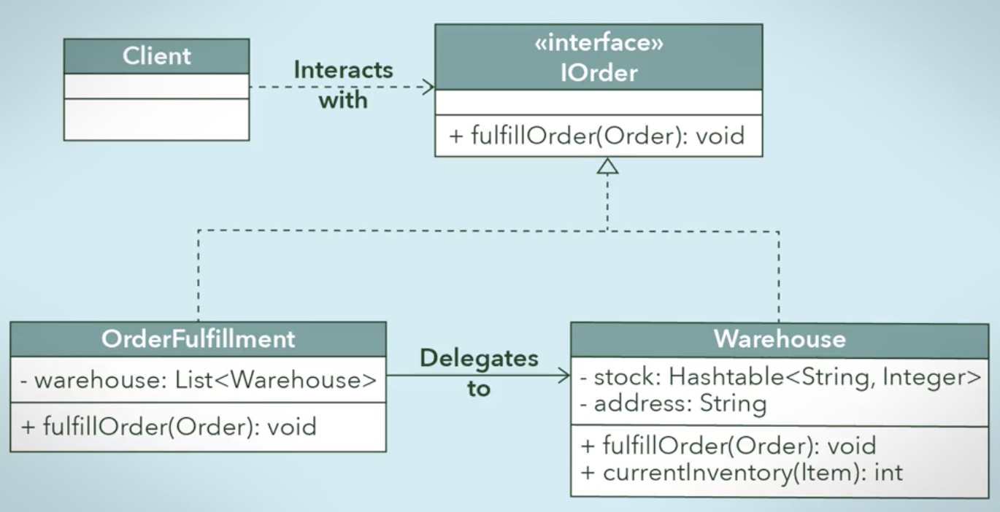

# Design Pattern

[TOC]

## Creational and Structural Design Patterns

### Singleton Pattern

* One object of a class.
* Globally accessible within the program.

```java
Public class ExampleSingleton { // lazy construction
    // the class variable is null if no instance is
    // instantiated
    Private static ExampleSingleton uniqueInstance = null;
    Private ExampleSingleton() {
        …
    }

    // lazy construction of the instance
    Public static ExampleSingleton getInstance() {
        if (uniqueInstance == null) {
            uniqueInstance = new ExampleSingleton();
        }
        Return uniqueInstance;
    }
    …
}
```

### Factory Method Pattern

```java
public class KnifeFactory {
    public Knife createKnife(String knifeType) {
        Knife knife = null;
        
        // create Knife object
        If (knifeType.equals("steak")) {
            knife = new SteakKnife();
        } else if (knifeType.equals("chefs")) {
            knife = new ChefsKnife();
        }
        
        return knife;
    }
}
```

### Facade /fə'sɑ:d/ Design Pattern

* A facade simply acts as a point of entry into the subsystem
* Wrapper class that encapsulates a subsystem in order to hide the subsystem's complexity
* A facade class can be used to wrap all the interfaces and classes for a subsystem

###  Adapter Pattern

* Facilitates communication between two existing systems by providing a compatible interface.

###  Composite Pattern (Polymorphism)

* Enforcing polymorphism across each class through implementing an interface (or inheriting from a superclass).

* 

### Proxy Pattern

* 
* In this example, class `OderFulfillment` is the proxy class, which implement interface `IOrder`, and send the requests to `Warehouse`.

### Decorator Pattern

* Add additional functions to the original classes
* Serves as the abstract superclass of concrete decorator classes that will each provide an increment of behaviour
* 

## Behavioural Design Patterns

* Focus on how independent objects work towards a common goal

### Template Method Pattern

* 

### Chain of Responsibility Pattern
* Like the switch function
* 

### State Pattern
* Change the behaviour of an object based on the state that it's in at run-time. 
* 

### Command Pattern
* 

### Observer Pattern
* 

* 

## Design Principles

### MVC Pattern

### Open/Closed Principle
* 
* 
* 

### Dependency Inversion Principle
* 
* The client classes should depend on an interface or abstract class instead of referring to concrete resources.
* 

### Composing Objects Principle
* 
* inheritance should be only used to extend classes.
* 
* 

### Interface Segregation Principle
* 
* 

### Principle of Least Knowledge
* 
* 
* 
* 
* 
* 
    *  The term "reaching through" means that you'd need to use another object to pass along your request


## UML

* https://www.uml-diagrams.org/index-examples.html
* https://tallyfy.com/uml-diagram/


1. 菱形 线 1对多 多对1 1对1


Aggregation: "Has-a"

* encapsulate vt. 压缩；将…装入胶囊；将…封进内部；概述 vi. 形成胶囊
* delegate ['deliɡət, -ɡeit, 'deliɡeit] vt. 委派…为代表 n. 代表
* stimulate ['stimjuleit] vt. 刺激；鼓舞，激励 vi. 起刺激作用；起促进作用
* generalization [,dʒenərəlai'zeiʃən, -li'z-] n. 概括；普遍化；一般化 接口化
* abstraction 抽象化
* polymorphism [,pɔli'mɔ:fizm] n. 多态性；多形性；同质多晶
* segregation [,seɡri'ɡeiʃən] n. 隔离，分离；种族隔离


robust
reusable
flexible 
maintainable