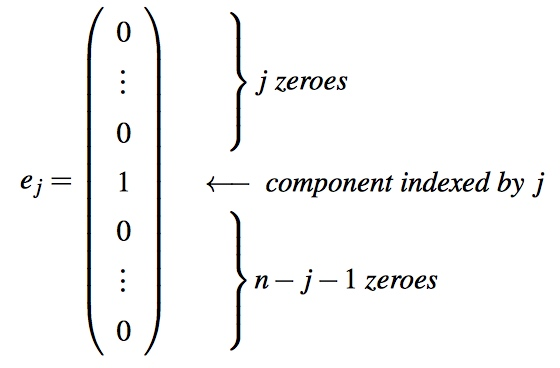

# Week 1 - Vectors in Linear Algebra

[TOC]

## What is Vector?

### Notation

* A two-dimensional vector:
    * 
* Vector in higher dimensions:
    * \\(x = \begin{pmatrix} x_0 \\ x_1 \\ \vdots \\ x_{n-1} \end{pmatrix}\\)
        * It is an ordered array.
        * The entries in the array are called components.
        * We start indexing the components at zero.
        * The component indexed with `i` is denoted by \\(x_i\\).
        * Each number is a real number: \\(x_i \in \mathbb{R}\\).
        * \\(x \in \mathbb{R}^n\\)
        * A vector has a direction and a length.
            * Draw an arrow from the origin to the point\\((x_0,x_1,\ldots,x_{n-1})\\).
            * The length is \\(\sqrt{x_0^2+x_1^2+\ldots+x_{n-1}^2}\\).
            * **A vector does not have a location.**
* Summary
    * A vector has a direction and a length.
    * We will write it as a column of values which we call a (column) vector.

### Unit Basis Vectors (Standard Basis Vectors)

* An important set of vectors is the set of unit basis vectors given by
    * 
    * Where the "1" appears as the component indexed by `j`. Thus, we get the set \\(\{e_0,e_1,\ldots,e_{n-1}\} \subset \mathbb{R}^n\\) given by
        * 
* Different with **unit vector**, which is any vector of length one (unit length). For example, the vector  \\(\begin{pmatrix}\frac{\sqrt{2}}{2} \\ \frac{\sqrt{2}}{2}\end{pmatrix}\\) has length one.

## Simple Vector Operations

### Equality (=), Assignment (:=), and Copy

* Two vectors \\(x,y \in \mathbb{R}^n\\) are equal if all their components are element-wise equal: \\[x=y\ \text{if and only if}\ x_i = \psi_i, \text{for all}\ 0 \le i < n\\]
* operation `y := x`:
    * 

### Vector Addition(ADD), Scaling(SCAL), Subtraction

* Addition and Subtraction
    * 
    * 
    * 
* Scaling
    * 

## Advanced Vector Operations

### Scaled Vector Addition (AXPY)

* axpy: \\(\alpha x + y\\)
    * 
* The AXPY operation requires `3n + 1` **memops**(memory operations) and `2n` **flops**(floating point operations). The reason is that \\(\alpha\\) is only brought in from memory once and kept in a register for reuse.
    * `3n+1`: x, ax, y, a
    * `2n`: ax, ax+y

### Dot or Inner Product (DOT)

* 

### Vector Length(NORM2)

* Let \\(x \in \mathbb{R}^n\\). Then the (Euclidean) length of a vector x (the two-norm) is given by \\[\lVert x \rVert _2 = \sqrt{x_0^2+x_1^2+\ldots+x_{n-1}^2} = \sqrt{\sum_{i=0}^{n-1}{}x_i^2}\\]
    * Here \\(\lVert x \rVert _2\\) notation stands for “the two norm of x”, which is another way of saying “the length of x”.

### Cauchy-Schwarz inequality

* Let \\( x, y \in R^n \\), then \\(|x y| \le \lVert x \rVert \lVert y \rVert\\)
* And \\(|x y| = \lVert x \rVert \lVert y \rVert \\), iff \\( x = cy, c \in \mathbb{R}\\).
* **Proof**: 
    * Let's Define \\(P(t) = \lVert t y - x \rVert ^2\\)
    * \\(P(t) = (t y - x) \cdot  (t y - x) \ge 0 \\)
    * \\(P(t) = (y \cdot y)t^2 - 2 ( x \cdot y) t + x \cdot x \ge 0 \\)
    * Set \\(a = y \cdot y, b = 2( x \cdot y ) , c = x \cdot x\\)
    * \\(P(t) = a t^2 - b t + c \ge 0 \\)
    * Set \\(t = \frac{b}{2a}\\)
    * \\(P(t) = a \frac{b}{2a}^2 - b \frac{b}{2a} + c \ge 0 \\) => \\(4ac \ge b^2\\)
    * \\(4 \lVert y \rVert ^2 \lVert x \rVert ^2 \ge (2 ( x \cdot y)^2\\) => \\( \lVert y \rVert \lVert x \rVert \ge | x \cdot y | \\)
    
### Vector Functions

* Sample:
    * 

### Vector Functions that Map a Vector to a Vector

* \\(f: \mathbb{R}^n \to \mathbb{R}^m\\)
* Sample:
    * 

## Enrichment  

### The Greek Alphabet

* Lowercase Greek letters (α, β, etc.) are used for scalars.
* Lowercase (Roman) letters (a, b, etc) are used for vectors.
* Uppercase (Roman) letters (A, B, etc) are used for matrices.
* [The Alphabet](https://cs.ericyy.me/SYMBOLS.html)

### Other Norms

* **A norm** is a function, in our case of a vector in \\(\mathbb{R}^n\\), that maps every vector to a nonnegative real number. The simplest example is the absolute value of a real number: Given \\(\alpha \in \mathbb{R}\\), the absolute value of α, often written as |α|, equals the magnitude of α: \\[\lvert \alpha \rvert = \left\{ 
    \begin{array}{rl} 
    \alpha & \text{if } \alpha \ge 0,\\ 
    -\alpha & \text{otherwise}. 
    \end{array} \right.\\]
* Similarly, one can find functions, called **norms**, that measure the magnitude of vectors. One example is the (Euclidean) length of a vector, which we call the 2-norm: for \\(x \in \mathbb{R}^n\\), \\[\lVert x \rVert _2 = \sqrt{\sum_{i=0}^{n-1}x_i^2}\\]
* Other norms:
    * 1-norm (also called taxi-cab norm): \\[\lVert x \rVert _1 = \sqrt{\sum_{i=0}^{n-1}|x_i|}\\]
    * For \\(1 \le p \le \infty\\), the p-norm: \\[\lVert x \rVert _p = \sqrt[p]{\sum_{i=0}^{n-1}|x_i|^p}\\]

## Summary of the Properties for Vector Operations

### Vector Addition

* Is commutative. That is, for all vectors \\(x,y\in \mathbb R^n, x+y=y+x.\\).
* Is associative. That is, for all vectors \\(x,y,z\in \mathbb R^n, (x+y)+z=x+(y+z)\\).
* Has the zero vector as an identity. For all vectors \\(x \in \mathbb R^n, x+\mathbf 0=\mathbf0+x=x\\) where 0 is the vector of size n with 0 for each component.
* Has an inverse, −x. That is \\(x+(-x)=\mathbf 0\\).

### The dot product of vectors

* Is commutative. That is, for all vectors \\(x,y\in R^n,x^Ty = y^Tx\\).
* Distributes over vector addition. That is, for all vectors \\(x,y,z\in R^n,x^T(y+z)=x^Ty+x^Tz\\). Also, \\((x+y)^Tz=x^Tz+y^Tz\\).

### Other Properties

* For \\(x,y \in R^n, (x+y)^T(x+y)=x^Tx+2x^Ty+y^Ty\\).
* For \\(x,y \in R^n, x^Ty=0\\) if and only if x and y are orthogonal.
* Let \\(x,y \in R^n\\) be nonzero vectors and let the angle between them equal θ. Then \\(\cos(\theta) = \frac{x^Ty}{||x||_2||y||_2}\\).
* For \\(x \in R^n, x^Te_i=e_i^Tx=\chi_i\\) where \\(x_i\\) equals the `i`th component of x.

## Refers

* [https://en.wikipedia.org/wiki/Cauchy%E2%80%93Schwarz_inequality](https://en.wikipedia.org/wiki/Cauchy%E2%80%93Schwarz_inequality)

