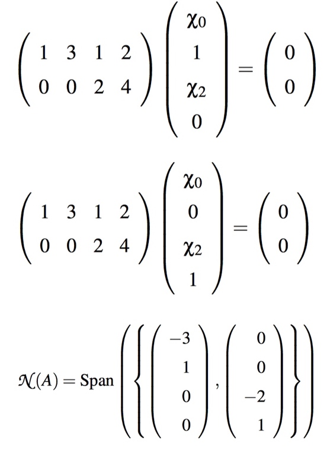

# Week 10 - Vector Spaces, Orthogonality, and Linear Least-Squares

[TOC]

## Solving underdetermined systems

* Important attributes of a linear system \\(Ax = b\\) and associated matrix A:
    * (example:\\(\left(\begin{array}{c c c c}1 & 3 & 1 & 2 \\ 2 & 6 & 4 & 8 \\ 0 & 0 & 2 & 4\end{array}\right)\left(\begin{array}{c} \chi_0 \\ \chi_1 \\ \chi_2 \\ \chi_3\end{array}\right) = \left(\begin{array}{c} 1 \\ 3 \\ 1\end{array}\right)\\))
    * The row-echelon form of the system.
        * 
    * The pivots.
        * the first nonzero entry in each row: 1, 2.
    * The free variables.
        * the columns that has no pivots: \\(\chi_1, \chi_3\\)
    * The dependent variables.
        * the columns that has pivots: \\(\chi_0, \chi_2\\)
    * A specific solution. 
        * Often called a **particular** solution.
        * The most straightforward way is to set the free variables equal to zero 
            * => \\(\chi_1 = \chi_3 = 0\\) 
            * => \\(\left(\begin{array}{c} 1/2 \\ 0 \\ 1/2 \\ 0\end{array}\right)\\)
    * A basis for the null space. 
        * Often called the **kernel** of the matrix. 
        * Set right hand set to 0, and free variables to 0 or 1.
            * 
    * A general solution. 
        * Often called a **complete** solution.
        * given by: 
            * 
    * A basis for the column space, \\(\mathcal{C}(A)\\). 
        * Often called the **range** of the matrix.
        * equal to the number of dependent variables.
        * The columns that have pivots in them are linearly independent. The corresponding columns in the original matrix are also linearly independent:
            * 
            * 
    * A basis for the row space, \\(\mathcal{R}(A) = \mathcal{C}(A^T)\\).
        * The row space is the subspace of all vectors that can be created by taking linear combinations of the rows of a matrix. 
        * List the rows that have pivots in the row echelon form as column vectors:
            * 
    * The dimension of the row and column space. 
        * = number of pivots
        * = 2
    * The rank of the matrix. 
        * = number of pivots
        * = 2
    * The dimension of the null space.
        * = the number of columns - number of pivots
        * = 4 - 2 = 2
    
## Orthogonal Vectors & Orthogonal Spaces

* Vectors x and y are considered to be orthogonal (perpendicular) if they meet at a right angle: \\[x^T y = 0\\]

### Orthogonal Spaces

* **Definition**: Let \\(V, W \subset \mathbb{R}^n\\) be subspaces. Then \\(V\\) and \\(W\\) are said to be orthogonal iff \(v \in V\\) and \\(w \in W\\) implies \\(v^T w = 0\\). Denoted by \\(V \perp W\\)
* **Definition**: Given subspace \\(V \subset \mathbb{R}^n\\), the set of all vectors in \\(\mathbb{R}^n\\) that are orthogonal to \\(V\\) is denoted by \\(V^{\perp}\\) (pronounced as “V-perp”).

### Fundamental Spaces

* Recall some definitions. Let \\(A \in \mathbb{R}^{m \times n}\\) and have k pivots. Then:
    * **Column space**: \\(\mathcal{C}(A) = \{y|y = Ax\}\subset \mathbb{R}^m\\).
        * dimension: k
    * **Null space**: \\(\mathcal{N}(A) = \{y|Ax = 0\} \subset \mathbb{R}^n\\).
        * dimension: n - k
    * **Row space**: \\(\mathcal{R}(A) = \mathcal{C}(A^T) =\{y|y = A^T x\} \subset \mathbb{R}^n\\).
        * dimension: k
    * **Left null space**: \\(\mathcal{N}(A^T) = \{y|x^T A = 0\} \subset \mathbb{R}^m\\).
        * dimension: m - k
* **Theorem**: Let \\(A \in \mathbb{R}^{m \times n}\\). Then:
    * \\(\mathcal{R}(A) \perp \mathcal{N}(A)\\).
    * every \\(x \in \mathbb{R}^n\\) can be written as \\(x = x_r + x_n\\) where \\(x_r \in \mathcal{R}(A)\\) and \\(x_r \in \mathcal{N}(A)\\).
    * \\(A\\) is a one-to-one, onto mapping from \\(\mathcal{R}(A)\\) to \\(\mathcal{C}(A)\\).
    * \\(\mathcal{N}(A^T)\\) is orthogonal to \\(\mathcal{C}(A)\\) and the dimension of \\(\mathcal{N}(A^T)\\) equals \\(m-r\\), where \\(r\\) is the dimension of \\(\mathcal{C}(A)\\).
* 

* **Normal Vector**: a normal vector is perpendicular to the plane. or we can say perpendicular to all of the vector on the plane.

## Words

* **orthogonality** [,ɔ:θɔɡə'næləti] n. [数] 正交性；相互垂直

