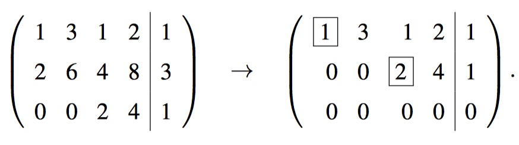
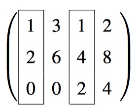
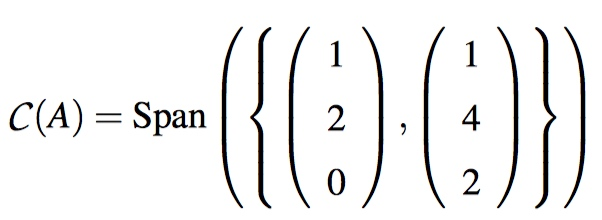
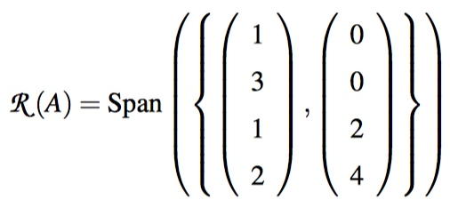
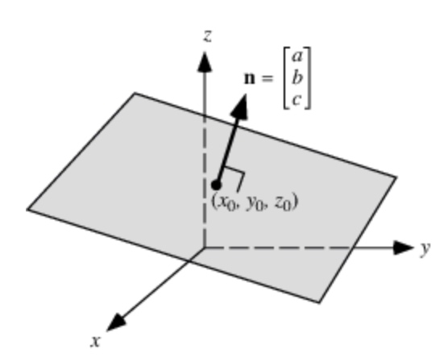
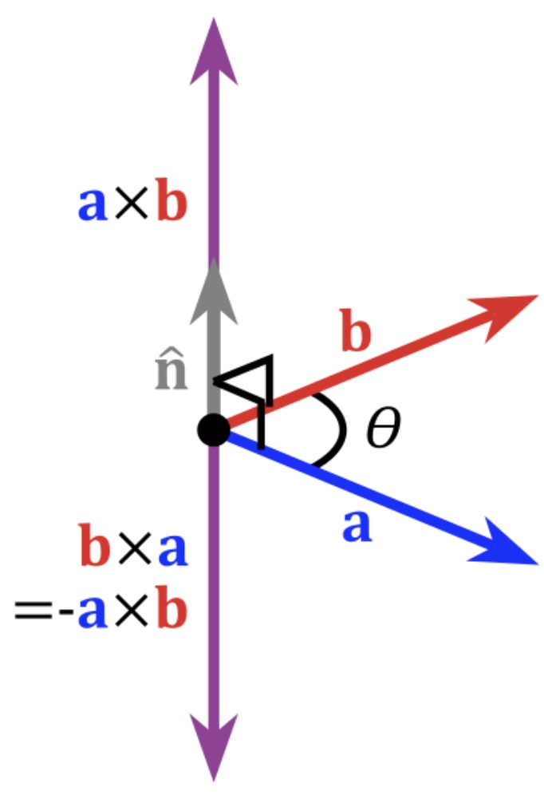
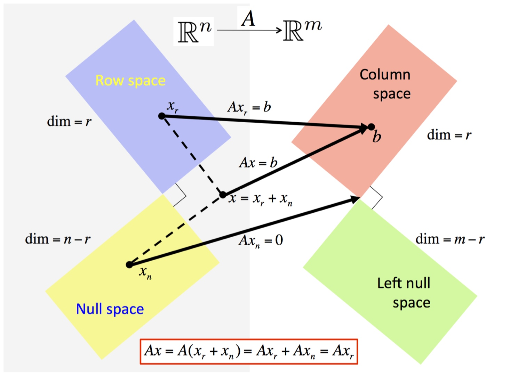
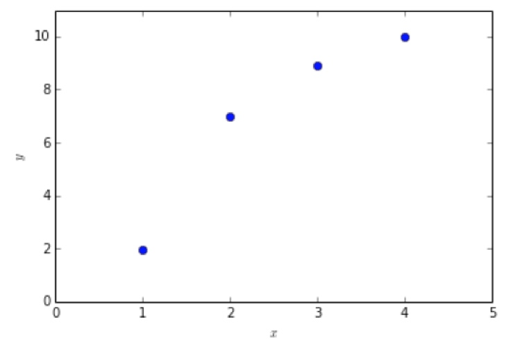
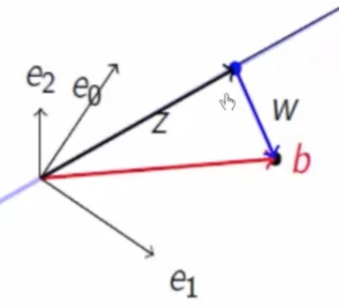

# Week 10 - Vector Spaces, Orthogonality, and Linear Least-Squares

[TOC]

## Solving underdetermined systems

* Important attributes of a linear system \\(Ax = b\\) and associated matrix A:
    * (example:\\(\left(\begin{array}{c c c c}1 & 3 & 1 & 2 \\ 2 & 6 & 4 & 8 \\ 0 & 0 & 2 & 4\end{array}\right)\left(\begin{array}{c} \chi_0 \\ \chi_1 \\ \chi_2 \\ \chi_3\end{array}\right) = \left(\begin{array}{c} 1 \\ 3 \\ 1\end{array}\right)\\))
    * The row-echelon form of the system.
        * 
    * The pivots.
        * the first nonzero entry in each row: 1, 2.
    * The free variables.
        * the columns that has no pivots: \\(\chi_1, \chi_3\\)
    * The dependent variables.
        * the columns that has pivots: \\(\chi_0, \chi_2\\)
    * A specific solution. 
        * Often called a **particular** solution.
        * The most straightforward way is to set the free variables equal to zero 
            * => \\(\chi_1 = \chi_3 = 0\\) 
            * => \\(\left(\begin{array}{c} 1/2 \\ 0 \\ 1/2 \\ 0\end{array}\right)\\)
    * A basis for the null space. 
        * Often called the **kernel** of the matrix. 
        * \\(\chi_0 + 3\chi_1 + \chi_2 + 2\chi_3 = 0, 2\chi_2 + 4\chi_3 = 0\\) => \\(\chi_2 = -2\chi_3, \chi_0 = -3\chi_1\\)
        * \\(\begin{bmatrix} \chi_0 \\ \chi_1 \\ \chi_2 \\ \chi_3 \end{bmatrix} = \chi_1 \begin{bmatrix} -3 \\ 1 \\ 0 \\ 0 \end{bmatrix} + \chi_3\begin{bmatrix} 0 \\ 0 \\ -2 \\ 1\end{bmatrix}\\)
        * So the basic for \\(\mathcal{N}(A) = \text{Span }(\begin{bmatrix} -3 \\ 1 \\ 0 \\ 0 \end{bmatrix},\begin{bmatrix} 0 \\ 0 \\ -2 \\ 1\end{bmatrix})\\)
    * A general solution. 
        * Often called a **complete** solution.
        * given by: 
            * \\(\begin{bmatrix} 1/2 \\ 0 \\ 1/2 \\ 0 \end{bmatrix} + \beta_0 \begin{bmatrix} -3 \\ 1 \\ 0 \\ 0 \end{bmatrix} + \beta_1 \begin{bmatrix} 0 \\ 0 \\ -2 \\ 1\end{bmatrix}\\)
    * A basis for the column space, \\(\mathcal{C}(A)\\). 
        * Often called the **range** of the matrix.
        * equal to the number of dependent variables.
        * The columns that have pivots in them are linearly independent. The corresponding columns in the original matrix are also linearly independent:
            * 
            * 
    * A basis for the row space, \\(\mathcal{R}(A) = \mathcal{C}(A^T)\\).
        * The row space is the subspace of all vectors that can be created by taking linear combinations of the rows of a matrix. 
        * List the rows that have pivots in the row echelon form as column vectors:
            * 
    * The dimension of the row and column space. 
        * = number of pivots
        * = 2
    * The rank of the matrix. 
        * = number of pivots
        * = 2
    * The dimension of the null space.
        * = the number of non-pivots columns
        * = 2
    
## Orthogonal Vectors & Orthogonal Spaces

* Vectors x and y are considered to be orthogonal (perpendicular) if they meet at a right angle: \\[x^T y = 0\\]

### Normal Vector

* The **normal vector**, often simply called the "normal," to a surface is a vector which is perpendicular to the surface at a given point. 
* For example:
    * 
    * Define the plane as \\(Ax + By + Cz = D\\)
        * Vector \\(\vec{n} = \begin{bmatrix} a \\ b \\ c \end{bmatrix}\\) is normal to the plane. 
        * Vector \\(\vec{x_0} = \begin{bmatrix} x_0 \\ y_0 \\ z_0 \end{bmatrix}\\) is pointing to the plane. 
        * Vector \\(\vec{x} = \begin{bmatrix} x \\ y \\ z \end{bmatrix}\\) is pointing to the plane.
    * Then \\(\vec{x} - \vec{x_0}\\) should be on the plane and perpendicular to \\(\vec{n}\\)
    * Then \\((\vec{x} - \vec{x_0})^T \vec{n} = 0\\)
    * \\(\begin{bmatrix} x - x_0 \\ y - y_0  \\ z - z_0  \end{bmatrix}^T \begin{bmatrix} a \\ b \\ c \end{bmatrix} = 0\\)
    * \\(a(x - x_0) + b(y - y_0) + c(z - z_0) = 0 \\)
    * So we can use \\(ax + by + cz = ax_0 + by_0 + cz_0\\) to represent the plane.

#### Cross Product

*  the **cross product** or **vector product** is a binary operation on **two** vectors in three-dimensional space (\\(\mathbb{R}^3\\)) and is denoted by the symbol **×**.
    *  \\(\begin{bmatrix} a_0 \\ a_1 \\ a_2 \end{bmatrix} \times \begin{bmatrix} b_0 \\ b_1 \\ b_2 \end{bmatrix} = \begin{bmatrix} a_1 b_2 - a_2 b_1 \\ a_2 b_0 - a_0 b_2 \\ a_0 b_1 - a_1 b_0 \end{bmatrix} \\)
* Given two linearly independent vectors a and b, the cross product, **a × b**, is a vector that is perpendicular to both a and b and thus **normal** to the plane containing them.
    * Because \\(\begin{bmatrix} a_1 b_2 - a_2 b_1 \\ a_2 b_0 - a_0 b_2 \\ a_0 b_1 - a_1 b_0 \end{bmatrix}^T \begin{bmatrix} a_0 \\ a_1 \\ a_2 \end{bmatrix} = 0\\) and \\(\begin{bmatrix} a_1 b_2 - a_2 b_1 \\ a_2 b_0 - a_0 b_2 \\ a_0 b_1 - a_1 b_0 \end{bmatrix}^T \begin{bmatrix} b_0 \\ b_1 \\ b_2 \end{bmatrix} = 0\\)
* 
* So we can use vectors a and b to get n. (\\(n = a \times b\\))

#### Visualizing a column space as a plane in R3

* For example: 
* \\(A = \begin{bmatrix} 1 & 1 & 1 & 1 \\ 2 & 1 & 4 & 3 \\ 3 & 4 & 1 & 2 \end{bmatrix}\\). \\(\text{rref }(A) = \begin{bmatrix} 1 & 0 & 3 & 2 \\ 0 & 1 & -2 & -1 \\ 0 & 0 & 0 & 0 \end{bmatrix}\\)
    * **rref**: row-echelon form.
* \\(\mathcal{C}(A) = \text{Span }(\begin{bmatrix}1 \\ 2 \\ 3\end{bmatrix}, \begin{bmatrix}1 \\ 1 \\ 4\end{bmatrix} )\\)
* Define \\(n\\) is the normal vector to \\(\mathcal{C}(A)\\), And vector \\(\begin{bmatrix}x \\ y \\ z\end{bmatrix}\\) is point to the surface. Then:
    * Use cross product, we get \\( n = \begin{bmatrix}1 \\ 2 \\ 3\end{bmatrix} \times \begin{bmatrix}1 \\ 1 \\ 4\end{bmatrix} = \begin{bmatrix}5 \\ -1 \\ -1\end{bmatrix}\\)
    * \\( n \cdot (\begin{bmatrix}x \\ y \\ z\end{bmatrix} - \begin{bmatrix}1 \\ 2 \\ 3\end{bmatrix}) = 0\\)
    * \\(5x - y - z = 0\\) <=> \\(\mathcal{C}(A)\\)
    
### Orthogonal Spaces

* **Definition**: Let \\(V, W \subset \mathbb{R}^n\\) be subspaces. Then \\(V\\) and \\(W\\) are said to be orthogonal iff \\(v \in V\\) and \\(w \in W\\) implies \\(v^T w = 0\\). Denoted by \\(V \perp W\\)
* **Definition**: Given subspace \\(V \subset \mathbb{R}^n\\), the set of all vectors in \\(\mathbb{R}^n\\) that are orthogonal to \\(V\\) is denoted by \\(V^{\perp}\\) (pronounced as “V-perp”).

### Fundamental Spaces

* Recall some definitions. Let \\(A \in \mathbb{R}^{m \times n}\\) and have k pivots. Then:
    * **Column space**: \\(\mathcal{C}(A) = \{y|y = Ax\}\subset \mathbb{R}^m\\).
        * dimension: k
    * **Null space**: \\(\mathcal{N}(A) = \{x|Ax = 0\} \subset \mathbb{R}^n\\).
        * dimension: n - k
    * **Row space**: \\(\mathcal{R}(A) = \mathcal{C}(A^T) =\{y|y = A^T x\} \subset \mathbb{R}^n\\).
        * dimension: k
    * **Left null space**: \\(\mathcal{N}(A^T) = \{x|x^T A = 0\} \subset \mathbb{R}^m\\).
        * dimension: m - k
* **Theorem**: Let \\(A \in \mathbb{R}^{m \times n}\\). Then:
    * \\(\mathcal{R}(A) \perp \mathcal{N}(A)\\).
    * every \\(x \in \mathbb{R}^n\\) can be written as \\(x = x_r + x_n\\) where \\(x_r \in \mathcal{R}(A)\\) and \\(x_r \in \mathcal{N}(A)\\).
    * \\(A\\) is a one-to-one, onto mapping from \\(\mathcal{R}(A)\\) to \\(\mathcal{C}(A)\\).
    * \\(\mathcal{N}(A^T)\\) is orthogonal to \\(\mathcal{C}(A)\\) and the dimension of \\(\mathcal{N}(A^T)\\) equals \\(m-r\\), where \\(r\\) is the dimension of \\(\mathcal{C}(A)\\).
* 

## Approximating a Solution

* Find a line \\(y = \gamma_0 + \gamma_1 x\\) to interpolate these points:
    * \\(x = \left(\begin{array}{c} \chi_0 \\ \chi_1 \\ \chi_2 \\ \chi_3 \end{array}\right) = \left(\begin{array}{c}1 \\ 2 \\ 3 \\ 4\end{array}\right) \text{ and } y = \left(\begin{array}{c} \psi_0 \\ \psi_1 \\ \psi_2 \\ \psi_3 \end{array}\right) = \left(\begin{array}{c}1.97 \\ 6.97 \\ 8.89 \\ 10.01\end{array}\right) \\)
    * 
* Clearly, there is no line could go through all these points, then what is the best approximation?
* Set \\(A = \begin{bmatrix}1 & 1 \\ 1 & 2 \\ 1 & 3 \\ 1 & 4\end{bmatrix}, b = \begin{bmatrix}1.97 \\ 6.97 \\ 8.89 \\ 10.01\end{bmatrix}\\)
* We've learned before that \\(Ax=b\\) has a solution iff \\(b \in \mathcal{C}(A)\\). In other words, b is in the plane of \\(\text{Span}(a_1, a_2,\ldots, a_n)\\).
* So, here we are solving \\(Ax \approx b\\).
* Set the projection of b = \\(z\\), \\(A\hat{x} = z\\)
    * 
* we can get
    * \\(b = z + w\\) where \\( w^T v = 0\\) for all \\(v \in \mathcal{C}(A)\\).
* also \\(w\\) is in the **left null space** of \\(A\\). So, \\(A^Tw = 0\\). But that means that
    * \\(0 = A^Tw = A^T(b - z) = A^T(b - A \hat{x})\\)
    * Rewrite it, we get \\(A^TA \hat{x} = A^T b\\).
    * This is known as the **normal equation** associated with the problem \\(A\hat{x} \approx b\\).
* Although \\(A^TA\\) is nonsingular, then
    * \\(\hat{x} = (A^T A)^{-1} A^T b\\)
* And the vector \\(z \in \mathcal{C}(A)\\) closest to \\(b\\) is given by
    * \\(z = A \hat{x} = A (A^T A)^{-1} A^T b\\)
* This shows that if A has linearly independent columns, then \\(z = A \hat{x} = A (A^T A)^{-1} A^T b\\) is the vector in the columns space closest to b. This is **the projection of b onto the column space of A**.
* And the “best” solutionis known as the “**linear least-squares**” solution.

## Refers

* [https://www.khanacademy.org/math/linear-algebra/vectors-and-spaces/dot-cross-products/v/defining-a-plane-in-r3-with-a-point-and-normal-vector](https://www.khanacademy.org/math/linear-algebra/vectors-and-spaces/dot-cross-products/v/defining-a-plane-in-r3-with-a-point-and-normal-vector)
* [https://en.wikipedia.org/wiki/Normal_(geometry)](https://en.wikipedia.org/wiki/Normal_(geometry))
* [http://mathworld.wolfram.com/NormalVector.html](http://mathworld.wolfram.com/NormalVector.html)
* [https://en.wikipedia.org/wiki/Cross_product](https://en.wikipedia.org/wiki/Cross_product)

## Words

* **orthogonality** [,ɔ:θɔɡə'næləti] n. [数] 正交性；相互垂直

