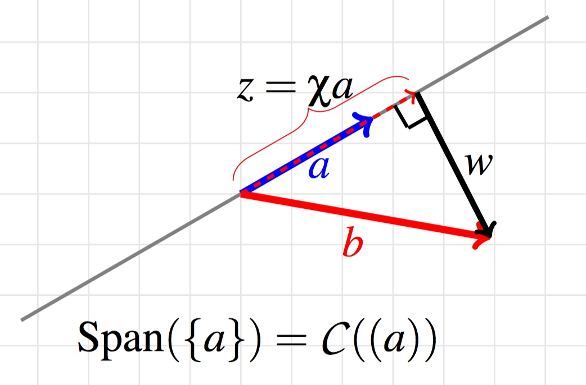
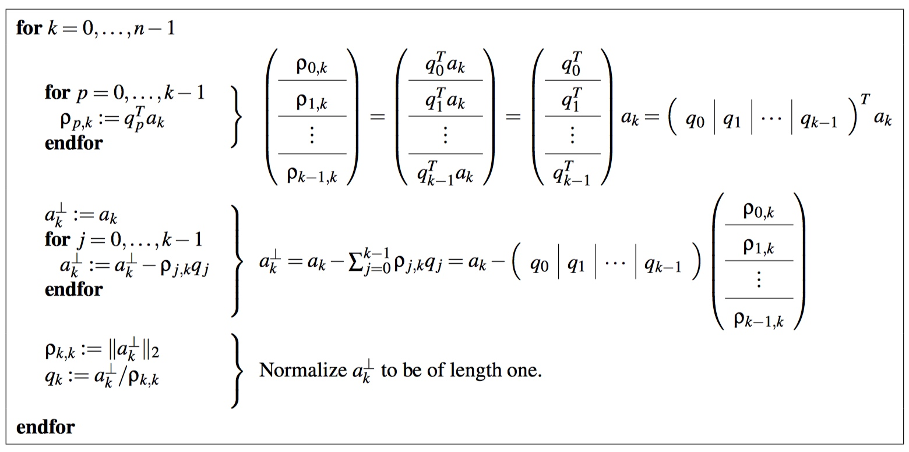
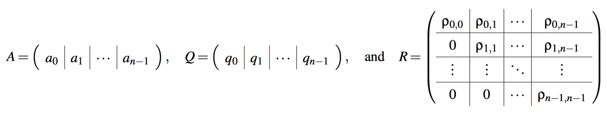
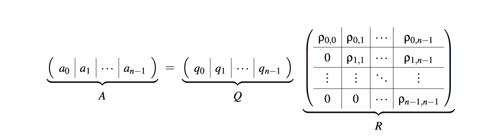
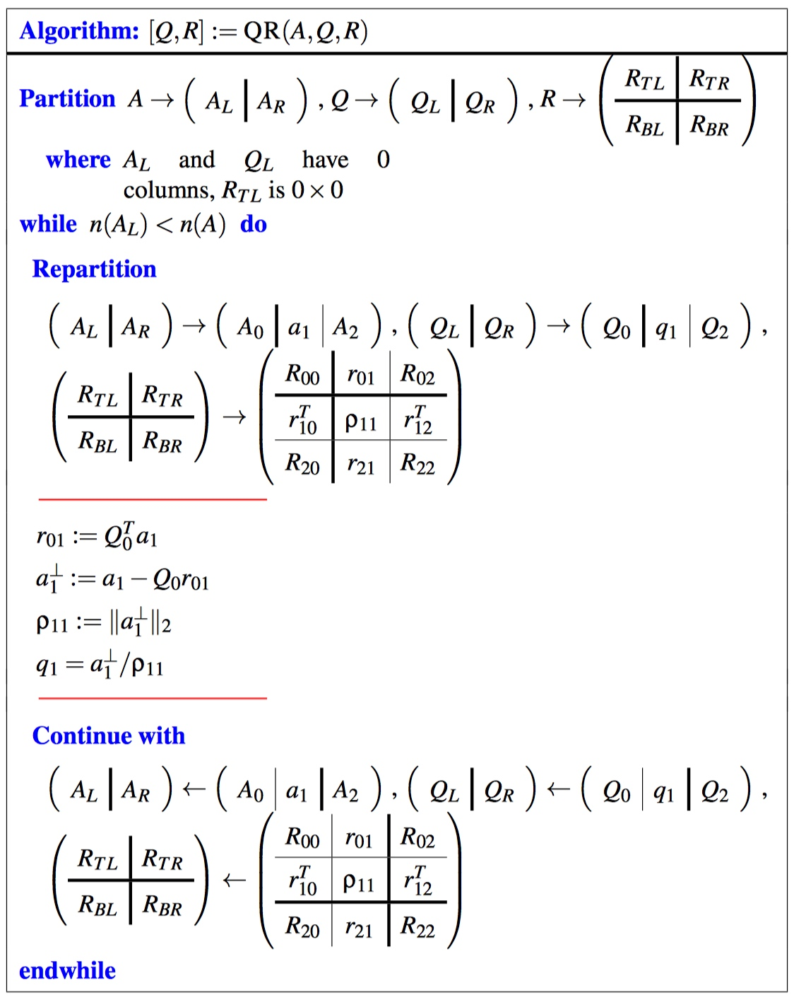
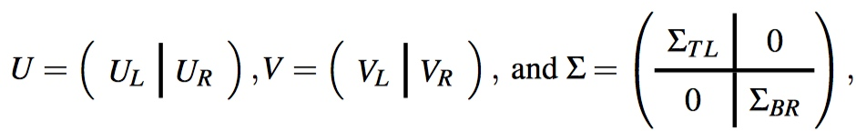

# Week 11 - Orthogonal Projection, Low Rank Approximation, and Orthogonal Bases

[TOC]

## Rank-k Approximation

### Projecting a Vector onto a Subspace

* 
* Here, we have two vectors, \\(a, b \in \mathbb{R}^m\\). They exist in the plane defined by \\(\text{Span}({a, b})\\) which is a two dimensional space (unless a and b point in the same direction). 
* \\(b = z + w\\)
* \\(z = \chi a \text{ with } \chi \in \mathbb{R}\\)
* \\(a^T w = 0\\)
* \\(0 = a^T w = a^T(b - z) = a^T (b - \chi a)\\)
* \\(a^T a \chi = a^T b\\).
* Provided \\(a \ne 0\\), \\(\chi = (a^T a)^{-1}(a^T b)\\).
* Thus, the component of \\(b\\) in the direction of \\(a\\) is given by \\[z = \chi a = (a^T a)^{-1} (a^T b) a = a(a^T a)^{-1}(a^T b) = [a(a^T a)^{-1}a^T ] b = [\frac{1}{a^T a} a a^T ] b\\]
    * Notice \\((a^Ta)^{-1}\\) and \\(a^T b\\) are both scalars.
    * We say that, given vector \\(a\\), the matrix that projects any given vector \\(b\\) onto the space spanned by \\(a\\) is given by \\[a(a^T a)^{-1}a^T = \frac{1}{a^T a} a a^T \\]
* The component of \\(b\\) orthogonal (perpendicular) to \\(a\\) is given by \\[w = b - z = b - (a(a^T a)^{-1}a^T ) b = Ib - (a(a^T a)^{-1}a^T )b = (I - a(a^T a)^{-1}a^T )b\\]
    * We say that, given vector \\(a\\), the matrix that projects any given vector \\(b\\) onto the space spanned by \\(a\\) is given by \\[I - a(a^T a)^{-1}a^T = I - \frac{1}{a^T a} a a^T \\]
* Set \\(v^T = (a^T a)^{-1}a^T\\),
    * \\(z = (a v^T) b\\)
    * \\(w = (I - a v^T) b\\)
    * Notice \\((I - a v^T)\\) is a rank-1 update to the identity matrix.
* Given \\(a, x \in \mathbb {R}^ m\\), we can use \\(P_ a( x )\\) and \\(P_ a ^{\perp}( x )\\) to represent the projection of vector \\(x\\) onto \\({\rm Span}(\{ a\} )\\) and \\({\rm Span}(\{ a\} )^{\perp}\\).

* Given \\(A \in \mathbb{R}^{m \times n}\\) with linearly independent columns and vector \\(b \in \mathbb{R}^m\\) :
    * Component of \\(b\\) in \\(\mathcal{C}(A)\\): \\[u = A(A^TA)^{-1} A^Tb\\]
    * Matrix that projects onto \\(\mathcal{C}(A)\\): \\[A(A^TA)^{-1}A^T\\]
    * Component of \\(b\\) in \\(\mathcal{C}(A)^{\perp} = \mathcal{N}(A^T)\\): \\[w = b - A(A^TA)^{-1}A^T b = (I - A(A^TA)^{-1}A^T) b\\]
    * Matrix that projects onto \\(\mathcal{C}(A)^{\perp} = \mathcal{N}(A^T)\\): \\[(I - A(A^TA)^{-1}A^T)\\]

### Rank-k Approximation

* "Best" **rank-k approximation** of \\(B \in \mathbb{R}^{m \times n}\\) using the column space of \\(A \in \mathbb{R}^{m \times k}\\) (pick \\(k\\) columns in B to get A) with linearly independent columns: \\[A(A^TA)^{-1}A^TB = AV, \text{ where } V = (A^TA)^{-1}A^TB\\]
    * To calculate \\(V = (A^TA)^{-1}A^TB\\)
    * First way is, to use LU factorization:
        * \\((A^TA)V = (A^TA)(A^TA)^{-1}A^TB\\)
        * \\((A^TA)V = A^TB\\)
        * solve \\(C = A^TA\\) and \\(Y = A^TB\\) separately, then solve \\( C V = Y\\) by LU factorization.
    * Second way is, to use Cholesky factorization:
        * \\((A^TA)V = A^TB\\)
        * Since \\(A^TA\\) is a symmetric positive definite(SPD) matrix. Then, we can transfer it to \\(LL^T = A^TA\\)
        * \\(LL^TV = A^TB\\)
        * set \\(U = L^TV\\)
        * solve \\(Y = A^TB\\)
        * Then solve \\(LU = Y\\), to get \\(U\\).
        * solve \\(L^TV = U\\), to get \\(V\\).

## Orthonormal Bases

### Orthonormal Vectors

* Definition: Let \\(q_0, q_1, \ldots, q_{k-1} \in \mathbb{R}^m\\). Then these vectors are (mutally) orthonormal if for all \\(0 \le i,j < k\\): \\[q_i^T q_j = \begin{cases} 1 & \text{ if } i = j \\ 0 & \text{ otherwise. }\end{cases}\\]
    * \\(\lVert q_i \rVert_2 = 1\\)
    * \\(q_i\\) is orthogonal to \\(\{q_0, q_1, \ldots, q_{i-1}, q_{i+1}, \ldots, q_{m}\}\\).

### Gram-Schmidt orthogonalization (GS orthogonalization)

* Definition: Transform a given set of basis vectors into a set of **orthonormal vectors** that form a basis for the same space.
* Starting with linearly independent vectors \\(a_0, a_1, \ldots, a_{n-1} \in \mathbb{R}^m\\), the following algorithm computes the mutually orthonormal vectors \\(q_0, q_1, \ldots, q_{n-1} \in \mathbb{R}^m\\) such that \\(\text{Span}(\{a_0, a_1, \ldots, a_{n-1}\}) = \text{Span}(\{q_0, q_1, \ldots, q_{n-1}\})\\):
* 
* The key of this transformation is:
    * We are trying to find the orthogonal \\(a_i^{\perp}\\) to the vectors \\(q_0, q_1, \ldots, q_{i-1}\\), then divided by the length of \\(a_i\\) ( i.e. \\(\lVert a_i^{\perp} \rVert _2\\)).
        * \\(a_i^{\perp} = a_i - q_0^T a_i q_0 - q_1^T a_i q_1 - \ldots - q_{i-1}^T a_i q_{i-1} \\) 
        * \\(=  a_i - \rho_{0,i} q_0 - \rho_{1,i} q_1 - \ldots - \rho_{i-1,i} q_{i-1}\\)
* Notice:
    * \\(\rho_{0,0} = \lVert a_0 \rVert _2, q_0 = a_0 / \rho_{0,0}\\)
        * Notice that \\(\text{Span}(\{a_0\}) = \text{Span}(\{q_0\})\\) since \\(q_0\\) is simply a scalar multiple of \\(a_0\\).
    * \\(\rho_{0,1} = (q_0^T q_0)^{-1} q_0^T a_1 = q_0^T a_1\\)
        * \\(q_i\\) is orthonormal vector, so \\((q_0^T q_0)^{-1} = 1\\)
        * \\(\rho_{0,1}\\) is like \\(\chi\\) in the image of the [first section of this week](#projecting-a-vector-onto-a-subspace).
    * \\(\rho_{0,2} = q_0^T a_2\\)
    * \\(\rho_{1,1} = \lVert a_1^{\perp} \rVert _2, q_1 = a_1^{\perp} / \rho_{1,1}\\)
        * \\(a_1^{\perp} = a_1 - \rho_{0,1} q_0\\)
    * \\(\rho_{1,2} = q_1^T a_2\\)

### The QR factorization

* Given \\(A \in \mathbb{R}^{m \times n}\\) with linearly independent columns, there exists a matrix \\(Q \in \mathbb{R}^{m \times n}\\) with mutually orthonormal columns and upper triangular matrix \\(R \in \mathbb{R}^{n \times n}\\) such that \\(A = QR\\).
* If one partitions
* 
* then 
* 
* and **Gram-Schmidt orthogonalization** (the Gram-Schmidt process) in the above algorithm computes the columns of Q and elements of R.

### Solving the linear least-squares problem via the QR factorization

* Given \\(A \in \mathbb{R}^{m \times n}\\) with linearly independent columns, there exists a matrix \\(Q \in \mathbb{R}^{m \times n}\\) with mutually orthonormal columns and upper triangular matrix \\(R \in \mathbb{R}^{n \times n}\\) such that \\(A = QR\\). The vector \\(\hat{x}\\) that is the best solution (in the linear least-squares sense) to \\(Ax \approx b\\) is given by
    * \\(\hat{x} = (A^T A)^{-1} A^T b\\) (as shown in Week 10) computed by solving the normal equations \\[A^TAx = A^T b\\]
    * \\(\hat{x} = R^{-1} Q^T b\\) computed by solving \\[Rx = Q^Tb\\]
        * Notice \\(Q^T Q = I\\) and \\(R\\) is upper trianglar.
        * And Columns of A must be linear independent.

* An algorithm for computing the QR factorization is given by
    * 

#### Change of Basis

* A vector \\(b \in \mathbb{R}^m\\) and a matrix \\(Q \in \mathbb{R}^{m \times n}\\) with mutually orthonormal columns.
* \\(Q^T Q = Q Q^T = Q^{-1} Q = Q Q^{-1} = I\\)
* \\(b = Q Q^T b = \left(\begin{array}{c|c|c}q_0 & q_1 & \cdots & q_{n-1}\end{array}\right)\left(\begin{array}{c}q_0^T \\ q_1^T \\ \vdots \\ q_{n-1}^T\end{array}\right) b = q_0^T b q_0 + q_1^T b q_1 + \ldots + q_{i-1}^T b q_{i-1}\\)
    * \\(q_0^T b q_0 = q_0 q_0^T b\\) because \\(q_0^T b \\) is scalar.
    * notice that each of these terms is just a component of the vector \\(b\\) in the direction of the given basis vector.

### Singular Value Decomposition

* Any matrix \\(A \in \mathbb{R}^{m \times n}\\) can be written as the product of three matrices, the Singular Value Decomposition (SVD): \\[A = U \Sigma V^T\\] where
    * \\(U \in \mathbb{R}^{m \times r}\\) and \\(U^T U = I\\) (U has orthonormal columns).
    * \\(\Sigma \in \mathbb{R}^{r \times r}\\) is a diagonal matrix with positive diagonal elements that are ordered so that \\(\sigma_{0,0} \ge \sigma_{1,1} \ge \ldots \ge \sigma_{(r-1),(r-1)} > 0\\).
    * \\(V \in \mathbb{R}^{n \times r}\\) and \\(V^T V = I\\) (V has orthonormal columns).
    * \\(r\\) equals the rank of matrix \\(A\\).

* If we partition
    * 
* where \\(U_L\\) and \\(V_L\\) have \\(k\\) columns and \\(\Sigma_{TL}\\) is \\(k \times k\\), then \\(U_L \Sigma_{TL} V_L^T\\) is the “best” rank-k approximation to matrix B. So, the “best” rank-k approximation \\(B = AW^T\\) is given by the choices \\(A = U_L\\) and \\(W = \Sigma_{TL} V_L\\).
    * Given \\(A \in \mathbb{R}^{m \times n}\\) with linearly independent columns, and \\(b \in \mathbb{R}^m\\) , the “best” solution to \\(Ax \approx b\\) (in the linear least-squares sense) via its SVD, \\(A = U \Sigma V^T\\) , is given by \\[\begin{aligned}\hat{x} &= (A^TA)^{-1}A^T b \\ &= ((U \Sigma V^T)^T U \Sigma V^T)^{-1} (U \Sigma V^T)^T b \\ &= V \Sigma^{-1} U^T b \end{aligned}\\]

