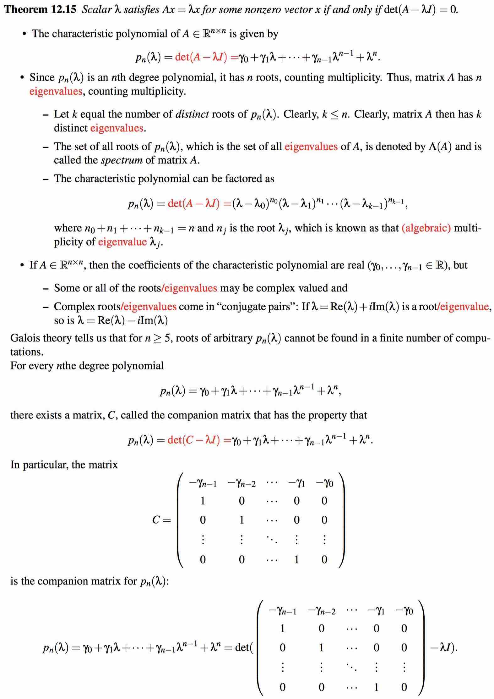

# Week 12 - Eigenvalues and Eigenvectors

[TOC]

## The Algebraic Eigenvalue Problem

* The algebraic eigenvalue problem is given by \\[Ax = \lambda x\\]
* where \\(A \in \mathbb{R}^{n \times n}\\) is a square matrix, \\(\lambda\\) is a scalar, and \\(x\\) is a nonzero vector.
    * If \\(x \ne 0\\), then \\(\lambda\\) is said to be an eigenvalue and x is said to be an **eigenvector** associated with the **eigenvalue** \\(\lambda\\).
    * The tuple \\((\lambda, x)\\) is said to be an **eigenpair**.
    * The set of all vectors that satisfy \\(Ax = \lambda x\\) is a subspace.
* Equivalent statements:
    * \\(Ax = \lambda x\\), where \\(x \ne 0\\).
    * \\((A - \lambda I) x = 0\\), where \\(x \ne 0\\).
    * \\(A - \lambda I\\) is singular.
    * \\(\mathcal{N}(A - \lambda I)\\) contains a nonzero vector x.
        * This is a consequence of there being a vector \\(x \ne 0\\) such that \\((A - \lambda I)x = 0\\).
    * \\(\text{dim}(\mathcal{N}(A - \lambda I)) > 0\\).
    * \\(\text{det}(A - \lambda I) = 0\\).
        * => \\(\mathcal{N}(A - \lambda I) \ne \{0\}\\)
        * A is a square matrix => \\((A - \lambda I)\\) is not invertible
        * => \\((A - \lambda I) x = 0\\) has many solutions.
        * More proves in **Week 7#Showing that A^T A is invertible**
        
* If we find a vector \\(x \ne 0\\) such that \\(Ax = \lambda x\\), it is certainly not unique.
    * For any scalar \\(\alpha\\), \\(A(\alpha x) = \lambda (\alpha x)\\) also holds.
    * If \\(Ax = \lambda x\\) and \\(Ay = \lambda y\\), then \\(A(x + y) = Ax + Ay = \lambda x + \lambda y = \lambda (x + y)\\)
* We conclude that the set of all vectors \\(x\\) that satisfy \\(Ax = \lambda x\\) is a subspace.

### Simple cases

* The eigenvalue of the **zero** matrix is the scalar \\(\lambda = 0\\). All nonzero vectors are eigenvectors.
* The eigenvalue of the **identity** matrix is the scalar \\(\lambda = 1\\). All nonzero vectors are eigenvectors.
* The eigenvalues of a **diagonal** matrix are its elements on the diagonal. The unit basis vectors are eigenvectors.
* The eigenvalues of a **triangular** matrix are its elements on the diagonal.
    * Because if there is a zero on the diagonal, it is singular.
* The eigenvalues of a 2 × 2 matrix can be found by finding the roots of \\(p_2(\lambda) = \text{det}(A - \lambda I) = 0\\)
* The eigenvalues of a 3 × 3 matrix can be found by finding the roots of \\(p_3(\lambda) = \text{det}(A - \lambda I) = 0\\)

#### Compute the eigenvalues and eigenvectors of 2×2 matrices

* Compute \\[\text{det}(\begin{pmatrix} (\alpha_{0,0} - \lambda) & \alpha_{0,1} \\ \alpha_{1,0} & (\alpha_{1,1} - \lambda)\end{pmatrix}) = (\alpha_{0,0} - \lambda)(\alpha_{1,1} - \lambda) - \alpha_{0,1}\alpha_{1,0}\\]
* Recognize that this is a second degree polynomial in \\(\lambda\\).
* It is called the **characteristic polynomial** of the matrix \\(A, p_2(\lambda)\\).
* Compute the coefficients of \\(p_2(\lambda)\\) so that \\[p_2(\lambda) = - \lambda^2 + \beta \lambda + \gamma\\]
* Solve \\[- \lambda^2 + \beta \lambda + \gamma = 0\\]
* for its roots. You can do this either by examination, or by using the quadratic formula: \\[\lambda = \frac{-\beta \pm \sqrt{\beta^2 + 4 \gamma} }{-2}\\]
* For each of the roots, find an eigenvector that satisfies \\[\begin{pmatrix} (\alpha_{0,0} - \lambda) & \alpha_{0,1} \\ \alpha_{1,0} & (\alpha_{1,1} - \lambda)\end{pmatrix}\begin{pmatrix} \chi_0 \\ \chi_1\end{pmatrix} = \begin{pmatrix} 0 \\ 0\end{pmatrix}\\]
* The easiest way to do this is to subtract the eigenvalue from the diagonal, set one of the components of \\(x\\) to 1, and then solve for the other component.
* Check your answer! It is a matter of plugging it into \\(Ax = \lambda x\\) and seeing if the computed \\(\lambda\\) and \\(x\\) satisfy the equation.

### General case

* **Theorem**: The matrix \\(A \in \mathbb{R}^{n \times n}\\) is **nonsingular** iff \\(\text{det}(A) \ne 0\\).
* **Theorem**: Given \\(A \in \mathbb{R}^{n \times n}\\), \\[p_n(\lambda) = \text{det}(A - \lambda I) = \lambda^n + \gamma_{n-1} \lambda^{n-1} + \cdots + \gamma_1 \lambda + \gamma_0\\] for some **coefficients** \\(\gamma_1, \ldots, \gamma_{n-1} \in \mathbb{R}\\)
* **Definition**: Given \\(A \in \mathbb{R}^{n \times n}\\), \\(p_n(\lambda) = \text{det}(A - \lambda I)\\) is called the **characteristic polynomial**.

* 

## Diagonalization

* **Theorem**: Let \\(A \in \mathbb{R}^{n \times n}\\). Then there exists a nonsingular matrix \\(X\\) such that \\(X^{-1} A X = \Lambda\\) iff \\(A\\) has **n** linearly independent eigenvectors.
* If \\(X\\) is invertible (nonsingular, has linearly independent columns, etc.), then the following are equivalent \\[\begin{aligned} X^{-1} A X &= \Lambda \\ A X &= X \Lambda \\ A &= X \Lambda X^{-1}\end{aligned}\\]
* If \\(\Lambda\\) is in addition diagonal, then the diagonal elements of \\(\Lambda\\) are eigenvectors of **A** and the columns of **X** are eigenvectors of **A**.

### Defective matrices

* It is **not** the case that for every \\(A \in \mathbb{R}^{n \times n}\\) there is a nonsingular matrix \\(A \in \mathbb{R}^{n \times n}\\) such that \\(X^{-1} A X = \Lambda\\), where \\(\Lambda\\) is diagonal.
* In general, the k ×k matrix \\(J_k(\lambda)\\) given by \\[J_k(\lambda) = \begin{pmatrix} \lambda & 1 & 0 & \cdots & 0 & 0 \\ 0 & \lambda & 1 & \cdots & 0 & 0 \\ 0 & 0 & \lambda & \cdots & 0 & 0 \\ \vdots & \vdots & \vdots & \ddots & \vdots & \vdots \\ 0 & 0 & 0 & \cdots & \lambda & 1 \\ 0 & 0 & 0 & \cdots & 0 & \lambda \end{pmatrix}\\] has eigenvalue \\(\lambda\\) of algebraic multiplicity **k**, but geometric multiplicity one (it has only one linearly independent eigenvector). Such a matrix is known as a Jordan block.

## Others

* **A matrix is singular** if and only if 0 is one of its **eigenvalues**. A singular matrix can be either diagonalizable or not diagonalizable. For example, \\(\left(\begin{array}{c c} 1 & 0 \\ 0 & 0\end{array}\right)\\) is diagonalizable, and \\(\left(\begin{array}{c c} 0 & 1 \\ 0 & 0\end{array}\right)\\) is not diagonalizable.

## Refers

* [http://mathworld.wolfram.com/SingularMatrix.html](http://mathworld.wolfram.com/SingularMatrix.html)
* [https://en.wikipedia.org/wiki/Invertible_matrix](https://en.wikipedia.org/wiki/Invertible_matrix)
* [http://mathworld.wolfram.com/Determinant.html](http://mathworld.wolfram.com/Determinant.html)

## Words 

* **eigenvalue** ['aiɡən,vælju:] n. [数] 特征值
* **eigenvector** ['aiɡən,vektə] n. [数] 特征向量；本征矢量
* **diagonalization** [dai,æɡənəlai'zeiʃən, -li'z-] n. [数] 对角化；对角线化

