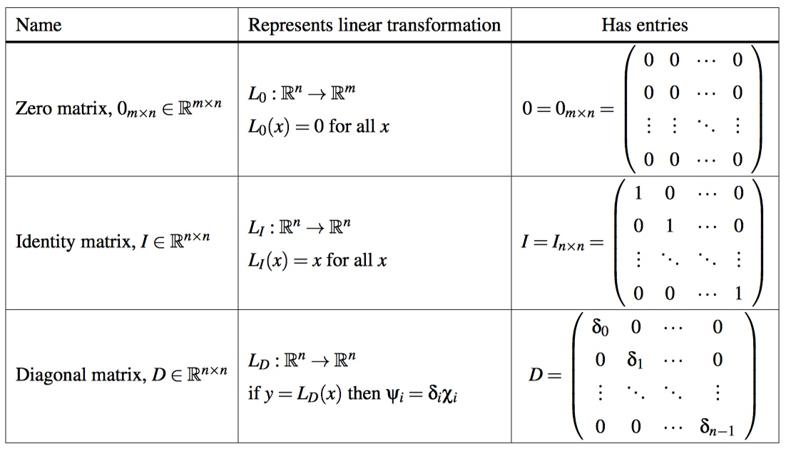
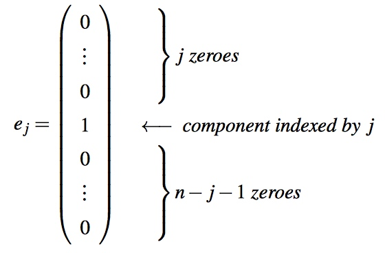
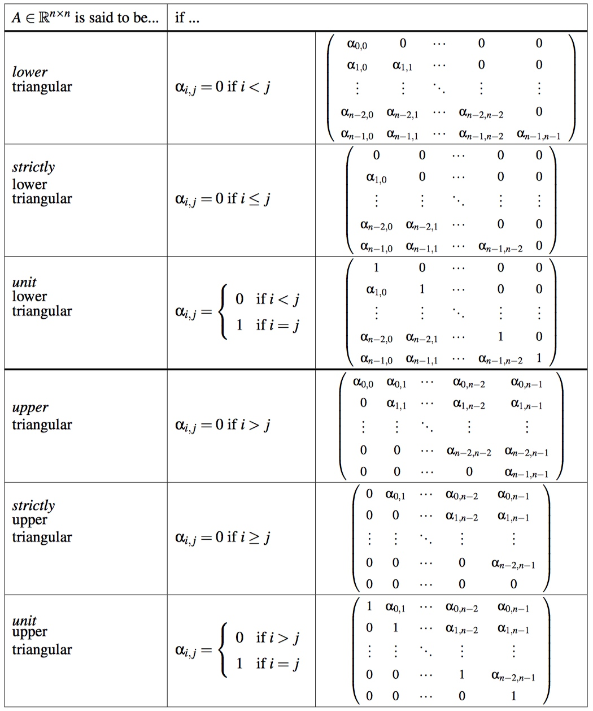
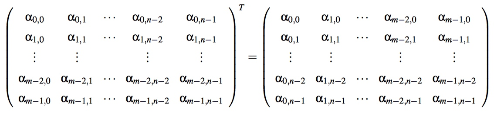
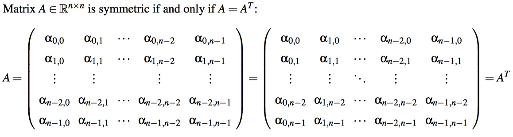
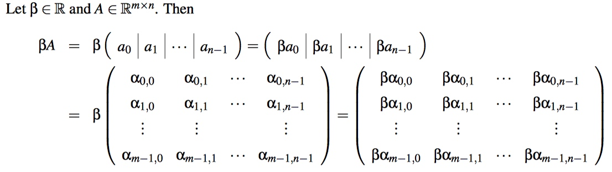
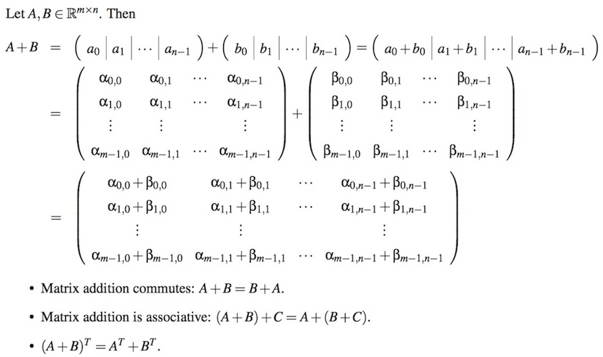
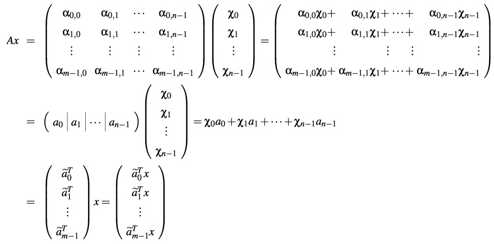

# Week 3 - Matrix-Vector Operations

[TOC]

## Special Matrices

* 

* Special Vectors:
    * **Unit Vector**: Any vector of length one (unit length). For example, the vector  $$\begin{pmatrix}\frac{\sqrt{2}}{2} \\ \frac{\sqrt{2}}{2}\end{pmatrix}$$ has length one.
    * **Standard Unit Vector**: 
        * 

## Triangular Matrices

* 

## Transpose Matrix

* 

## Symmetric Matrix

* 

## Scaling a Matrix

* 

## Adding Matrices

* 

## Matrix-vector Multiplication

* 

## Cost of Matrix-Vector Multiplication

* Consider $$y := Ax+y\ \text{, where } A \in R^{m \times n}$$ :
    * Notice that there is a multiply and an add for every element of A.
    * Since A has $$m \times n = mn$$ elements, $$y := Ax+y$$, requires **mn** multiplies and **mn** adds, for a total of **2mn** floating point operations (flops).

