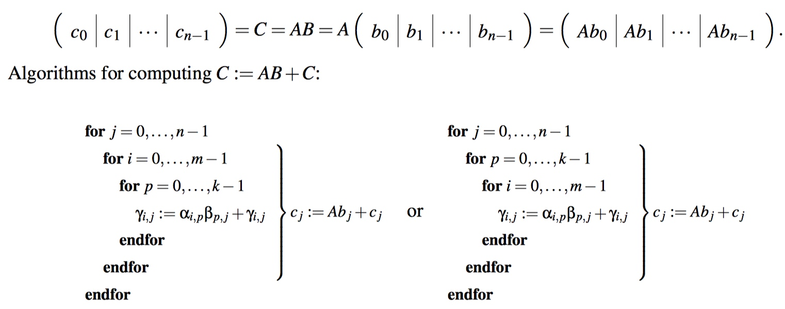

# Week 5 - Matrix- Matrix Multiplication

[TOC]

## Composing Rotations

* Rotate vector \\(\chi\\) through angle \\(\theta\\) then \\(\rho\\)
* 
* \\[R_{\theta}(\left(\begin{array}{c} \chi_{0} \\ \chi_1\end{array}\right)) =\left( \begin{array}{c|c} \cos(\theta) & -\sin(\theta) \\ \sin(\theta) &  \cos(\theta) \end{array} \right)\left(\begin{array}{c} \chi_{0} \\ \chi_1\end{array}\right)\\]
* \\[R_{\rho}(R_{\theta}(\left(\begin{array}{c} \chi_{0} \\ \chi_1\end{array}\right))) = \left( \begin{array}{c|c} \cos(\theta) & -\sin(\theta) \\ \sin(\theta) &  \cos(\theta) \end{array} \right) \left( \left( \begin{array}{c|c} \cos(\theta) & -\sin(\theta) \\ \sin(\theta) &  \cos(\theta) \end{array} \right) \left(\begin{array}{c} \chi_{0} \\ \chi_1\end{array}\right) \right) \\]
* \\[R_{\rho}(R_{\theta}(\left(\begin{array}{c} \chi_{0} \\\chi_1\end{array}\right))) = \left( \begin{array}{c|c} \cos(\theta) & -\sin(\theta) \\ \sin(\theta) &  \cos(\theta) \end{array} \right) \left( \begin{array}{c|c} \cos(\theta) & -\sin(\theta) \\ \sin(\theta) &  \cos(\theta) \end{array} \right) \left(\begin{array}{c} \chi_{0} \\ \chi_1\end{array}\right)\\]
    * \\[ = \left( \begin{array}{c|c} \cos(\rho)\cos(\theta) -\sin(\rho)\sin(\theta) & -\cos(\rho)\sin(\theta) - \sin(\rho)\cos(\theta)\\ \cos(\rho)\sin(\theta) + \sin(\rho)\cos(\theta) &  \cos(\rho)\cos(\theta) - \sin(\rho)\sin(\theta) \end{array} \right) \left(\begin{array}{c|c} \chi_{0} \\ \chi_1\end{array}\right)\\]
* \\[R_{\rho}(R_{\theta}(\left(\begin{array}{c} \chi_{0} \\ \chi_1\end{array}\right))) = R_{\theta + \rho}(\left(\begin{array}{c|c} \chi_{0} \\ \chi_1\end{array}\right)) = \left( \begin{array}{c|c} \cos(\theta + \rho) & -\sin(\theta + \rho) \\ \sin(\theta + \rho) &  \cos(\theta + \rho) \end{array} \right) \left(\begin{array}{c} \chi_{0} \\ \chi_1\end{array}\right)\\]
    * \\(\cos(\theta + \rho) =\cos(\rho)\cos(\theta) -\sin(\rho)\sin(\theta)\\)
    * \\(\sin(\theta + \rho) = \cos(\rho)\sin(\theta) + \sin(\rho)\cos(\theta)\\)

## Observations

### Transposing a Product of Matrices 

* Let \\(A \in \mathbb{R}^{m \times k} \text{ and }B \in \mathbb{R}^{k \times n}. (AB)^T = B^T A^T.\\)
* Let \\(A,B \text{and} C\\) be conformal matrices so that \\(ABC\\) is well-defined. Then \\((ABC)^T = C^T B^T A^T\\).

### Matrix-Matrix Multiplication with Special Matrices

* Let \\(A \in \mathbb{R}^{m \times n}\\) and let \\(I\\) denote the identity matrix of appropriate size.
    * \\(A I = I A = A\\)
* Let \\(A \in \mathbb R^{m \times n}\\) and let \\(D\\) denote the diagonal matrix with diagonal elements \\(\delta_0, \delta_1, \cdots, \delta_{n-1}\\). Partition \\(A\\) by columns : \\[A= \left( \begin{array}{r|r|r|r} a_0 &  a_1 & \dots &  a_{n-1} \end{array} \right).\\] \\[AD= \left ( \begin{array}{r|r|r|r} \delta_0 a_0 &  \delta_1 a_1 &   \dots  &  \delta_{n-1}a_{n-1} \end{array} \right).\\]
* Let \\(A \in \mathbb R^{m \times n}\\) and let \\(D\\) denote the diagonal matrix with diagonal elements \\(\delta_0, \delta_1, \cdots, \delta_{m-1}\\). Partition \\(A\\) by rows : \\[A= \left( \begin{array}{c} \widetilde a_0^{T} \\   \widetilde a_1^{T} \\  \vdots \\   \widetilde a_{m-1}^{T} \end{array} \right).\\] \\[DA= \left ( \begin{array}{c} \delta_0 \widetilde a_0^{T} \\   \delta_1 \widetilde a_1^{T} \\    \vdots  \\   \delta_{m-1} \widetilde a_{m-1}^{T} \end{array} \right).\\]
* Let \\(U, R \in \mathbb{R}^{n \times n}\\) be upper triangular matrices.
    * The product \\(UR\\) is an upper triangular matrix.
    * same as lower triangular.
* Let \\(A \in \mathbb R^{m \times n}\\). \\(A^TA\\) is symmetric.
    * \\((A^TA)^T = A^T(A^T)^T = A^TA\\)
* Let \\(A,B \in \mathbb R^{n \times n}\\) be symmetric matrices. \\(AB\\) may be symmetric.
    1. \\(B = A\\)
    2. \\(A = I or B = I\\)
    3. An example when this is false: \\[A= \begin{pmatrix} 0 & 1 \\ 1 & 0 \end{pmatrix} B=\begin{pmatrix} 1 & -1 \\ -1 & 2 \end{pmatrix} AB=\begin{pmatrix} -1 & 2 \\ 1 & -1 \end{pmatrix} \\]

## Algorithms for Computing Matrix-Matrix Multiplication

* Loops for computing C := AB
    * The easiest way is three loops via dot product:
        * 
* Three other different ways: by Columns, by Rows and with Rank-1 Updates.
* Computing C := AB by columns
    * 
    * Inner loop: \\(c_1^T = a_1^T B + c_1^T\\)
* Computing C := AB by rows
    * 
    * Inner loop: \\(c_1 = A b_1 + c_1\\)
* Computing C := AB via rank-1 updates
    * 
    * Inner loop: \\(C = a_1b_1^t + C\\)
    * Start with first column of A and first row of B. Notice that after calculating \\(a_0 \widetilde b_0^{T}\\), all of the elements in C are set to a new value. Like layer by layer to rewrite C.

## Optimize Matrix Matrix Multiplication

* [Slicing and Dicing for Performance](https://courses.edx.org/courses/course-v1:UTAustinX+UT.5.05x+2T2017/courseware/9fc355378f26481282ffa7961b74b402/c78ce0ba3206468c8629ae2817746439/1?activate_block_id=block-v1%3AUTAustinX%2BUT.5.05x%2B2T2017%2Btype%40vertical%2Bblock%4023ea74b30da04cada12135fa2592a61f)
* [How It is Really Done](https://courses.edx.org/courses/course-v1:UTAustinX+UT.5.05x+2T2017/courseware/9fc355378f26481282ffa7961b74b402/c78ce0ba3206468c8629ae2817746439/2?activate_block_id=block-v1%3AUTAustinX%2BUT.5.05x%2B2T2017%2Btype%40vertical%2Bblock%4021df08b0e8fc41b0a34c992eeaf5d74b)
* [(wiki)how-to-optimize-gemm](https://github.com/flame/how-to-optimize-gemm/wiki)

