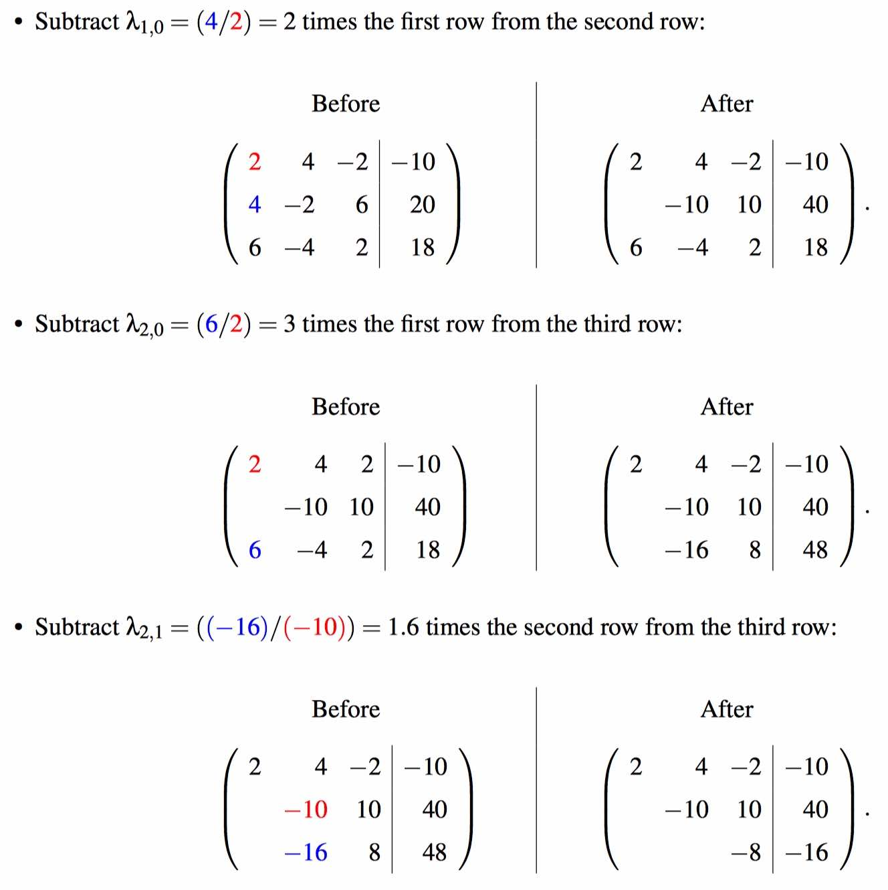
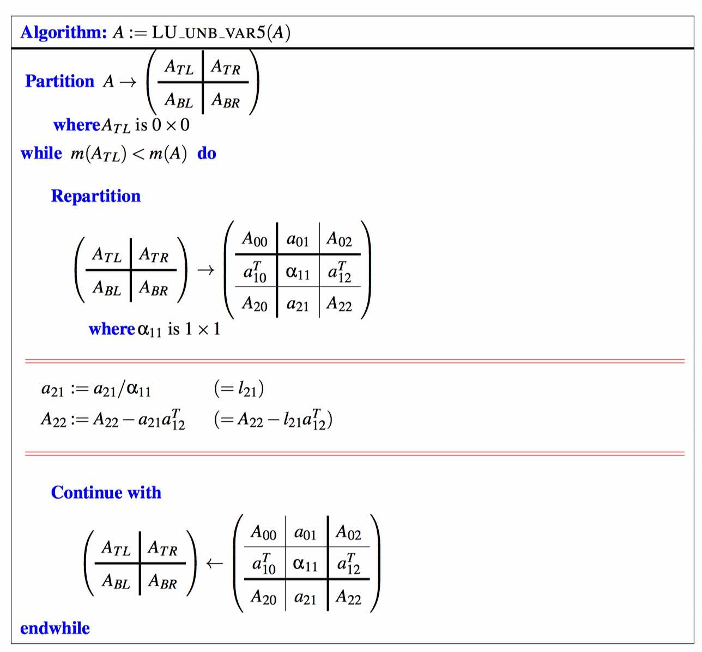

# Week 6 - Gaussian Elimination

[TOC]

## Gaussian Elimination

* To solv the linear system: \\[\begin{array}{c c c c c c}
    2 \chi_0 & + & 4 \chi_1 & - & 2 \chi_2 & = & -10 \\
    4 \chi_0 & - & 2 \chi_1 & + & 6 \chi_2 & = & 20 \\
    6 \chi_0 & - & 4 \chi_1 & + & 2 \chi_2 & = & 18
    \end{array}\\]

### Procedures

* **Transform linear system of equations to an upper triangular system**
    * Subtract \\(\lambda_{1,0} = (\color{blue}{4}/\color{red}{2}) = 2\\) times the first equation from the second equation: \\[\begin{array}{c | c}
        \text{Before} & \text{After} \\
        \begin{array}{c c c c c c}
    \color{red}{2} \chi_0 & + & 4 \chi_1 & - & 2 \chi_2 & = & -10 \\
    4 \chi_0 & - & 2 \chi_1 & + & 6 \chi_2 & = & 20 \\
    6 \chi_0 & - & 4 \chi_1 & + & 2 \chi_2 & = & 18
    \end{array} & \begin{array}{c c c c c c}
    2 \chi_0 & + & 4 \chi_1 & - & 2 \chi_2 & = & -10 \\
    & - & 10 \chi_1 & + & 10 \chi_2 & = & 40 \\
    6 \chi_0 & - & 4 \chi_1 & + & 2 \chi_2 & = & 18
    \end{array}
    \end{array}\\]
    
    * Subtract \\(\lambda_{2,0} = (\color{blue}{6}/\color{red}{2}) = 3\\) times the first equation from the third equation: \\[\begin{array}{c | c}
        \text{Before} & \text{After} \\
        \begin{array}{c c c c c c}
    \color{red}{2} \chi_0 & + & 4 \chi_1 & - & 2 \chi_2 & = & -10 \\
    & - & 10 \chi_1 & + & 10 \chi_2 & = & 40 \\
    \color{blue}{6} \chi_0 & - & 4 \chi_1 & + & 2 \chi_2 & = & 18
    \end{array} & \begin{array}{c c c c c c}
    2 \chi_0 & + & 4 \chi_1 & - & 2 \chi_2 & = & -10 \\
    & - & 10 \chi_1 & + & 10 \chi_2 & = & 40 \\
    & - & 16 \chi_1 & + & 8 \chi_2 & = & 48
    \end{array}
    \end{array}\\]
    
    * Subtract \\(\lambda_{2,0} = (\color{blue}{-16}/\color{red}{-10}) = 1.6\\) times the second equation from the third equation: \\[\begin{array}{c | c}
        \text{Before} & \text{After} \\
        \begin{array}{c c c c c c}
    2 \chi_0 & + & 4 \chi_1 & - & 2 \chi_2 & = & -10 \\
    & \color{red}{-} & \color{red}{10 \chi_1} & + & 10 \chi_2 & = & 40 \\
    & \color{red}{-} & \color{red}{16 \chi_1} & + & 8 \chi_2 & = & 48
    \end{array} & \begin{array}{c c c c c c}
    2 \chi_0 & + & 4 \chi_1 & - & 2 \chi_2 & = & -10 \\
    & - & 10 \chi_1 & + & 10 \chi_2 & = & 40 \\
    & & & - & 8 \chi_2 & = & - 16
    \end{array}
    \end{array}\\]
    
    * This now leaves us with an upper triangular system of linear equations.

* **Back substitution (solve the upper triangular system)**
    * The equivalent upper triangular system of equations is now solved via back substitution:
        * Consider the last equation, \\[-8 \chi_2 = -16.\\] Scaling both sides by by 1/(−8) we find that \\[\chi_2 = -16/(-8) = 2.\\]
        * Next, consider the second equation, \\[-10 \chi_1 + 10 \chi_2 = 40.\\] We know that \\(\chi_2 = 2\\), which we plug into this equation to yield \\[-10\chi_1 + 10(\color{blue}{2} = 40.)\\] Rearranging this we find that \\[\chi_1 = (40 - 10(\color{blue}{2}))/(-10) = -2.\\]
        * Finally, consider the first equation, \\[2\chi_0 + 4\chi_1 - 2\chi_2 = -10 \\] We know that \\(\chi_2 = \color{blue}{2}\\) and \\(\chi_1 = \color{blue}{-2}\\), which we plug into this equation to yield \\[2\chi_0 + 4(\color{blue}{-2}) - 2(\color{blue}{2}) = -10.\\] Rearranging this we find that \\[\chi_0 = (-10 - (4(\color{blue}{-2}) - (2)(\color{blue}{2})))/2 = 1.\\]
* Thus, the solution is vector \\[x = \left(\begin{array}{c} \chi_0 \\ \chi_1 \\ \chi_2 \end{array}\right) = \left(\begin{array}{c} 1 \\ -2 \\ 2 \end{array}\right).\\]
* **Check your answer** (by plugging \\(\chi_0 = 1, \chi_1 = -2, \text{and} \ \chi_2 = 2\\) into the original system).

### Representing the system of equations with an appended matrix

* 

### Transform to matrix to upper triangular matrix

* 

* **Forward substitution (applying the transforms to the right-hand side)**
* 

### Algorithms

* 

* 

## Solving Ax = b via LU Factorization

### LU Factorization

* A matrix \\(A \in R^{n \times n}\\) can be factored into the product of two matrices \\(L,U \in R^{n \times n}\\) : \\[A= LU\\] where L is unit lower triangular and U is upper triangular.
* LU Factorization is transfer A to a LU combined matrix.
    * We can do this, because L is unit lower triangle matrix and U is upper triangle matrix.
* 
* 
* After rearrange, we get:
    * 
* Partition matrix A:
    * Update \\(a_{21} = a_{21}/ \alpha_{11} (= l_{21})\\)
    * Update \\(A_{22} = A_{22} - a_{21} a_{12}^T\\) (Rank-1 update!)
    * Overwrite \\(A_{22}\\) with \\(L_{22}\\) and \\(U_{22}\\) by repeating with \\(A = A_{22}\\).
* This will leave U in the upper triangular part of A and the strictly lower triangular part of L in the strictly lower triangular part of A. The diagonal elements of L need not be stored, since they are known to equal one.

#### Algorithm

* 

### Where is this going?

1. Want to solve: \\(Ax = b\\)
    * Give A and b, solve x.
2. Now we find triangular L and U so that: \\(A = LU\\)
3. Substitute: \\((LU)x = b\\) => \\(L(Ux) = b\\)
4. Replace Ux with y. (\\(y = Ux\\)) => \\(Ly = b\\)
5. Solve \\(Ly = b\\) for \\(y\\). (**Next Section**)
    * Because solve a (lower) triangle matrix is easy.
6. Solve \\(Ux = y\\) for \\(x\\). (**Next Next Section**)

### Solving Lz = b (Forward substitution)

* Given a unit lower triangular matrix \\(L \in \mathbb{R}^{n \times n}\\) and vectors \\(z, b \in \mathbb{R}^{n}\\) , consider the equation \\(Lz = b\\) where L and b are known and z is to be computed. Partition
* 
* So, solving \\(Lz = b\\), overwriting b with z, is forward substitution when L is the unit lower triangular matrix that results from LU factorization.

#### Algorithm

* Algorithm for solving Lx = b, overwriting b with the result vector x. Here L is a lower triangular matrix.
* 

### Solving Ux = b (Back substitution)

* 

#### Algorithm

* 

### Cost

* Factoring \\(A = LU\\) requires, approximately, \\(\frac{2}{3}n^3\\) floating point operations.
* Solve \\(Lz = b\\) requires, approximately, \\(n^2\\) floating point operations.
* Solve \\(Ux = z\\) requires, approximately, \\(n^2\\) floating point operations.

