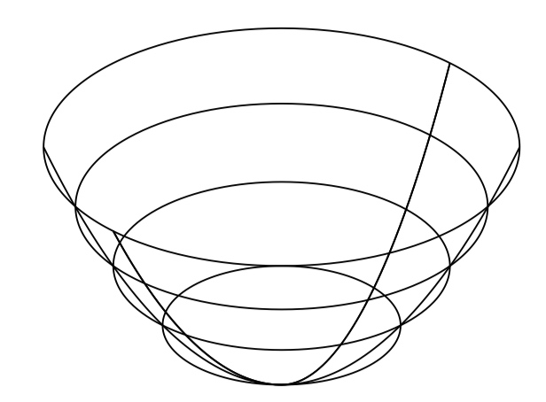
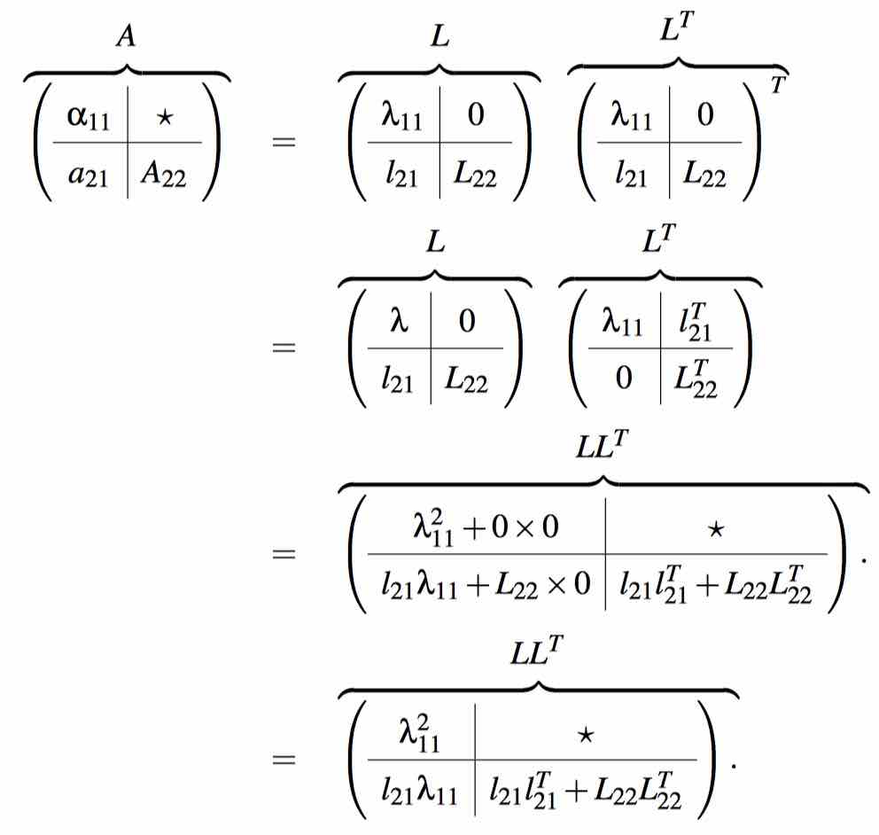
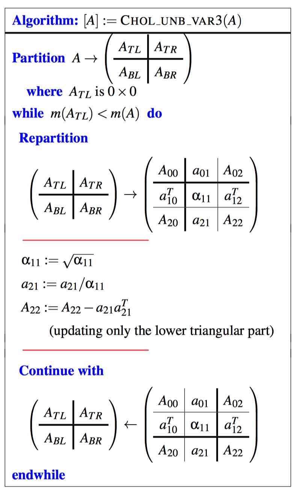

# Week 8 - More on Matrix Inversion

[TOC]

## Gauss-Jordan Elimination

* The key of Gauss-Jordan Elimination is to transfer matrix A to the identity matrix:
    * 

* \\(Ax=b\\)
* If A is non-singular, then:
    * \\(A^{-1}Ax = x \to A^{-1}b = x \to x = A^{-1}b\\)

### Computing A^−1 via Gauss-Jordan Elimination

* 
* Notice ,\\(\alpha_{11} = 1 / \alpha_{11}\\). Every iteration, we scale \\(\alpha_{11}\\) to **1**.
* 
* 

### Cost of inverting a matrix

* Via Gauss-Jordan, taking advantage of zeroes in the appended identity matrix, requires approximately \\(2n^3\\) floating point operations.

### (Almost) never, ever invert a matrix

* Solving Ax = b should be accomplished by first computing its LU factorization (possibly with partial pivoting) and then solving with the triangular matrices.

## Symmetric Positive Definite(SPD) Matrices

* Definition: Let \\(A \in \mathbb{R}^{n \times n}\\). Matrix A is said to be symmetric positive definite(SPD) if
    * A is symmetric; and
    * \\(x^T A x > 0 \\) for all nonzero vector \\(x \in \mathbb{R}^n\\).

* Consider the quadratic polynomial \\[p(\chi) = \alpha \chi^2 + \beta \chi + \gamma = \chi \alpha \chi + \beta \chi + \gamma\\]
* The graph of this function is a parabola that is “concaved up” if \\(\alpha > 0\\). In that case, it attains a minimum at a unique value \\(\chi\\).
* Now consider the vector function \\(f: \mathbb{R}^n \to \mathbb{R}\\) given by \\[f(x) = x^T A x + b^T x + \gamma\\] where \\(A \in \mathbb{R}^{n \times n}, b \in \mathbb{R}^n, \text{ and } \gamma \in \mathbb{R}\\) are all given. If A is a SPD matrix, then this equation is minimized for a unique vector x. If \\(n = 2\\), plotting this function when A is SPD yields a paraboloid that is concaved up:
    * 

### Solving Ax = b when A is Symmetric Positive Definite

#### Cholesky factorization theorem

* Let \\(A \in \mathbb{R}^{n \times n}\\) be a SPD matrix. Then there exists a lower trianglar matrix \\(L \in \mathbb{R}^{n \times n}\\) such that \\(A = LL^T\\). If the diagonal elements of L are chosen to be positive, this factorization is unique.
* 
* Algorithm:
    * 
* Notice that \\(\alpha_{11} := \sqrt{\alpha_{11} }\\) and \\(a_{21} := a_{21}/\alpha_{11}\\) which are legal if \\(\alpha > 0\\). It turns out that if **A** is SPD, then
    * \\(\alpha_{11} > 0\\) in the first iteration and hence \\(\alpha_{11} := \sqrt{\alpha_{11} }\\) and \\(a_{21} := a_{21}/\alpha_{11}\\) are legal; and
    * \\(A_{22} := A_{22} - a_{21} a_{21}^T\\) is again a SPD matrix. 

