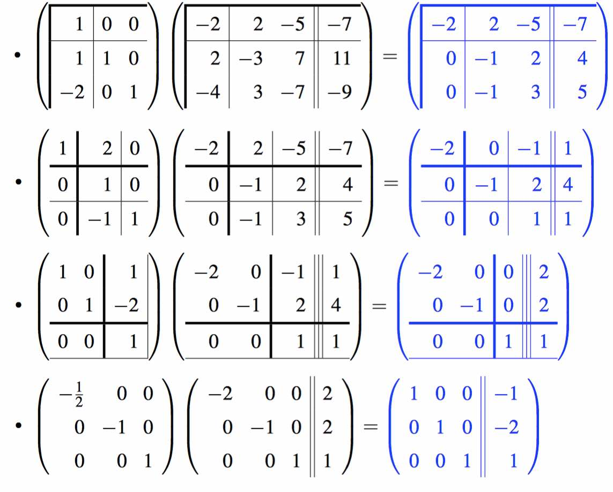

# Week 8 - More on Matrix Inversion

[TOC]

## Gauss-Jordan Elimination

* The key of Gauss-Jordan Elimination is to transfer matrix A to the identity matrix:
    * 

### Computing A^−1 via Gauss-Jordan Elimination

* 
* Notice ,\\(\alpha_{11} = 1 / \alpha_{11}\\). Every iteration, we scale \\(\alpha_{11}\\) to **1**.
* 
* 

### Cost of inverting a matrix

* Via Gauss-Jordan, taking advantage of zeroes in the appended identity matrix, requires approximately \\(2n^3\\) floating point operations.

### (Almost) never, ever invert a matrix

* Solving Ax = b should be accomplished by first computing its LU factorization (possibly with partial pivoting) and then solving with the triangular matrices.

