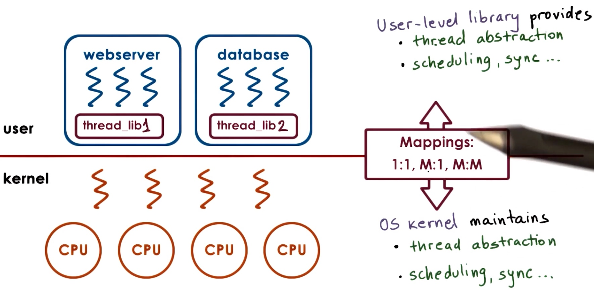
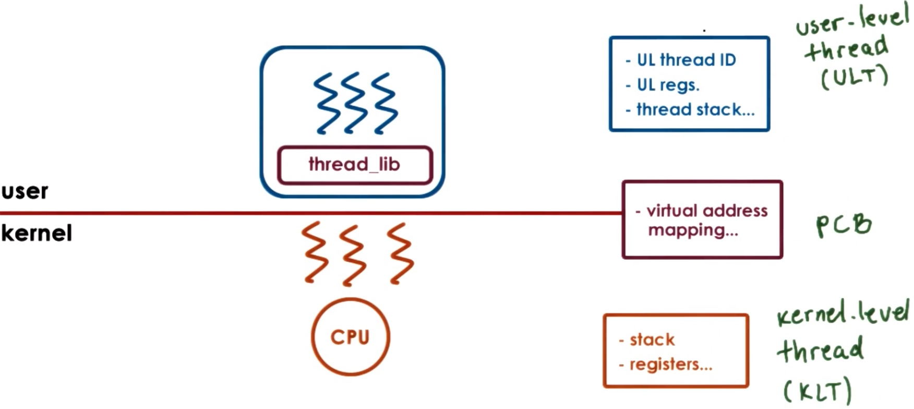
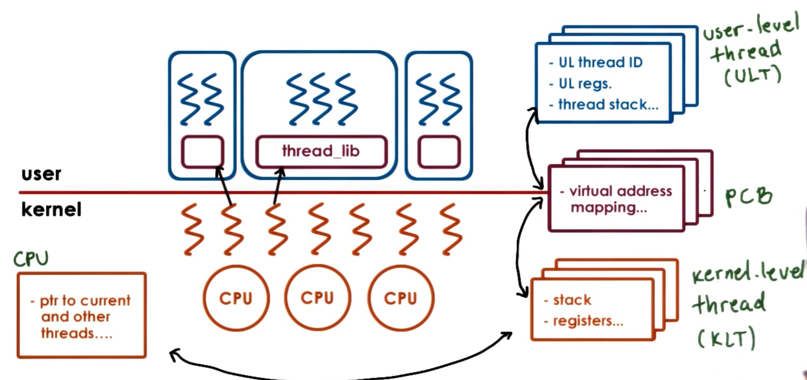
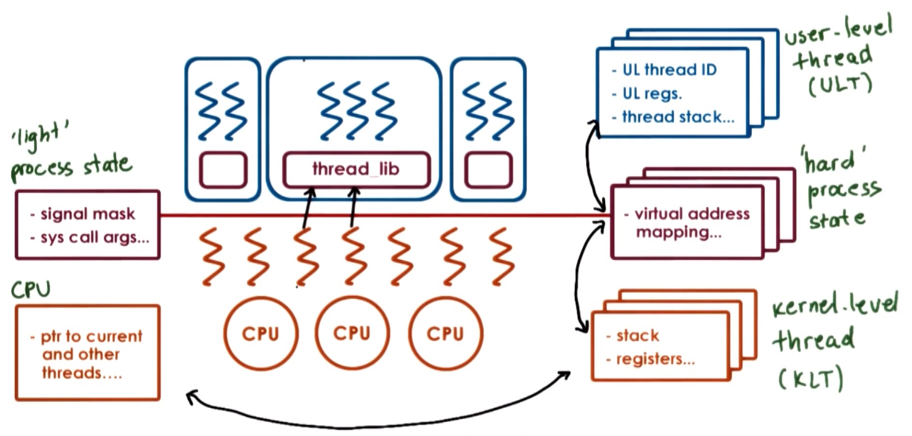
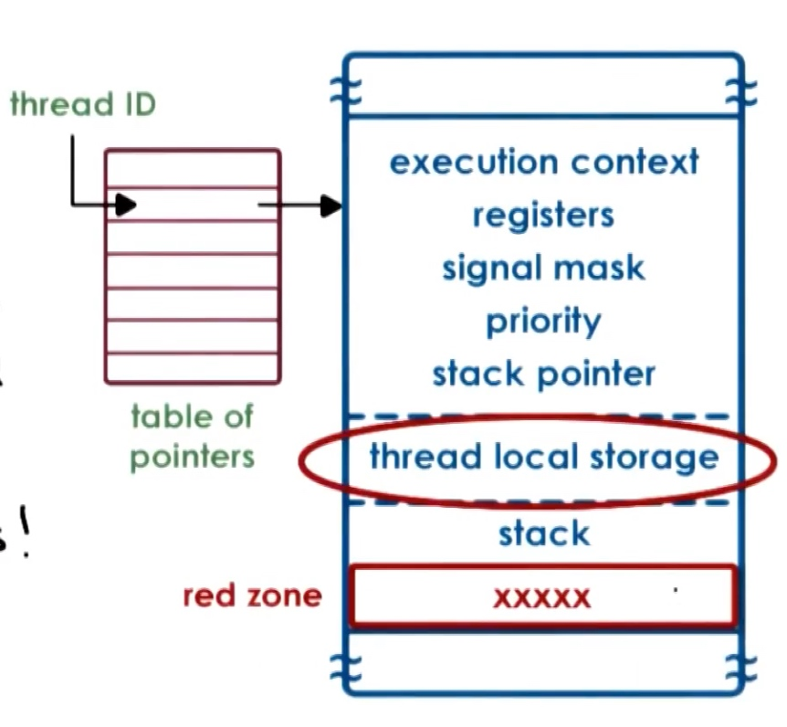
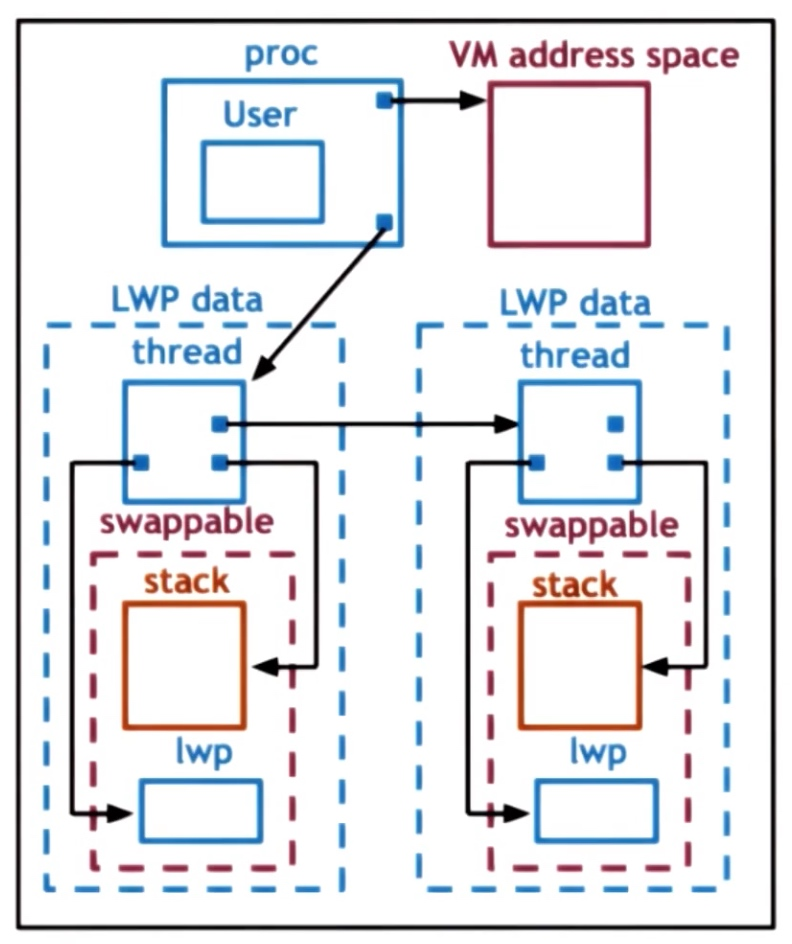

# P2L4: Thread Design Considerations

<!-- toc -->
----

## Kernel Vs. User Level Threads

* [A review of the concept](/cs6200/p2l2-threads-and-concurrency/index.html#kernel-level-threads-vs-user-level-threads)
    * 
## Thread Related Data Structures

### Single CPU

* A process is described by its process control block, which contains:
    * virtual address mapping
    * stack
    * registers
* If the process links in a **user-level threading**(ULT) library, the library will maintain a user-level thread data structure, which contains:
    * user-level thread id
    * user-level registers
    * thread stack
* If we want the multiple kernel-level threads associated with the threads in the process, the PCB needs to be duplicated for each kernel-level thread. To avoid the duplication, we can split the PCB into smaller data structures:
    * The PCB only keep the virtual address mapping,
    * The **kernel-level thread**(KLT) keeps the stack and register
    * 

### At Scale

* In a multiple processes situation, there will be multiple ULT, PCB and KLT. To cope with this, the system need to maintain the relationships: ULT <-> PCB, PCB <-> KLT. And the system has multiple CPU, we also need to maintain the relationship: CPU <-> KLT.
* 
* For each process, we need to track the kernel level threads that execute on behalf the process, and the for each kernel level thread, we need to track of the processes on whose behalf we execute.
* When kernel itself is multithreaded, we can have multiple kernel-level threads supporting a single user-level process. When kernel needs to schedule/context switch among kernel-level threads that belong to diff processes, it can quickly determine the KLT point to diff PCB. 

### Hard and Light Process State

* When the operating system context switches between two kernel level threads that belong to the process, there is information relevant to both threads in the process control block, and also information that is only relevant to each thread.
* Information relevant to all threads includes the virtual address mapping, while information relevant to each thread specifically can include things like signals or system call arguments. When context switching among the two kernel level threads, we want to preserve some portion of the PCB and swap out the rest.
* We can split up the information in the PCB into **hard process state** which is <u>relevant for all user level threads</u> in a given process and l**ight process state** that is <u>only relevant for a subset of user level threads</u> associated with a particular kernel level thread.
* 

### Rationale For Data Structures

* Single control block:
    * large continuous data structure
    * private for each entity (even though some information can be shared)
    * saved and restored in entirety on each context switch
    * updates may be challenging
* Multiple data structures:
    * smaller data structures
    * easier to share
    * save and restore only what needs to change on context switch
    * user-level library only needs to update a portion of the state for customized behavior

## Data Structures in Solaris 2.0(OS)

* The OS is intended for multiple CPU and multi-threads. Each kernel-level thread has a lightweight process data structure associated with it, called **lightweight process(LWP)**, which represents the virtual CPUs onto which the user-level threads are scheduled. And the kernel-level scheduler is responsible for scheduling the kernel-level threads onto physical CPU.

### User Level Structures

* From paper: ["Implementing Lightweight Threads"](https://s3.amazonaws.com/content.udacity-data.com/courses/ud923/references/ud923-stein-shah-paper.pdf) by Stein and Shah
    * not POSIX threads, but similar
* When a thread is created, the library returns a thread id(tid). This id is **not a direct pointer to** the thread data structure but is rather an index into an array of thread pointers. the reason for that is, if there is a problem with the thread, the value at the index can change to -1 instead of the pointer just pointing to some corrupt memory.
* The thread data structure:
    * 
* To avoid one thread overrun its boundary and overwrite the data for the next thread, we create a red zone for separating the threads. **Red zone** is a portion of the address space that is not allocated. If a thread tries to write to a red zone, the operating system causes a fault.

### Kernel Level Structures

* 
* Data structures in details
    * Process:
        * list of kernel level threads
        * virtual address space
        * user credentials
        * signal handlers
    * **light-weight process (LWP)**:
        * user level registers
        * system call arguments
        * resource usage info
        * signal masks
    * Kernel-level thread(KLT):
        * kernel-level registers
        * stack pointer
        * scheduling info
        * pointers to associated LWPs, and CPU structures
    * CPU:
        * current thread
        * list of kernel level threads
        * dispatching & interrupt handling information

* LWP contains data that is relevant for some subset of the user threads in a given process, which is similar to the data contained in the ULT, but the LWP is visible to the kernel. When the kernel needs to make scheduling decisions, they can look at the LWP to help make decisions.
* The KLT has information about an execution context that is always needed. There are operating system services (for example, scheduler) that need to access information about a thread even when the thread is not active. As a result, **the information in the kernel level thread is not swappable**. The LWP data does not have to be present when a process is not running, so its data can be swapped out.

## Thread Management Interaction

* Why kernel-level threads and user-level threads need to interact with each other?
    * Consider a process with four user threads, and a kernel with two threads. At a given time, the process require the level of concurrency to two. It always happens that two of its threads are blocking on, say, IO and the other two threads are executing.
    * Consider the scenario where the two user level threads that are scheduled on the kernel level threads happen to be the two that block. The kernel level threads block as well. This means that the whole process is blocked, even though there are user level threads that can make progress. The user threads have no way to know that the kernel threads are about to block, and has no way to decide before this event occurs.
    * It would be helpful if the kernel can **signal** the user-level library before blocking, and the user-level library could potentially request more kernel-level threads, or allocate one kernel thread to  other threads that can be executed immediately.

### Visibility in Bewteen

* The kernel sees:
    * Kernel-level threads
    * CPUs
    * Kernel-level scheduler
* The user-level library sees:
    * User-level threads
    * Available kernel-level threads

* A case of invisibility:
    * In a many-to-many case, if a user level thread acquires a lock while running on top of a kernel level thread and that kernel level thread gets preempted, the user level library scheduler will cycle through the remaining user level threads and try to schedule them. If they need the lock, none will be able to execute and time will be wasted until the thread holding the lock is scheduled again.
    * 

Issue On Multiple CPUs

Synchronization Related Issues

## Interrupts and Signals 

### Interrupts
### Signals
### Signal/Interrupt Similarities
### Interrupt Handling
### Signal Handling
### Why Disable Interrupts or Signals?
### More on Signal Masks
### Interrupts on Multicore Systems
### Types of Signals
### Interrupts as Threads
### Interrupts: Top Vs. Bottom Half
### Performance of Threads as Interrupts
### Threads and Signal Handling
### Tasks in Linux
