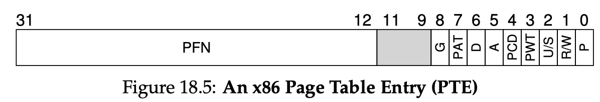
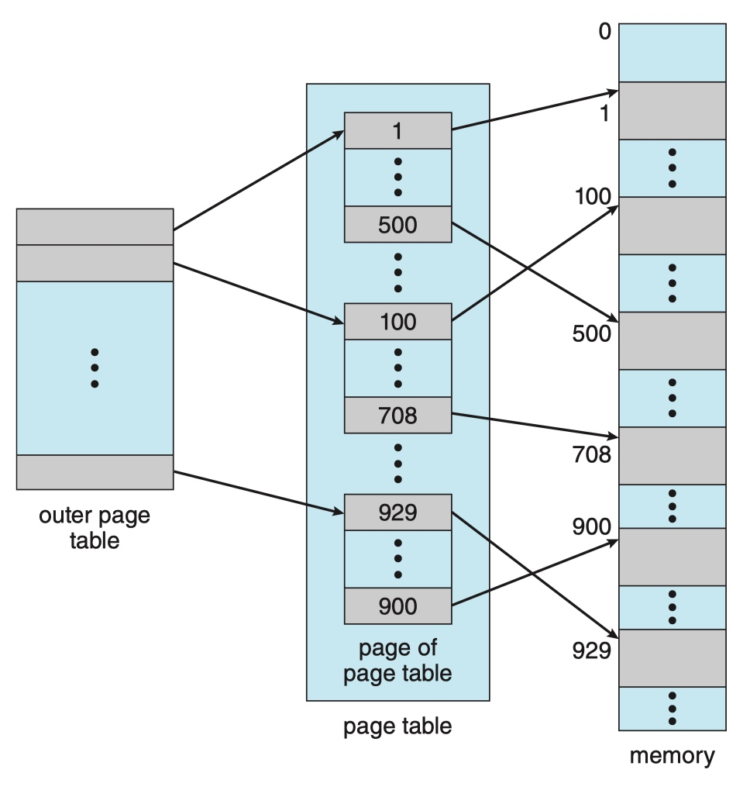
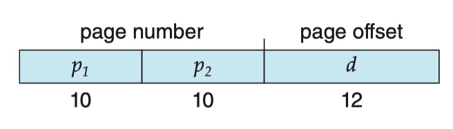
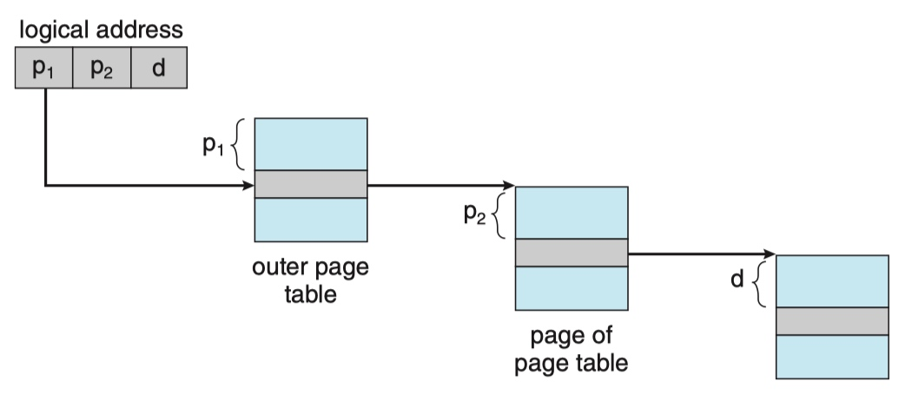

# P3L2 : Memory Management

<!-- toc -->
----

## Goals

* In order to manage the physical memory, the operating system must be able to **allocate** physical memory and also **arbitrate** how it is being accessed.
    * Notice that the virtual addresses that visible to processes can be larger than the actual physical memory. -- The OS can swap the memory to disks and read them back to memory when need it.
* Allocation
    * track how memory is used and what memory is free;
    * replace the contents in physical memory with the contents in disk.
* Arbitration
    * quickly translate and validate the virtual addresses.
        * This rely on a combination of hardware support and software implementation.
 
### Page-based memory management

* The virtual address space is subdivided into fixed-size segments called **pages**. The physical memory is divided into **page frames** of the **same size**. 
* Allocation: mapping pages -> page frames;
* Arbitration: page tables.
* Another way to decouple virtual/physical memory is segmentation: **segment-based memory management**.
    * Allocation: flexibly-sized segments mapping to physical memory
    * Arbitration: segment registers supported by hardware

#### Hardware support for page-based memory management

* In each CPU package, there is a **memory management unit(MMU)** which is responsible for 
    * translating virtual addresses to physical addresses;
    * reports faults, such as illegal access: attempt to access unallocated memory, insufficient permission to perform certain access, or the requested page is not present in memory and need to be fetched from disk.
* Another hardware supported memory management is **registers** which helps memory translation by pointing the pointers to **page table**.
    * In segment-based management, the pointer can point to the base address, the size of segment and the total number of segments.
* Most MMU integrates a small cache of valid virtual/physical address translations, which is called **translation look-aside buffer(TLB)**, to make the translation faster.
* Finally, the actual translation is done by hardware. The OS maintains the page table, but the hardware performs it. This also imply that the hardware will dictate what type of memory management modes are supported.

## Page Tables

* The page table tells the system where to find the physical address associated with the virtual address.
* The sizes of the pages in virtual memory is identical to the sizes of the page frames in physical memory. By keeping the size of these the same, the operating system does not need to manage the translation of every single virtual address within a page. Instead, we can only translate the first virtual address in a page to the first physical address in a page frame. The rest of the memory address in the page map to the corresponding offsets in the page frame. As a result, we can reduce the number of entries we have in the page table.
* What this means is that only the first portion of the virtual address is used to index into the page table. We call this part of the address the **virtual page number (VPN)**, and the rest of the of the virtual address is the **offset**. The VPN is used as an index into the page table, which will produce the **physical frame number (PFN)**, which is the first physical address of the frame in DRAM. To complete the full translation, the PFN needs to be summed with the offset specified in the latter part of the virtual address to produce the actual physical address. The PFN with the offset can be used to reference a specific location in DRAM.
    * VPN + offset is the address we have in program, and PFN + offset is the actual address in physical memory

### An example

* Let's say we want to initialize an array for the very first time. We have already allocated the memory for that array into the virtual address space for the process, we have just never accessed it before. Since this portion of the address space has not been accessed before, the operating system has not yet allocated memory for it.
* What will happen the first time we access this memory is that the operating system will realize that there isn't physical memory that corresponds to this range of virtual memory addresses, so it will **take a free page of physical memory**, and **create a page table entry linking the two**.
* <u>The physical memory is only allocated when the process is trying to access it.</u> This is called allocation on **first touch**. The reason for this is to make sure that physical memory is only allocated when it's really needed. Sometimes, programmers may create data structures that they don't really use.
* If a process hasn't used some of its memory pages for a long time, it is possible that those pages will be reclaimed. The contents will no longer be present in physical memory. They will be swapped out to disk, and some other content will end up in the corresponding physical memory slot.
* In order to detect this, page table entries have a **valid bit** to indicate the validity of the access of the page. 1 is valid, 0 is not. When MMU sees the bit is 0 when access occur, it raise a fault. Then if the OS decide to allow the access, the mapping will be re-established. However the physical memory address will be different and page table needs to be updated to map the virtual address to the new physical address.
* In summary, the operating system creates a page table for every every process it runs. Whenever a context switch is performed, the operating system swap in the page table associated with the new process. Hardware assists with page table accesses by maintaining a **register** that points to the active page table. 
    * On x86 platforms, this register is the CR3 register.

### Page Table Entry(PTE)

* 32 bits in total for each entry.
* 
    * A **present bit**(P) indicates whether this page is in physical memory or on disk (i.e., it has been swapped out).
    * A **protection bits**(R/W), indicating whether the page could be read from, written to, or executed from.
    * A **dirty bit**(D) indicates whether the page has been modified since it was brought into memory.
    * A **reference bit (a.k.a. accessed bit)**(A) is sometimes used to track whether a page has been accessed, and is useful in determining which pages are popular and thus should be kept in memory;
    * A **user/supervisor bit** (U/S) which determines if user-mode processes can access the page;
    * A few bits (PWT, PCD, PAT, and G) that determine how hardware caching works for these pages; 
    * Finally, **the page frame number (PFN)** itself.

* The MMU uses the page table entry not just to perform the address translation, but also to rely on these bits to determine the validity of the access. If the hardware determines that a physical memory access cannot be performed, it causes a **page fault**.
* If this happens, then the CPU will place an error code on the stack of the kernel, and it will generate a trap into the OS kernel, which will invoke the **page fault handler**. This handler determines the action to take based on the error code and the faulting address.
* Pieces of information in the error code will include whether or not the page was not present and needs to be brought in from disk or perhaps there is some sort of permission protection that was violated and that is why the page access if forbidden.
* On x86 platforms, the error code is generated from some of the flags in the page table entry and the faulting address is stored in the **CR2 register**.

### Page Table Size

* For 32-bit architecture, PTE = 4 bytes(32 bits), and a common page size is 4KB(2^12 bits).
    * To represent a 4GB(2^32 bits) memory, we need 2^32/2^12 = 2^20 entries. Each PTE is 4 bytes. In total, we need 2^22 bytes = 4MB memory.
* For 64-bit architecture, PTE = 8 bytes(64 bits), and a common page size is 4KB(2^12 bits).
    * To represent a 8GB(2^64 bits) memory, we need 2^64/2^12 = 2^52 entries. Each PTE is 8 bytes. In total, we need 2^55 bytes = 32PB memory.
* Remember that page tables are a **per-process** allocation.
* It is important to know that **a process will not use all of the theoretically available virtual memory**. Even on 32-bit architectures, not all of the 4GB is used by every type of process. <u>The problem is that the page table assumes that there is an entry for every VPN, regardless of whether the VPN is needed by the process or not.</u> This is unnecessarily large.

### Multi-level Page Tables

* One way to solve the problem is to use a **two-level paging algorithm**(hierarchical paging), in which the page table itself is also paged.
    * 
    * The internal page table only exists when the virtual memory regions are valid.
    * When a process request more memory to be allocated via malloc, the OS will check/create another page table for it, add new entry in the outer page table, map the entry to the new virtual memory region in the internal page table.
* For example, consider again the system with a 32-bit logical address space and a page size of 4 KB. A logical address is divided into a page number consisting of 20 bits and a page offset consisting of 12 bits. Because we page the page table, the page number is further divided into a 10-bit page number and a 10-bit page offset. Thus, a logical address is as follows:
    * 
        * Different way to look at this^
            1. From p1's perspective, p2 + d is the offset, meaning each entry is 2^22 = 4MB and there are 2^10 = 1K records in outer table
            2. From p2's perspective, d is the offset, meaning each entry is 2^12 = 4K, and there are 1K x 2^10 = 1M potential records.
            3. The 1K outer entries exists no matter what, but the 1M in the internal table doesn't.
    * where p 1 is an index into the outer page table and p 2 is the displacement within the page of the inner page table. The address-translation method for this architecture is:
        * 
        * Because address translation works from the outer page table inward, this scheme is also known as a **forward-mapped** page table.
    * The size of each page in the inter page table is 2^10(p_2) * 2^10(page size or page offset) = 2^20 = 1MB

* For a system with a 64-bit logical address space, a two-level paging scheme is no longer appropriate. Assume the page size is 4KB(2^12),  the outer page table is gonna have 2^42 entries. So we need further dividing. And even we divide the page table to three-level, the outer page table is still 2^34 bytes(16GB). The 64-bit UltraSPARC would require seven levels of paging which is why, for 64-bit architectures, hierarchical page tables are generally considered inappropriate.
    * Because more layers means more memory accesses required for translation.

## Speeding Up Translation TLB

Inverted Page Tables
Segmentation
Page Size

## Memory Allocation
Memory Allocation Challenges
Linux Kernel Allocators
Demand Paging
Page Replacement

## Copy On Write
Failure Management Checkpointing