# Week 1

<!-- toc -->

## Supervised Learning
* regression, to predict results within a continuous output. 
* classification, to predict results in a discrete output.

## Unsupervised Learning
* derive this structure by clustering the data based on relationships among the variables in the data.

## Model and Cost Function
* Model Representation

  * To describe the supervised learning problem slightly more formally, our goal is, given a training set, to learn a function h : X → Y so that $h^{(x)}$ is a “good” predictor for the corresponding value of y. For historical reasons, this function h is called a hypothesis. Seen pictorially, the process is therefore like this:

  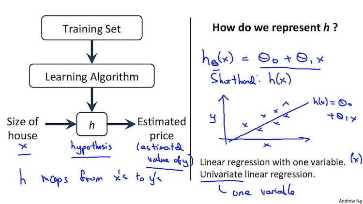

  * $h_\theta(x)=\theta_{0}+\theta_{1}x$, and this means:

    * Y is a linear function of x
      * $\theta_{i}$ are **parameters**
      * $\theta_{0}$ is zero condition
      * $\theta_{1}$ is gradient
    * This kind of function is a linear regression with one variable, also called **univariate linear regression** 

    ​

### Cost function 

* A cost function lets us figure out how to fit the best straight line to our data

* Choosing values for $\theta_{1}$ (parameters)
  * Different values give you different functions
  * If $\theta_{0}$ is 1.5 and $\theta_{1}$ is 0 then we get straight line parallel with X along 1.5 @ y
  * If $\theta_{1}$ is > 0 then we get a positive slope
  * We want to find a straight line which colse to the actural `y`s as possible

* To formalize this:

  * We want to solve a minialization problem
  * Minimize $(h_{\theta}(x)-y)^{2}$
    * minimize the difference between h(x) and y for each/any/every example
  * Sum this over the training set: $\dfrac {1}{2m} \displaystyle \sum _{i=1}^m \left (h_\theta (x_{i}) - y_{i} \right)^2$
    * $\frac{1}{2m}$
      * $\frac{1}{m}$ - means we determine the average
      * $\frac{1}{2m}$ - the 2 makes the math a bit easier, and doesn't change the constants we determine at all (i.e. half the smallest value is still the smallest value)
  * This is a cost function:
    * $J(\theta_0, \theta_1) = \dfrac {1}{2m} \displaystyle \sum _{i=1}^m \left ( \hat{y}_{i}- y_{i} \right)^2 = \dfrac {1}{2m} \displaystyle \sum _{i=1}^m \left (h_\theta (x_{i}) - y_{i} \right)^2$
    * And we want to minimize this cost function
      * Our cost function is (because of the summartion term) inherently looking at ALL the data in the training set at any time

* The following image summarizes what the cost function does:

  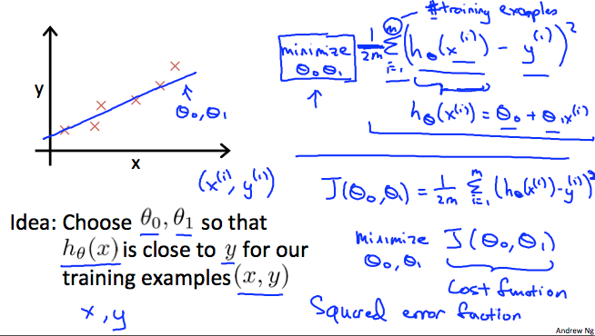

  * **Hypothesis** - is like your prediction machine, throw in an `x` value, get a putative `y` value
  * **Cost** - is a way to, using your trainning data, determine values for your $\theta$ values which make the hypothesis as accurate as possibile
    * This cost function is also called the squared **error cost function**

### Cost Function - Intuition

* Simplified hypothesis (Assumes $θ_{0}= 0$)
  * So we got: $h_{\theta}(x)=\theta_{1}x$, then the cost function will be:
  * $J(\theta_1) = \dfrac {1}{2m} \displaystyle \sum _{i=1}^m \left (h_\theta (x_{i}) - y_{i} \right)^2$ 
  * $\displaystyle {minimize \atop \theta_{1}} $,  $J(\theta_{1})$
  * For example:
    * 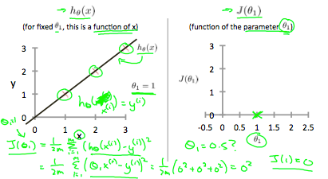
  * $\theta=1$, then $h_{\theta}(x) = 0 + 1\times x$ , then $h_\theta (x_{i}) - y_{i} =0$, then $J(\theta_{1})=0$ 
  * Plots: ($\theta_{1}=1, J(\theta_{1})=0$), ($\theta_{1}=0.5, J(\theta_{1})\approx0.58$), ($\theta_{1}=0, J(\theta_{1})\approx2.3$)
  * Then we got:
    * 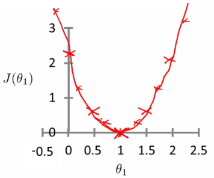
  * The optimization objective for the learning algorithm is find the value of $\theta_{1}$ which $minimizes  J(\theta_{1})$
    * So, here $\theta_{1} = 1$ is the best value for $\theta_{1}$
* Using our original complex hyothesis with two pariables,So cost function is $J(\theta_{0}, \theta_{1})$
  * Generates a 3D surface plot where axis are
    * $X = \theta_{0}$
    * $Z = \theta_{0}$
    * $Y=J(\theta_{0}, \theta_{1})$
    * 
  * Instead of a surface plot we can use a **contour figures/plots**
    * Set of ellipses in different colors
    * Each colour is the same value of $J(\theta_{0}, \theta_{1})$, but obviously plot to different locations because $\theta_{1}$ and $\theta_{0}$ will vary
    * Imagine a bowl shape function coming out of the screen so the middle is the concentric circles
    * 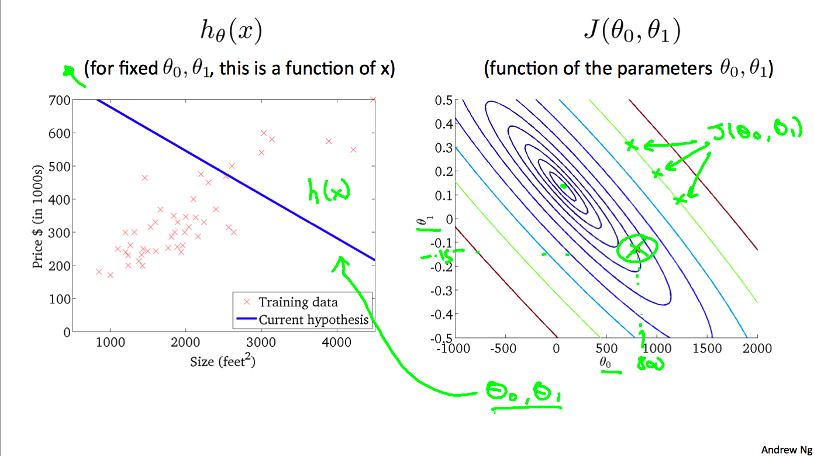
    * ​

## Parameter Learning

### Gradient Descent

- Minimize cost function $ J$
- Gradient descent
  - Used all over machine learning for minimization
- Start by looking at a general $J()$ function
- Problem
  - We have $J(\theta_{0}, \theta_{1})$
  - We want to get $\min J(\theta_{0}, \theta_{1})$
- Gradient descent applies to more general functions
  - $J(\theta_{0}, \theta_{1}, \theta_{2}... \theta_{n})$
  - $\min J(\theta_{0}, \theta_{1}, \theta_{2}... \theta_{n})$
- Outline:
  - Start with some $\theta_{0}, \theta_{1}$, 
  - Keep changing $\theta_{0}, \theta_{1}$ to reduce $J(\theta_{0}, \theta_{1})$ until we hopefully end up at a minimum
  - 
  - Here we can see one initialization point led to one local minimum
  - The other led to a different one

### Gradient Descent Intuition

- $\theta_j := \theta_j - \alpha \frac{\partial}{\partial \theta_j} J(\theta_0, \theta_1) $  for $( j=0, j=1)$
- What does this all mean?
  - Update $\theta_{j}$ by setting it to $(\theta_{j} - \alpha)$ times the partial derivative of the cost function with respect to $\theta_{j}$
- Notation
  - $:=$ 
    - Denotes assignment
    - NB a = b is a *truth assertion*
    - $\alpha$ (alpha) Is a number called the **learning rate**
    - Controls how big a step you take
      - If α is big have an aggressive gradient descent
      - If α is small take tiny steps
- Derivative term: $\frac{\partial}{\partial \theta_j} J(\theta_0, \theta_1)$, will derive it later
- How this gradient descent algrorithm is impliemented
  - Do this for $\theta_{0}$ and $\theta_{1}$
  - For $j=0$ and $j=1$ means we **simultaneously** update both, like:
    - 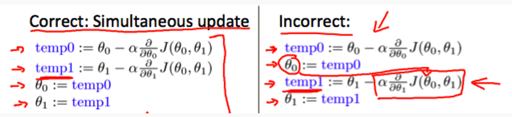

- Understanding the algorithm
  - back to simpler function where we minimize one parameter
    - $\min \theta_{1}J(\theta_{1})$ where $\theta_{1}$ is a real number

  - Two key terms in the algorithm
    - $\alpha$ Alpha
    - $\frac{\partial}{\partial \theta_j} J(\theta_0, \theta_1)$ Derivative term

  - Notation nuances
    - Partial derivative vs. derivative
      - Use partial derivative when we have multiple variables but only derive with respect to one
      - Use derivative when we are deriving with respect to all the variables

  - Derivative term
    - Lets take the tangent at the point and look at the slope of the line
    - So moving towards the mimum (down) will greate a negative derivative, alpha is always positive, so will update $j(\theta_{1})$ to a smaller value
    - Similarly, if we're moving up a slope we make $j(\theta_{1})$ a bigger numbers
    - 

  - Alpha term (α)

    - 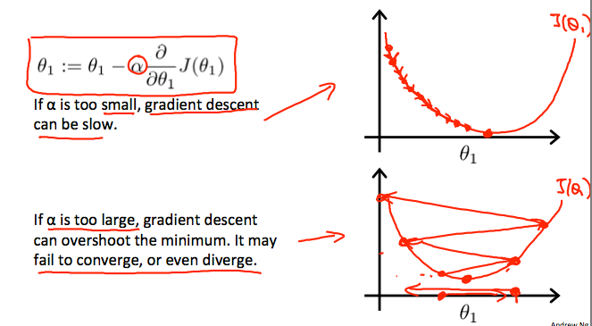

  - How does gradient descent converge with a fixed step size α?

    - The intuition behind the convergence is that $\frac{\partial}{\partial \theta_j} J(\theta_0, \theta_1)$, $\theta_{1}$ approaches 0 as we approach the bottom of our convex function. At the minimum, the derivative will always be 0 and thus we get:

      - > $\theta_{1}:=\theta_{1}−\alpha \times 0$

    - 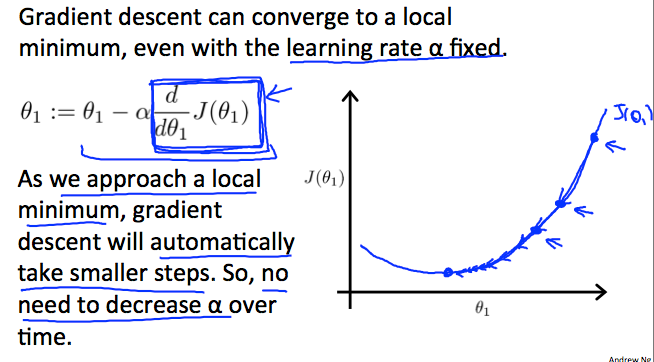

### Gradient Descent For Linear Regression

* Apply gradient descent to minimize the squared error cost function $J(\theta_{0}, \theta_{1})$

* Now we have a partial derivative:

  * 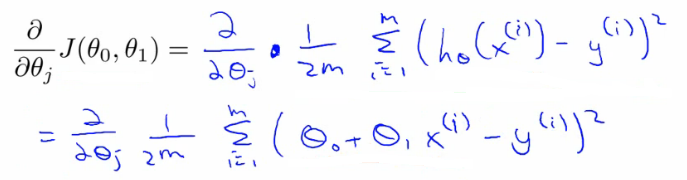

* So we need to determine the derivative for each parameter:

* > $\begin{align*} \text{repeat until convergence: } \lbrace & \newline \theta_0 := & \theta_0 - \alpha \frac{1}{m} \sum\limits_{i=1}^{m}(h_\theta(x_{i}) - y_{i}) \newline \theta_1 := & \theta_1 - \alpha \frac{1}{m} \sum\limits_{i=1}^{m}\left((h_\theta(x_{i}) - y_{i}) x_{i}\right) \newline \rbrace& \end{align*}$

  * To check this you need to know multivariate calculus
    * We have separated out the two cases for $\theta_{j}$ into separate equations for $\theta_{0}$ and $\theta_{1}$; and that for θ1 we are multiplying xi at the end due to the derivative. The following is a derivation of $\frac{\partial}{\partial \theta_j} J(\theta)$ for a single example :
    * 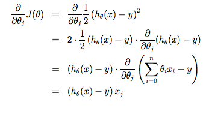

* How does it work

  * Risk of meeting different local optimum
  * The linear regression cost function is always a **convex function** - always has a single minimum
    * Bowl shaped
      * One global optima
        * So gradient descent will always converge to global optima
  * In action
    * Initialize values to $\theta_{0} = 900, \theta_{1} = -0.1$
    * 
  * End up at a global minimum
  * This is actually **Batch Gradient Descent**
    * Refers to the fact that over each step you look at all the training data
      * Each step compute over m training examples
    * Sometimes non-batch versions exist, which look at small data subsets
      * We'll look at other forms of gradient descent (to use when m is too large) later in the course
  * There exists a numerical solution for finding a solution for a minimum function
    * **Normal equations** method Gradient descent scales better to large data sets though
    * Used in lots of contexts and machine learning 

## Linear Algebra

### Matrices and Vectors

* **Matrix**: Rectangular array of numbers:

  * $X =  \begin{bmatrix} 1 & 2 & 3 & 4 & 5 \\ 3 & 4 & 5 & 6 & 7 \\ 9 & 10 & 11 & 12 & 13 \end{bmatrix}$

* Dimension of matrix: number of rows x number of columns
* $X_{ij}$ = "i,j entry" in the $i^{th}$ row, $j^{th}$ column.

* **Vector**: An n x 1 matrix.

    * $y =  \begin{bmatrix} 1 \\ 3 \\ 13 \end{bmatrix}$
    * $y_{i}$ = $i^{th}$ element

* Uppercase letter for Matrix, and lowwercase for Vector.

### Addition and Scalar Multiplication

* Matrix Addition:
  * Two matrices must have an equal number of rows and columns to be added.
  * Sample: 
    * $\begin{bmatrix} 1 & 2 & 3 \\ 3 & 4 & 5 \end{bmatrix} +  \begin{bmatrix} 3 & 1 & 6 \\ 6 & 7 & 2 \end{bmatrix} = \begin{bmatrix} 4 & 3 & 9 \\ 9 & 11 & 7 \end{bmatrix}$
    * **Error!!** $\begin{bmatrix} 1 & 2 & 3 \\ 3 & 4 & 5 \end{bmatrix} +  \begin{bmatrix} 3 & 1 \\ 6 & 7 \end{bmatrix} $ 

* Scalar Multiplication
  * Sample:
    * $3 \times \begin{bmatrix} 3 & 1 \\ 6 & 7 \end{bmatrix} = \begin{bmatrix} 9 & 3 \\ 18 & 21 \end{bmatrix}$

### Matrix Vector Multiplication 

* 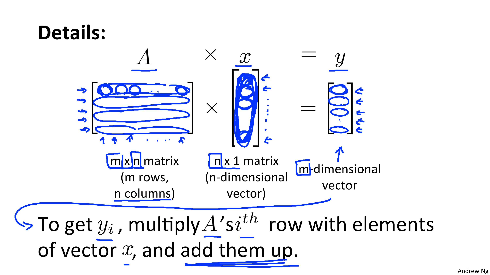
* Example:
  * $\begin{bmatrix} 1 & 2 & 3 \\ 3 & 4 & 5 \end{bmatrix} \times \begin{bmatrix} 4 \\ 3 \\ 2 \end{bmatrix} = \begin{bmatrix} 16 \\ 34 \end{bmatrix}$
  * Row 1: $1 \times 4 + 2 \times 3 + 3 \times 2 = 16$​
* 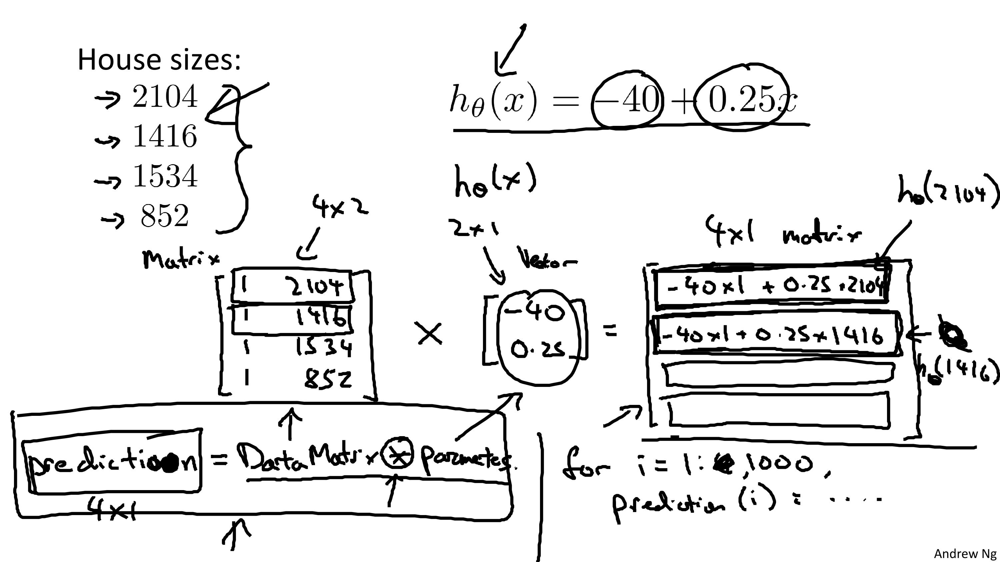

### Matrix Matrix Multiplication

* 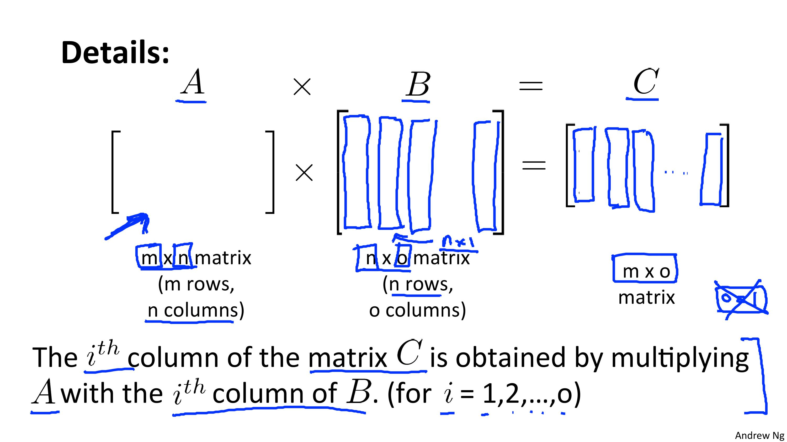
* 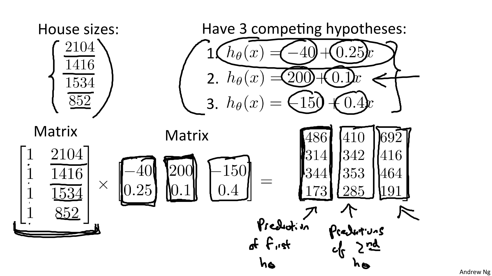

### Matrix Multiplication Properties

* Let A and B be matirces. Then in general, $A * B \ne B * A$ . (not commutative)
* $A * B * C$ : 
  * Let $D = B * C$. Compute $A * D$
  * Let $E = A * B$. Compute $E * C$
* Identity Matrix:
  * 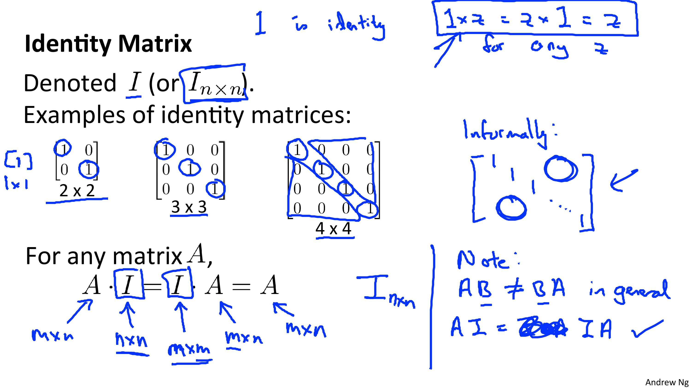

### Inverse and Transpose

* **Inverse**: $AA^{-1} = A^{-1}A = I$. Like $3 * 3^{-1} = 1$
  * 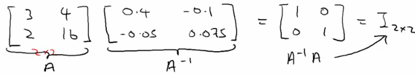
  * Not all numbers have an inverse. Like $0$ doesn't have.
  * Matrices that don't have an inverse are "singular" or "degenerate".
  * How did you find the inverse
    * Turns out that you can sometimes do it by hand, although this is very hard
    * Numerical software for computing a matrices inverse
      * Lots of open source libraries
* **Transpose**:
  * 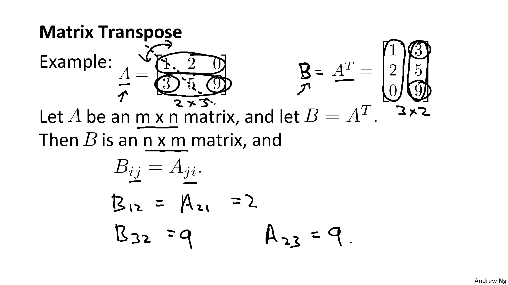

## Words

- **algebra**   ['ældʒibrə] n. 代数学
- **gradient**   ['ɡreidiənt] n. 梯度；坡度
- **descent**   [di'sent] n. 下降；血统；袭击
- **gradient descent**  梯度下降法
- **intuition**   [,intju:'iʃən] n. 直觉；直觉力；
- **linear**   ['liniə] adj. 线的，线型的；
- **regression**   [ri'ɡreʃən] n. 回归；退化；
- **plot**   [plɔt] vt. 密谋；绘图；划分；标绘
- **contour**   ['kɔntuə] n. 轮廓；等高线；周线；电路；概要
- **contour plot**  等值线图
- **contour figure** 轮廓图
- **denote**   [di'nəut] vt. 表示，指示
- **derivative**  [də'rɪvətɪv] n. 派生物；导数
- **derivative term** 导数项
- **subtly**   ['sʌtli] adv. 精细地；巧妙地；敏锐地
- **nuance**   ['nju:ɑ:ns, nju:'ɑ:ns] n. 细微差别
- **tangent**   ['tændʒənt] n. [数] 切线，[数] 正切
- **slope**   [sləup] n. 斜坡；倾斜；斜率
- **converge**   [kən'və:dʒ] vt. 使汇聚 vi. 聚集；靠拢；收敛
- **convex**   [kɔn'veks] adj. 凸面的；凸圆的
- **scalar**   ['skeilə, -lɑ:] n. [数] 标量；[数] 数量

