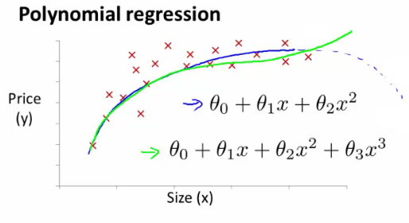

# Week 2

[TOC]

## Multivariate Linear Regression 

### Multiple features

* In original version we had 
  * \\(X\\) = house size, use this to predict
  * \\(y\\) = house price
* If in a new scheme we have more variables ( such as number of bedrooms, number floors, age of the house)
  * \\(x_1, x_2, x_3, x_4\\) are the four features
    * \\(x_1\\) - size (feet squared)
    * \\(x_2\\) - Number of bedrooms
    * \\(x_3\\) - Number of floors
    * \\(x_4\\) - Age of house (years)
  * \\(y\\) is the output varible (price)
* Notations
  * \\(n\\) : number of features ( n =4 )
  * m : number of examples ( i.e. number of rows in a table )
  * \\(x^{(i)}\\) : input (features) of \\(i^{th}\\) training example.
  * \\(x^{(i)}_{j}\\) : value of feature \\(j\\) in \\(i^{th}\\) training example.
  * 
* Cost function with multiple features
  * \\(h_{\theta}(x) = \theta_{0}x_{0} + \theta_{1}x_{1} + \theta_{2}x_{2} + \theta_{3}x_{3} + \theta_{4}x_{4}\\) (\\(x_{0} = 1\\) )
    * for convenience of notation, define \\(x_0 = 1\\)
  * \\(h_\theta(x) = \theta^{T}x\\) 
    * \\(x = \begin{bmatrix} x_0 \\ x_1 \\ x_2 \\ ... \\ x_n\end{bmatrix} (n+1)\\) 
    * \\(\theta = \begin{bmatrix} \theta_0 \\ \theta_1 \\ \theta_2 \\ ... \\ \theta_n\end{bmatrix} (n+1)\\) 
    * \\(\theta^T\\) is an \\(1 * (n + 1)\\) matrix
  * \\(h_{\theta}(X) = X\theta\\)
    * The training examples are stored in \\(X\\) row-wise. The following example shows us the reason behind setting \\(x^{(i)}_{0}=1\\) :
    * \\[\begin{aligned}X = \begin{bmatrix}x^{(1)}_0 & x^{(1)}_1 \\ x^{(2)}_0 & x^{(2)}_1 \\ x^{(3)}_0 & x^{(3)}_1 \end{bmatrix}&,\theta = \begin{bmatrix}\theta_0 \\ \theta_1 \\\end{bmatrix}\end{aligned}\\]

### Gradient Descent for Multiple Variables

* Cost function: \\(J(\theta_0, \theta_1,..., \theta_n) = \dfrac {1}{2m} \displaystyle \sum _{i=1}^m \left (h_\theta (x_{i}) - y_{i} \right)^2\\) 

* Gradient descent:

  * > \\[\begin{aligned} \text{Repeat } \lbrace & \\ \theta_j := & \theta_j - \alpha \frac{\partial}{\partial \theta_j} J(\theta) \\ \rbrace& \end{aligned}\\]

    * \\(J(\theta) = J(\theta_0, \theta_1,..., \theta_n)\\) 

* 

### Feature Scaling

* If you have a problem with multiple features, you should make sure those features have a similar scale
* e.g.
  * x1 = size(0 - 2000 feet)
  * x2 = number of bedrooms(1 - 5)
  * Means the contours generated if we plot \\(\theta_1\\) vs. \\(\theta_2\\) give a very tall and thin shape due to the huge range difference
* Running gradient descent on this kind of cost function can take a long time to find the globale minumum
  * 
* The way to prevent this is to modify the ranges of our input variables so that they are all roughly the same. Ideally:
  * \\(-1 \le x_{(i)} \le 1\\) or \\(-0.5 \le x_{(i)} \le 0.5\\) 
  * The goal is to get all input variables into roughly one of these ranges, give or take a few.
  * Two techniques to help with this are **feature scaling** and **mean normalization**.
  * **Feature scaling** involves dividing the input values by the range (i.e. the maximum value minus the minimum value) of the input variable, resulting in a new range of just 1.
  * **Mean normalization** involves subtracting the average value for an input variable from the values for that input variable resulting in a new average value for the input variable of just zero. 
  * To implement both of these techniques, adjust your input values as shown in this formula:
    * \\(x_i := \dfrac{x_i - \mu_i}{s_i}\\)
    * Where \\(μ_i\\) is the **average** of all the values for feature (i) and  \\(s_i\\) is the range of values (max - min), or \\(s_i\\) is the standard deviation.
    * For example, if \\(x_i\\) represents housing prices with a range of 100 to 2000 and a mean value of 1000, then, \\(x_i := \dfrac{price-1000}{1900}\\) 

### Learning Rate

* Debugging: how to make sure gradient descent is working correctly.
* How to choose learning rate \\(\alpha\\) .

#### Debugging gradient descent

* Make a plot with *number of iterations* on the x-axis. Now plot the cost function, \\(J(θ)\\) over the number of iterations of gradient descent. If \\(J(θ)\\) ever increases, then you probably need to decrease \\(\alpha\\).

#### Automatic convergence test

* Declare convergence if **J(θ)** decreases by less than **E** in one iteration, where **E** is some small value such as \\(10^{-3}\\). However in practice it's difficult to choose this threshold value.
* 
* It has been proven that if learning rate \\(\alpha\\) is sufficiently small, then \\(J(θ)\\) will decrease on every iteration.
* 

#### Summarize

* If \\(\alpha\\) is too small: slow convergence.
* If \\(\alpha\\) is too large: may not decrease on every iteration and thus may not converge.
* Typically
  - Try a range of alpha values
  - Plot \\(J(\theta)\\) vs number of iterations for each version of \\(\alpha\\)  
  - Go for roughly threefold increases
    - 0.001, 0.003, 0.01, 0.03. 0.1, 0.3

### Features and Polynomial

* to improve our features and the form of our hypothesis function.

#### Combine multiple features into one

* We can combine \\(x_1\\) and \\(x_2\\) into a new feature \\(x_3\\) by taking \\(x1 \cdot x2\\) .
  * take the housing price as sample: \\(x = x_1 * x_2\\),\\(x_1\\) is frontage, and \\(x_2\\) is depth of the house.

#### Polynomial Regression

* Our hypothesis function need **NOT** be linear (a straight line) if that does not fit the data well. And, choose new features to get a better model, called polynomial regression.
* We can **change the behavior or curve** of our hypothesis function by making it a quadratic, cubic or square root function (or any other form). ​

* For housing data could use a quadratic function: \\(h_\theta(x) = \theta_0 + \theta_1 x_1 + \theta_2 x_1^2\\) 
  * But may not fit data so well, because inflection point means housing prices decrease when size gets really big.
  * So instead must use a cubic function: \\(h_\theta(x) = \theta_0 + \theta_1 x_1 + \theta_2 x_1^2 + \theta_3 x_1^3\\) 
  * 
  * In the cubic version, we have created new features \\(x_2\\) and \\(x_3\\) where.\\(x_2 = x_1^2\\) and \\(x_3 = x_1^3\\) . 
    * 
  * One important thing to keep in mind is, if you choose your features this way then feature scaling becomes very important.
    * eg. if \\(x_1\\) has range 1 - 1000 then range of \\(x^2_1\\) becomes 1 - 1000000 and that of \\(x^3_1\\) becomes 1 - 1000000000
  * Or we can make it a square root function, we could do: \\(h_\theta(x) = \theta_0 + \theta_1 x_1 + \theta_2 \sqrt{x_1}\\) .

## Computing Parameters Analytically

### Normal Equation

* Method to solve for \\(\theta\\) analytically.Minimize J by explicitly taking its derivatives with respect to the θj ’s, and setting them to zero. This allows us to find the optimum theta without iteration. The normal equation formula is given below:

  * \\(\theta = (X^T X)^{-1}X^T y\\) 
  * 

* **no need** to do feature scaling with the normal equation.

* The following is a comparison of gradient descent and the normal equation:
    
| Gradient Descent      | Normal Equation         | 
| --------------------- | ----------------------- | 
| Need to choose alpha  | No need to choose alpha | 
| Needs many iterations | No need to iterate      | 
| O(\\(kn^2\\) )           | O(\\(n^3\\) ), need to calculate inverse of \\(X^TX\\) |
| Works well when \\(n\\) is large | Slow if \\(n\\) is very large|

* With the normal equation, computing the inversion has complexity \\(\mathcal{O}(n^3)\\). So if we have a very large number of features, the normal equation will be slow. In practice, when exceeds 10,000 it might be a good time to go from a normal solution to an iterative process.

#### Normal Equation Noninvertibility

* If \\(X^TX\\) is **noninvertible** (singular/degenerate), the common causes might be having :
  * Redundant features, where two features are very closely related (i.e. they are linearly dependent)
  * Too many features (e.g. m ≤ n). In this case, delete some features or use "regularization".

## Words

**semicolon**   [,semi'kəulən, 'semikəulən] n. 分号

**decimal**   ['desiməl] adj. 小数的；十进位的; n. 小数

**diagonal**   [dai'æɡənəl] adj. 斜的；对角线的；斜纹的; n. 对角线；斜线

**vectorization**   [,vektəri'zeiʃən] n. [数] 向量化

**numerical**   [nju:'merikəl] adj. 数值的；数字的；用数字表示的

**pathological**   [,pæθə'lɔdʒikəl] adj. 病理学的；病态的；由疾病引起的（等于pathologic）

**convergence**   [kən'və:dʒəns] n. [数] 收敛；会聚，集合

**polynomial**   [,pɔli'nəumiəl] n. [数] 多项式；

**quadratic**   [kwɔ'drætik] adj. [数] 二次的 n. 二次方程式

**cubic**   ['kju:bik] adj. 立方体的，立方的

**noninvertibility** 可逆性

